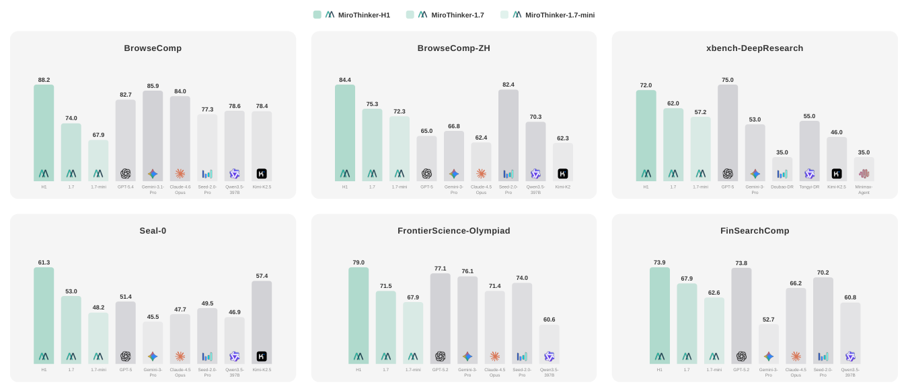
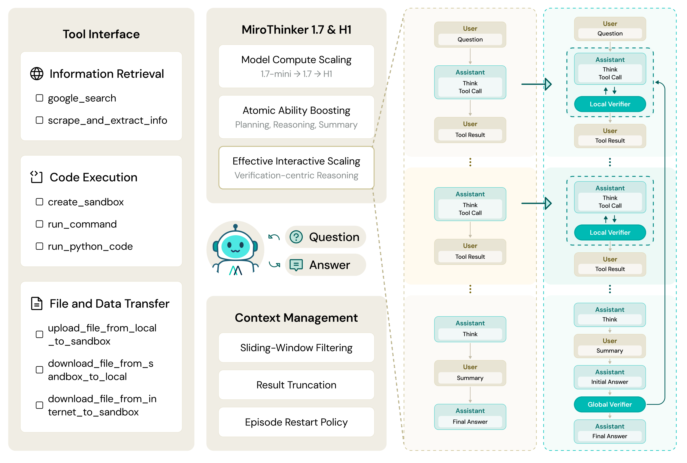
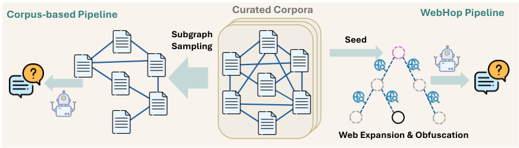
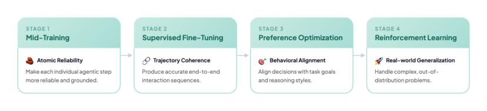
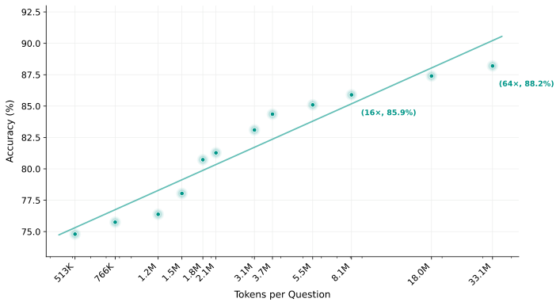
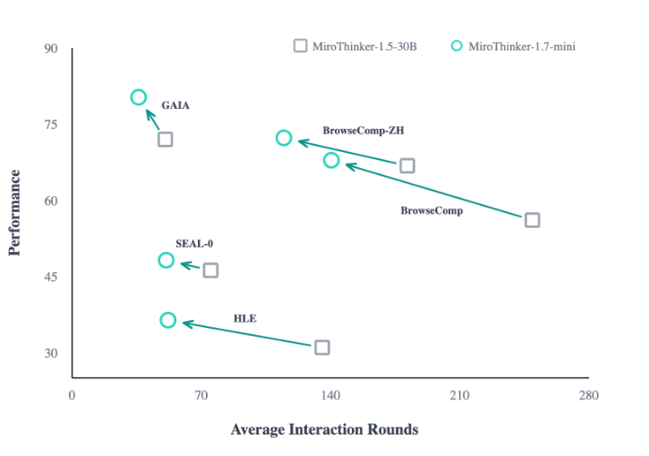

# MiroThinker-1.7 与 H1 深度解读：用“验证”把 Research Agent 从“会搜”提升到“会证”

## 结论先行：这项工作解决了什么问题？

许多 Agent 工作默认“推理链越长越好、工具调用越多越强”。这篇论文给出的核心判断是： **长推理链不等于高质量推理** 。  
如果中间步骤质量不足，链条越长，噪声越多，错误传播越严重。

MiroMind 团队给出的方案分两步：

1. 用 MiroThinker-1.7 先把每一步的原子能力（规划、推理、工具调用、总结）训练扎实。
2. 在此基础上构建 MiroThinker-H1，引入  **本地验证（Local Verifier）**  与  **全局验证（Global Verifier）** ，让模型在中间步骤与最终答案两个层面都可“自证”。

一句话总结：这项工作追求的不是“更长轨迹”，而是“更有效交互”。

> 图解：该图对比了 MiroThinker 系列与主流商业/开源 Agent 在多个基准上的表现。关键信号是 H1 在搜索型与长链推理型任务上整体提升明显，说明“验证驱动”在复杂任务中收益更大。

## 背景：为什么 Research Agent 在长任务中容易“越想越乱”？

真实世界任务（科研分析、金融研究、开放域问答）通常具有三个特征：

- 需要多跳信息检索，而非单次回答。
- 中间结论需要反复核对，否则会带偏后续推理。
- 工具输出通常很长且噪声高，容易挤占上下文窗口。

因此，论文强调的关键目标是：扩展  **有效交互（effective interaction）** ，而不是单纯扩展交互长度。

## 方法总览：MiroThinker-1.7 与 H1 的双层设计

> 图解：左侧是 1.7 的训练与推理框架，右侧是 H1 的 heavy-duty reasoning 模式。右侧新增的 Local/Global Verifier 分别负责“单步纠偏”和“全链审计”。

### 1) Agent 工作流：双循环结构（Step Loop + Episode Loop）

论文将单次求解建模为“步内循环 + 回合重启循环”：

-  **Step Loop** ：按 ReAct 思路执行 `Think -> Act -> Observe`。
-  **Episode Loop** ：若本回合失败或超预算，则清空上下文并重开新回合，避免脏上下文持续污染。

核心上下文管理公式如下（保留近邻观测并限制每步长度）：

$$
S_t(K) = \{ i \in \{1,\dots,t-1\} \mid i \ge t-K \}
$$

$$
\Phi_t(O_i)=
\begin{cases}
\mathrm{Trunc}_L(O_i), & i \in S_t(K) \\
\varnothing, & \text{otherwise}
\end{cases}
$$

$$
C_t^{(e)} = \{(T_i, A_i, \Phi_t(O_i))\}_{i=1}^{t-1}
$$

其中只保留最近 5 步观测（$K=5$），并对每个工具输出做长度截断（$L$）。这对长轨迹稳定性非常关键。

### 2) Heavy-duty Reasoning：将“验证”嵌入推理过程

#### Local Verifier（局部验证）

- 在中间步骤实时检查：计划是否合理、工具调用是否偏题、假设是否需要修正。
- 避免模型沿着高概率但错误的路径持续推进。

#### Global Verifier（全局验证）

- 在完成若干候选推理链后做全链审计：证据是否完整、链路是否一致、答案是否被充分支持。
- 若证据不足，则继续补证或重采样，而非直接输出。

其本质利用了一个非对称性： **验证通常比生成更容易** 。

## 数据与训练：从“会答题”到“会做研究”

> 图解：左侧是高吞吐语料图谱式 QA 合成，右侧是 WebHop 多跳树构建与层级验证。左侧保广度，右侧保深度与可控难度。

### 1) 高质量 QA 构造（两条管线）

-  **Corpus-based Pipeline** ：从互链语料（如百科、学术语料）抽取子图生成多跳问题，规模大、覆盖广。
-  **WebHop Pipeline** ：构建有向推理树，结合网页扩展、分层可解性验证与叶节点混淆，保证题目“可解但不直给”。

同时，系统通过弱/强搜索 Agent 做后过滤，形成课程式难度分层数据。

### 2) 四阶段训练管线

> 图解：从 Mid-training 到 SFT、DPO、GRPO，逐步从“能力塑形”走向“偏好对齐”和“在线探索优化”。

- Stage 1: Agentic Mid-training（强化原子能力）
- Stage 2: Agentic SFT（模仿高质量轨迹）
- Stage 3: Preference Optimization（DPO + 正样本 SFT 辅助）
- Stage 4: Agentic RL（GRPO 在线强化）

代表性目标函数如下：

$$
\mathcal{L}_{\text{mid}}(\theta)=
-\mathbb{E}_{(C_{<k},y_k)\sim\mathcal{D}_{\text{mid}}}
\left[\log \pi_\theta(y_k\mid C_{<k})\right]
$$

$$
\mathcal{L}_{\text{SFT}}(\theta)=
-\mathbb{E}_{(x,H)}
\left[\sum_{t=1}^{T_H}\log \pi_\theta(T_t,A_t\mid x,H_{<t})\right]
$$

$$
\mathcal{L}_{\text{PO}}=
\mathbb{E}\left[\mathcal{L}_{\text{DPO}}(x,H^+,H^-)\right]
+\lambda \mathcal{L}_{\text{SFT}}^{(+)}
$$

此外，GRPO 对负轨迹低概率 token 增加额外 KL 约束，以减缓熵塌缩并保持探索性。

## 实验结果：H1 为什么更强？

### 1) 通用 Agent 基准（核心榜单）

| 模型 | BrowseComp | BrowseComp-ZH | HLE | GAIA | xbench-DeepSearch-2510 | SEAL-0 | DeepSearchQA |
|---|---:|---:|---:|---:|---:|---:|---:|
| OpenAI-GPT-5 | 54.9 | 65.0 | 35.2 | 76.4 | 75.0 | 51.4 | 79.0 |
| Claude-4.6-Opus | 84.0 | - | 53.1 | - | - | - | 91.3 |
| Seed-2.0-Pro | 77.3 | 82.4 | 54.2 | - | - | 49.5 | 77.4 |
| MiroThinker-1.7-mini | 67.9 | 72.3 | 36.4 | 80.3 | 57.2 | 48.2 | 67.9 |
| MiroThinker-1.7 | 74.0 | 75.3 | 42.9 | 82.7 | 62.0 | 53.0 | 72.1 |
| MiroThinker-H1 | 88.2 | 84.4 | 47.7 | 88.5 | 72.0 | 61.3 | 80.6 |

观察要点：

- H1 在 BrowseComp、BrowseComp-ZH、GAIA、SEAL-0 上表现突出。
- DeepSearchQA 上并非第一，但仍具高竞争力。
- 1.7-mini（低激活参数）在部分任务上展现出较好性价比。

### 2) 专业领域基准（科研/金融/医疗）

| 模型 | FrontierSci-Olympiad | SUPERChem(text) | FinSearchComp(T2/T3) | MedBrowseComp |
|---|---:|---:|---:|---:|
| GPT-5.2-high | 77.1 | 58.0 | 73.8 | - |
| Gemini-3-Pro | 76.1 | 63.2 | 52.7 | - |
| MiroThinker-1.7 | 71.5 | 42.1 | 67.9 | 54.2 |
| MiroThinker-H1 | 79.0 | 51.3 | 73.9 | 56.5 |

结论：H1 在 4 项中获得 3 项第一，尤其在科学推理与金融搜索分析任务上优势明显。

### 3) 长报告生成（DeepResearchEval 风格）

| 模型 | Report | Factuality | Overall |
|---|---:|---:|---:|
| ChatGPT-5.4 Deep Research | 76.4 | 85.5 | 81.0 |
| MiroThinker-1.7 | 76.5 | 78.5 | 77.5 |
| MiroThinker-H1 | 76.8 | 79.1 | 78.0 |

H1 的报告质量和事实性表现较强，但综合分仍落后顶尖闭源系统，说明其在可读性、结构化表达与事实校准方面已接近第一梯队。

### 4) 消融分析：验证机制具体带来了什么？

#### Local Verifier 在困难子集上的效果

| 模型 | Pass@1 | Steps |
|---|---:|---:|
| MiroThinker-1.7 | 32.1 | 1185.2 |
| H1（仅 Local Verifier） | 58.5 | 210.8 |

这一结果非常关键：在准确率提升的同时，步骤数显著下降。  
这表明收益来自“每一步更正确”，而非“多次试错碰运气”。

#### Global Verifier 与算力扩展

> 图解：横轴可视作计算预算倍率，纵轴为准确率。曲线随预算增加呈近似对数增长，在高预算区间仍可继续提升，符合 heavy-duty reasoning 的设计目标。

### 5) 交互效率：不是回合越多越好

> 图解：箭头整体朝“左上”移动，表示在更少交互回合下取得更高分，体现了有效交互密度的提升。

论文统计显示：在同等 30B 预算下，1.7-mini 相比 1.5 平均实现  **性能 +16.7%**  与  **交互轮数 -43.0%** 。  
这验证了其核心假设：提升单步质量，比盲目拉长轨迹更重要。

## 总结：这套方案的核心价值

-  **方法论价值** ：将 Agent 优化目标从“轨迹长度”转向“可验证的有效交互”。
-  **工程价值** ：上下文窗口管理（$K=5$）、工具输出截断、回合重启、工具调用纠偏，均具备强落地性。
-  **训练价值** ：从中训到 RL 的一体化流程，且在数据构造中显式控制可解性与难度分层。
-  **产品价值** ：H1 在复杂搜索型任务上已呈现“深度研究助手”的雏形。

对 Research Agent 实践而言，最值得借鉴的不是某个单点技巧，而是这条主线：  
 **训练增强单步能力 + 推理阶段双层验证 + 系统层保障长链稳定性** 。

> 本文参考： [MiroThinker-1.7 & H1: Towards Heavy-Duty Research Agents via Verification](https://arxiv.org/abs/2603.15726)