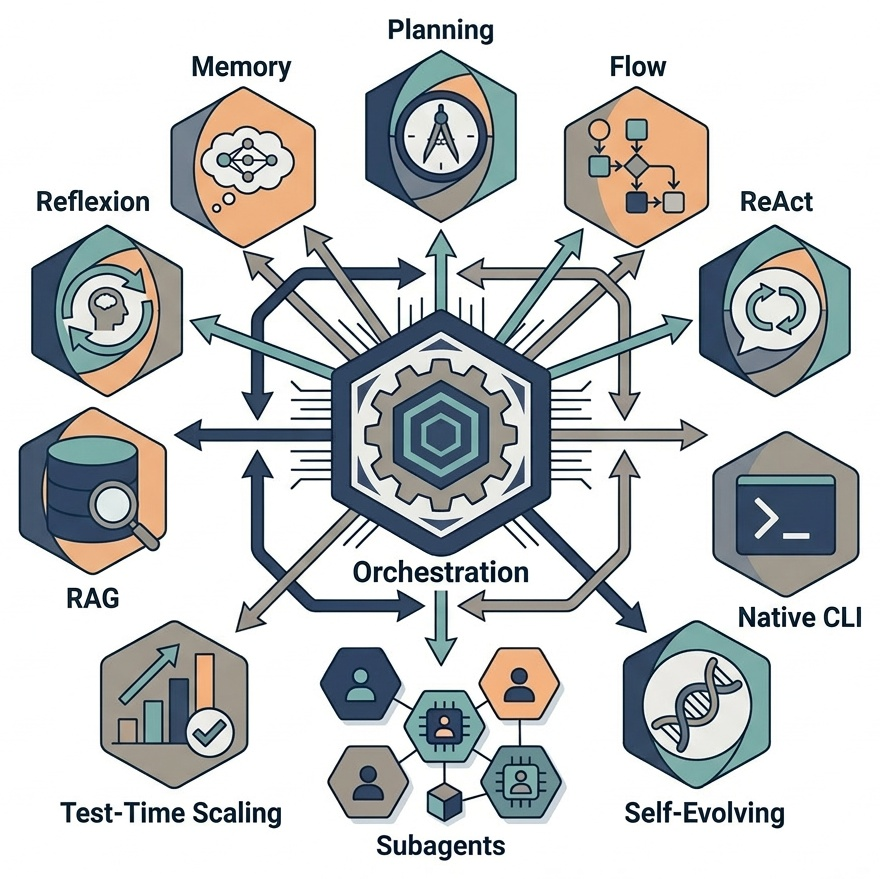
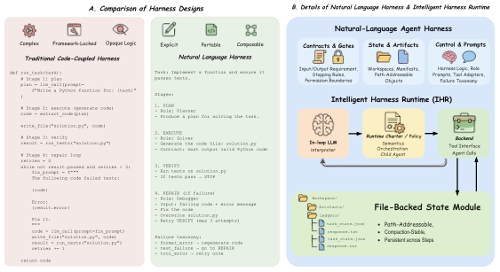
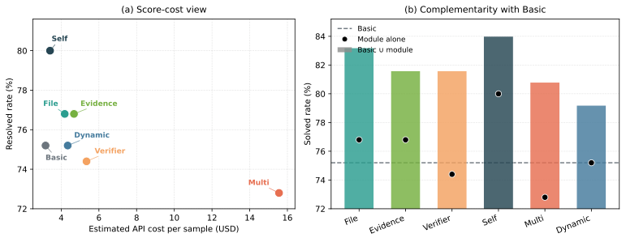
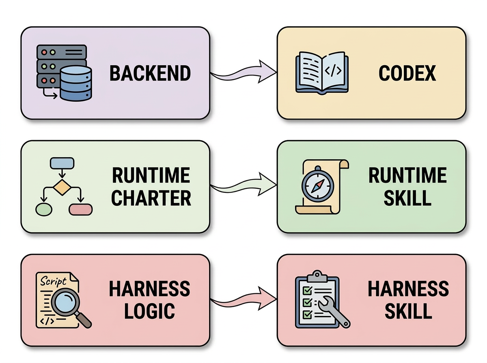

# Natural-Language Agent Harnesses：把 Agent Harness 从“隐式代码”变成“可执行文本对象”

这篇论文的核心问题非常直接：今天很多 Agent 的效果，已经不再只由底层模型决定，而是被外层的 Harness（控制与编排系统）强烈影响。但现实中，Harness 常常散落在控制器代码、框架默认行为、工具适配层和脚本里，导致 **难迁移** 、 **难比较** 、 **难做模块级消融** 。  
作者提出的答案是：把 Harness 的高层设计模式外显为可编辑、可执行的自然语言对象。

---

## 1. 先说结论：这篇论文到底做了什么？

作者提出了两个核心构件：

- **NLAH (Natural-Language Agent Harnesses)** ：用结构化自然语言表示 Harness 的控制逻辑。
- **IHR (Intelligent Harness Runtime)** ：一个共享运行时，用 in-loop LLM 去解释并执行 NLAH。

论文不是在说“自然语言替代代码”，而是在说：  
把 **可变的高层控制逻辑** （角色、阶段、契约、失败恢复）放进自然语言；  
把 **确定性执行** （测试、脚本、工具接口、sandbox）继续留给代码。

---

## 2. 为什么这个问题现在变得关键？

作者给出的背景很典型：

- 长任务、多步骤、跨工具、跨上下文窗口的场景越来越多。
- Prompt engineering 的收益在复杂任务中并不稳定，系统开始转向 Context engineering / Harness engineering。
- 在固定 base model 下，不同 scaffold/harness 的差异可直接主导最终结果。

也就是说，真正需要被“科研化”的对象，已经从“单次提示词”升级为“跨步骤控制系统”。

> 图解：这张图展示了现代 Agent 常见 Harness 模式（reason-act、retrieval、reflection、verification、memory、search、orchestration）。横向可理解为不同控制模块类型，纵向可理解为任务链路中的介入点。论文的目标是把这些模式从“隐式实现细节”提炼为“显式可执行对象”。

---

## 3. 方法总览：NLAH + IHR 的分层设计

### 3.1 IHR：共享运行时（runtime charter + backend + in-loop LLM）

IHR 由三部分组成：

- in-loop LLM：每一步解释当前 harness、状态、环境并决定下一动作。
- backend：提供终端工具、多 Agent 能力（如 spawn/wait child agent）。
- runtime charter：定义契约语义、状态语义、子 Agent 生命周期和编排规则。

> 图解：框架图的核心是“共享运行时 + 可替换 harness”。横向是任务实例输入，纵向是执行层分工。IHR 提供统一语义底座，NLAH 承载任务家族特定逻辑。这样才能在同一运行时下公平比较不同 harness 模式。

### 3.2 NLAH：可执行的自然语言 Harness

论文强调 NLAH 必须显式暴露以下模块（这是可执行性的关键）：

- Contracts：输入输出要求、格式约束、验证门、权限边界、重试与停止规则。
- Roles：solver/verifier/researcher/orchestrator 等职责边界。
- Stage structure：例如 plan → execute → verify → repair。
- Adapters/scripts：测试、解析、抓取、校验等确定性钩子。
- State semantics：哪些状态持久化、如何按路径重开。
- Failure taxonomy：缺失文件、路径错误、校验失败、工具错误、超时等。

---

## 4. 关键抽象：从 model call 升级到 agent call

论文在附录给出了非常重要的形式化。先是基础模型调用：

$$
y = \operatorname{LM}_m(c)
$$

其中 $c$ 是上下文（文本/图像/视频）。

然后定义任务：

$$
T = (p, F_{\text{in}}, \kappa)
$$

- $p$：任务提示。
- $F_{\text{in}}$：输入文件或资源。
- $\kappa$：执行契约（输出要求、预算、权限、完成条件、输出路径）。

再把一次调用提升为 agent call：

$$
\operatorname{AgentCall}(T, \Omega_t^{\mathrm{in}}) = (A_t, \Delta \Omega_t, y_t)
$$

- $\Omega_t^{\mathrm{in}}$：调用开始时可见环境和文件状态。
- $A_t$：产出的制品集合。
- $\Delta \Omega_t$：环境改动。
- $y_t$：规范化最终响应（含成功/失败与制品指针）。

这个抽象的价值在于：把“能否完成任务”从一句文本回答，变成“契约驱动的可审计执行单元”。

---

## 5. 文件化状态（file-backed state）：长链路稳定性的核心

论文单独把 file-backed state 作为可插拔模块研究。  
它要求状态满足三点：

- externalized：状态写入文件，而不只留在上下文中。
- path-addressable：后续步骤按路径精确重开。
- compaction-stable：截断、重启、分支后仍可恢复。

这非常贴合真实 Agent 的痛点：上下文变长会丢细节，分支变多会丢责任边界。

---

## 6. 实验设置与研究问题

作者围绕三类问题做了控制实验：

- **RQ1 Behavioral Effect** ：共享 runtime charter 与 benchmark harness logic 是否改变行为和结果？
- **RQ2 Composability** ：显式模块能否组合与消融？
- **RQ3 Migration** ：代码版 harness 与文本重建版 harness 在共享运行时下差异多大？

实验基座（论文报告版本）：

- Codex CLI `0.114.0`。
- GPT-5.4，reasoning effort `xhigh`。
- 子集评测：SWE-bench Verified 125 样本，OSWorld 36 样本。
- Docker 运行，固定 CPU/内存/磁盘上限。

---

## 7. RQ1：它真的改变了系统行为，但不一定单调提分

论文给出一个很“工程真实”的结论：  
**过程指标变化远大于最终 resolved rate 变化** 。

以 SWE 中的 TRAE / Live-SWE 为例，Full IHR 与去掉 runtime skill 或 harness skill 的版本，在分数上未必拉开巨大差距，但 token、tool calls、LLM calls、runtime 会明显变化。作者认为这说明 NLAH + IHR 不是“prompt 装饰层”，而是 **行为控制层** 。

另一个关键观察：

- 大多数样本在不同设置下不翻转（110+/125 一致）。
- 差异集中在“边界样本”。
- Full IHR 更像 solved-set replacer（替换解集），而不是统一扩张 frontier。

这说明 Harness 模块的价值是“改变困难样本的可解路径”，而不是“对全部样本提供平均增益”。

---

## 8. RQ2：模块可组合，但“结构更多 ≠ 成绩更好”

作者逐个加入模块（file-backed state、evidence-backed answering、verifier、self-evolution、multi-candidate search、dynamic orchestration），观察边际影响。整体模式非常有意思：

- self-evolution 在 SWE 上提升明显（+4.8）。
- file-backed state 在 OSWorld 上提升最明显（+5.5）。
- verifier / multi-candidate search 在当前预算与运行时下可能带来负收益。
- dynamic orchestration 往往改变“谁被解出来”，但不保证均值上升。

> 图解：左图是性能-成本视角，右图是“单模块得分”与“和 Basic 的并集覆盖”视角。一个模块即使单独得分一般，也可能通过覆盖不同边界样本提升并集可解性。这说明模块价值应看 frontier 形状，而不只是平均分。

---

## 9. RQ3：代码 harness 迁移到 NLAH 后，性能不一定掉，行为会重定位

在 OSWorld 配对实验中：

- 原生代码 harness：30.4。
- 重建 NLAH（IHR 执行）：47.2。

作者强调，更重要的不是数值本身，而是 **可靠性机制迁移** ：

- 原生轨迹偏“屏幕局部修复循环”（focus/selection 等 GUI 纠错）。
- NLAH 轨迹更偏“文件化状态 + 制品证据闭环”。
- 从“视觉上看起来对了”迁移到“路径可重开、证据可审计、契约可闭合”。

> 图解：这张图说明了三层映射关系：backend（工具与执行）、runtime skill（共享 charter）、harness skill（任务家族逻辑）。横轴可看作执行资源，纵轴可看作控制语义。迁移实验的公平性，正是建立在这个分层解耦之上。

---

## 10. 这篇论文最值得记住的创新点

- 把 Harness 的“设计模式层”定义为独立研究对象，而不再混在 controller bundle 中。
- 给出可执行自然语言 Harness 的最小组成：契约、角色、阶段、适配器、状态语义、失败类型。
- 用共享 IHR 实现受控比较：runtime charter 与 harness logic 可分别消融。
- 证明代码到文本的 harness migration 可以做“任务级等价研究”，而不只是 demo 式复刻。

---

## 11. 局限与风险（论文也写得很坦诚）

- 自然语言精度不如代码，遇到隐式服务状态/私有调度器时难以完整恢复。
- 共享 runtime 可能“吞掉”一部分本应归因于 harness 的行为。
- 文本模块消融不是严格因果识别（提示显著性、长度等混杂因素）。
- 可移植 harness 也可能降低风险流程扩散门槛，带来 prompt injection、工具污染、供应链攻击面。

---

## 12. 对实践者的启发：如何落地这套思路？

如果你在做复杂 Agent，论文给出的实操方向很清晰：

- 先把 harness 从代码里“写出来”，形成可读契约与角色边界。
- 把可复用状态落到文件制品，确保路径可重开。
- 用统一 runtime charter 跑不同 harness，做真正公平的 A/B 与消融。
- 评估时除了结果分数，也必须看 process metrics（tokens、calls、runtime、翻转样本类型）。

一句话总结：  
这篇论文把 Harness engineering 从“经验活”推进到了“表示科学 + 运行时科学”。

> 本文参考自 [Natural-Language Agent Harnesses](https://arxiv.org/abs/2603.25723)