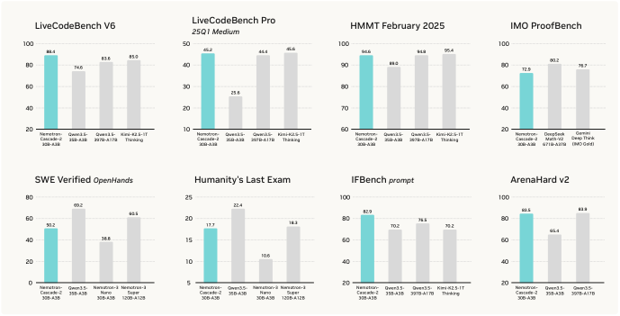
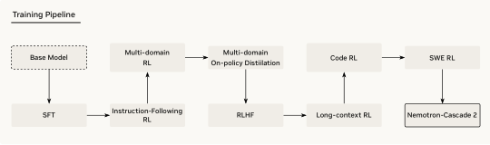
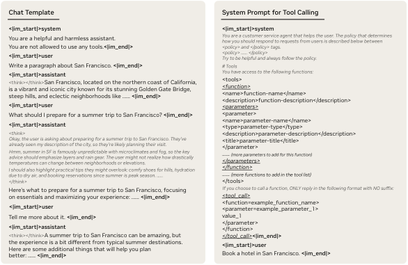

# Nemotron-Cascade 2 深度解读：用 Cascade RL + 多域 On-Policy Distillation，把 30B-A3B 模型推到 IMO/IOI 金牌级

这篇 NVIDIA Tech Report（日期为 **2026-03-16** ）的核心信息非常直接：他们把一个 **30B MoE、仅 3B 激活参数** 的开放模型，做到了接近超大开源/闭源前沿模型的推理与智能体能力，尤其在数学与竞赛编程上表现激进。

先给一句话结论：这不是“单一技巧提分”，而是一条分阶段、强工程化的后训练流水线—— **SFT 打底 + Cascade RL 分域推进 + MOPD 回补与融合** 。

> 图解：这是论文首页主图，重点传达的是“高智能密度”——在远小于超大模型参数量的前提下，仍能在数学、代码、Agentic 任务上维持强势表现。

## 1. 这篇文章到底解决了什么问题？

LLM 后训练里最难的不是“单 benchmark 刷高”，而是多能力并行优化时的 **互相干扰（inter-domain interference）** 和 **能力漂移（capability drift）** 。  
例如，强化某类可验证任务（RLVR）可能牺牲对话风格；做了 RLHF 又可能损伤严格指令遵循能力。

作者给出的答案是三层结构：

- 先按 domain 拆解训练顺序（Cascade RL），减少灾难性遗忘。
- 在中途插入多域蒸馏（MOPD），把各阶段最强 checkpoint 当作 teacher 回灌 student。
- 最后再做长上下文、代码、SWE 等专项强化，冲高实战能力。

## 2. 方法主线：Cascade RL 为什么有效？

> 图解：横向是训练阶段顺序。IF-RL 先做“指令约束地基”，中间多域 RL + MOPD 做能力平衡，再串联 RLHF、Long-context RL、Code RL、SWE RL，体现“先稳后专精”的课程学习风格。

论文给出的顺序是：

1. IF-RL（指令遵循）
2. Multi-domain RL（STEM MCQA + Tool Calling + Structured Output）
3. MOPD（多域 on-policy 蒸馏）
4. RLHF（偏好对齐）
5. Long-context RL
6. Code RL
7. SWE RL（含 agentless + execution-based agentic）

关键点在于：他们不追求“一锅炖联合训练”，而是按冲突关系排课程顺序，并在中段用蒸馏把偏移拉回去。

## 3. MOPD 是本文最值得借鉴的技术点

作者把蒸馏写成了 token 级优势项。对 sampled token $y_t$，定义：

$$
a_t^{\text{MOPD}}=
\log \pi^{\text{domain}_i}(y_t \mid s_t)-\log \pi^{\text{train}}(y_t \mid s_t)
$$

直觉上，teacher 在某个 token 上更“确信”，这个优势就更大，student 会被拉向 teacher 分布。  
同时由于 rollout 来自 inference policy、训练来自 train policy，还引入了截断重要性权重：

$$
r_t=\frac{\pi^{\text{train}}(y_t \mid s_t)}{\pi^{\text{inf}}(y_t \mid s_t)},\quad
w_t=\mathrm{sg}[r_t]\mathbf{1}[\epsilon_{\mathrm{low}}\le r_t\le \epsilon_{\mathrm{high}}]
$$

最终目标是加权的 token 级对数似然优化。核心收益在于：相比 GRPO 这类序列级稀疏奖励，MOPD 的学习信号更密、收敛更快。

论文给出的训练观察也支持这一点：

- 约 40-50 steps 即收敛。
- warmup 对稳定性非常关键。
- 在 AIME25 上，MOPD 达到 teacher-level 的速度明显快于 GRPO。
- 在 ArenaHard v2.0 上，52 steps 的 MOPD 已接近或超过更长步数 RLHF 对照。

## 4. SFT 与模板设计：为什么“thinking/non-thinking”切换很重要

> 图解：左侧是思考模式开关（通过 `<think>` 结构），右侧是工具调用标签（`<tool_call>`）。这让同一模型能在“深推理”和“工具执行”之间明确切换，减少格式混乱。

SFT 数据规模很大，覆盖 math/code/science/long-context/chat/instruction/safety/agentic/SWE/terminal。  
这部分经验是：后续 RL 的上限，很大程度由 SFT 的“能力底座密度”决定。

## 5. 结果怎么看：强在“数学 + 竞赛代码 + 指令对齐”

### 5.1 顶级竞赛结果（最有传播力）

- IMO 2025： **35/42（金牌档）**
- IOI 2025： **439.28/600（金牌档）**
- ICPC World Finals 2025： **10/12（第 4，金牌）**

在开源模型中，这组成绩非常稀缺，尤其考虑其激活参数规模仅 3B。

### 5.2 代码基准（实战可比）

在 LiveCodeBench / Pro / Codeforces ELO 上，Nemotron-Cascade-2-30B-A3B 相对同级与更大参数开源基线都很有竞争力。  
此外，Tool-Integrated Reasoning（Python 执行器）对中高难题有可见增益（如 Med/Hard 分段）。

### 5.3 对齐与指令遵循

- IFBench 达到 82.9 附近（文中主表）。
- ArenaHard v2 的 Hard Prompt / Creative Writing 都有明显提升。
- 这说明它不是纯“理工刷题机”，在人类偏好侧也做了平衡。

## 6. 复现视角下最值得学的三条

- **先排训练顺序，再谈 reward 细节** ：顺序本身就是优化器。
- **中途加 MOPD 回补能力漂移** ：相当于给多阶段 RL 加“稳定器”。
- **专项域用可验证环境冲刺** ：Code RL、SWE RL 明显依赖可执行反馈闭环。

## 7. 局限与下一步

论文也坦诚：在知识密集型和部分 agentic 任务上，仍落后于更重预训练或更强 agent scaffold 的模型。  
这意味着后续最可能的增量方向是：

- 更强的知识型预训练底座
- 更大规模的 agentic RL（尤其真实工具链）
- 多域冲突下的自动课程排序

## 8. 总结

Nemotron-Cascade 2 的价值，不只是“某个分数高”，而是它把大模型后训练工程抽象成了一个可迁移范式：  
**分域级联训练（Cascade RL）+ 中途多域蒸馏校正（MOPD）+ 可验证环境专项强化** 。  
如果你在做中等参数模型冲高，这篇文章的 pipeline 设计比单点算法更值得复用。

> 本文参考自 [Nemotron-Cascade 2: Post-Training LLMs with Cascade RL and Multi-Domain On-Policy Distillation](https://arxiv.org/abs/2603.19220)