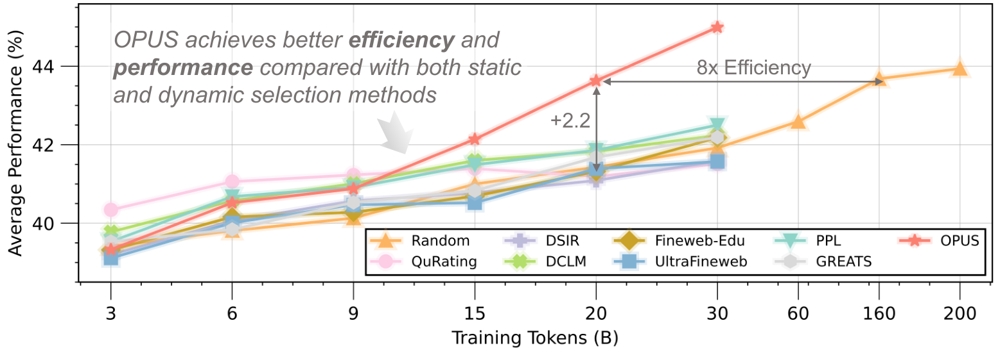
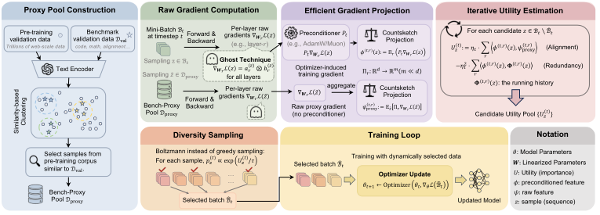
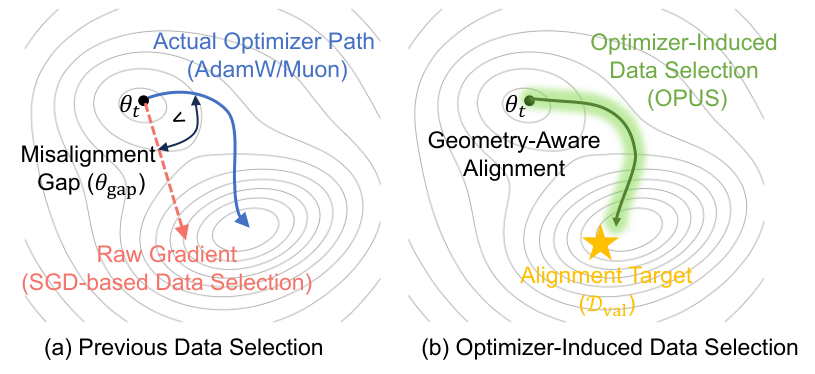
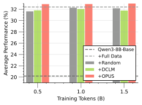
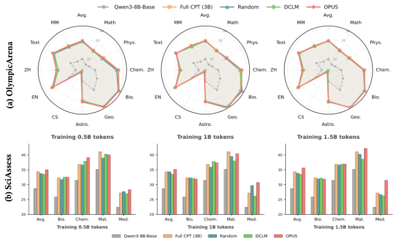
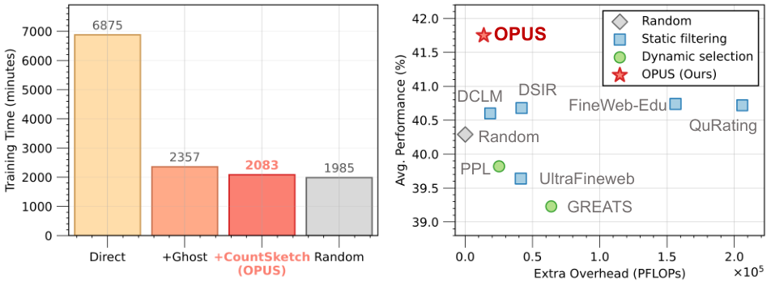
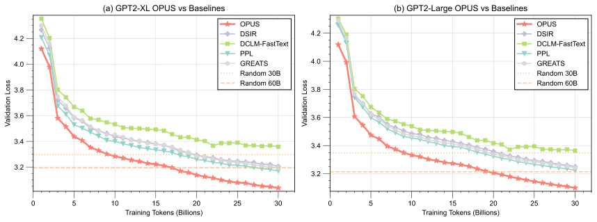

# OPUS：在 **每一次** 预训练迭代中，做更聪明的数据选择

## 一句话总结
这篇论文提出 OPUS，把“数据选择”从静态过滤升级为 **与优化器更新几何对齐的动态选择** ，在同等算力下显著提升 LLM 预训练效率，并把数据消耗压到更低。

> 图解：横轴是不同基准任务，纵轴是准确率/性能提升。图中对比显示 OPUS 在多个基准上整体优于随机选择，并在 GPT-XL 上带来显著算力节省。  

## 1. 研究背景：数据墙来了，问题不再是“更多”，而是“更好”
LLM 预训练长期依赖“模型更大 + 数据更多”的规模化路线，但高质量公开文本即将枯竭（Data Wall）。这意味着：
- **每一个 token 都很贵** ，选错数据就是浪费训练预算。
- 静态过滤（一次性筛掉坏数据）无法适应训练过程中的模型变化。
- 动态方法又大多 **以 SGD 视角定义梯度对齐** ，忽略了 AdamW、Muon 等现代优化器对更新方向的扭曲。

所以核心问题变成：  
**在每一个优化器 step 上，哪些数据最值得更新模型？**

## 2. OPUS 的核心思想：在“优化器诱导的更新空间”里定义数据价值
传统方法用 raw gradient 来衡量样本效用，但现代优化器会对梯度进行 **预条件化（preconditioning）** ，真实更新方向与 raw gradient 并不一致。

OPUS 的关键定义是：

$$
\mathbf u_z^{(t)} = \mathbf{P}_t \nabla_\theta \mathcal{L}(z;\theta_t)
$$

- $\mathbf{P}_t$ 是优化器诱导的预条件器
- $\mathbf u_z^{(t)}$ 是样本在优化器几何中的“真实更新方向”

数据效用的本质就是：  
**样本更新方向是否对齐验证/代理目标方向。**

## 3. OPUS 的目标函数：对齐 + 去冗余
论文从验证集损失下降推导出如下打分：

$$
U_z^{(t)} \approx
\eta_t \langle \mathbf u_z^{(t)}, \mathbf g_{\text{proxy}}^{(t)} \rangle
-
\eta_t^2 \langle \mathbf u_z^{(t)}, \mathbf G^{(t)} \rangle
$$

解释：
- 第一项：与 proxy 方向对齐，鼓励“有用更新”
- 第二项：去冗余，避免多个样本在同一方向重复

这也是 OPUS 里“性能 + 多样性”的核心平衡。

## 4. 为什么要引入 Proxy？Bench-Proxy 的设计逻辑
直接用验证集会有分布偏移，且噪声大。  
OPUS 提出 **Bench-Proxy** ：

1. 用语义检索把 benchmark 验证样本映射到预训练语料
2. 选出最相似文档作为 proxy pool
3. 训练时每步采样 proxy mini-batch 估计目标方向

这样 proxy 同时满足：
- **任务对齐** （来自 benchmark 语义）
- **分布一致** （来自预训练语料）

> 图解：左侧展示 Bench-Proxy 的检索流程，中间是 OPUS 的打分与投影步骤，右侧是 Boltzmann 采样形成训练批次的闭环。  

## 5. 算法层面：OPUS 的整体流程
OPUS 每一步大致做 6 件事：
1. 从数据流取候选 buffer
2. 根据优化器状态构造 $\mathbf{P}_t$
3. 采样 proxy batch 得到目标方向
4. 用 ghost + CountSketch 计算样本投影
5. 软采样选出 batch（Boltzmann）
6. 真实更新模型

算法原始形式在文中给出，关键是：  
**每一步都动态选择，且 selection 与优化器几何一致。**

## 6. 为什么 OPUS 能扩展到 LLM 规模？Ghost + CountSketch
如果真的算 per-sample full gradient，会炸。  
OPUS 做了两层降维：

### 6.1 Ghost 技术：线性层梯度是 rank-1
对线性层：

$$
\nabla_{\mathbf W_r}\mathcal{L}(z) = \mathbf a_r^{(z)} \otimes \mathbf b_r^{(z)}
$$

只保存输入激活 $\mathbf a$ 和反向误差 $\mathbf b$，避免 materialize 大矩阵。

### 6.2 CountSketch 投影
把高维梯度映射到低维空间，内积保持无偏：

$$
\mathbb{E}\langle \Pi(g_1), \Pi(g_2)\rangle=\langle g_1,g_2\rangle
$$

这让 OPUS 的 scoring 成本大幅下降。

## 7. 为何不能用 greedy top-k？Boltzmann 采样的必要性
贪心 top-k 在噪声 proxy 下会过拟合，缺乏多样性。  
OPUS 用：

$$
p_z^{(t)} \propto \exp(U_z^{(t)} / \tau)
$$

- 高分样本概率大
- 低分样本仍保留探索机会

实验也证明 soft sampling 更稳。

## 8. 实验结果：从头训练与继续训练全覆盖

### 8.1 FineWeb (30B tokens)
OPUS 在 GPT-2 Large/XL 上，整体平均性能优于所有对照，甚至接近随机训练 60B token 的结果。

> 图解：不同方法的数据选择与优化器匹配程度。OPUS 显式对齐 AdamW/Muon 的更新几何，因此比 raw-gradient 方法更稳定。  

### 8.2 FineWeb-Edu：低质量数据也能打
最强对比之一：
- OPUS 用 **score=3 的中质量数据**
- baseline 用 **score=4+5 的高质量数据**

结果：OPUS 仍能打平甚至超越高质量 baselines。

### 8.3 OOD 泛化
即使 proxy 来自 benchmark，OPUS 在 OOD 任务（BBH / RACE / AX / StoryCloze）仍保持领先，说明 **不是过拟合 proxy** 。

### 8.4 继续预训练 (Qwen3-8B, SciencePedia)
OPUS 只用 0.5B token 就超过 Full CPT 3B token 的效果，数据效率提升约 **6×** 。

> 图解：横轴是 CPT token 数，纵轴是领域任务性能。OPUS 在 0.5B 就达到 Full CPT（3B）的水准。  

> 图解：不同科学领域的细分结果，OPUS 在大多数领域明显优于 Random / DCLM，并接近 Full CPT。  

## 9. 收敛与效率：不是“多算”，而是“算得更准”
OPUS 的额外计算开销仅 4.7%，远小于 naive online selection 的 3.5×。

> 图解：横轴是方法，纵轴是训练时间/计算量。OPUS 的 overhead 极低，同时性能提升明显。  

> 图解：横轴是训练 token，纵轴是验证损失。OPUS 收敛更快，甚至用 17B token 达到 Random 60B 的效果。  

## 10. 关键创新点总结
- **优化器感知的数据选择** ：不再假设 SGD。
- **Bench-Proxy** ：在任务对齐与数据分布一致性间找平衡。
- **Ghost + CountSketch** ：把理论可行性变成工程可落地。
- **Boltzmann Sampling** ：在动态选择里保留探索空间。

## 11. 结论与展望
OPUS 把数据选择变成 **训练过程本身的一部分** 。  
在数据墙时代，这类“以优化器几何为中心”的方法可能会成为预训练管线的标配。

> 本文参考自 [OPUS: Towards Efficient and Principled Data Selection in Large Language Model Pre-training in Every Iteration](https://arxiv.org/abs/2602.05400)