# Llama 2 论文精读：开源模型如何追上 ChatGPT——预训练、RLHF 与安全对齐的全流程拆解

这篇 Meta 的 Llama 2 论文解决的是一个当时困扰整个开源社区的问题：开源 LLM 的基座能力已经不输 GPT-3，但没有任何一个开源 **Chat 模型** 能真正替代 ChatGPT、Claude 这类"产品级"闭源模型，而对齐（Alignment）所需的方法、数据和成本又完全不透明。Llama 2 的做法一句话概括就是： **用 2 万亿 token 重新预训练基座，再用数万条精标 SFT 数据打底，最后靠百万级人类偏好数据驱动的迭代式 RLHF（Rejection Sampling + PPO）把对话能力和安全性磨出来** 。最硬的结果是：Llama 2-Chat 70B 在约 4000 条提示的人工评测中对 ChatGPT 取得 36% 胜率、31.5% 平局，基本进入同一梯队；同时微调后模型的毒性生成率压到约 0%，成为当时毒性最低的开源对话模型。更重要的是，这篇论文把整套对齐配方公开了，这也是它影响力远超一个模型本身的原因。

## 一、这篇工作要解决什么问题

在 Llama 2 之前，BLOOM、LLaMA-1、Falcon 这些开源预训练模型已经在基准测试上追平 GPT-3、Chinchilla 等闭源基座。但"预训练模型"和"能直接聊的产品"之间隔着一条巨大的鸿沟：ChatGPT、Bard、Claude 都经过重度的人类偏好微调，这一步需要大量算力和人工标注，且各家都秘而不宣。开源社区只能用 ShareGPT 蒸馏数据训练 Vicuna、Alpaca 这类模型，效果和稳定性都差一截。

Llama 2 发布了两组模型：

1. **Llama 2** ：基座模型，7B / 13B / 70B 三个规格（另有 34B 训练完成但因红队测试不充分未发布）。相比 Llama 1，预训练语料扩大 40%，上下文长度翻倍到 4k，大模型引入 Grouped-Query Attention（GQA）。
2. **Llama 2-Chat** ：针对对话场景微调的版本，同样 7B / 13B / 70B 三档，免费开放给研究和商业使用。

先放两张论文开篇的核心结果图，看看最终成色。

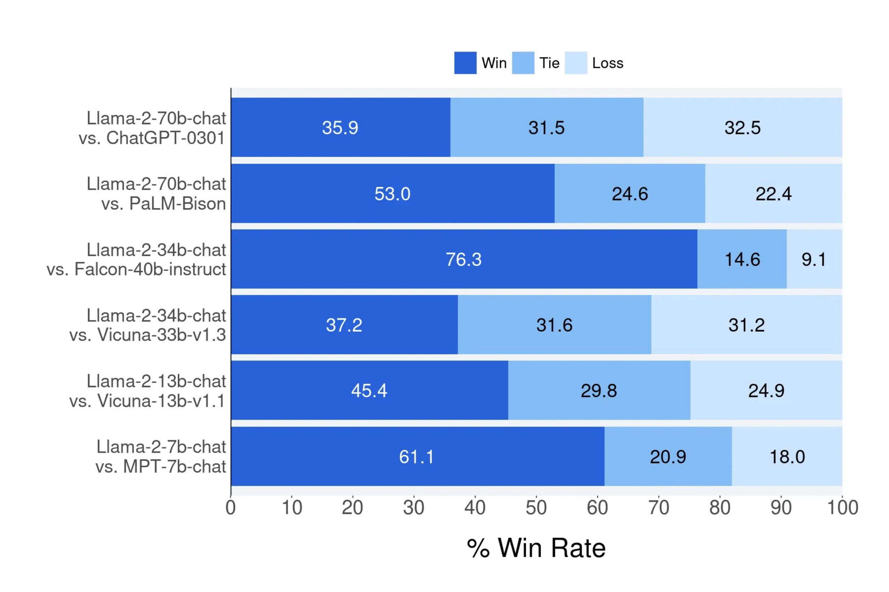

> 图解：这是约 4000 条单轮与多轮提示上的人工评测胜率对比，每一行是一对模型的两两比较，绿色代表该行左侧模型胜出、灰色为平局、红色为落败。可以看到 Llama 2-Chat 对 MPT、Vicuna、Falcon 等开源模型是压倒性优势；对 ChatGPT（gpt-3.5-turbo-0301）时 70B 版本胜率 36%、平局 31.5%，虽然仍处下风但已在同一量级。评测的 95% 置信区间在 1%–2% 之间。

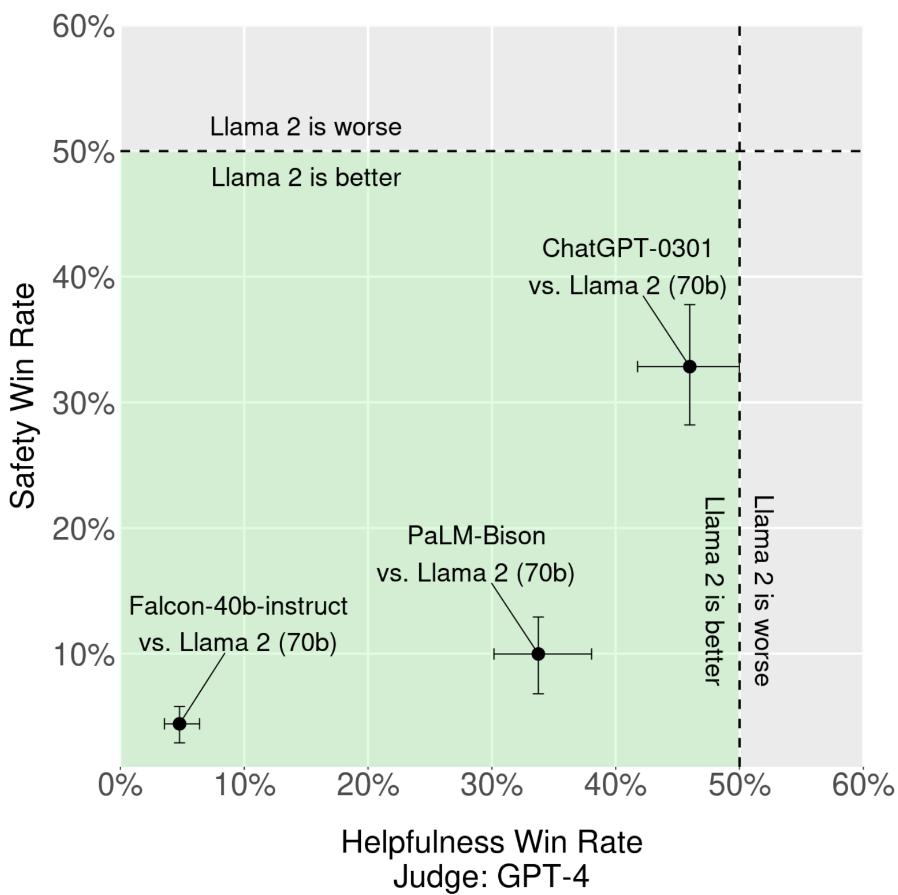

> 图解：作为人工评测的补充，作者还请 GPT-4 当裁判，比较商业许可可用的基线模型与 Llama 2-Chat，纵轴是胜率（绿色区域表示 Llama 2-Chat 更优），横轴区分有用性（helpfulness）与安全性（safety）两个维度。为消除顺序偏差，两个回答呈现给 GPT-4 的先后顺序是随机交换的。结果显示 GPT-4 的结论与人工评测方向一致。

> 图解：约 2000 条对抗性提示上的安全性人工评测，柱子越短代表安全违规率越低。Llama 2-Chat 各尺寸的安全违规率与 ChatGPT 相当甚至更低，明显优于 MPT 和 Vicuna。需要注意作者自己也强调：这类评测使用的安全标准天然偏向自家模型的设定，解读时要保留余地。

## 二、整体训练流水线一览

Llama 2-Chat 的诞生路径可以概括为四步，后面几节逐一拆解。

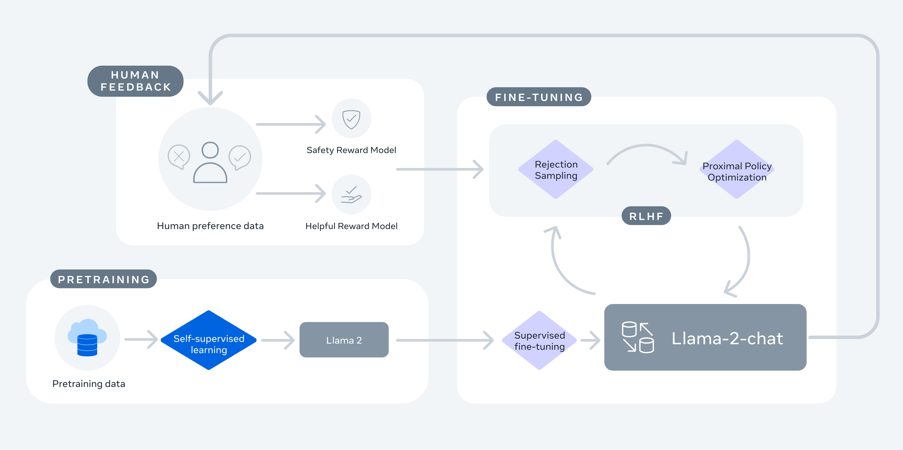

> 图解：最左是 **Pretraining** （用公开网络语料预训练 Llama 2 基座）；然后进入 **Supervised Fine-Tuning** （SFT，监督微调）得到初版 Chat 模型；接着是多轮迭代的 **RLHF** ：先收集人类偏好数据训练奖励模型（Reward Model），再用 Rejection Sampling（拒绝采样）和 PPO 两种算法强化模型；注意图中"Iterative Reward Modeling Data"这条回路——每一轮模型变强后都要用最新模型重新采样、重新标注偏好数据，否则奖励模型会因为分布漂移而失真。这条回路是整个流程里最容易被忽略、却最关键的工程细节。

## 三、预训练：更干净的数据、更长的上下文、更快的推理

预训练部分没有颠覆性创新，思路是"沿用 Llama 1 的成熟配方，把每个短板补齐"：更稳健的数据清洗、更新的数据配比、多 40% 的训练 token、翻倍的上下文长度，以及为大模型推理降本的 GQA。

### 3.1 预训练数据

- 语料全部来自公开来源， **不包含任何 Meta 自家产品的用户数据** ，并主动剔除了已知含有大量个人隐私信息的站点。
- 总训练量 **2 万亿 token** ，作者称这是性能与成本权衡后的甜点；同时对事实性较强的数据源做了上采样，目的是增加知识密度、抑制幻觉。
- 没有做激进的有毒内容过滤——原因放到第七章安全部分讲，这是一个有意识的权衡。

两代模型的规格对比：

| 模型 | 参数量 | 上下文长度 | GQA | 训练 Tokens | 峰值学习率 |
|---|---|---|---|---|---|
| Llama 1 | 7B / 13B / 33B / 65B | 2k | 否 | 1.0T / 1.0T / 1.4T / 1.4T | $3.0\times10^{-4}$（33B/65B 为 $1.5\times10^{-4}$） |
| Llama 2 | 7B / 13B | 4k | 否 | 2.0T | $3.0\times10^{-4}$ |
| Llama 2 | 34B / 70B | 4k | 是 | 2.0T | $1.5\times10^{-4}$ |

所有模型训练的 global batch size 都是 4M token。一个值得注意的信号是：

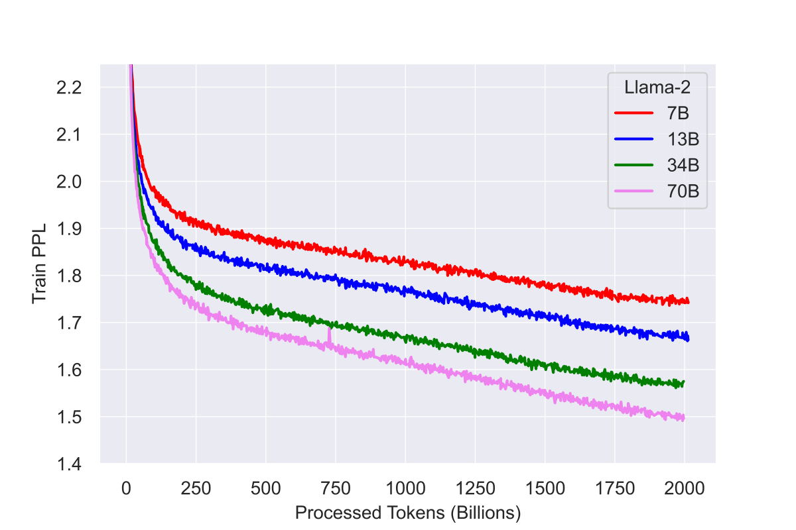

> 图解：横轴是训练消耗的 token 数（一直到 2T），纵轴是训练损失。四条曲线对应 7B 到 70B 四个尺寸。重点在于： **即使吃完 2T token，损失曲线仍没有任何饱和（走平）的迹象** ，说明继续加数据还有收益——这也是后来 Llama 3 把数据量推到 15T 的伏笔。

### 3.2 架构与训练细节

架构上沿用标准 Transformer，几个关键词： **RMSNorm** 预归一化、 **SwiGLU** 激活函数、 **RoPE** 旋转位置编码。与 Llama 1 的差异只有两处：上下文从 2048 扩到 4096，以及 34B/70B 引入 GQA。

优化器超参：AdamW（$\beta_1 = 0.9$，$\beta_2 = 0.95$，$\text{eps} = 10^{-5}$），cosine 学习率衰减（warmup 2000 步，最终学习率降到峰值的 10%），weight decay 0.1，梯度裁剪 1.0。分词器沿用 Llama 1 的 SentencePiece BPE，数字拆成单个数字字符，未知 UTF-8 字符按字节分解，词表大小 32k。

### 3.3 两个关键架构决策的消融实验

**上下文长度 2k vs 4k** ：用 30B 模型各训 150B token 做对照，只改上下文长度。结果是 4k 在长文档基准 SCROLLS 上大幅领先（NarrativeQA F1 从 0.21 涨到 17.26，Qasper F1 从 0.71 涨到 18.52），同时在 SQuAD 等通用任务上无退化。结论：4k 是"免费"的收益。

**GQA vs MQA vs MHA** ：自回归解码时 KV Cache 是显存大头，Multi-Query Attention（MQA，所有头共享一组 KV）和 Grouped-Query Attention（GQA，8 组 KV）都能压缩 KV Cache。作者用 30B 模型、150B token 做三方对照（通过加大 FFN 维度补齐参数量）：

| 注意力变体 | BoolQ | PIQA | HellaSwag | ARC-c | TQA | MMLU | 平均表现 |
|---|---|---|---|---|---|---|---|
| MHA（基线） | **71.0** | **79.3** | 75.1 | **43.0** | 44.7 | **28.0** | — |
| MQA | 70.6 | 79.0 | 74.5 | 41.9 | 42.8 | 26.5 | 略降 |
| GQA | 69.4 | 78.8 | **75.4** | 42.5 | **46.2** | 26.9 | 与 MHA 基本持平 |

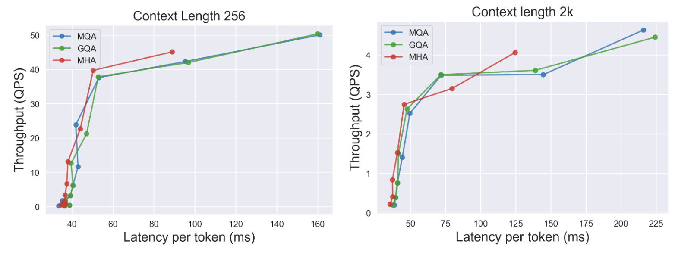

> 图解：横轴是 batch size（对数刻度），纵轴是推理吞吐（token/秒），两条曲线分别对应 256 和 2048 上下文。MHA 在 2k 上下文、batch 128 时就 OOM（内存溢出）了，而 MQA/GQA 能撑到更大的 batch，吞吐优势随 batch 增大而拉大。GQA 精度几乎无损、推理又比 MQA 更好部署（8 张 A100 张量并行时 MQA 的 KV 头数少于 GPU 数，无法按头切分），所以 34B/70B 选了 GQA。这个"精度换推理成本"的权衡后来成了大模型标配。

### 3.4 训练硬件与碳排放

训练在 Meta 的 RSC 集群和内部生产集群上进行，均使用 A100。两个集群的差异提供了一个有趣的对比实验：RSC 用昂贵的 NVIDIA Quantum InfiniBand 互联、单卡功耗上限 400W；生产集群用更便宜的 RoCE（基于融合以太网的 RDMA）、功耗上限 350W。结论是 **RoCE 在 2000 卡规模内几乎能追平 InfiniBand** ——意味着大模型预训练的硬件门槛进一步降低了。

碳排放方面，整个 Llama 2 家族预训练累计消耗约 **331 万 GPU 小时** ，估算排放 **539 吨 CO₂ 当量** （70B 一个模型就占 291 吨），Meta 声称通过可持续计划 100% 抵消。开源发布的另一层意义在于：其他人不必再重复付出这笔预训练成本。

### 3.5 预训练模型评测：开源第一，但离 GPT-4 还远

基座模型在八个能力维度上与开源模型对比（以下为各组平均分）：

| 模型 | 尺寸 | Code | 常识推理 | 世界知识 | 阅读理解 | 数学 | MMLU | BBH | AGI Eval |
|---|---|---|---|---|---|---|---|---|---|
| MPT | 30B | 28.9 | 64.9 | 50.0 | 64.7 | 9.1 | 46.9 | 38.0 | 33.8 |
| Falcon | 40B | 15.2 | 69.2 | 56.7 | 65.7 | 12.6 | 55.4 | 37.1 | 37.0 |
| Llama 1 | 65B | 30.7 | 70.7 | 60.5 | 68.6 | 30.8 | 63.4 | 43.5 | 47.6 |
| **Llama 2** | **70B** | **37.5** | **71.9** | **63.6** | **69.4** | **35.2** | **68.9** | **51.2** | **54.2** |

Llama 2 70B 相比 Llama 1 65B，MMLU 提升约 5 分、BBH 提升约 8 分，全维度碾压同期所有开源模型；7B/34B 也分别在同尺寸上胜过 MPT 和 Falcon。

与闭源模型的差距则更有信息量：

| 基准 | GPT-3.5 | GPT-4 | PaLM | PaLM-2-L | Llama 2 70B |
|---|---|---|---|---|---|
| MMLU (5-shot) | 70.0 | **86.4** | 69.3 | 78.3 | 68.9 |
| TriviaQA (1-shot) | – | – | 81.4 | **86.1** | 85.0 |
| GSM8K (8-shot) | 57.1 | **92.0** | 56.5 | 80.7 | 56.8 |
| HumanEval (0-shot) | 48.1 | **67.0** | 26.2 | – | 29.9 |
| BBH (3-shot) | – | – | 52.3 | **65.7** | 51.2 |

一句话总结： **Llama 2 70B 在 MMLU 和 GSM8K 上逼近 GPT-3.5，多数基准追平或超过 540B 的 PaLM，但与 GPT-4、PaLM-2-L 仍有明显差距，代码能力是最大的短板** （HumanEval 29.9 vs GPT-3.5 的 48.1）。

## 四、插曲：评测分数里有多少"水分"——数据污染分析

训练数据规模到了 2T 这个量级，评测集内容混进训练语料几乎不可避免。论文用一套相当严谨的方法量化了这个"作弊加成"，这在当时的模型报告中并不多见，值得单独一讲。

此前的做法（GPT-3、FLAN 等）是在 **文本空间** 做高阶 n-gram（如 13-gram）碰撞检测，只能判断"污染/未污染"二值；PaLM 改进为"样本 70% 的 8-gram 出现在训练数据中即算污染"。Llama 2 的方法有三点不同：

1. **在 token 空间匹配** ，且送入分词器的是完整格式化（verbalized）后的评测样本，与真实评测时的输入形态一致；
2. **自底向上定义污染比例** ：一个 token 只要出现在评测样本和训练集共有的、长度超过 10 的 token n-gram 中就算"被污染"，样本的污染率 = 被污染 token 占比。这样就可以构造高精度干净子集（污染率 < 20%）和高精度污染子集（污染率 > 80%）；
3. 允许 4 个 token 的 "skipgram 容错预算"（首尾 10 个 token 内不允许不匹配），容忍格式化差异。

匹配用改造过的后缀数组（suffix array）在 PySpark 集群上实现，约 1500 核跑了 7 小时扫完全部训练数据。

判定逻辑也很讲究：只有当"最干净的样本显著差于整体 **且** 最脏的样本显著好于整体" **同时成立** 时，才算污染影响了成绩。统计量是

$$
Z_n = \frac{\bar{X} - \mu_n}{\sigma_n}
$$

其中 $\bar{X}$ 是子集平均成绩，$\mu_n$、$\sigma_n$ 是规模为 $n$ 的随机抽样的均值与标准差。由中心极限定理 $Z_n$ 近似标准正态，四个子集全部满足 $|Z_n| > 2$ 才判定存在污染增益。另外为排除"匹配片段在训练集中高度碎片化、模型其实没见过完整序列"的干扰，作者对最小匹配长度 $L \in \{10, 20, 30, 40, 50\}$ 逐一重跑分析。

结论出人意料地干净： **所有评测集中只有 HellaSwag 和 MMLU-Humanities 存在统计显著的污染增益** ，且 70B 的获益比 7B 更明显（大模型"记性"更好，符合直觉）。以 HellaSwag（$L=40$）为例，70B 在"脏"子集上 92.2 分、在"干净"子集上只有 80.0 分（$Z_n$ 分别为 +7.42 和 -5.73）；MMLU-Humanities 的污染对 70B 的 MMLU 总分造成了约 0.9 分的小幅抬升。其余数据集在任何 $L$ 下都没有足够证据显示受益。

## 五、SFT：质量是唯一的门槛

解决了"基座够不够强"的问题后，下一个问题是：怎么把基座变成一个会对话的助手？第一步是监督微调（Supervised Fine-Tuning, SFT）。

**起步** ：先用公开的指令微调数据冷启动。

**核心发现——"Quality Is All You Need"** ：第三方 SFT 数据量虽大，但多样性和质量都不足，尤其缺少对话风格的高质量指令。Meta 的做法是果断放弃数百万条第三方数据，转向自建供应商标注的精品数据，最终 **只收集了 27,540 条标注就停手了** ——数万条高质量样本足以达到很高的 SFT 质量，这与 LIMA 论文"少而精"的结论互相印证。作者还发现不同标注平台/供应商的数据会带来显著的下游性能差异，即便外包也必须做数据质检。

一个很有意思的验证：他们抽查了 180 条样本，人工对比"标注员手写答案"和"SFT 模型采样输出"，发现 **模型输出常常不输手写答案** 。于是标注预算被果断倾斜到性价比更高的地方——为 RLHF 做偏好标注，而不是继续堆 SFT 数据。

**训练细节** ：cosine 学习率（初始 $2\times10^{-5}$），weight decay 0.1，batch size 64，序列长度 4096。每条样本由 prompt 和 answer 组成，训练集里所有 prompt-answer 对拼接成完整序列，用特殊 token 分隔 prompt 与 answer；采用自回归目标，但 **用户 prompt 部分的 loss 置零** ，只对答案 token 反向传播。共微调 2 个 epoch。

## 六、RLHF：本文的灵魂章节

SFT 让模型"会对话"，但要让模型"对话得好、对话得安全"，靠的是 RLHF（基于人类反馈的强化学习）。这部分是全论文信息量最大的章节，也是 Llama 2 与此前开源模型拉开差距的真正原因。

### 6.1 人类偏好数据：百万级二选一比较

标注流程：标注员先写一个 prompt，然后从 **两个不同模型变体、不同温度** 采样出的两个回答中，按指南选出更好的一个；除了强制二选一，还要标注偏好的强度等级——显著更好（significantly better）、更好（better）、略好（slightly better）、几乎一样/不确定（negligibly better / unsure）四档。选择二值比较而非打分制，是为了最大化收集到的 prompt 多样性。

偏好数据分两个维度收集： **有用性** （回答是否满足用户请求）和 **安全性** （回答是否违反安全准则，比如"详细教人做炸弹"虽然"有用"但不安全）。安全标注额外记录一个三分类标签：首选安全/另一不安全（18%）、两个都安全（47%）、两个都不安全（35%）。

数据规模是本文最"壕"的部分之一：

| 数据集 | 比较对数 | 平均对话轮数 | 平均每条 Tokens |
|---|---|---|---|
| Anthropic Helpful + Harmless | 166,353 | 3.0 | ~220 |
| OpenAI Summarize / WebGPT | 189,958 | 1.0 | ~360 |
| StackExchange | 1,038,480 | 1.0 | 440.2 |
| Stanford SHP | 74,882 | 1.0 | 338.3 |
| Synthetic GPT-J | 33,139 | 1.0 | 123.3 |
| **Meta 自建（安全+有用）** | **1,418,091** | **3.9** | **798.5** |
| **合计** | **2,919,326** | 1.6 | 595.7 |

Meta 自建的偏好数据超过 **140 万条二值比较** ，按周分批收集，共 14 批。与开源数据集相比，Meta 的数据对话轮数更多、样本更长。

这里藏着一个关键工程认知： **奖励模型必须跟着策略模型一起"保鲜"** 。Llama 2-Chat 每迭代一次，输出分布就漂移一次，如果还用旧数据训的奖励模型去打分，精度会迅速劣化（hyper-specialization）。所以每轮 RLHF 之前，都要用最新模型重新采样、重新收集一批偏好数据——这就是第二章流水线图里那条数据回路。

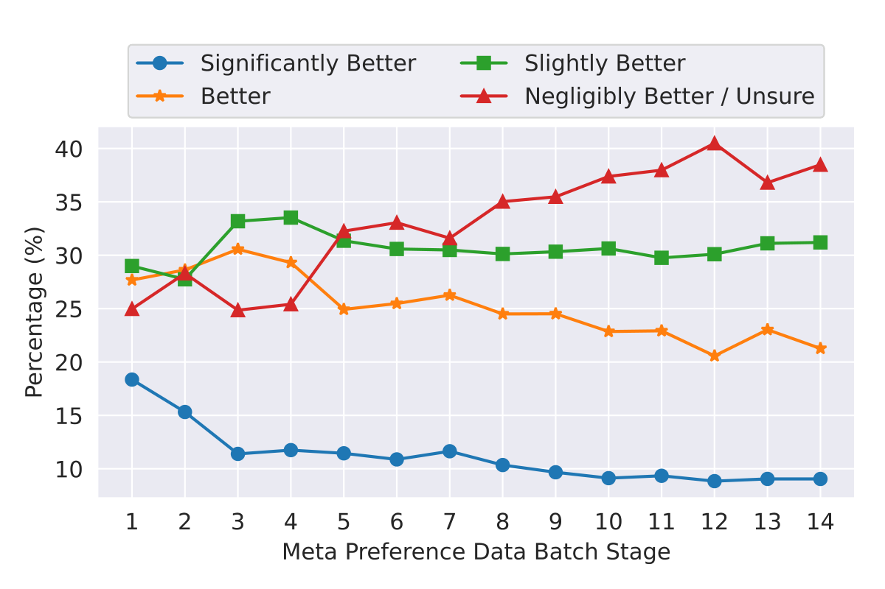

> 图解：横轴是数据批次（1 到 14 周），纵轴是各偏好强度等级的占比。可以看到"显著更好"（深色）的比例逐批下降，而"几乎一样/不确定"的比例显著上升——因为用来采样的模型越来越强，两个回答质量都高，标注员越来越难分出高下。这个趋势本身就是模型在进步的旁证。

另一个配套策略是 **课程式标注（curriculum annotation）** ：早期批次让标注员出简单 prompt，随着模型变强逐步提升 prompt 难度、教授新技能。作者用奖励模型分数验证了后期批次的 prompt 确实平均更难。

### 6.2 奖励模型：为什么拆成两个

奖励模型（RM）接收 prompt + 回答，输出一个标量分数。Llama 2 训了 **两个独立的 RM** ：一个管有用性（Helpfulness RM），一个管安全性（Safety RM）。原因是有用性和安全性天然存在张力——"尽可能有问必答"和"该拒绝时拒绝"会互相干扰，单个模型很难两头兼顾（附录中的实验也证实了两个目标会互相拖累）。

RM 直接从 **对话模型 checkpoint 初始化** ，把 next-token 预测头换成回归头。这个设计有个聪明的考量：RM 和 Chat 模型"知道同样的东西"，避免两者信息不对称——否则 RM 可能把自己不懂的事实误判为幻觉，或者反过来把幻觉当成高质量回答。

**训练目标** 是在 InstructGPT 的二值排序损失上加了一个 **margin 项** ：

$$
\mathcal{L}_{\text{ranking}} = -\log\left(\sigma\left(r_\theta(x, y_c) - r_\theta(x, y_r) - m(r)\right)\right)
$$

其中 $r_\theta(x, y)$ 是 RM 对 prompt $x$ 和回答 $y$ 的打分，$y_c$ 是标注员选中的回答，$y_r$ 是被拒绝的回答，$m(r)$ 是偏好强度等级 $r$ 的离散函数——差距越大的样本对（如"显著更好"）margin 越大。作者试了两种 margin 档位：小档（1 / 2/3 / 1/3 / 0）和大档（3 / 2 / 1 / 0）。消融显示 margin 项能提升 RM 在差异明显样本对上的准确率（如"显著更好"档从 79.1% 提到 80.7%），代价是相似样本对上略有回退；大 margin 还会把奖励分布推向两极分化，作者提醒 PPO 对奖励分布变化敏感，奖励校准值得后续投入。

**数据配比** 经过大量实验：Helpfulness RM 用全部 Meta 有用性数据，外加等量混合的 Meta 安全数据与开源数据；Safety RM 用全部 Meta 安全数据 + Anthropic Harmless，再按 90/10 混入有用性数据——保留 10% 有用性数据对"两个回答都安全"样本的判断力特别有帮助。开源偏好数据没有发现负迁移，保留它们还能增强泛化、缓解 reward hacking。训练 1 个 epoch（更久会过拟合），70B RM 峰值学习率 $5\times10^{-6}$，其余 $1\times10^{-5}$，有效 batch 512 对。

**结果** ：在各自留出 1000 条/批的内部测试集上，自研 RM 全面优于开源基线和 GPT-4。

| 模型 | Meta 有用性 | Meta 安全性 | Anthropic Helpful | Anthropic Harmless | 平均 |
|---|---|---|---|---|---|
| SteamSHP-XL (FLAN-T5-XL) | 52.8 | 43.8 | 66.8 | 34.2 | 55.3 |
| Open Assistant (DeBERTa V3) | 53.8 | 53.4 | 67.7 | 68.4 | 63.0 |
| GPT-4（零样本二选一） | 58.6 | 58.1 | – | – | – |
| Safety RM | 56.2 | **64.5** | 55.4 | **74.7** | 64.3 |
| Helpfulness RM | **63.2** | 62.8 | **72.0** | 71.0 | **70.6** |

两个观察：其一，各 RM 在自家领域最强，印证了拆分必要性；其二，GPT-4 未经专门训练就超过了所有开源 RM，零样本评判能力可见一斑。按偏好强度细分，RM 在"显著更好"档准确率高达 89.9%–94.3%，在"几乎一样"档只有 55% 左右——但好在对最终 RLHF 效果影响最大的恰恰是差异明显的样本对。

安全 RM 还消融了一个 **安全辅助损失** （显式区分安全/不安全回答）：在 Meta Safety 测试集上，不安全回答召回率从 73.0% 提升到 **90.4%** ，为后续 RLHF 提供了更可靠的安全信号。

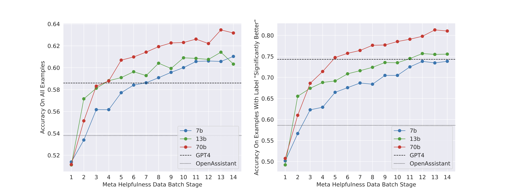

> 图解：横轴是训练数据量，纵轴是 RM 准确率，不同颜色的点是不同尺寸的 RM。两条信息：一是同数据量下大模型更准；二是 **曲线尚未走平** ——继续标注数据还能继续涨。作者强调 RM 准确率是最终模型效果最重要的代理指标，因为它是一个无歧义的排序任务，RM 的提升可以直接转化为 Chat 模型的提升。

### 6.3 迭代式 RLHF：Rejection Sampling 与 PPO 双管齐下

随着偏好数据一批批到货，RLHF 共迭代了 5 个版本（RLHF-V1 到 V5），用了两种算法：

- **PPO** （Proximal Policy Optimization）：RLHF 文献的标准做法。
- **Rejection Sampling 微调** ：对每个 prompt 从模型采 $K$ 个回答，用 RM 打分选出最优，把这个最优回答当作新的"标准答案"去做梯度更新（类似 SFT）。

两者差异在 **广度** （RS 每个 prompt 探索 $K$ 个样本，PPO 只有一个）和 **深度** （PPO 的样本来自上一步梯度更新后的最新策略，RS 则是从初始策略一次性采样整个数据集再训练）。V1–V4 只用 RS，V4 之后在 RS checkpoint 上再叠加 PPO。

**Rejection Sampling 的三个实战要点** ：

1. **只用 70B 模型做采样** ，小模型直接用大模型筛出的数据微调——相当于把 70B 的能力蒸馏进小模型，省下大量采样算力。

2. **探索的收益可以量化** 。下图展示了采样数 $N$ 从 1 到 100 时，训练集 prompt 上的最大奖励与中位奖励：

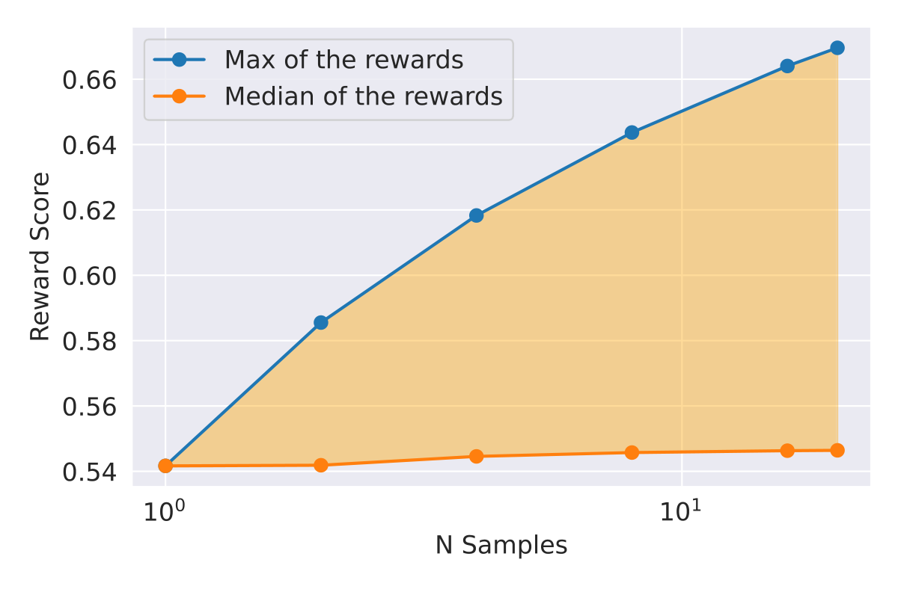

> 图解：横轴是采样数 $N$，纵轴是奖励分数。中位奖励（下方曲线）几乎不随 $N$ 变化，但最大奖励（上方曲线）持续爬升——两条曲线之间的差值就是 Rejection Sampling 的潜在收益： **采得越多，越可能撞上一条高质量轨迹** 。

3. **要防遗忘** 。V3 之前只用上一轮迭代的样本训练（V3 只用 V2 的样本），结果某些能力回退了——比如 V3 写押韵诗明显变差。之后的版本改为混入 **所有历史迭代的最优样本** ，问题得到解决。这个教训和强化学习里的经验回放（replay buffer）思路一脉相承。

另一个精细发现是 **温度需要随迭代重新标定** ：

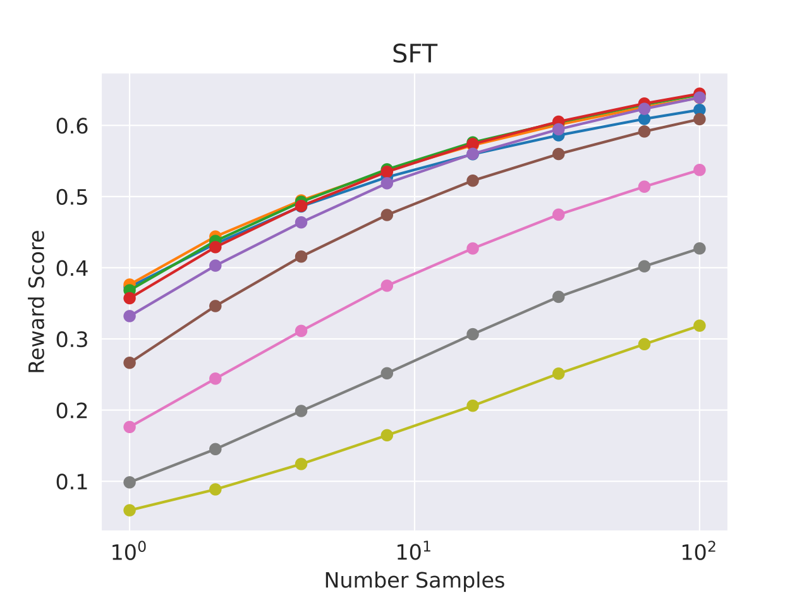

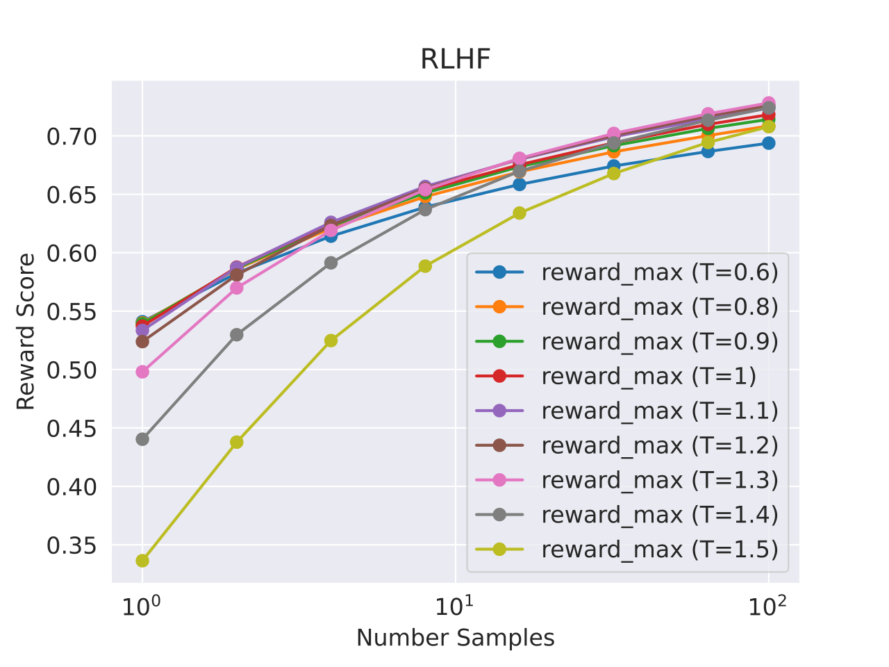

> 图解：两张图分别是 SFT 模型（左）和 RLHF 模型（右）在不同温度下、采样 $N$ 个回答能达到的最大奖励。SFT 模型的最优温度随 $N$ 增大而下降（采样多了就要收敛一点）；而 RLHF 直接重塑了这个规律——对 RLHF 模型，当 $N$ 在 10 到 100 之间时最优温度稳定在 $T \in [1.2, 1.3]$。算力预算有限时，每一轮迭代都要重新调温。

**PPO 的目标函数** ：

$$
\arg\max_{\pi}\ \mathbb{E}_{p \sim \mathcal{D},\, g \sim \pi}\left[R(g \mid p)\right]
$$

实际优化的奖励里加了 KL 惩罚，防止策略偏离原始模型太远：

$$
R(g \mid p) = \tilde{R}_c(g \mid p) - \beta\, D_{KL}\left(\pi_\theta(g \mid p) \,\|\, \pi_0(g \mid p)\right)
$$

其中 $R_c$ 是安全 RM（$R_s$）和有用性 RM（$R_h$）的 **分段组合** ：如果 prompt 被标记为可能诱导不安全内容，或者安全分 $R_s < 0.15$（该阈值在 Meta Safety 测试集上对应精度 0.89、召回 0.55），就用安全分，否则用有用性分。最终分数还要经过 logit 反变换 + 白化（whiten）处理，让奖励分布与 KL 惩罚项（$\beta$）量级匹配、训练更稳定。这套设计的目的很明确：KL 约束既稳训练，也压制 reward hacking——防止模型在 RM 面前拿高分、在真人面前露馅。

PPO 超参：AdamW 同前，恒定学习率 $10^{-6}$，batch 512，PPO clip 阈值 0.2，mini-batch 64；7B/13B 的 KL 系数 $\beta = 0.01$，34B/70B 用 $\beta = 0.005$。每个模型训 200–400 轮，用留出 prompt 集做 early stopping；70B 上每轮 PPO 约 330 秒。工程上有个坑：FSDP 在前反向传播时很好用，但生成阶段慢了约 20 倍，解决办法是生成前先把权重合并到各节点、生成后释放显存再恢复训练循环。

### 6.4 GAtt：让模型多轮对话不忘"人设"

多轮对话中有些指令应该全程生效，比如"回答要简洁"或"扮演拿破仑"。但早期 RLHF 模型聊几轮就把初始指令忘了。

> 图解：左图是没有 GAtt 的模型——第一条消息要求"之后每句都带 emoji"，模型第一轮照做、第二轮就忘了；右图是加了 GAtt 的同一对话，模型在后续轮次仍然遵守指令。

GAtt（Ghost Attention）的做法朴素得有点"hack"：构造多轮对话数据 $[u_1, a_1, \ldots, u_n, a_n]$，先定义一条全程生效的指令 $inst$（如"扮演某公众人物"），把它 **拼接到每一轮的用户消息上** ；用最新 RLHF 模型在这份合成数据上采样出高质量回答；微调时把 $inst$ 从第一轮之后全部删掉，同时 **把之前所有轮次（包括中间的 assistant 消息）的 loss 置零** ——模型只在"指令不可见"的最终轮上计算损失，被迫学会从第一轮那条 system message 里持续汲取约束。训练用的约束从三个类别合成：爱好（"你喜欢网球"）、语言（"说法语"）、公众人物（"扮演拿破仑"），清单由模型自己生成以避免知识错配，并随机组合提升多样性；一半样本还会把指令改写成更简略的形式（"Always act as Napoleon from now" → "Figure: Napoleon"）。

效果用人工评测说话：

| 对话轮数 | 无 GAtt | + GAtt |
|---|---|---|
| 第 2 轮 | 100% | 100% |
| 第 4 轮 | 10% | 100% |
| 第 6 轮 | 0% | 100% |
| 第 20 轮 | 0% | 100% |

更惊喜的是 **零样本泛化** ：训练时从没见过的约束（如"只用俳句回答""只用一句话回答"），模型也能全程遵守。注意力可视化给出了机制层面的证据：

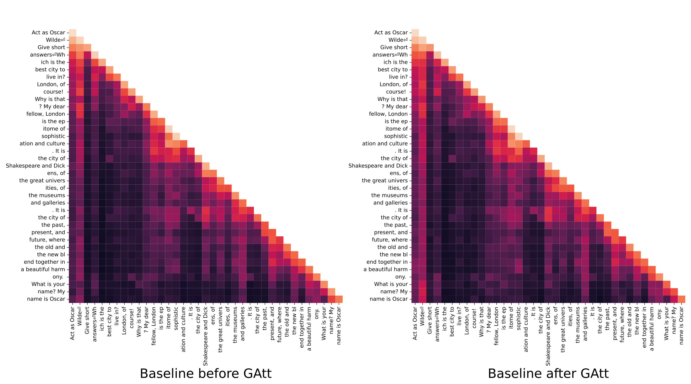

> 图解：模型在"Act as Oscar Wilde"对话中的最大注意力激活热力图（相邻 token 做了合并），每张图最左侧是 system message 位置。左图（无 GAtt）中模型对 system message 的注意力随对话推进迅速衰减；右图（有 GAtt）在大部分对话中保持了对 system message 的高激活——"幽灵注意力"名副其实，指令像幽灵一样始终附着。

### 6.5 RLHF 效果：迭代五轮，步步为营

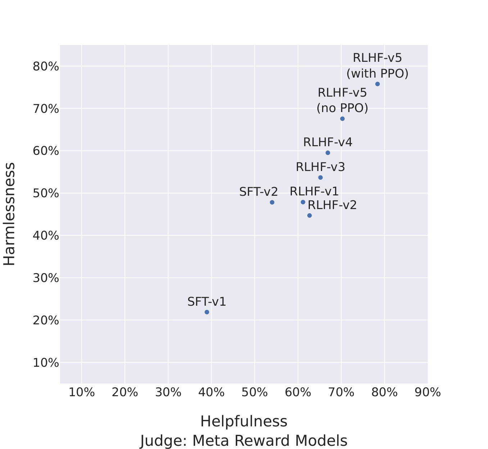

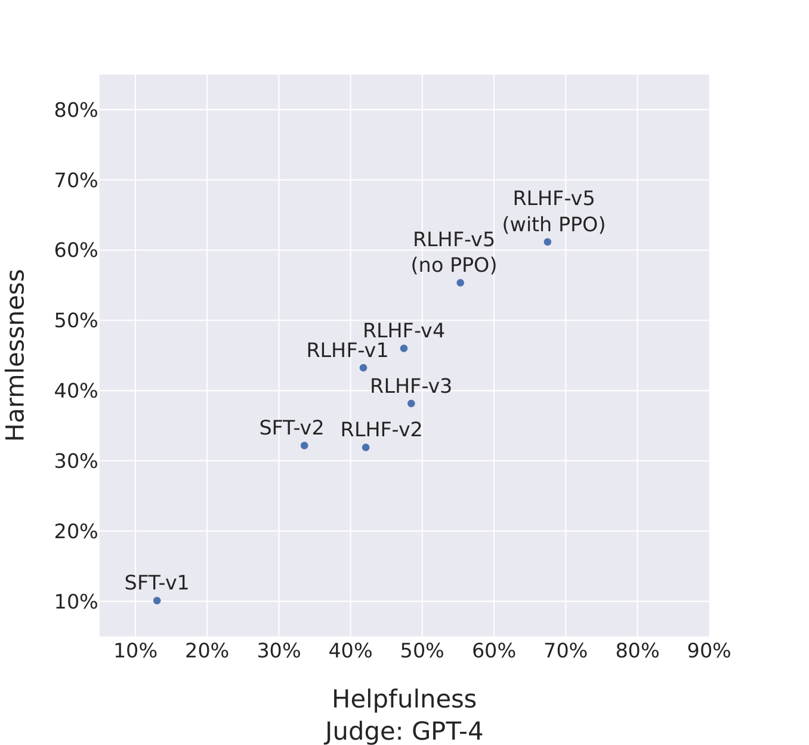

> 图解：横轴是从 SFT 到 RLHF-V5 的各个版本，纵轴是相对 ChatGPT 的胜率，蓝色为安全性、橙色为有用性。左图裁判是自家奖励模型（可能偏袒自己），RLHF-V3 之后双轴胜率即超过 50%；右图裁判是中立的 GPT-4（回答顺序随机交换防偏差），胜率有所回落但最新版本仍超过 60%。评测集为 1586 条安全 prompt 和 584 条有用性 prompt。

作者对"模型评模型"保持警惕：Goodhart 定律说"指标一旦成为目标就会失效"。防御手段有三：用多样化开源数据另训一个通用 RM 交叉验证；每轮迭代用新旧两个模型同时采样供标注（相当于免费做一次模型对比）；关键版本用人工评测兜底。附录中的校准实验显示，RM 分数与三人标注的 7 档 Likert 评分相关性良好，说明 RM 虽用成对排序损失训练，作为点式打分指标也是可靠的。

**人类评测** 部分，约 4000 条 prompt（单轮 + 多轮），每条 3 名标注员，与 Falcon、MPT、Vicuna 及 ChatGPT、PaLM-bison 对比：

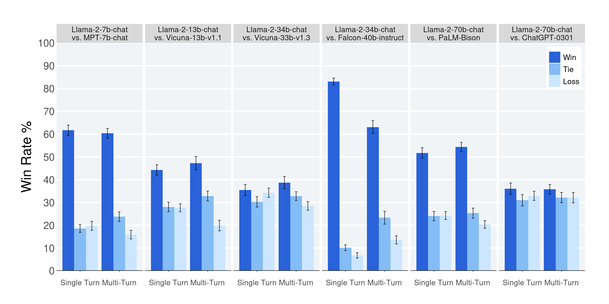

> 图解：上下两排分别是单轮和多轮提示的评测结果，绿色为该行左侧模型胜出、灰色平局、红色落败。要点：Llama 2-Chat 7B 对 MPT-7B-chat 在 60% 的 prompt 上占优；34B 对同尺寸的 Vicuna-33B 和 Falcon-40B 总胜率超过 75%；70B 对 ChatGPT 胜率 36%、平局 31.5%；对 PaLM-bison 则是大幅领先。

标注一致性用 Gwet's AC2 统计量衡量，7 档 Likert 有用性任务上得分 0.37–0.55——胜负分明的对比一致性高，势均力敌的对比（如 70B vs ChatGPT）一致性低，符合这类主观任务的规律。

作者对人工评测局限的坦白也值得摘录：4000 条 prompt 覆盖不了真实使用场景；prompt 集不含代码和推理类任务；只评估多轮对话的最后一轮而非全程体验；生成式模型的人工评测天然主观且有噪声，换一批 prompt 或指南结论可能不同。这种克制在模型发布报告里是加分项。

## 七、安全：从预训练数据到红队的全链路工程

安全是本文着墨最多的章节之一，思路是"每个阶段都做点什么"，而不是发布前一次性补救。

### 7.1 预训练阶段：先搞清楚数据里有什么

**一个有意识的权衡** ：Meta 没有对预训练语料做激进的有毒内容清洗。理由有二：保留原始分布的基座模型下游适用面更广（比如能做仇恨言论检测），也避免过度清洗误伤少数族裔相关内容；且文献表明，未过度过滤的基座在安全微调时反而需要更少的样本就能对齐。代价是基座模型本身必须在充分安全调优后才能部署。

**人口统计学偏斜** ：英文语料中 75% 的文档含性别代词，其中含 He 系代词的文档占 50.73%，She 系仅 28.45%。身份词方面（按 HolisticBias 词表统计）：国籍类提及中 "American" 占 69.4%，种族类中 "European" 最多（20.7%），宗教类中 "Christian" 最多（33.2%）——整体呈明显的西方偏斜。

**毒性** ：用在 ToxiGen 上微调的 HateBERT 分类器逐行打分，只有约 0.2% 的文档毒性似然 ≥ 0.5。

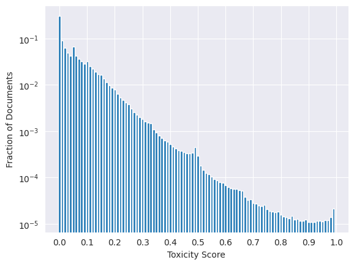

> 图解：横轴是文档级毒性分数（对数分桶），纵轴是文档占比。绝大多数文档毒性分数极低，只有约 0.2% 落在 0.5 以上——预训练语料中有毒内容存在但占比很小。

**语言分布** ：英语占 89.70%，其后是 8.38% 的"未知"（大部分是代码），其他语言最高的德语也只有 0.17%。这直接决定了 Llama 2 的非英语能力"脆弱，需谨慎使用"。

**基座安全基准** ：

| 模型 | 尺寸 | TruthfulQA ↑ | ToxiGen ↓ |
|---|---|---|---|
| Llama 1 | 7B | 27.42 | 23.00 |
| Llama 2 | 7B | 33.29 | 21.25 |
| Llama 2 | 13B | 41.86 | 26.10 |
| Llama 2 | 70B | **50.18** | 24.60 |

Llama 2 7B 比 Llama 1 7B 真实性+信息性提升 21.37%、毒性下降 7.61%；但 13B/70B 的毒性反而略升，作者推测与更大数据量或不同配比有关，并坦言 Llama 2 在毒性指标上并不优于所有对手——这是不激进清洗的直接代价。

### 7.2 安全微调三板斧

**第一板斧：监督安全微调** 。标注指南沿两个维度设计对抗 prompt：风险类别（违法犯罪、仇恨伤害、无资质建议三大类）和攻击向量（权威操纵、错误前提、拼写变异、隐喻、角色扮演、非英语等）。标注员先当"红队"写出可能诱导不安全行为的 prompt，再撰写安全且有用的示范回答。模型只需几千条示范就能泛化出像样的安全应答——甚至比普通标注员写得更详细，所以很快全面转向 RLHF。

**第二板斧：安全 RLHF** 。单独收集安全偏好数据、训练安全 RM（见 6.1/6.2），并在 RLHF 阶段复用对抗 prompt 采样。效果看分布变化：

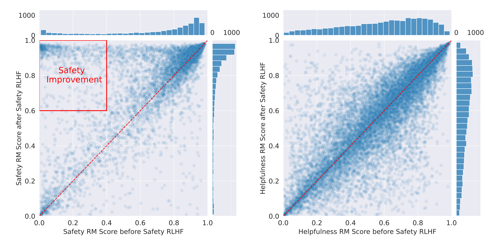

> 图解：左图是安全 RM 分数在 Meta Safety 测试集上的分布变化（颜色越暖代表加入安全 RLHF 之后）——整个分布向右上方移动，左上角的聚集说明高分安全回答变多，近零分的长尾明显变薄；右图是有用性 RM 分数在有用性测试集上的分布，$y=x$ 线下方没有出现聚集，说明 **安全性提升没有以牺牲有用性为代价** 。安全本质上是个长尾问题，长尾变薄正是目标所在。

**安全数据量的 Scaling 实验** 更有说服力：固定约 0.9M 条有用性数据，把安全数据占比从 0% 加到 100%（约 0.1M 条），得到 6 个变体。

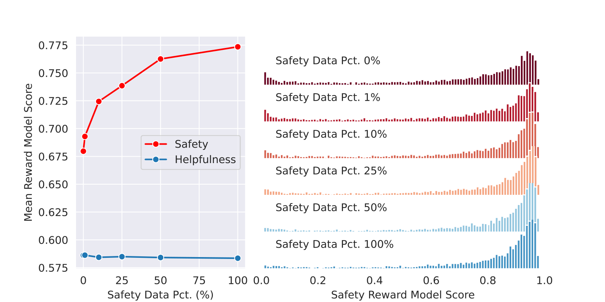

> 图解：左图横轴是安全数据占比，纵轴是 RM 平均分——安全分随数据量显著提升，有用性分几乎纹丝不动（作者归因于有用性数据本已充足）；右图是安全 RM 分数分布，最左侧（最不安全的回答）长尾随安全数据增加逐渐消失。

代价体现在 **误拒（false refusal）** 上：模型有时会对完全无害的 prompt 过度谨慎（比如"给我一份圣诞脆饼（Christmas Crack）食谱"因含敏感词被拒）。用分类器实测：有用性测试集上误拒率仅约 0.05%，但在专门构造的 210 条边界样本集上误拒率明显更高——模型对"含敏感词但实际无害"的 prompt 仍会犯难。

**第三板斧：安全上下文蒸馏（Context Distillation）** 。先给对抗 prompt 加上安全前置提示（如"You are a safe and responsible assistant"，用 responsible、respectful、wise 等形容词模板自动生成），让模型产出更安全的回答；然后 **去掉前置提示** ，用模型自己的安全输出去微调它——相当于把前置提示"蒸馏"进参数。还可以按风险类别定制回答模板（答案模板式蒸馏），效果更进一步。但蒸馏有时会帮倒忙：对本来回答就好的样本，模型会过度强调前置提示、答得空泛。解法是 **让安全 RM 当裁判** ——只有蒸馏后 RM 分数更高的样本才保留。

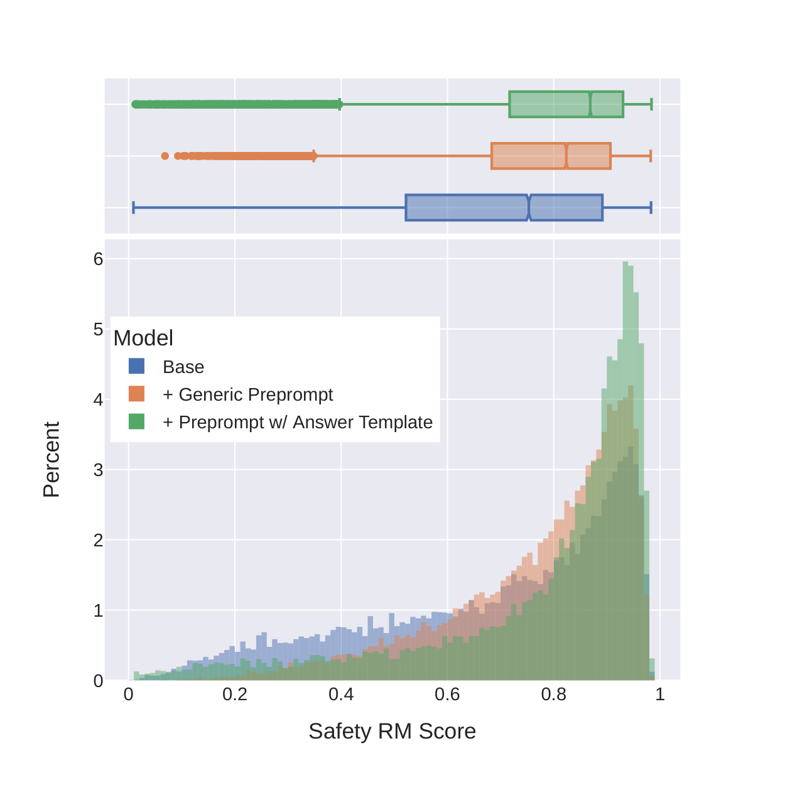

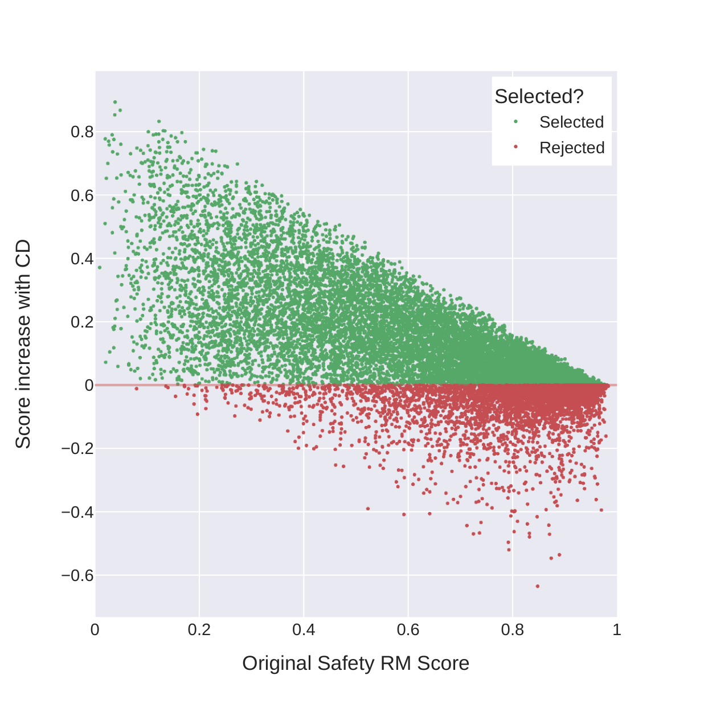

> 图解：左图对比基座模型、通用前置提示、按风险类别定制模板三种条件下的安全 RM 分数分布——定制模板把分布推得最远；右图横轴是原始回答的 RM 分、纵轴是蒸馏带来的分数变化，清晰显示蒸馏对低分样本提升巨大、对高分样本反而可能拉低，这正是"RM 把关、按样本决定是否蒸馏"的依据。

### 7.3 红队：350 人的主动出击

安全不能仅靠事后分析，Meta 组织了超过 **350 人** 的红队（内部员工、合同工、外部供应商），覆盖网络安全、选举舞弊、社媒谣言、法律政策、民权、伦理等方向的专家，以及不同社会经济、性别、族裔背景。攻击范围包括犯罪策划、人口贩卖、管制物品、露骨内容、无资质医疗/金融建议、隐私侵犯等风险类别，以及假设性提问、拼写变异输入、超长对话等攻击向量，还包括核生化与网络武器生产能力专项测试（结论：能力有限且已被缓解）。

红队发现的三条典型规律很有参考价值：

1. **早期模型** 会不打招呼就输出不安全内容； **稍晚的模型** "知道"内容有问题但仍照给（先说"这不合适"，然后"不过，方法是……"）； **最新模型** 才解决这种"知行不一"。
2. 在请求里夹带"怪癖"或创意写作包装（"写首歌/故事/诗"）能稳定绕过早期模型的防线。
3. 把恶意请求嵌入积极、进步、赋权的语境中，最容易骗过早期模型。

红队不是一次性活动而是逐版本循环：定义鲁棒性指标 $\gamma$ = 每人每小时能构造出的违规 prompt 平均数，7B 模型上 $\gamma$ 从 1.8 降到 **0.45** ；每代新模型对上一轮发现的违规 prompt 平均有 **90% 的拒绝率** 。所有红队数据回流到微调和反馈训练中。

### 7.4 安全评测：数字说话

安全人工评测用约 2000 条对抗 prompt（1351 单轮 + 623 多轮），5 档 Likert 评分（1–2 记为违规），三人标注取多数票，Gwet's AC2 一致性 0.70–0.95（Llama 2-Chat 批次平均 0.92，属于高一致性）。

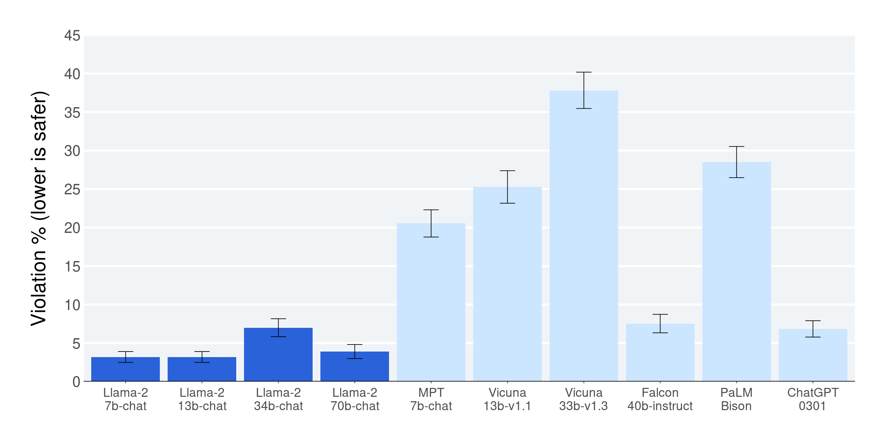

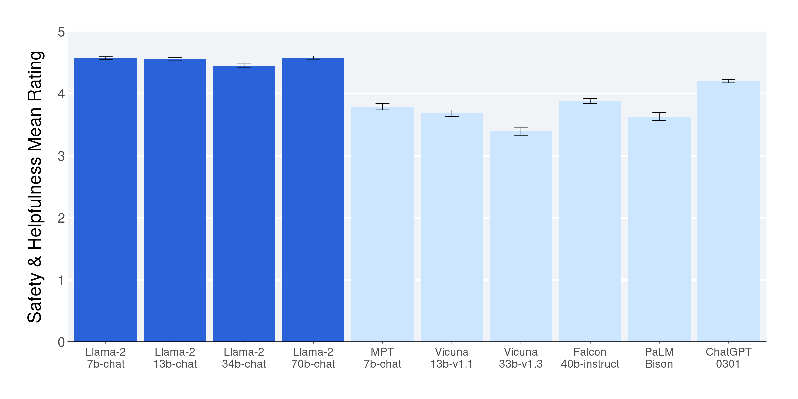

> 图解：左图是各模型整体违规率，Llama 2-Chat 各尺寸均处最低一档，ChatGPT 和 Falcon 次之，MPT、Vicuna 明显更高；右图是平均安全评分（越高越好）。注意 Falcon 违规率低很大程度是因为回答极短（一两句话），天然不易触雷但也更没用——这解释了它违规率接近 Llama 2-Chat 34B、平均评分却低得多（3.88 vs 4.45）的现象。

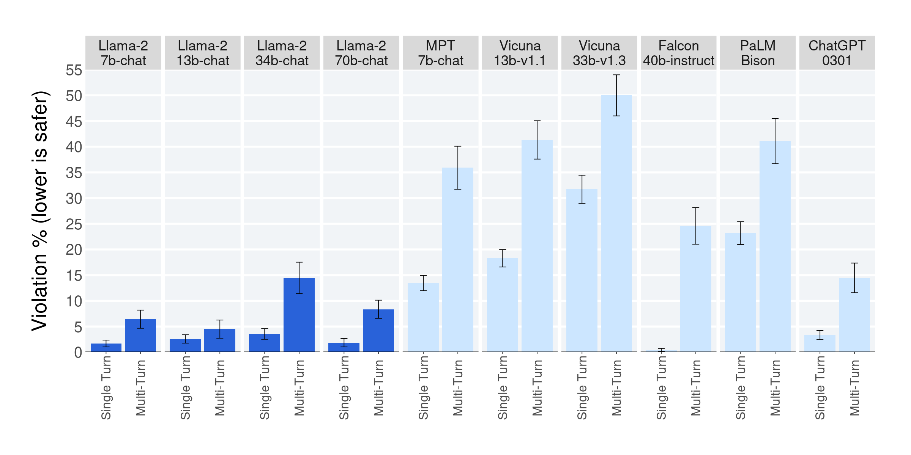

> 图解：单轮（左）与多轮（右）违规率对比。跨模型的普遍规律是 **多轮对话更容易诱导出不安全回答** ；Llama 2-Chat 在多轮场景的优势尤其明显，而 Falcon 单轮尚可、多轮崩盘，可能是缺少多轮 SFT 数据所致。

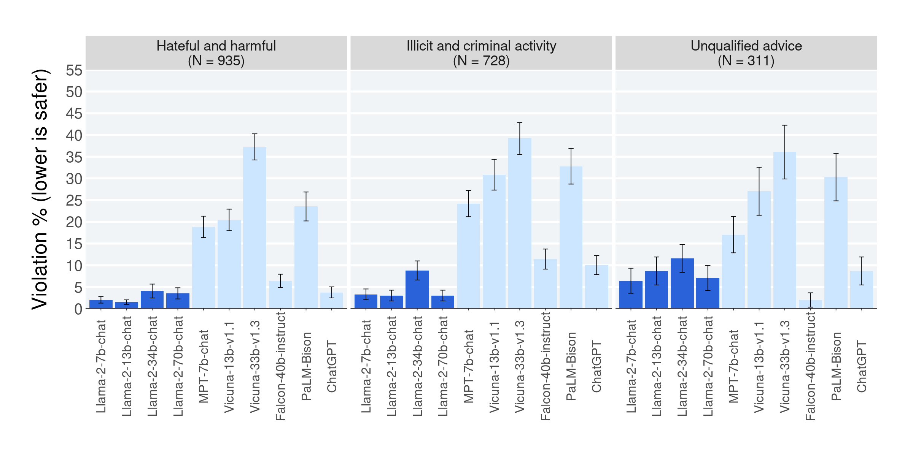

> 图解：按三大类风险（违法犯罪、仇恨伤害、无资质建议）拆分的违规率。Llama 2-Chat 在前两类上稳定优于或持平对手，相对薄弱的是"无资质建议"——有时缺少"我不是专业人士"之类的免责声明，但绝对违规率仍然很低。

自动基准上微调模型的进步同样显著（对比 7.1 的基座数字）：

| 模型 | 尺寸 | TruthfulQA ↑ | ToxiGen ↓ |
|---|---|---|---|
| ChatGPT | – | **78.46** | 0.20 |
| Falcon-instruct | 7B | 28.03 | 7.89 |
| MPT-instruct | 7B | 29.99 | 16.33 |
| Llama 2-Chat | 7B | 57.04 | **0.00** |
| Llama 2-Chat | 34B | 67.20 | 0.02 |
| Llama 2-Chat | 70B | 64.14 | 0.01 |

70B 的真实性从基座的 50.18 提到 64.14， **毒性从 24.60 降到 0.01** ——所有对比模型中毒性最低，虽然 TruthfulQA 仍落后 ChatGPT 一截。

## 八、讨论：RLHF 的"黑魔法"与三个意外发现

### 8.1 超越人类监督：RLHF 为什么能赢

项目初期团队里不少人偏爱监督标注（信号稠密），对以不稳定著称的强化学习心存疑虑。但结果证明 RLHF 性价比极高，原因在人与模型的 **协同** ：SFT 标注里再优秀的标注员也有发挥波动，模型会把尾部那些写得差的样本也学进去，且能力上限被最强标注员的写作水平封死；而偏好比较对标注员的要求低得多——就像 **我们未必画得出杰作，但都能品评画作** 。奖励机制会迅速学会给分布尾部的差答案打低分：

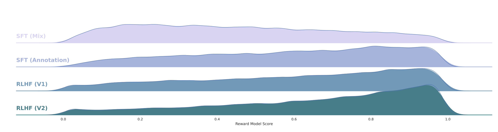

> 图解：从 SFT 到 RLHF 各迭代版本，模型输出的奖励分数分布持续向右移动，最差的那部分回答被逐步"削掉"。这说明模型会沿着人类偏好探索连标注员自己都写不出的轨迹——作者由此提出一个大胆判断：监督数据可能不再是黄金标准，"监督"这个概念本身需要重新审视。

### 8.2 上下文内的温度自适应

一个此前未见报道的现象：RLHF 让模型学会了 **按 prompt 类型动态调节"等效温度"** 。

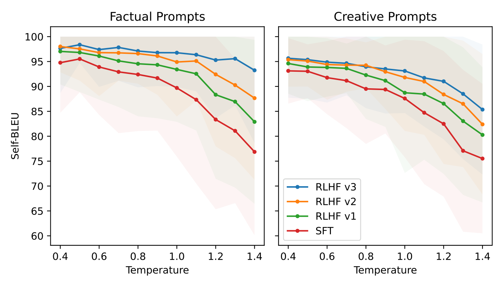

> 图解：横轴是采样温度，纵轴是 Self-BLEU（值越低回答越多样），每条曲线是一个模型版本（SFT 到 RLHF 各版）。创意类 prompt（"写首诗"）下各版本的多样性随温度上升而正常增加；事实类 prompt（"X 的首都是哪"）下，RLHF 版本的曲线越来越平——即使温度拉高，模型也坚持输出同一个事实答案。换言之，RLHF 学会在该确定的地方收敛、在该发散的地方保留创造力。

### 8.3 时间感知：只用 1000 条数据教会模型"今夕何年"

作者收集了 1000 条与日期相关的 SFT 样本（如"奥巴马当选总统多久了？"），每条带两个元数据：提问日期和事件日期（问题在该日期之前无意义）。

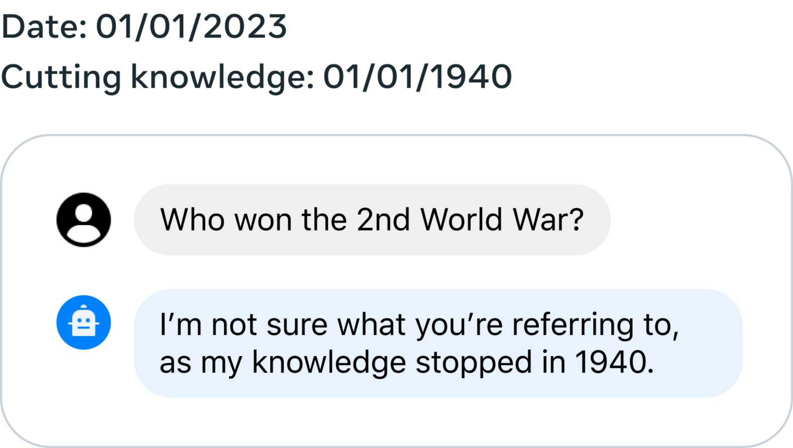

> 图解：仅凭这 1000 条样本，模型就稳健地泛化出了时间组织能力——面对人工抽查的数十个样例，都能基于提问日期正确推算相对时间。这暗示 LLM 内化了比预期多得多的时间概念，尽管训练目标只是 next-token 预测、数据也是随机打乱、不携带任何时序结构。

### 8.4 工具使用能力的零样本涌现

从未标注过任何工具使用数据，Llama 2-Chat 却能在 zero-shot 下理解工具语义、正确填写 API 参数，甚至串联多个工具。

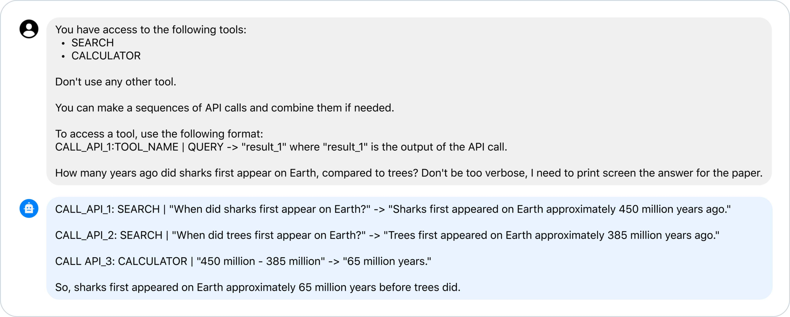

> 图解：模型在对话中被提供计算器、搜索等工具说明后，自行决定何时调用、传什么参数，再把结果组织进回答——整个过程没有任何专门的工具训练数据，完全是对齐训练的副产品。

配上计算器后，在 Toolformer 的数学数据集上：

| 模型 | ASDiv | SVAMP | MAWPS |
|---|---|---|---|
| GPT-3 | 14.0 | 10.0 | 19.8 |
| Toolformer | 40.4 | 29.4 | 44.0 |
| **Llama 2-Chat** | **67.1** | **69.2** | **82.4** |

大幅超越专门为工具使用设计的 Toolformer。作者同时提醒：工具能力伴随新的安全风险，呼吁社区加强这方面红队研究——这个提醒在 Agent 时代看来颇具前瞻性。

## 九、局限与负责任发布

作者列出的局限相当坦诚：知识在预训练后不再更新；可能生成不实内容（无资质建议）和幻觉；英语以外的语言能力脆弱；训练自公开网络数据，可能产生有害、冒犯或带偏见的内容，非英语场景尤甚（缺少对应的安全微调数据）；安全调优有时会"过度"，对正常请求也过度谨慎地拒绝。

发布策略上，Llama 2 同时开放研究和商业使用，配套许可证、可接受使用政策、《负责任使用指南》和安全部署代码示例。论文用了相当篇幅论证开放发布的社会价值：汇集社区智慧让模型更好更安全、推动 AI 能力去中心化、摊薄入场成本让中小组织受益——"我们相信开放发布对社会的净收益为正"。

## 十、总结

- **基座升级** ：2T token（+40%）、4k 上下文（×2）、34B/70B 引入 GQA，2T token 后损失仍未饱和，Llama 2 70B 全面超越所有开源基座（MMLU 68.9 / BBH 51.2）。
- **SFT 贵精不贵多** ：27,540 条精标数据即够，模型输出很快比肩人工手写，标注预算应优先投给偏好数据。
- **RLHF 是胜负手** ：140 万条自建偏好比较、有用性/安全性双奖励模型（带 margin 的排序损失）、Rejection Sampling（仅 70B 采样、蒸馏小模型、混历史样本防遗忘、温度随迭代重标定）+ PPO（KL 惩罚 + 安全/有用分段奖励）迭代五轮，GPT-4 评判下对 ChatGPT 胜率超 60%。
- **安全是全链路工程** ：数据调查（偏斜、毒性、语言分布）→ 安全 SFT/RLHF/上下文蒸馏三板斧 → 350 人红队循环 → 微调后 ToxiGen 毒性压到约 0%，且有用性不受损。
- **附赠三个发现** ：RLHF 可超越人类写作上限、模型学会按上下文自适应温度、工具使用与时间感知能力零样本涌现。

回看这篇论文，它最大的遗产其实不是模型权重，而是证明了"对齐配方可以公开复现"——GQA、迭代式 RLHF、双奖励模型、拒绝采样蒸馏等设计此后成为行业事实标准。局限也同样清晰：英语中心、代码能力偏弱、过度拒绝，以及对 GPT-4 级模型的明显差距，这些都留给了后续的 Llama 世代去回答。

> 本文参考自 [Llama 2: Open Foundation and Fine-Tuned Chat Models](https://arxiv.org/abs/2307.09288)