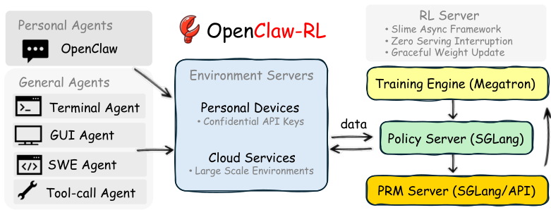
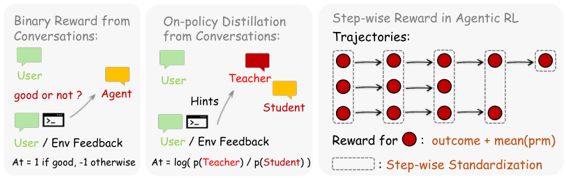
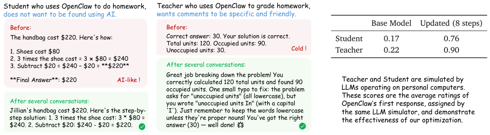
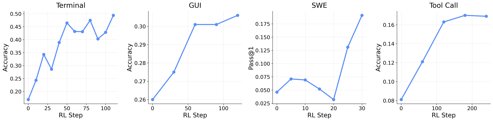

# OpenClaw-RL 深度解读：让 Agent 在真实交互中“边用边学”

这篇工作最有意思的一点是：作者没有再把 RL 训练看成“先收集离线数据，再统一训练”的流水线，而是直接把线上每一次交互后的 **next-state signal** （下一状态信号）当成训练信号。  
一句话概括： **你和 Agent 聊天、让它调工具、跑终端、改代码，本身就是训练数据。**

## 1. 论文到底解决了什么问题？

现有 Agent 系统里，模型每做完一步动作 $a_t$，环境都会返回一个后续状态 $s_{t+1}$（用户回复、工具输出、测试结果、GUI 变化等）。  
大多数系统只把它当作下一轮上下文，但这篇论文认为它其实包含两类“被浪费”的监督：

- **评估型信号** （Evaluative）：这步做得好不好（例如测试通过、用户追问、报错）。
- **指令型信号** （Directive）：具体应该怎么改（例如“你应该先检查文件再编辑”）。

作者的核心主张是：这两类信号都能在线恢复，并且能在同一个异步系统里统一训练 personal agent 和 general agent。

## 2. OpenClaw-RL 的系统设计：四环解耦、异步并行

> 图解：这张图展示了 OpenClaw-RL 的基础设施。左侧是多种交互流（个人设备对话、Terminal、GUI、SWE、Tool-call），中间是异步 RL 服务器，拆成环境服务、PRM/Judge、训练器（Megatron）、推理服务（SGLang）四个独立组件。重点是它们互不阻塞：模型在服务新请求时，PRM 可以评估旧样本，训练器可同步更新参数。

这套架构的意义有三层：

- 线上服务不中断：训练不会卡住推理。
- 多场景统一：同一条训练链路可处理对话、工具、代码、GUI。
- 可扩展：general agent 能通过云端并行环境扩大量级。

## 3. 方法核心：把 next-state 变成可优化的梯度

> 图解：方法图分成 personal 与 general 两条支路。personal 支路同时支持 Binary RL 和 OPD；general 支路强调 outcome reward + process reward 的融合。横向对比可看到：Binary RL 提供“广覆盖”粗粒度监督，OPD 提供“低覆盖”高分辨率 token 级方向监督。

### 3.1 Binary RL：把“好/坏反馈”变成标量奖励

给定动作 $a_t$ 与后续状态 $s_{t+1}$，PRM 判分：

$$
\text{PRM}(a_t, s_{t+1}) \rightarrow r \in \{+1, -1, 0\}
$$

然后用多数投票聚合为 $r_{\text{final}}$，作为 advantage（或其核心部分）进入 PPO 风格目标。  
这条支路的优点是覆盖率高：只要有 next-state，就几乎都能打分。

### 3.2 OPD（Hindsight-Guided On-Policy Distillation）：把“纠错建议”变成 token 级优势

这是论文真正的创新点。流程如下：

1. 从 $s_{t+1}$ 抽取结构化 hint（不是直接复制原始 next-state，而是先去噪）。
2. 把 hint 拼到增强上下文 $s_{\text{enhanced}}$。
3. 同模型在增强上下文下充当 teacher，计算原响应 token 的对数概率。
4. 用 teacher-student log-prob 差值构造 token 级优势：

$$
A_t[k] = \log \pi_{\text{teacher}}(a_t[k] \mid s_{\text{enhanced}}) - \log \pi_{\theta}(a_t[k] \mid s_t)
$$

这比单一标量 reward 更细：同一句回复里，有些 token 该升权，有些该降权。

### 3.3 Binary RL + OPD 联合

论文建议默认混合：

$$
A_t = w_{\text{binary}} \cdot r_{\text{final}} + w_{\text{opd}} \cdot \left(\log \pi_{\text{teacher}}(a_t \mid s_{\text{enhanced}}) - \log \pi_{\theta}(a_t \mid s_t)\right)
$$

默认 $w_{\text{binary}} = w_{\text{opd}} = 1$。  
直观理解：Binary RL 保证训练“不断粮”，OPD 负责“精修方向”。

### 3.4 General Agent 的长时程奖励融合

论文延续 RLAnything 的结论：长轨迹任务若只看终局 reward，信用分配会过于稀疏。  
他们把 outcome + process 直接融合：

$$
R_t = o + \frac{1}{m}\sum_{i=1}^{m} r_i
$$

其中 $o$ 是终局可验证结果，$r_i$ 来自 step-wise PRM。

## 4. 实验结果：个人个性化与通用 Agent 都有效

### 4.1 Personal Agent：确实能“越用越懂你”

> 图解：图中展示了学生/教师两类 persona 的优化前后效果。横向可理解为交互轮次增长，纵向可理解为个性化贴合度。可见在几十次交互后，语言风格就发生了明显偏移（例如更自然、避免 AI 味模板表达）。

#### 关键量化结果（个性化评分）

| 方法 | 更新 8 步 | 更新 16 步 |
|---|---:|---:|
| Binary RL | 0.25 | 0.23 |
| OPD | 0.25 | 0.72 |
| Combined | **0.76** | **0.81** |

解读：

- Binary RL 单独提升有限，但稳定。
- OPD 前期慢（样本过滤严格、稀疏），后期爆发。
- 组合方法最好，验证了“广覆盖 + 高分辨率”的互补性。

### 4.2 General Agent：一套框架覆盖 Terminal/GUI/SWE/Tool-call

> 图解：四宫格分别对应不同 Agent 场景的训练曲线。横轴是 RL step，纵轴是任务成功率或等价性能指标。整体趋势显示，OpenClaw-RL 在多环境并行下可稳定推进性能。

#### outcome + process 融合收益

| 设置 | Integrated | Outcome only |
|---|---:|---:|
| Tool-call | **0.30** | 0.17 |
| GUI | **0.33** | 0.31 |

结论：过程奖励通常带来更强优化，但要多部署一个 PRM，工程资源成本更高。

## 5. 工程与复现视角：这篇论文为什么“落地感强”？

从工程角度看，论文最实用的并不是某个复杂公式，而是三点：

- **异步解耦** ：服务、评估、训练并行，避免线上系统被训练拖慢。
- **样本治理** ：OPD 对 hint 质量做严格过滤，宁缺毋滥。
- **统一协议** ：不同环境都抽象成“动作后有 next-state”，训练接口一致。

如果你要复现，建议优先关注这几个超参数与机制：

- PPO clip：$\varepsilon = 0.2,\ \varepsilon_{\text{high}} = 0.28$
- KL 系数：personal 可设到很低甚至 0（论文个别设定如此），general 通常保留
- OPD hint 过滤：最小长度阈值、正样本判定规则
- 并行环境规模：Terminal/GUI/SWE/Tool-call 的 worker 数量直接影响吞吐

## 6. 方法边界与潜在风险

论文结果很亮眼，但有几个现实边界要注意：

- PRM 判分误差会直接污染在线梯度。
- OPD 依赖 next-state 中存在可提炼的指令信息；噪声高时收益会下降。
- personal 在线学习虽然个性化强，但也可能过拟合某个用户短期偏好。
- 跨场景统一训练时，不同任务 reward 分布差异可能导致训练不稳定，需要更细致的标准化策略。

## 7. 总结

OpenClaw-RL 的核心贡献不是“再发明一个 RL loss”，而是把大家早就拥有却没用好的 next-state 信号系统化利用起来：

- 用 **Binary RL** 吃下全量评估型反馈；
- 用 **OPD** 深挖少量但高价值的纠错型反馈；
- 用一套 **异步解耦基础设施** 同时支持 personal 与 general agent。

如果把 Agent 看成长期在线系统，这篇工作的方向非常明确： **训练不该只在实验室里发生，而应直接嵌入真实使用过程。**

> 本文参考自 [OpenClaw-RL: Train Any Agent Simply by Talking](https://arxiv.org/abs/2603.10165)