# Qwen-RobotManip 技术报告解读：先对齐、再扩展，38,100 小时开源数据炼出可泛化的机器人操作基础模型

大语言模型和多模态模型之所以能成为"基础模型"，靠的是一套经典配方： **把异构数据对齐到统一的表述形式，然后用海量低成本数据规模化训练** ，让不同来源的训练信号互相强化。这篇文章要回答的问题非常直接： **这套"对齐 + 规模"的配方，能不能搬到机器人操作上，炼出真正可泛化的 VLA（Vision-Language-Action）基础模型？**

这件事难在：机器人操作数据天然异构（不同本体、不同坐标系、不同相机配置、不同动作空间）、采集昂贵、多样性狭窄——"对齐"和"规模"两件事都很难做到。Qwen Team 给出的答案是 **Qwen-RobotManip** ：一个构建在 Qwen-VL 之上的 VLA 基础模型，核心设计哲学是 **Alignment first, then scale（先对齐，再扩展）** 。

几个最抓眼球的数字：

- **只用开源数据** （开源机器人数据集 + 第一人称人类操作视频），零私有采集，构建了约 **38,100 小时** 的预训练语料；
- 一条 Human-to-Robot（H2R）合成管线，把约 1,933 小时的第一人称人手演示渲染成 **15 种机器人本体** 上的约 24,808 小时合成轨迹；
- 在所有 OOD（Out-of-Distribution，分布外）评测上大幅超越 $\pi_{0.5}$ 等前代 SOTA，并在 RoboChallenge Table30 真机挑战赛 Generalist 赛道 **排名第一** ，相对提升 20%；
- 涌现出零样本指令跟随、抗扰动、反应式错误恢复（retry）、跨本体知识迁移等泛化能力。

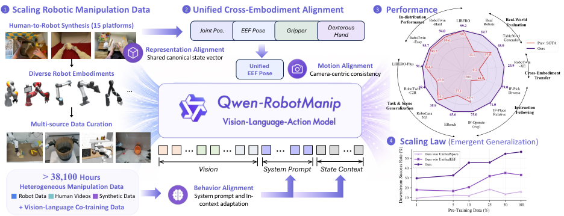

> 图解：Qwen-RobotManip 总览。模型基于 Qwen-VL 主干 + Flow Matching 动作专家，通过统一对齐框架吸收多源异构数据（真实机器人、第一人称人类视频、H2R 合成数据），并在仿真与真机的多维 OOD 场景中展现出泛化能力。

## 一、提出问题：标准 Benchmark 上的高分，可能是"假泛化"

作者先做了一件"泼冷水"的事：证明 **当前主流评测体系系统性地测不出预训练的价值** 。

在 LIBERO、RoboTwin 这类标准 in-distribution（同分布）基准上，一个耐人寻味的现象是： **没有大规模机器人预训练的模型** （如 StarVLA、Ours-scratch，即从零训练的同款架构） **居然能追平甚至超过** $\pi_{0.5}$ 这样重度预训练的模型。这并非巧合，而是这类基准的结构性缺陷——训练集和测试集来自同一环境与任务分布，靠"背模式"（in-distribution pattern matching）就能拿高分，基准无法区分"记住了"和"真会了"。

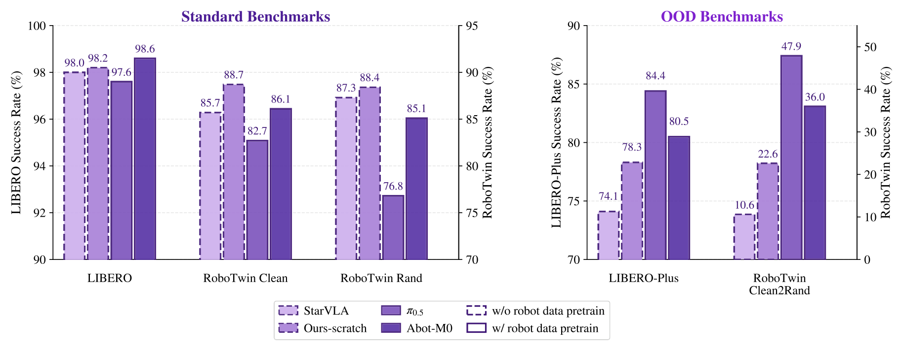

> 图解：左图，在 LIBERO、RoboTwin 等 IID 基准上，无预训练模型（虚线框）与预训练模型分数接近；右图，换成 OOD 基准（LIBERO-Plus、RoboTwin-Clean2Rand）后立刻"泾渭分明"——预训练模型显著领先，且扰动越强差距越大。例如 StarVLA 从 RoboTwin Easy 的 85.7% 崩到 Clean2Rand 的 10.6%。

结论很清晰： **OOD 评测才是衡量基础模型质量的"北极星"** 。这也解释了为什么 $\pi_{0.5}$ 被社区广泛采用——不是因为它刷榜，而是因为用户在自己机器人上采少量数据微调后就能得到可靠表现。对基础模型而言，正确的评价标准不是同分布任务成功率，而是 **分布外迁移的效率与鲁棒性** 。

为什么现有 VLA 的预训练先验迁移不出去？作者归纳为两点：

1. **数据多样性不足** ：现有机器人语料集中在狭窄的遥操作场景，本体和任务多样性远不够触发规模效应；
2. **更根本的——有多样性却没有对齐** ：当不同本体的演示带着互不兼容的观测与动作表示时，加数据产生的是 **干扰而非协同** 。此前工作用了共享架构、embodiment token、统一动作 token 化等手段，但缺少一个让"同一个物理动作在不同本体上数值一致"的表述，数据就转化不成能力。

**对齐不是独立的工程选项，而是数据规模化本身的前提。** 这就是全文的核心论点。

## 二、模型设计：三层统一对齐框架

Qwen-RobotManip 采用解耦架构： **Qwen3.5-4B 视觉语言主干** 负责多模态感知与语义推理， **Flow Matching 的 Diffusion Transformer（DiT）动作专家** 负责连续动作生成。动作专家由 $N=10$ 个 Transformer block 组成（隐藏维度 768，12 个注意力头），每个 block 先对状态-动作 token 序列做 self-attention，再对 VLM 隐状态做 cross-attention——偶数层 attend 视觉 token、奇数层 attend 语言 token，让动作预测在每个处理阶段都分别对齐空间观测与语言指令。推理时只需 4 步 Euler 积分即可生成动作序列，保证低延迟实时控制。

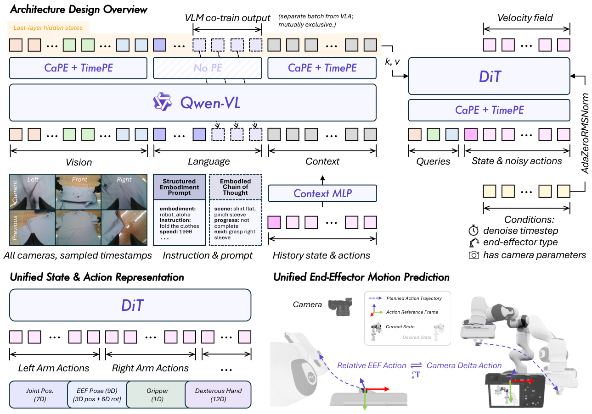

> 图解：Qwen-RobotManip 架构总览。Qwen-VL 主干联合编码多视角视觉 token、结构化本体提示（Embodiment Prompt）和历史上下文 token，最后一层隐状态通过交替 cross-attention 注入 DiT；状态与动作共享 80 维统一表示，末端执行器动作用相机系 delta 位姿表达。VLM 协同训练与 VLA 训练使用各自独立的 batch。

对齐框架工作在三个层面：

### 2.1 表示层：80 维 Canonical 状态-动作向量

不同机器人的关节数、末端、夹爪各不相同。模型设计了一个 **80 维标准向量** ：两个 29 维的单臂 block + 22 维保留位。每个单臂 block 按语义分组：

- 关节位置（7 维）；
- 末端执行器位姿（9 维：3 维位置 + 6 维连续旋转表示）；
- 夹爪状态（1 维）；
- 灵巧手关节（12 维）。

不同本体只填充自己有的维度，其余补零，并用 **逐维二值 mask** 保证梯度只流过有语义的维度。Franka 单臂填一个 block，ALOHA 双臂填两个，带灵巧手的再填手关节维度。状态用绝对坐标；动作中关节量用绝对值、末端量用相对 delta。

### 2.2 运动层：相机系 Delta 位姿（Camera-frame Delta Pose）

统一向量解决了"结构布局"问题，但还有个更隐蔽的坑： **同一个动作在不同数据集里记录在不同坐标系下** （基座系、末端系、世界系），模型得浪费容量去调和这些几何不一致。

解法是 **把所有末端动作都表达在相机坐标系下** ：设 $c$ 为参考相机系，$e$ 为当前末端系，$e^{*}$ 为目标末端系，预测的动作为

$$
\mathbf{a}_p = \begin{bmatrix} {}^{c}_{e}\mathbf{R}\ {}^{e}_{e^{*}}\mathbf{R}\ {}^{e}_{c}\mathbf{R} & {}^{c}_{e}\mathbf{R}\ {}^{e}\mathbf{t}_{e^{*}} \\ \mathbf{0} & 1 \end{bmatrix}
$$

旋转块通过与相机-末端外参的共轭变换，把末端相对旋转表达到相机系；平移块把末端位移投影到相机坐标。核心性质是： **在图像里看起来相似的动作，在动作空间里数值也接近** ——动作表示与视觉观测空间直接对齐，跨本体迁移由此成为可能（后文 RoboTwin-XE 实验验证了这一点）。

配套的还有两个设计： **CaPE（Camera Positional Encoding）** 把相机外参编码进 DiT 的 cross-attention（每个 64 维注意力头中 32 维给 CaPE、32 维给 RoPE），由于是旋转式位置编码，世界系原点在内积中代数消去，只留下 token 间的相对几何； **末端感知条件化** 通过 adaLN 注入末端类型 embedding（单臂/左臂/右臂/人头/移动底座）和"是否有标定相机参数"的开关 flag。多视角场景下训练时随机选择参考相机，进一步提升鲁棒性。

### 2.3 行为层：In-Context Policy Adaptation

部署到新机器人时，能否 **不更新参数就快速适配行为** ？作者借鉴 LLM 的 in-context learning，让模型把 **当前 episode 内的执行历史当作"隐式本体标识符"** 来读。

具体来说，一个 context chunk 定义为三元组 $(\mathbf{o}_h, \mathbf{s}_h, \mathbf{a}_h)$——机器人"看到了什么、处于什么状态、做了什么"。历史帧与当前帧一起进 VLM 视觉编码器；状态和动作 chunk 则由两个轻量 MLP 投影进 VLM 隐空间，加上时序与槽位 embedding，按时间序序列化成一条 context token 序列，拼到 VLM 输入末尾联合推理（unified 模式）。

这里有个关键的坑：如果总是提供最近 $H$ 个 chunk，模型会学到"抄最近动作"的捷径，训练 loss 很低但实际成功率很差。解法是 **随机上下文采样（Stochastic Context Sampling）** ——训练时从 episode 内随机位置取样历史 chunk，迫使模型从任意历史子集中提取一致的行为画像（速度模式、抓取策略、交互签名），而不是利用时间邻近性作弊。

### 2.4 结构化 Embodiment Prompt

提示词包含五个字段：embodiment（如 `robot_aloha`）、instruction（任务描述）、speed（episode 长度，按 500 步分桶）、fps、相机方位（arm side / opposite side）。这让模型同时知道"做什么、哪个机器人做、以什么节奏做"。训练时以 15% 概率随机丢弃部分字段，提升测试时信息不全的鲁棒性。

## 三、数据引擎：38,100 小时从哪来？

对齐框架到位后，规模化才有意义。语料由三类互补数据源构成：

| 数据类型 | 本体形态 | 来源 | 时长 |
| --- | --- | --- | --- |
| Robot | 单臂 | OXE、RoboMIND、DROID、RH20T、InternData-A1 等 | 3,808 h |
| Robot | 双臂 | RoboMIND、AgiBotWorld-Beta、RoboCOIN、RDT 等 | 6,744 h |
| Robot | 移动/人形 | Galaxea Open-World、RoboCOIN | 868 h |
| Human | 人手 | EgoDex、VITRA、EgoVerse | 1,933 h |
| Human-to-Robot | 15 种双臂平台 | 由人类数据合成 | 24,808 h |

真实机器人数据汇集了 9 个开源数据集（OXE、AgiBotWorld-Beta、RoboMIND 1.0/2.0、Galaxea、RoboCOIN、DROID、RH20T、RDT-1B、InternData-A1），合计超 11,000 小时；第一人称人类数据三个来源合计约 1,933 小时、约 180 万条轨迹，全部统一转成 MANO 参数 + 21 个手部关键点表示。

### 3.1 Human-to-Robot 合成管线：数据规模化的引擎

人手数据和机器人数据之间存在形态与视觉的双重鸿沟。H2R 管线将其显式拆成 **动作对齐** 和 **视觉对齐** 两步。

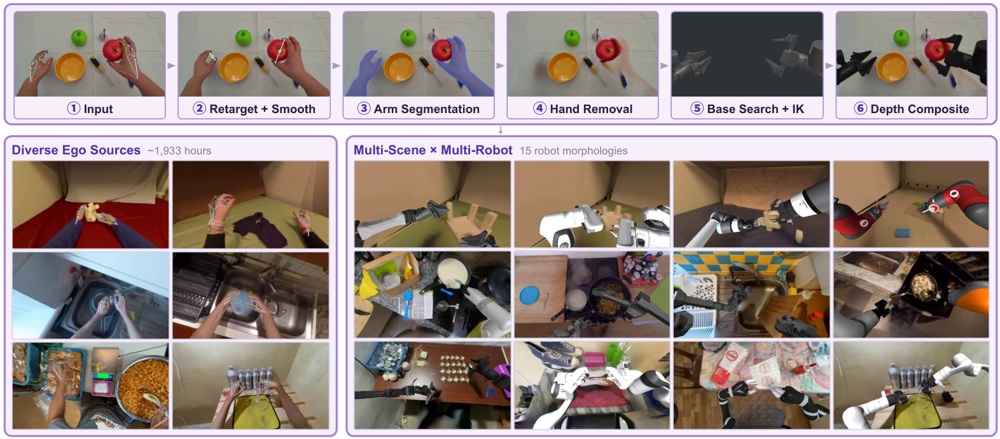

> 图解：上方为管线流程——对第一人称视频做动作重定向与平滑、SAM3 人手分割、ProPainter 修补、基于 MuJoCo IK 的基座位置搜索、深度引导合成；下方为规模化效果——3 个来源约 1,933 小时的第一人称数据被渲染到 15 种机器人形态上，产出约 24,808 小时合成演示。

**动作对齐** ：把机器人动作定义为 $\mathbf{a}_t = (\mathbf{p}_t, \mathbf{R}_t, w_t)$（末端位置、夹爪朝向、夹爪开度）。利用 MANO 手部关键点，定义"虚拟手指"为食指与中指指尖的加权组合，末端位置取拇指尖与虚拟手指的中点、开度取两者欧氏距离：

$$
\mathbf{k}_{vf} = 0.7\,\mathbf{k}_{index} + 0.3\,\mathbf{k}_{middle}, \quad \mathbf{p} = \frac{1}{2}(\mathbf{k}_{thumb} + \mathbf{k}_{vf}), \quad w = \|\mathbf{k}_{thumb} - \mathbf{k}_{vf}\|_2
$$

夹爪朝向由抓取轴（拇指-虚拟手指连线）与腕-指方向构造右手正交系，左右手通过符号翻转映射到同一夹爪坐标系。再用 Savitzky-Golay 滤波和高斯加权 SLERP 平滑轨迹。

**视觉对齐** ：SAM3 生成人臂 mask → ProPainter 依光流修补出干净背景 → 由于第一人称轨迹"没有本体"，基座摆放被建模为优化问题——在轨迹质心附近网格搜索，最大化关键帧 IK 可行率（每种本体独立搜索，共 15 种）→ MuJoCo 中渲染机器人及深度图 → 与 Depth Anything v3 估计的场景深度比较得到遮挡 mask，做深度引导合成：

$$
I_t^{syn} = M_t^{occ} \odot I_t^{robot} + (1 - M_t^{occ}) \odot \hat{I}_t
$$

此外还有 **动作速度对齐** ：人手操作显著快于机器人遥操作，训练时按来源做帧率降采样（EgoDex 降至 60%、EgoVerse 45%、VITRA 25%），匹配机器人数据的速度分布。

### 3.2 多阶段数据清洗

跨本体、跨仿真器、跨采集管线聚合数据会引入各种噪声。作者设计了 **五阶段状态-动作信号过滤 + 三项跨模态检查** ：

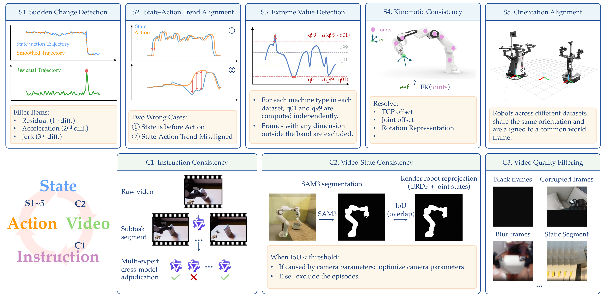

> 图解：五阶段过滤（突变检测 → 状态-动作趋势对齐 → 极值过滤 → 关节-末端正运动学一致性 → 基座系与末端朝向对齐），随后三项跨模态检查（指令一致性、视频-状态一致性、视频质量过滤）。

几个值得注意的细节：

- **趋势对齐检查** 利用"动作应在时间上领先或同步于状态变化"这一因果不变量，用互相关估计时延后计算方向一致率（DA），阈值通常 0.6–0.7。RoboMIND UR 类数据 **81% 的 episode 未通过此检查被剔除** ——足见公开数据质量参差；
- **FK 一致性检查** 主要做"数据修正"而非过滤：恒定位置偏移通过调整 TCP 定义解决，甚至发现同一机器人型号在不同数据集中关节角符号约定都不同，这反过来印证了统一表示的必要性；
- **指令一致性检查** 用 VLM 三阶段流水线：长 episode 先切分为子任务片段，再用结构化推理引导的 prompt 做标注，争议样本由多个 VLM 交叉投票裁决。

### 3.3 视觉-语言协同训练数据

为防止 VLA 训练侵蚀 VLM 的感知与推理能力，作者构建了约 **28M 条** VL 数据，覆盖六大类：通用视觉理解、空间感知与推理、OCR 与文档理解、多模态专业知识、指令跟随/多语言/纯文本，以及专门设计的 **具身中心 VL 数据** ：

- **ECoT（Embodied Chain-of-Thought）** ：基于机器人轨迹合成三段式推理监督——描述当前场景、评估任务进度、预测下一个原子动作（预定义了 17 类原子动作词表，如 Reach、Flip、Insert、Handover 等）。标注 VLM 可以使用"特权信息"（历史记忆摘要、未来动作预览、时间进度估计）提升标注质量，但训练输入只含当前观测与指令；
- **第一人称视频理解** ：把人类操作视频切成 1.5–3 秒片段，让 VLM 描述手部运动、手-物交互与物体状态变化；
- **2D 轨迹预测** ：把机器人末端/人手的未来轨迹投影到图像平面，让模型预测归一化 2D 坐标序列，直接把视觉观测与空间运动推理连接起来。

## 四、训练配方

### 4.1 预训练：双流协同 + 带掩码的 Flow Matching

训练采用 **双流协同（Dual-Stream Co-Training）** ：VLA 流吃全部操作数据，VLM 流吃上述 VL 数据，比例 9:1。

动作学习用 Flow Matching：对真值动作 chunk $\mathbf{a}$，采样 $t \sim \mathrm{Beta}(1, 1.5)$ 与噪声 $\boldsymbol{\epsilon} \sim \mathcal{N}(\mathbf{0}, \mathbf{I})$，构造插值 $\mathbf{x}_t = (1-t)\boldsymbol{\epsilon} + t\mathbf{a}$，训练模型预测速度场：

$$
\mathcal{L}_{\mathrm{FM}} = \mathbb{E}_{\mathbf{a},\,\boldsymbol{\epsilon},\,t} \left\| f_\theta(\mathbf{x}_t, t, \mathbf{s}, \mathbf{o}) - (\mathbf{a} - \boldsymbol{\epsilon}) \right\|_2^2
$$

由于不同本体只填充 80 维空间的不同子集，损失上施加三类 mask 的与组合：逐维槽位 mask（屏蔽未填充维度）、步有效性 mask（屏蔽清洗标记的异常步及之后所有步，保持因果一致）、逐手有效性 mask（人手中某只手出画后整条手臂槽位置零）。掩码损失按有效项做样本内平均：

$$
\mathcal{L}_{\mathrm{FM}} = \frac{1}{B}\sum_{i=1}^{B} \frac{\sum_{t,j} m_{i,t,j}\,\left(f_\theta(\mathbf{x}_{i,t}, t_i, \mathbf{s}_i, \mathbf{o}_i)_{j} - v_{i,t,j}\right)^2}{\sum_{t,j} m_{i,t,j}}
$$

这保证无论激活多少维度，每个样本对梯度的贡献相等，避免多槽位本体主导优化。

VLM 侧用标准的 next-token prediction 损失，总目标为

$$
\mathcal{L} = \mathcal{L}_{\mathrm{FM}} + \lambda\,\mathcal{L}_{\mathrm{VLM}}, \quad \lambda = 0.1
$$

另有一个实用的效率设计：动作专家对每个训练样本做 $K_{repeat}=8$ 次重复扩散（同一动作 chunk 采 8 组独立噪声与时间步），摊销 VLM 前向的成本，不增加数据消耗即显著提升训练效率。

### 4.2 后训练：Generalist SFT 与"VLA-to-VA 退化"

下游适配采用 **generalist SFT** ——不为单任务训专家策略，而是把目标域所有演示合成一个训练集，训一个统一模型。SFT 只优化 Flow Matching 损失，且 **关闭预训练阶段的多阶段过滤** （保留每一条有效演示），并加颜色抖动增广。

作者还点出一个隐蔽的失效模式： **VLA-to-VA 退化** ——在狭窄 benchmark 数据上充分 SFT 后，模型靠重复的视觉/任务模式拿分，对语言指令越来越不敏感，退化成"视觉-动作模式匹配器"。成因有三：域数据多样性低、训测视觉模式雷同、模型本身组合性 grounding 弱。对策是 **混合后训练** ：SFT 时混入与目标域分布相近的预训练数据子集 + VL 数据。为此作者还专门构建了 RoboTwin-IF 基准来直接测量语言跟随能力（见后文）。

### 4.3 部署

推理在远程服务器进行，观测与动作经 WiFi 在机器人与服务器间传输。为掩盖云端推理与网络往返延迟，采用 **Real-Time Chunking（RTC）** ：机器人执行当前动作 chunk 的同时异步生成下一个 chunk，实现平滑实时控制。

## 五、实验验证：OOD 全线碾压

评测覆盖 500+ 仿真任务（LIBERO、LIBERO-Plus、EBench、RoboTwin 系列、RoboCasa365）与 80+ 真机任务（UR、Franka、AgileX ALOHA、ARX 四种本体），围绕三条泛化轴展开： **任务与场景泛化、指令跟随、零样本跨本体迁移** 。

先看 IID 基准（前面论证过它说明不了太多问题，但该有的 SOTA 还是得有）：

| 模型 | LIBERO | RoboTwin-Easy | RoboTwin-Hard |
| --- | --- | --- | --- |
| $\pi_0$ | 94.4 | 65.9 | 58.4 |
| $\pi_{0.5}$ | 97.6 | 82.7 | 76.8 |
| StarVLA | 98.0 | 85.7 | 87.3 |
| Being-H0.7 | **99.2** | 90.2 | 89.6 |
| Ours-scratch | 98.2 | 88.7 | 88.4 |
| Qwen-RobotManip | 99.1 | 93.4 | 92.5 |
| Qwen-RobotManip-Context | **99.2** | **93.7** | **94.0** |

真正的主战场是 OOD：

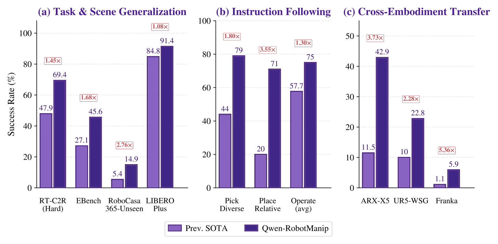

> 图解：三条泛化轴上的 OOD 成绩对比。(a) 受控扰动下的任务与场景泛化；(b) 留出语言模板的指令跟随；(c) 零样本跨本体迁移。Qwen-RobotManip 在每个 OOD 基准上都领先，且设置越难差距越大。

### 5.1 LIBERO-Plus：七维扰动逐个拆解

LIBERO-Plus 在原 LIBERO 上施加七个正交维度的扰动（相机、机器人初始状态、语言、光照、背景、噪声、布局）：

| 模型 | Camera | Robot | Language | Light | Background | Noise | Layout | Total |
| --- | --- | --- | --- | --- | --- | --- | --- | --- |
| $\pi_{0.5}$ | 78.4 | 73.6 | 80.8 | 96.2 | 94.1 | 89.0 | 84.5 | 84.4 |
| StarVLA | 52.5 | 49.8 | **88.5** | 95.7 | 95.7 | 73.0 | 76.9 | 74.1 |
| Being-H0.7 | 82.0 | 59.0 | 82.8 | 97.8 | 90.0 | 93.5 | **88.5** | 84.8 |
| Ours-scratch | 70.4 | 44.9 | 88.1 | 95.8 | 95.5 | 84.4 | 79.1 | 78.3 |
| Qwen-RobotManip | 87.2 | 75.5 | 85.6 | 96.6 | 97.7 | 97.7 | 87.3 | 89.0 |
| Qwen-RobotManip-Context | **89.9** | **83.9** | 86.5 | **98.6** | **99.9** | **97.9** | 87.5 | **91.4** |

逐维拆解非常有信息量： **无机器人预训练的模型在 Language、Light、Background 上能追平预训练模型** ——这些鲁棒性本来就来自 VLM 主干；但在 **Robot 扰动** （未见过的机器人初始状态）上，scratch 模型只有 44.9%–49.8%，而 Qwen-RobotManip 达 75.5%，Context 版再 +8.4 到 83.9%。这说明：区分"真泛化"与"分布内记忆"的能力——新视角下的空间推理、对陌生机器人状态的鲁棒性、杂乱场景中锁定任务相关物体—— **必须由大规模跨本体预训练提供** 。In-context 历史则像一个隐式运动学先验，帮策略在 episode 内自适应陌生初始构型。

### 5.2 RoboTwin-Clean2Rand：扰动越狠，差距越大

所有模型只在 Clean 数据（白背景、默认光照、无干扰物、固定桌高）上微调，再在各轴随机化下测试：

| 模型 | Easy | Background | Light | Clutter | Height | Hard |
| --- | --- | --- | --- | --- | --- | --- |
| StarVLA | 58.1 | 27.1 | 50.9 | 24.2 | 48.4 | 10.6 |
| GR00T-N1.7 | 43.6 | 40.4 | 41.9 | 27.1 | 39.0 | 20.7 |
| $\pi_{0.5}$ | 73.1 | 67.0 | 69.2 | 57.9 | 67.6 | 47.9 |
| Ours-scratch | 71.6 | 60.6 | 70.7 | 24.6 | 63.6 | 22.6 |
| Qwen-RobotManip (joint) | 73.2 | 74.6 | 68.4 | 61.3 | 71.0 | 62.6 |
| Qwen-RobotManip-Context (joint) | 84.7 | **82.4** | 84.2 | **75.4** | 79.5 | **69.4** |

两个细节值得玩味：其一，Qwen-RobotManip 从 Easy 到 Hard 保留约 86% 性能，$\pi_{0.5}$ 只保留 66%，scratch 模型只剩约 30%；其二，模型在 Background 随机化下的分数（74.6%）反而 **高于** Easy 白背景（73.2%）——因为预训练语料里的真实场景多样性让随机背景比纯白背景更"in-distribution"。Context 机制在 Easy/Hard 上再带来 +11.5/+6.8 的提升，说明基于执行历史的动态校准与视觉鲁棒性互补。

### 5.3 RoboCasa365 与 EBench：长程与移动操作

RoboCasa365 是厨房操作基准，分 Atomic（18 种原子技能）、Composite-Seen（见过的长程组合）、Composite-Unseen（未见长程任务）三档：

| 模型 | Atomic | Composite-Seen | Composite-Unseen | Total |
| --- | --- | --- | --- | --- |
| $\pi_{0.5}$ | 39.6 | 7.1 | 1.2 | 16.9 |
| GR00T-N1.5 | 50.7 | 14.8 | 2.7 | 23.9 |
| RLDX-1 | 63.0 | **27.5** | 5.4 | 33.2 |
| Qwen-RobotManip | **68.6** | 20.1 | **14.9** | **35.9** |

最能说明问题的是 Composite-Unseen：14.9% 几乎三倍于次优的 5.4%——OOD 场景下的长程组合泛化正是基础模型该有的能力。

EBench（基于 Isaac Sim 的室内移动操作，26 类任务 794 个实例）上，Qwen-RobotManip 总分 45.6% SR / 60 分，大幅领先 $\pi_{0.5}$（27.1% / 41）；在需要精细操作的 Table Top 子集上 50.0% SR，接近 $\pi_{0.5}$（12.9%）的四倍。更难得的是 **稳定性** ：随扰动复合程度加深，$\pi_{0.5}$ 的 SR 从 34.6% 掉到 23.3%（-33%），而 Qwen-RobotManip 各维度几乎无衰减（44.5–46.8），最严苛的 Mix 条件下甚至拿到最高的 46.8%。

### 5.4 RoboTwin-IF：语言究竟是不是"控制信号"？

现有 OOD 基准只测视觉/物理扰动，没人系统测过"模型是否真的在听指令"。RoboTwin-IF 设计了五个任务套件，分别考察：目标物体 grounding（Pick-Diverse-Object）、空间关系理解（Place-Relative）、多步序列与双臂协调（Operate-Mic-Drawer）、共享场景元素下的动词辨析（Operate-Stapler）、多可供性场景的三路动词-目标辨析（Operate-Tabletop）。评测使用训练时 **从未见过** 的指令模板。

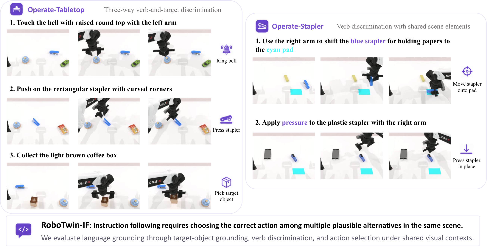

> 图解：RoboTwin-IF 代表性套件。左：Operate-Tabletop，铃铛、订书机、可抓物同时在场，只有指令指定的动作算对；右：Operate-Stapler，彩色垫始终在场，按压任务中它是干扰物、移动任务中它是目标——视觉场景相同，只有指令不同。

| 模型 | Pick-Diverse | Place-Rel. | Ope.-Mic-Dr. | Ope.-Stapler | Ope.-Table | Average |
| --- | --- | --- | --- | --- | --- | --- |
| StarVLA | 11 | 13 | 0 | 49 | 74 | 29.4 |
| GR00T-N1.7 | 20 | 17 | 0 | 14 | 32 | 16.6 |
| $\pi_{0.5}$ | 44 | 20 | 15 | **92** | 66 | 49.6 |
| Qwen-RobotManip | **79** | 57 | **42** | 90 | **93** | **72.2** |

平均分 72.2% 对 49.6%，领先 22.6 个点，且优势集中在"必须解析指令才能在相同场景中选出正确动作"的套件上（Pick-Diverse +35、Place-Relative +37）。指令跟随恰恰是 VLA 训练中最容易退化的能力，这个结果说明双流协同训练与预训练语料多样性确实保住了 **真正的语言条件化控制** 。

### 5.5 RoboTwin-XE：零样本跨本体迁移

这是最硬核的测试：模型只在 AgileX ALOHA 演示上微调，零样本部署到 ARX-X5、UR5-WSG、Franka Panda 三种未见本体（初始末端位姿经 IK 对齐、相机外参保持一致、场景与扰动种子共享）。

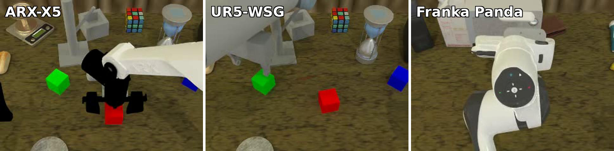

> 图解：RoboTwin-XE 零样本跨本体评测。同一策略（仅用 AgileX 数据训练）直接部署到三个未见本体：左 ARX-X5、中 UR5-WSG、右 Franka Panda。

| 模型 | ARX-X5 | UR5-WSG | Franka Panda | Total |
| --- | --- | --- | --- | --- |
| $\pi_{0.5}$ (joint) | 24.6 | 2.2 | 0.9 | 9.2 |
| $\pi_{0.5}$ (eef) | 11.5 | 10.0 | 1.1 | 7.5 |
| Ours (joint) | 37.6 | 4.1 | 1.8 | 14.5 |
| Ours (eef) | **42.9** | **22.8** | **5.9** | **23.9** |

关节空间动作天然是机器人专属的，跨本体近乎随机行为；切到相机系 EEF 后迁移率飙升——UR5 上 22.8% 是关节模式的 5.6 倍。整体 23.9% 是 $\pi_{0.5}$（7.5%）的 3.2 倍。性能梯度 ARX > UR5 > Franka 与训练本体的视觉/运动学相似度正相关，完全符合直觉。 **这直接验证了相机系对齐策略的价值：把动作表达在视觉域，形态迥异的机器人也能共享"物理上相似的动作"。**

## 六、真机实验

### 6.1 CobotMagic ALOHA：ID 与 OOD 双重评测

在 22.9 小时遥操作数据上微调后，ID 基准（桌面清理、三碗堆叠、折毛巾、抽屉放块、圆盘插入、三块堆叠等 7 个任务）：

| 模型 | 平均成功率 |
| --- | --- |
| $\pi_{0.5}$ | 42.9% |
| StarVLA | 20.0% |
| Qwen-RobotManip | **88.6%** |

OOD 基准（杂乱背景、未见物体、左右空间指代、disco 灯动态光照干扰）：

| 模型 | 平均成功率 |
| --- | --- |
| $\pi_{0.5}$ | 37.5% |
| StarVLA | 0.0% |
| Qwen-RobotManip | **87.5%** |

$\pi_{0.5}$ 在简单 OOD 变化上尚有余力（target-object-in-basket 8/10），但一遇组合性、关系性泛化就崩（left-right-bowl-stacking 仅 1/10）；StarVLA 四个 OOD 任务全军覆没。

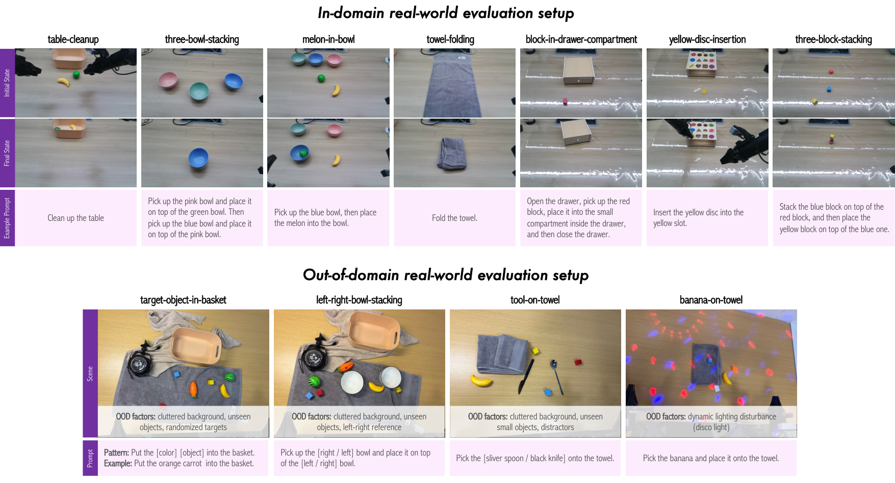

> 图解：CobotMagic ALOHA 平台的 ID 与 OOD 任务设置，涵盖可变形物体、接触丰富的精细插入、多步长程任务以及杂乱背景、动态光照等分布偏移。

### 6.2 ARX ALOHA：Few-shot 适配与跨本体技能迁移

五个真机任务（放水果、放积木、折毛巾、插螺丝、拧瓶盖），所有方法在同样的 130 条演示上联合微调。Qwen-RobotManip 在五项中四项领先：Put Blocks 上子步骤成功率 37.5% 对 $\pi_{0.5}$ 的 25.0%；拧瓶盖的瓶盖移除率翻倍（4/10 对 2/10）。无预训练的 StarVLA 接近零分，再次印证大规模预训练对真机操作的决定性作用。

更有意思的是 **跨本体技能迁移** 实验：用 6K 条 CobotMagic + 130 条 ARX 演示联合微调 **一个** 策略，然后在 ARX 上测 4 个 **零演示** 新任务（堆盘子、堆积木、放水果到指定盘、纸球入桶）——相关技能必须跨本体从 CobotMagic 行为泛化过来：

| 变体 | 平均成功率 |
| --- | --- |
| Ours w/o UnifiedSpace | 7.5% |
| Ours w/o UnifiedEEF | 12.5% |
| Qwen-RobotManip（完整） | **55.0%** |

去掉统一动作空间或统一 EEF 表示后几乎全灭，完整版 55.0%—— **统一表示不是锦上添花，而是技能级跨本体迁移的必要条件** 。

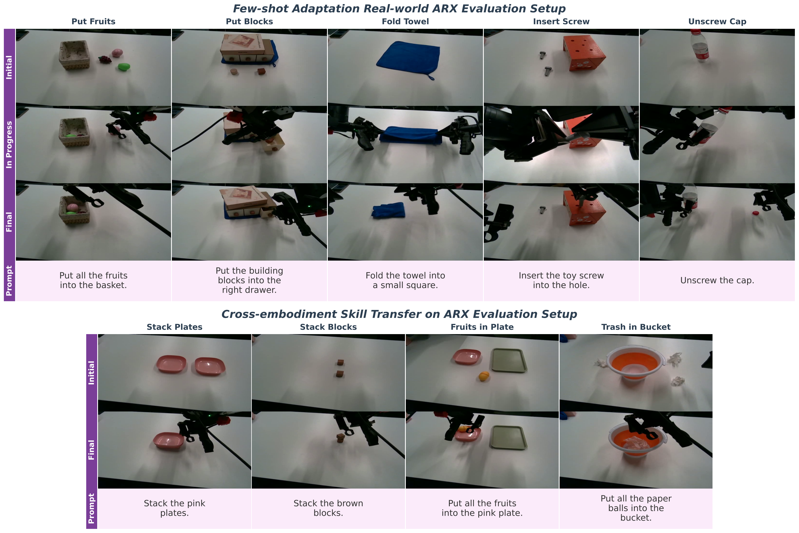

> 图解：ARX ALOHA 真机评测设置。上：few-shot 适配的五类任务（多物体抓放、长程序列操作、可变形物体、双臂精密装配、精细旋转控制）；下：跨本体技能迁移场景。

### 6.3 RoboChallenge Table30：真机挑战赛第一

Table30 v1 包含 4 种本体上的 30 个任务，Generalist 赛道要求每个本体只训 **一个** 统一策略应对所有任务。Qwen-RobotManip（匿名身份 `Lira_generalist` 提交）取得 **45% 成功率 / 59.83 过程分，排名第一** ，领先第二名 DM0_generalist（37% / 48.43）8 个百分点，相对提升 20%。三个亮点发现：

**强双臂协调。** 8 个 ALOHA 双臂任务上平均 40%，远超 $\pi_{0.5}$（21.2%）和 DM0（16.2%）；在 pour fries into plate 上是唯一非零模型（30%）。作者归因于预训练语料中高比例的双臂数据 + H2R 管线天然产出的双臂合成数据。

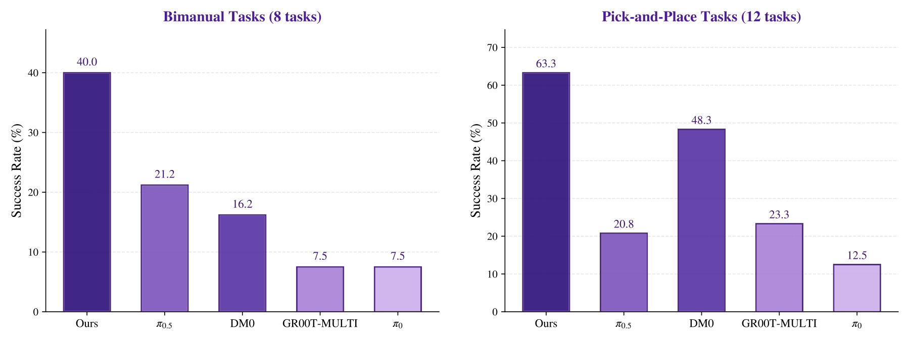

> 图解：左为 8 个双臂协调任务、右为 12 个抓放任务的平均成功率对比。Qwen-RobotManip 在两类任务上都大幅领先所有基线（抓放类 63.3% 对次优 DM0 的 48.3%）。

**涌现的 retry 行为。** 真机评测中反复观察到：抓取滑落或放置失误时，策略会 **自发重试** 而不是卡住或跳到下一步。这种行为难以量化但无处不在（抓、放、倒、折、擦、扫都有），作者推测它来自预训练数据中天然包含的"失败-纠正"演示。

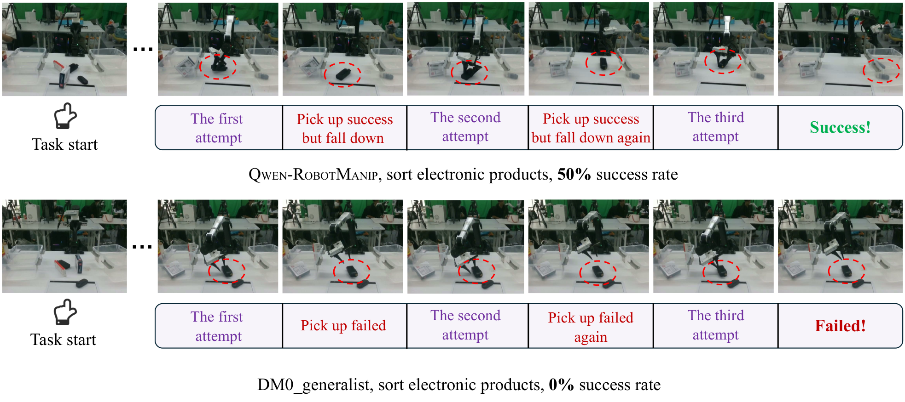

> 图解：sort electronic products 任务案例。Qwen-RobotManip（上）前两次抓取物体均掉落，策略自主重试，第三次成功抓稳并放入目标箱；DM0（下）同样尝试三次但从未抓稳，任务失败。

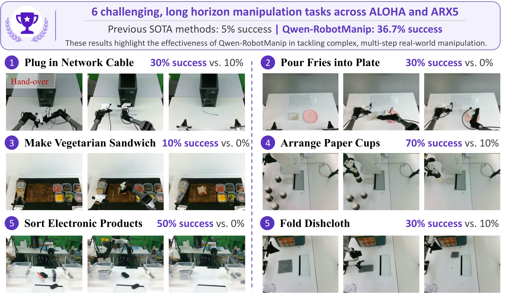

> 图解：Table30 中六个高难度长程任务（双臂精细操作、序列堆叠、多物体整理、可变形物体处理）。此前 SOTA generalist 方法在这些任务上平均仅 5% 成功率，Qwen-RobotManip 达 36.7%，且每个任务都有显著优势——例如 arrange paper cups 70%、sort electronic products 50%，分别领先次优 60 和 40 个百分点。

## 七、消融实验：每个设计都在"刀刃"上

### 7.1 动作空间对齐决定数据规模化是否成立

作者构造了受控的数据规模化实验：从完整预训练混合中按 1%→100% 构造嵌套子集，在 15 种本体、154 个训练外任务的 held-out OOD 验证集上测最佳验证 MSE。

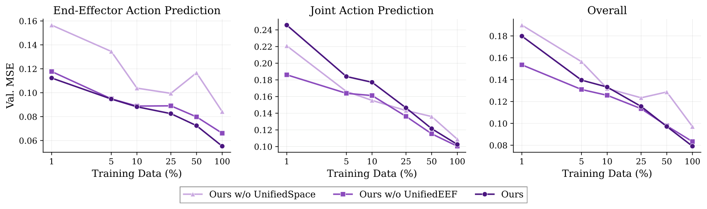

> 图解：三种动作空间设计的数据规模化曲线（横轴为训练数据百分比，纵轴为 held-out 验证 MSE）。两个统一表示变体（Ours w/o UnifiedEEF 与完整版 Ours）呈现干净的 log-linear 下降——数据越多、OOD 预测误差越低；而无统一空间的 w/o UnifiedSpace 曲线抖动且 MSE 显著更高，朴素拼接 + 补零的表示 **加数据不出规模效应** 。

下游验证更直接：

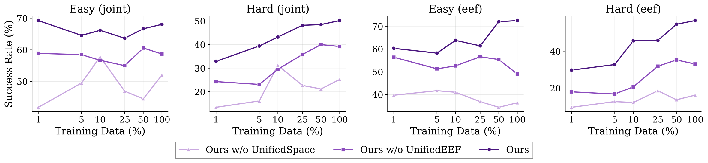

> 图解：不同预训练数据量微调后的 RoboTwin-C2R 成功率，四个子图对应 joint/EEF × Easy/Hard 组合。 **只有在 OOD Hard 设置下** ，完整版才呈现清晰的"数据越多分越高"的规模化性质（EEF 模式下达 56.6%）；IID Easy 设置下三个变体都没有明显趋势——再次印证 in-domain 评测测不出预训练收益。另一个反转现象：完整版是唯一 EEF 控制优于 joint 控制的变体，说明相机系对齐炼出了真正强的 EEF 空间策略。

### 7.2 Prompt 设计与 In-Context 机制

在 RoboTwin-C2R（joint）上的消融显示：结构化 prompt 相比无 prompt 提升 2.2–3.2 分（65.9 vs 62.7）；加入 in-context 历史后，动作分布变复杂，4 步去噪预算下会出现抖动， **把去噪步数提到 10 步后收益完全释放** ——平均 70.9，比结构化 prompt 基线高 5.0 分，超过任何 prompt 变体的贡献。这支持了"历史是隐式本体标识符而非情景记忆"的判断。一个实际部署中的小坑：episode 开头 context 全是零填充占位符，模型会"犹豫"，因此作者同时发布 context 版与 context-free 版供选用。

### 7.3 H2R 合成数据、VL 协同训练与架构

- **H2R 消融** （固定 7:3 机器人/辅助数据比）：RoboTwin-C2R Hard 上 Robot-only 54.7% → +Ego（生第一人称数据）55.0% → +H2R 58.7%；LIBERO-Plus 的 Camera 维度 +7.2（72.8→80.0）。单调递进说明：生 ego 数据靠视觉多样性贡献，而 H2R 管线通过动作与视觉双重对齐解锁额外收益；
- **VL 协同训练** ：预训练去掉 VL 数据后，LIBERO 仅掉 0.9 分，但 RoboTwin-C2R Hard 掉 8.2 分、RoboTwin-IF 掉 7.0 分——任务越复杂、分布偏移越大，VL 协同越关键；后训练阶段加入 VL 数据则主要提升 **语言相关泛化** （LIBERO-Plus 语言扰动 86.9%→93.9%）；
- **架构消融** ：对比逐层 self-attention 融合、末层 self-attention、末层 cross-attention + 可学习 query token 三种 DiT-VLM 交互方式，第三种在 LIBERO-Plus 上以最低算力拿到最高的 87.5%，被采用为默认架构。

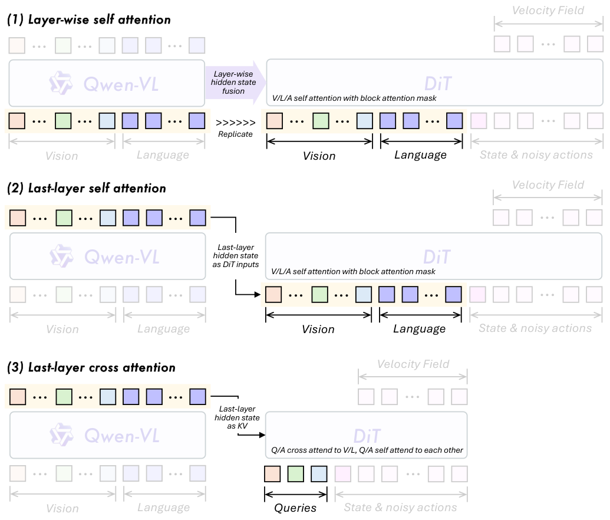

> 图解：三种架构变体示意——(1) VLM 各层隐状态复制进 DiT 做纯 self-attention + 逐层残差融合；(2) 仅末层隐状态、纯 self-attention；(3) 引入可学习 query token 与状态/动作 token 拼接，共同对 VLM 末层隐状态做 cross-attention。

### 7.4 混合后训练：UnifiedEEF 是前提

在 RoboTwin-IF 上，纯域数据 SFT 随训练步数增加出现严重过拟合（IF 分数先升后降）；混入 10% VL 数据显著缓解；再混入 75% 的辅助 VLA 预训练数据后 **过拟合完全消失** ，IF 分数随训练持续上升。但最关键的发现是： **这一切的前提是 UnifiedEEF** ——没有它，混入多源数据直接引发表示坍塌（成功率 0.0%）；有了它，混合后训练才能把性能天花板推到 75.8%。这个实验是"对齐解锁规模"论点的微观缩影。

## 八、总结与展望

回到开头的问题： **语言/多模态的"对齐 + 规模"配方能否搬到机器人操作？** Qwen-RobotManip 给出了肯定答案，并留下三个超出系统本身的结论：

1. **对齐是规模化的前提而非并列的工程项** 。消融显示朴素表示加不出规模效应——是对齐把数据量转化成了能力；
2. **操作基础模型的数据门槛可能比想象中低** 。仅靠开源数据集 + 第一人称人类视频就构建了 38,100 小时语料并涌现出泛化能力，前提是合成与清洗基础设施到位；
3. **该换"尺子"了** 。标准基准系统性地分不清"预训练带来的可泛化结构"与"分布内模式匹配"，OOD 评测（LIBERO-Plus、RoboTwin-C2R、RoboCasa365、EBench、RoboTwin-IF/XE）才是更忠实的度量。

局限也同样坦诚：H2R 合成存在重定向近似与修补伪影带来的分布缺口；OOD 评测仍以仿真为主；固定动作 chunk 长度与推理延迟限制了亚秒级反应控制任务的适用性。未来方向包括纳入更多本体与任务域、提升合成保真度（更准的手-机器人重定向与物理渲染）、以及结合 agentic 系统走向更长程的推理与操作。

> 本文参考自 [Qwen-RobotManip Technical Report: Towards a Generalizable Foundation Model for Robotic Manipulation](https://arxiv.org/abs/2606.17846)