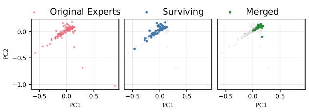
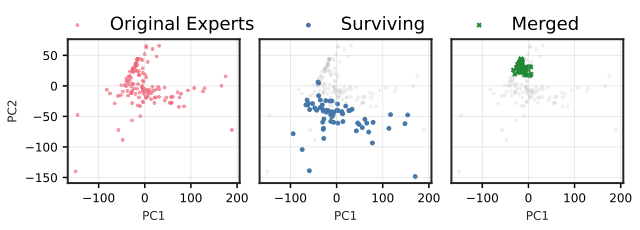
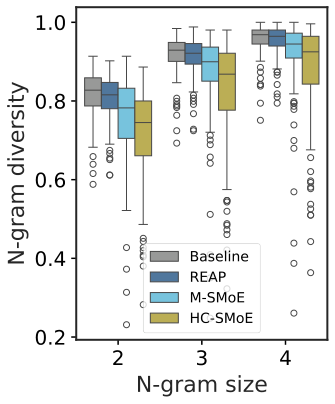
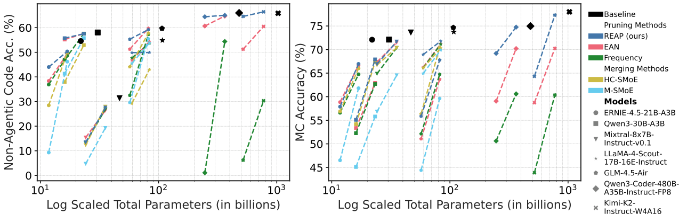
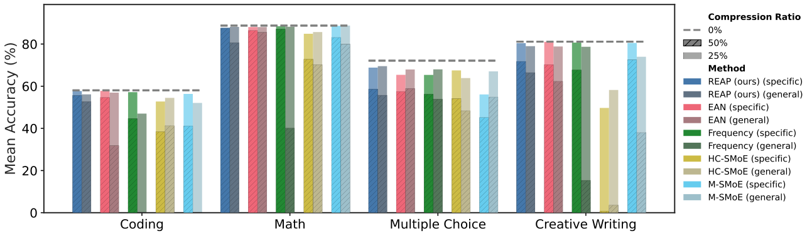

# REAP the Experts：为什么一刀切的 MoE 压缩里，Pruning 比 Merging 更稳、更准

## 这篇论文解决什么问题
Sparsely-activated Mixture-of-Experts（SMoE）在 LLM 里很香：预训练省算力、推理低延迟，但代价是 **参数量爆炸** 和 **显存占用高**。于是大家开始做专家压缩。过去的结论常常是：在多选题（MC）上，**Merging** 比 **Pruning** 好。但这篇论文指出：一旦任务变成 **生成式（code、math、creative writing、tool calling）**，结论会反过来，**Pruning 更优**，并且给出理论原因与新的剪枝准则 REAP。

## 关键结论一：Merging 会导致“功能子空间坍缩”
作者先建立一个极简但关键的分析：把两个专家 $f_i, f_j$ 压成一个专家时，会发生什么？

原始 SMoE 层输出：
$$
h(x)=\sum_{k=1}^K g_k(x) f_k(x)
$$

### Merging 的根本问题
合并时把 $g_i(x)$ 和 $g_j(x)$ 直接相加，并用一个固定组合的专家 $\tilde f$ 替代：
$$
\tilde h(x) = \sum_{k\neq i,j} g_k(x)f_k(x) + \big(g_i(x)+g_j(x)\big)\tilde f(x)
$$

但原本两个专家在不同输入下的比例是动态的。定义：
$$
r(x) = \frac{g_i(x)}{g_i(x)+g_j(x)}
$$
原始组合实际上是：
$$
(g_i+g_j)\cdot\Big(r(x)f_i(x)+(1-r(x))f_j(x)\Big)
$$

**问题**：Merging 强行把动态混合变成静态混合，理论上会引入不可消除的误差。

核心下界（论文定理）：
$$
\text{Error} = \mathbb{E}\!\left[(g_i{+}g_j)^2\right]\cdot \mathrm{Var}[r(x)] \cdot \|f_i-f_j\|^2
$$

只要：
- router 的 mixing policy 不是常数（$\mathrm{Var}[r]>0$）
- 两专家不是同一个函数（$\|f_i-f_j\|>0$）

那么 **误差必然 > 0**。

### Pruning 的优势
如果直接剪掉 $f_j$：
$$
\text{Error} = \mathbb{E}[g_j(x)^2\|f_i-f_j\|_2^2]
$$

这里没有 $\mathrm{Var}[r]$，所以 **Pruning 不会因为策略多样性而受罚**。这就是“功能子空间坍缩”结论的理论原因。

## 关键结论二：经验层面，Merging 在生成任务上崩得更快
作者用 PCA 可视化显示：在高层 MoE 中，Merging 会把专家输出子空间强行拉到中心，出现 “functional subspace collapse”；Pruning 则保留原来的 manifold 结构。

> 图解：Qwen3-30B 早期层 PCA 空间，Pruning 保留原分布形状，Merging 明显收缩。

> 图解：Qwen3-30B 后期层 PCA 空间，Merging 收缩更剧烈，Pruning 仍保持原 manifold 结构。

## REAP：Router-weighted Expert Activation Pruning
为了让 Pruning 更稳，作者提出新的剪枝准则 **REAP**，直觉是：专家重要性不仅取决于 **路由频率**，还取决于 **输出幅度**。

定义专家 $j$ 的 saliency：
$$
S_j = \frac{1}{|\mathcal{X}_j|}\sum_{x\in\mathcal{X}_j} g_j(x)\cdot \|f_j(x)\|_2
$$

含义：
- $g_j(x)$：router gate 值
- $\|f_j(x)\|_2$：专家输出激活幅度
- $\mathcal{X}_j$：该专家被 TopK 激活的 token 集合

**剪掉 $S_j$ 最小的专家**，就能最大限度减小 layer 输出变化。

## 实验设置概览
- 模型规模：21B 到 1T
- 压缩比例：25% / 50%
- Baseline：Frequency, EAN, HC-SMoE, M-SMoE
- 任务：MC QA、Code、Math、Creative Writing、Tool Calling

> 图解：GLM-4.5-Air 与 Qwen3-30B 在多任务上的压缩效果。50% 压缩时，Merging 在生成类任务上明显下滑，REAP 保持最好稳定性。

## 生成任务分析：Merging 为什么更差
作者进一步统计生成输出分布差异：

> 图解：N-gram 多样性。Merging 输出显著更重复，REAP 接近原模型。

> 图解：cross perplexity，Merging 与原模型分布偏离更大。

> 图解：logit JSD 随 token 位置变化。Merging 随序列增长快速失配，REAP 更稳。

> 图解：专家权重间距离和奇异向量对齐度。专家之间差异大，导致 Merging 的“参数平均”本身就不稳定。

## 大模型级别验证
REAP 在 480B 和 1T 级别仍然稳定：
- **Qwen3-Coder-480B**：50% Pruning 仅 1.4% 代码准确下降
- **Kimi-K2**：50% Pruning 仍保持近无损表现
- 在 SWE-Bench、BFCLv3 等 agentic / tool tasks 上，REAP 依然稳于 Frequency 和 EAN

> 图解：Coding + MC vs 参数规模。50% 压缩时，REAP 显著优于其他方法。

## Merging 的额外挑战：簇结构本身很糟
Merging 依赖聚类，但现实中聚类经常出现：
- 大量 singleton clusters
- 少量 mega-clusters（几十专家强行合并）

> 图解：限制最大 cluster size 后，编码任务准确率大幅下降，说明大簇是性能崩溃来源。

## 校准数据的重要性
生成任务必须用 **领域数据校准**，否则压缩模型可能完全失效。

> 图解：用 c4 校准导致 coding 质量崩溃，领域数据明显更稳。

> 图解：领域校准在 50% 压缩下更关键，通用校准数据表现显著下降。

## 结论与意义
- **Merging 在生成任务上存在不可消除的理论误差**，根因是 router 控制权被绑定。
- **Pruning 保留 router 独立控制，避免功能子空间坍缩**。
- **REAP** 通过结合 gate 值与激活幅度，显著优于频率剪枝与 EAN，且能扩展到超大模型。
- 这篇论文说明：压缩 SMoE 时，**只看 MC 或 perplexity 是误导性的**，生成任务才是现实表现的关键。

> 本文参考自 [REAP the Experts: Why Pruning Prevails for One-Shot MoE compression](https://arxiv.org/abs/2510.13999)