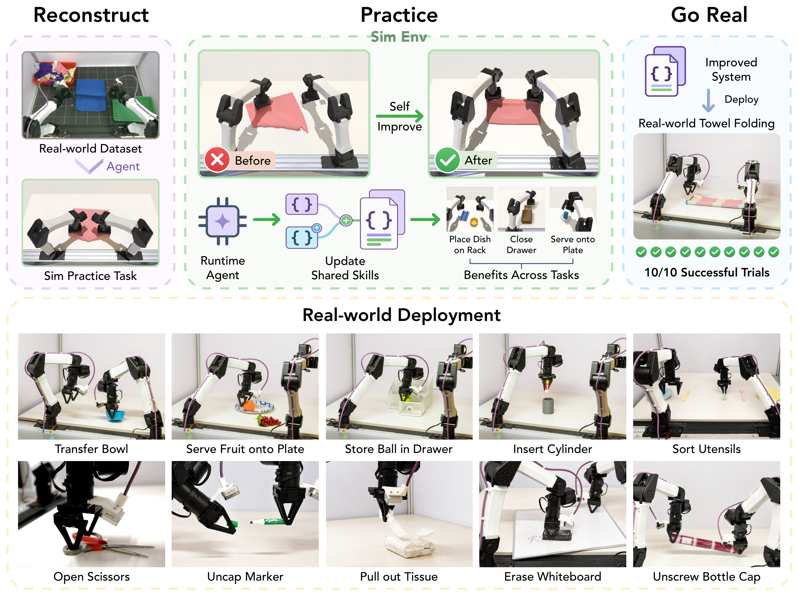

# RPG：让具身智能体自主练习、自我进化

让机器人在五花八门的任务上稳定可靠地干活，最大的瓶颈不是模型不够大，而是 **每来一个新任务，就要有人重新写技能、调奖励、接感知** ——这套人力工程几乎无法规模化。RPG（Reconstruct, Practice, Go Real）给出的答案是： **不更新任何模型权重** ，让智能体在仿真里像人类学徒一样「重建练习任务 → 反复练习 → 上真机」，把经验沉淀为可复用的技能代码和系统提示词。结果相当硬：在 22 个操作任务的 held-out 初始化上，成功率从第 1 轮练习的 28.6% 一路涨到 15 轮后的 **95.0%** ，大幅超过 ASPIRE（75.5%）和搭载 GPT-6 Astra Pro 的 CaP-Agent0（60.0%）；冻结后的系统在真实机器人上 3 个任务、30 次尝试 **全部成功** 。

## 为什么需要「会练习」的机器人

基于语言模型的机器人控制，一直在两条路线之间摇摆：

- **Code-as-Policy** ：把感知和控制原语组合成可执行程序（如 Code as Policies、CaP-X）。程序跑得快、能带反馈环，但行为完全取决于事先写死的逻辑——比如「抓取是否成功」这种符号化判断很难手写，而 MLLM 看一眼图就能判断。
- **Agent-as-Policy** ：让 MLLM 留在控制环里在线推理。视觉语义判断灵活了，但每一步低层决策都要调模型，又慢又贵。

一个可扩展的系统显然应该两者兼顾： **把可重复的执行下沉为可复用代码，把多模态推理留给真正需要视觉/语义判断的决策** 。问题在于，这些「可复用技能代码」谁来写、谁来维护、谁来修 bug？这正是 RPG 要自动化的部分——它把共享技能库和系统提示词当作可持续进化的「资产」，让机器人通过自主练习自己迭代。

## RPG 总体框架：三阶段、六智能体

> 图解：RPG 的三个阶段。 **Reconstruct** （左上）：智能体从离线数据集中识别出有价值的操作能力，在仿真中构建对应的练习任务； **Practice** （中）：Runtime Agent 与 Privileged Agent 并行执行任务，Video Analyzer 对比二者执行记录诊断失败，Implementor 修订共享技能与系统提示词，候选改动经过跨任务验证后才被保留——技能修订可以惠及复用同一技能库的其他任务； **Go Real** （右下）：改进后的系统经校准后冻结，部署到物理机器人。底部为真机部署的定性示例。

RPG 共调度六个专业化 Agent：Constructor、Runtime Agent、Privileged Agent、Video Analyzer、Implementor 和 Merger。执行系统被形式化为 **Agent-as-Policy** ：Runtime Agent 遵循系统提示词，从共享技能库中挑选并组合可复用技能来完成任务。第 $r$ 轮使用的执行系统记为 $S_r = (\mathcal{L}_r, \rho_r)$，其中 $\mathcal{L}_r$ 是共享技能库，$\rho_r$ 是系统提示词。

初始技能库 $\mathcal{L}_0$ 由两部分构成：来自 CaP-X 的 9 个低层工具（状态查询、感知、逆运动学、运动、夹爪控制），加上 Constructor 从离线数据轨迹中抽象出的 6 个高层操作技能（pick、place、pick-and-place、双臂间桌面转移、move-above、push），合计 15 个条目。 **整个 Practice 过程中，模型权重、任务定义、评估标准全部冻结，唯一进化的就是 $(\mathcal{L}_r, \rho_r)$** ——这是 RPG 与所有「训练派」方法的本质区别。

### Reconstruct：从离线数据「重建」练习任务

巧妇难为无米之炊，练习首先得有练习题。Constructor 从离线数据集 $\mathcal{D}$（本文使用覆盖 193 个任务的 ABC 数据集）中筛选能暴露有价值操作能力的源任务，每个源任务选取 3–8 条轨迹，观看视频和文字描述后，在 MuJoCo 中搭建 YAM 双臂机器人的仿真练习任务（每个源任务有 7.5 分钟的构建预算，缺少的资产可以联网搜索）。

值得强调的是，练习任务 **不需要复刻原始轨迹或场景** ，只需覆盖部分能力或构造类比操作。几个代表性对应关系：

| 离线数据中的源任务 | 构建出的练习任务 |
| --- | --- |
| 整理太阳镜 | 合上眼镜盒（打开和装入已编码进初始状态） |
| 整理化妆品 | 关上抽屉（前置操作已满足） |
| 卷毛巾 | 对折一次（不同最终形态的布料操作类比） |
| 无对应源任务 | 依据任务规格做双臂间物体转移 |

每个任务的二元评估器 $e_i(\tau)$ 由 Constructor 写成 `check_success` 函数，人工核查后开始练习，练习期间任务集合冻结。这个设计很务实： **用数据指引「练什么」，但用仿真保证「练得起、评得准」** 。

### Practice：诊断—修订—验证的自我提升闭环

练习阶段是 RPG 的核心，每轮分为四步。

**第一步：双智能体并行执行。** Runtime Agent 只用部署时真实可用的观测（顶部与双腕 RGB 相机、顶部深度、本体感觉）执行任务；Privileged Agent 用 **同一个模型、同一个技能库** ，从相同初始状态跑独立 episode，唯一区别是它额外能看到仿真器状态（物体名称、位姿、尺寸、速度、布料角点位置）。这借鉴了 asymmetric actor-critic 的思想，但用途不同——RPG 不用特权状态训练 critic，而是用它做 **失败诊断的参照系** ：Privileged Agent 的成功轨迹可以指导 Runtime Agent 改进；两者都失败，则暴露共享技能本身的缺陷。

**第二步：Video Analyzer 诊断失败。** 它拿到采样帧、技能调用及返回值、感知结果、指令与实测机器人状态、仿真 ground truth 和评估指标，必要时还能对照数据集中的源视频，按「物体角色 + 手臂 + 操作类型」对齐操作相位，定位 **第一个可观测的失败** ，给出有证据支撑的根因和具体修改建议。它只诊断、不动手，诊断结论交给 Implementor。

**第三步：Implementor 修订系统。** 对每个成功率不满 5/5 的开发任务，Implementor 每轮最多产出一个候选修订（新增技能、修改现有技能、修订系统提示词），所有候选从 $S_r$ 独立分支。修改前先检查候选能否加载、语法与接口是否合法、是否只用部署时可用观测。已满分的任务和 feedback-held-out 任务不产生候选，但仍参与回归验证。

**第四步：跨任务验证与贪心合并。** 共享技能库是一柄双刃剑：一个改动可能救了一个任务、坑了三个任务。因此每个候选 $\widetilde{S}$ 都要在全部 22 个任务、每个任务 5 个固定开发种子上跑完整 episode（共 $22 \times 5 = 110$ 个 episode），与 $S_r$ 对比。记任务 $i$ 的经验成功率和全局平均为：

$$
\widehat{q}_i(S) = \frac{1}{n}\sum_{k=1}^{n} e_i(\tau_{ik}(S)), \qquad \widehat{J}(S) = \frac{1}{K}\sum_{i=1}^{K} \widehat{q}_i(S)
$$

候选通过 Gate 的条件是：

$$
\mathsf{Gate}(\widetilde{S}; S_r) = \mathbf{1}\!\left[\, \Delta\widehat{J} > 0 \ \land\ \min_i \Delta\widehat{q}_i \geq -0.20 \,\right]
$$

即 **平均成功率必须提升，且任何单个任务的下降不能超过 20 个百分点** （5 次尝试中最多退步 1 次）。通过的候选按 $\Delta\widehat{J}$ 排序后贪心合并（每轮最多尝试 8 个），同一文件冲突时先做三方合并，解不了的由 coding agent 收尾；合并后的系统 $S^+$ 还要再过一遍同样的 Gate，通过才令 $S_{r+1} = S^+$，否则回滚为 $S_{r+1} = S_r$。

笔者认为这个「 **个体 Gate + 合并复测** 」的双保险是整个框架最聪明的地方：它承认 LLM 生成的代码改动不可靠、改动之间会互相干扰，用工程化的回归测试把「自我提升」变成可控的单调过程，而不是寄希望于模型一次改对。

### Go Real：校准、冻结、上真机

练习结束后，最终系统与基线方法经历 **完全相同** 的坐标校准与硬件适配（夹爪垫片偏移、空夹爪开合度等），不做任何物体级或任务级调参，全部物理评估使用 `low` reasoning effort 以降低延迟。Privileged Agent 和 Video Analyzer 在部署时退场——它们是「教练」，不上场比赛。

## 实验：四个问题层层递进

实验围绕四个问题展开：练习是否带来提升（Q1）？哪些诊断输入起作用（Q2）？技能库修订本身是否有贡献（Q3）？能否迁移到真机（Q4）？

### Q1：练习 15 轮，成功率 28.6% → 95.0%

评估协议很严格：练习决策只用 5 个开发种子，最终每个轮末系统在 10 个 held-out 种子上回溯评估（每点 $22 \times 10 = 220$ 个 episode，held-out 种子不参与任何改进与 checkpoint 选择）。基线包括官方代码复现的 CaP-Agent0（四种模型配置）、ASPIRE 和 RATs。

| 方法 | 模型 | 成功数 | 成功率 |
| --- | --- | --- | --- |
| CaP-Agent0 | Gemini 3.8 Flash | 107/220 | 48.6% |
| CaP-Agent0 | GPT-6 Astra Pro | 132/220 | 60.0% |
| CaP-Agent0 | Opus 5 | 100/220 | 45.5% |
| CaP-Agent0 | Fable 5.1 | 108/220 | 49.1% |
| RATs | Gemini 3.8 Flash | 92/220 | 41.8% |
| ASPIRE | Gemini 3.8 Flash | 166/220 | 75.5% |
| **RPG** | Gemini 3.8 Flash | **209/220** | **95.0%** |

几个值得注意的细节：

- **第 4 轮就超过了全部四个 CaP-Agent0 配置，第 5 轮（78.2%）就超过了 ASPIRE 的终点成绩。** RPG 用的是 Gemini 3.8 Flash，却赢了用 GPT-6 Astra Pro 的 CaP-Agent0——改进共享执行系统比单纯换更强的 runtime 模型收益更大。
- 系统到底改了什么？15 轮下来，技能库从 15 个条目长到 **38 个** （新增 23 个技能，修改既有技能 66 次），系统提示词在前 4 轮被修订。最大的单轮跳变发生在第 3→4 轮（43.2% → 73.6%），这一轮只改了提示词：引入有界的感知—行动循环并跟踪剩余交互预算，让 agent 基于当前估计行动，而不是反复请求观测。
- 曲线并非严格单调（第 6、14 轮各回退 1 个成功 episode），因为 Gate 是在 5 个开发种子上验证的，不能穷举所有 held-out 情形——这反而说明结果真实可信。
- 分任务看，17/22 个任务拿到 10/10 满分；剩余失败中 7 次集中在毛巾折叠，形变体操作是主要遗留短板。

### Q2：Video Analyzer 与 Privileged Agent 缺一不可

从相同的 15 技能初始化出发，四个变体各练 5 轮：

| Video Analyzer | Privileged Agent | 成功率 |
| --- | --- | --- |
| 有 | 有 | **78.2%** |
| 无 | 有 | 51.8% |
| 有 | 无 | 50.9% |
| 无 | 无 | 50.9% |

去掉 Video Analyzer 掉 26.4 个百分点，去掉 Privileged Agent 掉 27.3 个百分点，且任一单组件变体都与「双无」变体相差无几（0.9 个百分点以内）。这说明二者提供的是 **互补** 信息：Privileged Agent 提供特权状态下的参照执行，Video Analyzer 把参照执行、Runtime Agent 轨迹与数据集视频结合起来做诊断——只有参照没有分析，或只有分析没有参照，都喂不出有效修订。

### Q3：技能库修订本身就是硬道理

为了隔离「技能代码改进」与「提示词/在线推理改进」，作者固定 runtime 模型、提示词、感知实现与 episode 预算，只替换两个记录下来的技能库快照，在 4 个任务上对比：

| 任务 | 修订前 | 修订后 |
| --- | --- | --- |
| Two-arm lift | 6/10 | **10/10** |
| Place dish on rack | 5/10 | **9/10** |
| Nut assembly | 5/10 | **8/10** |
| Place bottles in bin | 10/10 | 10/10 |
| **总成功率** | 65.0% (26/40) | **92.5%** (37/40) |

修订到底修了什么？以 lifting 技能为例：旧版请求 6 cm 位移实际只动 4.6–5.1 cm，却把指令位移当作实际位移上报，且 lift 目标相对于名义抓取位姿定义；新版先完成接近、以实测抓取后指尖位置定义 lift、并校验实际位移、抓取保持与物体水平度。受控 episode 中，lift 技能调用修订前 13 次失败 12 次，修订后 11 次全部成功。换用同一个特权脚本调用者，仅换技能库也把成功率从 19/40 提到 39/40。

但也有一处局部回退：修订后的库在 ABC sorting 上从 6/6 掉到 5/6。这个细节恰好反向证明了跨任务任务级验证的必要性—— **局部检查通过不代表全局无回归** 。

### Q4：真机 30 次尝试全部成功

在物理 YAM 机器人上评估三个任务（每方法每任务 10 次，物体位置随机且各方法复现相同初始布局，不允许人工干预）：

| 任务 / 阶段 | CaP-Agent0 (Gemini) | CaP-Agent0 (GPT-6) | RPG (Gemini) |
| --- | --- | --- | --- |
| 存球入抽屉并关抽屉 | 3/10 | 4/10 | **10/10** |
| — 其中：球放入抽屉 | 7/10 | 6/10 | **10/10** |
| 叠毛巾 | 0/10 | 9/10 | **10/10** |
| 双手转移碗 | 0/10 | 1/10 | **10/10** |
| — 其中：碗移到中央 | 6/10 | 8/10 | **10/10** |

RPG 的优势在 **多阶段任务** 上最大：Gemini CaP-Agent0 能把球放进抽屉（7/10）却很少能完成关抽屉（3/10），能把碗移到中央（6/10）却 0 次完成交接。这印证了 Q1 的结论——改进共享执行系统带来的收益大于单纯更换更强的 runtime 模型。此外，冻结系统还零样本完成了开剪刀、拔笔帽、抽纸巾、擦白板、拧瓶盖 5 个额外物理任务，无需任何任务级真机调参。

## 深入附录：自我提升到底「学会」了什么

附录里的几个分析比主文更能说明 RPG 的本质。

### 技能进化的四个典型案例

- **瓶子入箱（Place bottles in bin）** ：第 12 轮开发集成功率从 1/5 跳到 5/5。行为从「抓取 → 移到容器附近 → 松手」进化为「 **定位开口 → 检查全程路径 → 验证抓取 → 对齐瓶身 → 越过边缘 → 下降 → 释放 → 验证入箱** 」——本质上是从「以末端执行器为中心」转向「 **以物体为中心** 」的操作：到达夹爪目标位姿不再等同于达成物理目标状态。
- **螺母装配（Nut assembly）** ：第 4→5 轮从 1/5 到 5/5，且提示词未变，改进全部来自技能。新流程先短距离试举确认抓持，估计夹爪与方孔的偏移， **对齐孔而非指尖** ，小步增量插入，卡住就后退重新观测。
- **擦拭（Spill wipe）** ：从开环划水进化为闭环覆盖——估计支撑面、校准接触高度、短重叠行程、撤退观察残余碎屑、按残余选择下一行程。
- **双臂抬升（Two-arm lift）** ：引入显式双边验证——两臂各查路径、双抓确认、先小幅同步试举、增量同步上升并监控物体两侧高度差。

### 失败分类学：把隐含假设变成显式检查

作者把反复出现的失败归纳为八类模式及其学到的纠正方式，共同趋势非常清晰： **自我提升不断把「隐含假设」转化为「显式程序化检查」** 。名义上成功的运动不再被视为成功的抓取、插入或放置；进化后的流程在行动前验证前提、行动中监控、终止前检查任务级状态。比如：

- **定位与几何不确定** → 场景变化后重新观测、用多点和深度重建几何、接触后作废旧目标；
- **抓取确认** → 夹爪状态结合腕部/顶部观测加短试举，要求看到目标随动再运输；
- **末端中心几何** → 跟踪被操作物体的任务相关特征，对齐物体、孔、底面而非指尖；
- **提前释放/提前判定完成** → 不可逆操作「失败即安全」（fail closed），释放后验证物理状态。

这也解释了为什么修订能跨任务迁移：试举验证、全路径可达性检查、物体中心对齐、增量接触运动、释放后验证，都是与具体物体无关的 **可复用操作模式** 。数据也支持这一点——从未产生过任务专属反馈的 feedback-held-out 任务同样大涨：Two-arm handover 从 3/10 到 10/10，Close sunglasses case 从 0/10 到 10/10，Transfer object 第 4 轮就达 10/10。

### 边界：形变体操作仍未攻克

RPG 不是万能的。Fold towel 在 15 轮中最高只有 5/10，更严格的 hard 变体（角点对齐容差从 5 cm 收紧到 1 cm）全程 0/10。失败原因不是缺某个 waypoint，而是布料在接触中状态持续变化，视觉相似的构型对应不同的层叠与附着状态。刚体技能中学到的验证机制（试举确认角点、检查路径、短步双臂同步、滑脱后重观测）仍然有用，但不足以可靠估计层叠关系与持续接触。 **这个 regime 可能需要更丰富的形变状态与接触表示，而非刚体技能的进一步组合** ——作者对这一局限的坦诚值得点赞。

## 总结与展望

- **不更新权重的自我进化** ：RPG 把共享技能库 + 系统提示词作为可持久改进的载体，模型权重、任务定义、评估标准全程冻结。
- **数据指路、仿真练习、真机验证** ：Reconstruct 从离线数据（ABC）中识别能力并构建可扩展的仿真练习套件，无需复刻原始场景。
- **特权执行 + 视频诊断** ：Privileged Agent 提供参照执行，Video Analyzer 做有证据的失败归因，消融显示二者互补、缺一不可（78.2% vs. 约 51%）。
- **双保险验证机制** ：候选 Gate（平均提升且单任务回退 ≤ 20%）+ 合并后复测，把 LLM 代码生成的不可靠性关在回归测试里。
- **硬结果** ：仿真 22 任务 held-out 成功率 28.6% → 95.0%，真机 3 任务 30/30 全成功，另有 5 个零样本物理任务定性演示。

局限与方向：当前瓶颈在于每轮要为 22 个任务采集双智能体轨迹，API 速率限制了并行 rollout，任务集扩大后共享技能的重叠修订也会增加合并复杂度；作者提出配额感知的 rollout 调度与依赖感知的提案整合作为未来方向。更根本的开放问题是形变体操作——这可能需要超出「技能组合」的新表示。

> 本文参考自 [Reconstruct, Practice, Go Real: Guided Self-Improvement for Embodied Agents](http://arxiv.org/abs/2610.02204v1)