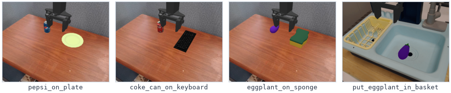
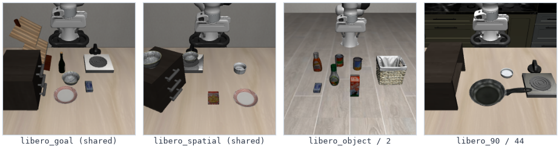
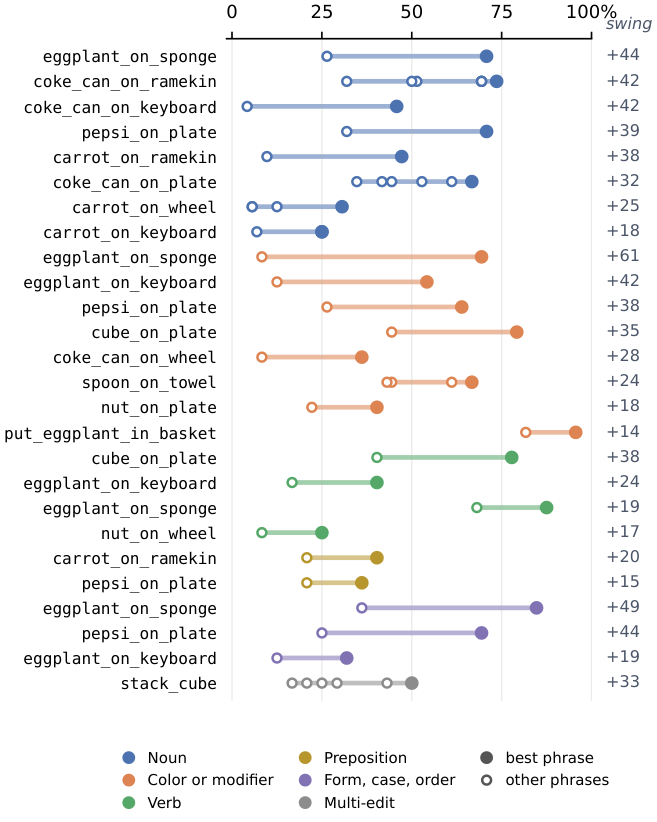
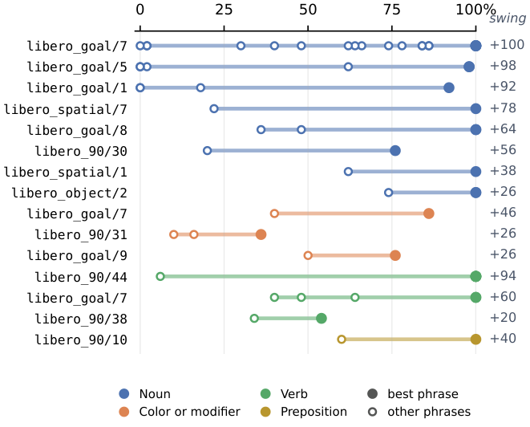
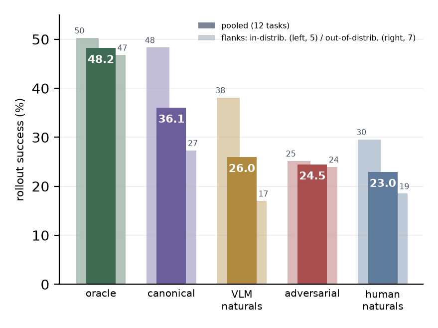
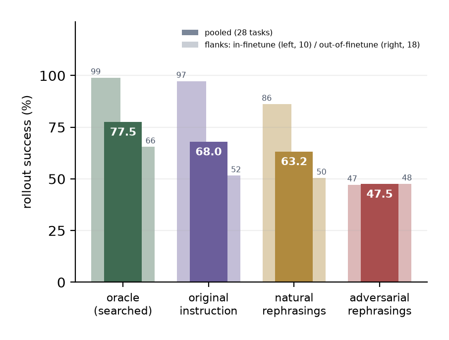
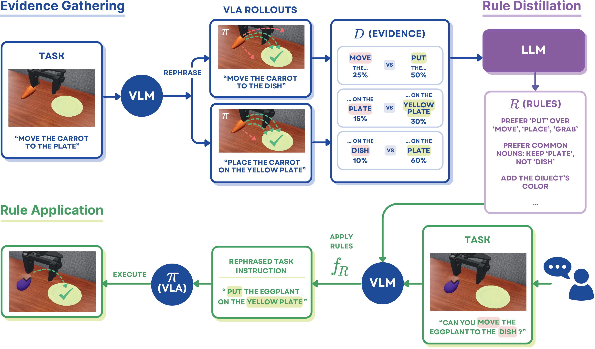
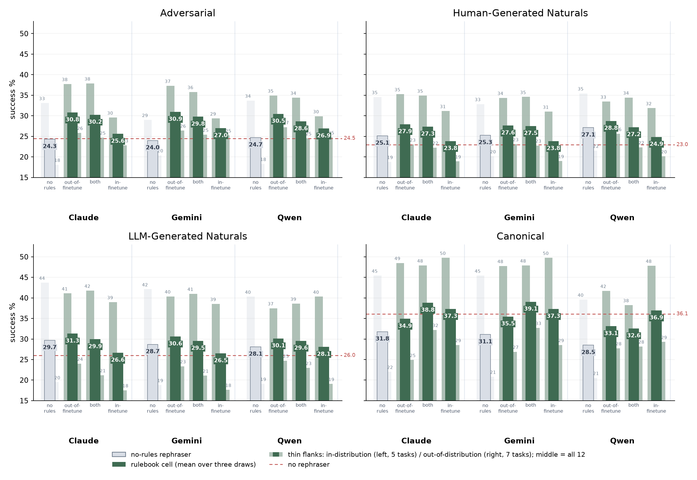

# Rephrase Before You Act：VLA 换词就失灵，规则改写救场

Vision-Language-Action 模型（VLA）被认为能继承 Vision-Language Model（VLM）的语言鲁棒性，但事实是：同一个指令换个说法，机器人成功率可以差出几十个百分点。这篇论文先用统计检验把"语言敏感性"量化清楚，再提出一个不动模型权重的解法——让 LLM 从真实 rollout 证据中蒸馏出十几条改写规则，部署时把用户指令"翻译"成 VLA 听得懂的说法。在 12 个从未见过的任务上，这套规则让冻结的 $\pi_0$ 相对提升 16%–27%；在 LIBERO 上复现后，$\pi_{0.5}$ 的 in-finetune 成功率从 93.6% 升至 97.8%。全程无需重训练、无需逐步验证。

## 问题：VLA 并没有继承 VLM 的语言鲁棒性

通用机器人的终极形态，是让普通用户"用自己的话"指挥它。VLA 把 VLM 扩展到机器人控制，大家自然期待它继承 VLM 对措辞的鲁棒性——这个期待落空了。

论文举了几个触目惊心的例子：

- 对 $\pi_{0.5}$ 说 **"switch on the stove"** ，成功率 100%；换成 **"switch on the hot plate"** ，成功率跌到 2%。
- 在 SIMPLER 任务上对 $\pi_0$ 说 **"purple eggplant goes on the sponge"** ，成功率 69%；仅仅删掉颜色词 "purple"，成功率跌到 8%。

有人会说：训练时做措辞增强（rephrase augmentation）不就行了？论文研究的这个 $\pi_0$ checkpoint 恰恰就是用措辞增强微调过的，它在自然措辞上确实有约 20% 的相对提升，但上面那些"翻车"依然存在。也就是说， **训练侧的标准解法治标之后，仍有残余的敏感性没人管** 。

那部署侧的现有方法呢？两条路都走不通：

- **Test-time verification** （如 CoVer、RoboMonkey）：每一步推理都要在多个"措辞-动作"候选中选最优，推理成本成倍增加，且在本文设置下并不比原策略好。
- **Instruction optimization** （如 SARL、VLA Grounder）：需要和每个任务在线交互来优化措辞，学到的东西无法迁移到没见过的任务。

本文的目标因此非常明确： **不动策略权重、每个 episode 只干预一次、且能 zero-shot 迁移到未见任务** 。前人的方法没有一个同时满足这三条。

## 刻画敏感性：换个词，成功率天差地别

在动手解决之前，作者先把问题"量化"了。这一步很有必要：如果不先搞清楚敏感性的形态，就无法判断哪种缓解手段有效。

### 形式化定义

冻结策略 $\pi$ 把观测和指令 $\ell$ 映射为动作。对任务 $t$，记 $S_t(\ell)$ 为指令 $\ell$ 下的成功率，$\ell_t$ 为基准指令（canonical instruction），$L_t$ 为保持语义不变的所有合法改写集合。论文定义了两个核心量：

- **单次编辑摇摆（single-edit swing）** ：$\ell$ 与 $\ell'$ 只差一次编辑（一个词），但成功率差异统计显著。
- **Oracle 余量（oracle headroom）** ：$\max_{\ell \in L_t} S_t(\ell) - S_t(\ell_t)$，即纯靠措辞能拿到的最大提升。

寻找 swing 的流程是：LLM 从证据集中提出候选短语对，每对短语在仿真里大量 rollout（$\pi_0$ 每短语 72 次，$\pi_{0.5}$ 每短语 50 次），只保留双比例 z 检验 $p < 0.05$ 的集合（$\pi_{0.5}$ 还要求差距至少 18 个百分点）。LIBERO 场景里有多个同类物体，作者还人工剔除了差距可能来自"场景歧义"而非措辞本身的集合。

> 图解：SIMPLER Bridge 基准的代表性首帧场景。桌面任务共用同一套布置，只有源物体和目标物体不同；最右是基准自带的水槽场景。这些场景里物体的初始化布局是固定的（episode 0–23），保证不同措辞面对的是完全相同的物理条件。

> 图解：LIBERO 基准的代表性首帧场景。libero_spatial 与 libero_goal 每个套件共用场景，libero_object 在篮子旁摆放杂物，libero_90 的场景随任务变化。相比 Bridge 的"干净"桌面，LIBERO 场景中常有多个同类物体，这也是作者要剔除场景歧义集合的原因。

### 摇摆的规律：有规律，但不完全可迁移

> 图解：$\pi_0$ 在 SIMPLER Bridge 上的 26 组显著单次编辑摇摆（覆盖 16 个任务）。每一行是一组只差一个词的短语，圆点是 $n=72$ 次 rollout 的成功率，实心点为该组最优措辞，右列为摇摆幅度（百分点）。所有集合均满足 $p < 0.05$。

> 图解：$\pi_{0.5}$ 在 LIBERO 上的 15 组显著摇摆（覆盖 13 个任务，每短语 $n=50$），另有 8 组因场景歧义被剔除。最大摇摆达 100 个百分点——"fire up the stove" 成功率 100%，"turn on the stove" 只有 6%。

从这些数据里，作者总结出几条很有意思的规律：

- **有些规则跨任务、甚至跨模型成立** ：把 plate 换成 dish，$\pi_0$ 掉 19 个百分点，$\pi_{0.5}$ 掉 56 个；"hot plate" 这个词到哪都失败，作源物体 2%、作目标物体 0%。
- **有些规律互相矛盾** ：给茄子加 "purple" 在一个任务上 +61 个百分点，在另一个任务上 −30 个。静态规则不可能同时满足两者，这说明规则必须来自证据而非拍脑袋。
- **敏感性集中在 in-finetune 任务上** ：$\pi_{0.5}$ 的 426 个候选对中，in-finetune 任务有 44% 出现显著摇摆，out-of-finetune 只有 5%。这暗示微调后的性能建立在"背下来的措辞"上，一个词就能打破。
- **"朴素命名"是金标准** ：泛化类别词（can、dish、thing）普遍不如具体的日常名字，哪怕这个名字训练集里根本没有——pepsi 比 soda 高 39 个百分点。甚至把 Pepsi 改成小写 pepsi 都能 +44 个百分点，说明敏感性已经深入 token 层面。

## Oracle 搜索：所谓泛化差距，多半是措辞差距

摇摆实验告诉我们"措辞影响大"，但到底能大到什么程度？作者做了一个 oracle phrase search：让 VLM 分三轮为每个任务生成改写（每轮 16 个，后续轮次能看到已打分的结果），在留出布局上选出最优短语，再在全部布局上重新测量。这相当于估计"如果有个措辞之神帮你说话，冻结策略还能榨出多少性能"。

> 图解：措辞增强版 $\pi_0$ 在 12 个 sealed Bridge 任务上、按措辞条件划分的成功率（24 个固定布局）。实心柱为全部任务汇总，两侧细柱分别为 in-distribution（左，5 个任务）和 out-of-distribution（右，7 个任务）分层。Oracle 措辞把两个分层之间 21 个百分点的差距压缩到了 3 个百分点。

> 图解：$\pi_{0.5}$ 在 LIBERO 上按措辞条件的成功率（每短语 50 个布局）。实心柱汇总全部 28 个任务，细柱为 in-finetune（左，10 个）与 out-of-finetune（右，18 个）两半。In-finetune 上对抗性措辞代价高达 50 个百分点（97→47）；out-of-finetune 上 canonical / natural / adversarial 三档几乎无差别（52 / 50 / 48）。Oracle 搜索在两种情形下都找到了余量（99 / 66）。

两个发现奠定了全文基调：

1. **Oracle 措辞几乎抹平了 in-distribution 与 out-of-distribution 之间 21 个百分点的差距** （缩小到 3 个点）。也就是说，所谓"泛化差距"的很大一部分根本不是任务本身难，而是措辞不对。
2. 对抗性措辞在 $\pi_{0.5}$ 的 in-finetune 任务上造成 50 个百分点的损失，在 out-of-finetune 任务上却几乎无损——进一步佐证了"模型只在训练教过它的地方才真正读指令"。

笔者认为，这两张图是全文最有洞察力的部分：它把"模型泛化能力差"这个笼统的抱怨，精确定位成了"模型语言接口脆弱"这个可操作的问题。问题一旦被这样定位，解法就呼之欲出了。

## 方法：三段式规则蒸馏管线

既然敏感性是系统性的（有跨任务规律），那它就可以被显式规则捕获。方法分三步，全部不动 VLA 权重。

> 图解：方法总览。 **证据收集** （左）：VLM 为每个训练任务生成多种改写，冻结 VLA 对每种改写的 rollout 成功率构成证据集 $\mathcal{D}$。 **规则蒸馏** （中）：LLM 把 $\mathcal{D}$ 一次性、离线地蒸馏成 10–20 条显式措辞规则 $R$。 **规则应用** （右）：部署时，以 $R$ 为条件的 VLM 把每条新指令改写一次（$f_R$），再交给完全不变的 VLA 执行。图中措辞、分数与规则仅为示意。

### 第一步：证据收集

规则要从证据里长出来。证据任务包括 8 个可仿真的 Bridge 任务（sealed 集之外）和 208 个不可仿真但有真机专家轨迹的任务（来自 BridgeData V2）。对每个任务，gemini-pro-latest 生成 7 个自然改写（像人正常说话那样）和 2 个对抗改写（刻意绕弯、过度复杂），再加上 oracle 搜索阶段测过的所有短语，共 5,453 个"任务-短语"打分对。

可仿真任务直接跑 rollout 算成功率（18 个布局 × 2 次重复）。不可仿真任务用代理分数：VLA 预测动作与专家真值动作在夹爪维度上的平均绝对误差（16 条轨迹 × 4 帧 × 4 次解码采样，共 64 个测量/短语）。这个代理指标与 rollout 成功率的任务内 Pearson 相关系数为 $r = 0.54$——不算完美，但够用。

### 第二步：规则蒸馏

LLM（Claude）从证据中一次性蒸馏出 10–20 条自然语言规则。按看到的证据不同，规则书分三类：in-finetune、out-of-finetune、both。蒸馏是随机的，每类独立蒸馏 3 次取平均。

规则长什么样？举两条原文例子：

- "'coke' stays 'coke', never 'cola', 'soda', or bare 'can'"（专有名词不许泛化）
- "'onto' becomes 'on', 'into' becomes 'in'"（介词替换）

蒸馏过程本身是个多智能体面板：3 个不同视角的蒸馏器 + 1 个对抗评论者 + 1 个综合者，跑一遍不迭代。这个设计的聪明之处在于：它要求规则 **必须在所有任务上同时成立** ，而不是针对单个任务的最优——这正是与 per-task instruction optimization 的本质区别。

### 第三步：规则应用

部署时，改写器（applier）在机器人动之前、每个 episode 只对指令改写一次。applier 有三个候选：Claude、Gemini、开源的 Qwen3.5-9B。applier 拿到三样东西：原始指令、规则书 $R$、以及由 Gemini 3.5 Flash 从"指令 + 场景图像"生成的推理 trace（applier 自己不直接看图）。

开销方面：每条指令在机器人动之前只有两次模型调用——trace 生成约 2.5 秒，规则应用 Claude 约 10 秒、Gemini 约 17 秒、本地 Qwen 仅 1–2 秒。改写算一次，所有布局和重复都复用。相比 test-time verification 每步都要多次推理，这个成本几乎可以忽略。

## 实验：冻结模型上的真实收益

评估设置在 12 个 **sealed** Bridge 任务上——这些任务在任何证据收集开始之前就已封存，只来自非 sealed 任务的证据才进入蒸馏。24 个固定布局对所有实验臂共享，配对检验用符号翻转置换检验（sign-flip permutation test），以"基准指令"为配对单位，场景难度在配对内抵消。

### 短语集与基线

四类短语集：

- **对抗改写** ：6 条/任务，共 72 条；
- **VLM 自然改写** ：约 16 条/任务，共 186 条；
- **人类自然改写** ：约 30 条/任务，共 363 条——来自 37 位 11–85 岁、AI 熟悉程度各异的受访者，看完任务演示视频后分别向 8 岁小孩、成年人和机器人"发出请求"，原样保留（含错别字）；
- **Canonical 指令** ：每任务 1 条（样本量太小，统计功效不足，需谨慎解读）。

三个基线：no-rephraser（原样送指令）、no-rules rephraser（同一 applier 但只给一条通用规则，用于隔离"蒸馏规则"本身的贡献）、CoVer（每步从 8 个改写 × 5 个动作共 40 个候选中选最优）。

### 主结果：out-of-finetune 规则书稳定最强

> 图解：措辞增强版 $\pi_0$ 在 12 个 sealed SIMPLER 任务上的成功率，每个短语集一个面板、每个 applier 一组柱。红色虚线为 no-rephraser 基线；灰色为 no-rules rephraser；绿色系为三种规则书（out-of-finetune / both / in-finetune，各为 3 次蒸馏的均值）；细柱为 in-distribution（左）与 out-of-distribution（右）分层。除 canonical 面板外，out-of-finetune 规则书在所有集合上最强，且收益集中在 out-of-distribution 任务上。

Out-of-finetune 规则书相对 no-rephraser 基线的提升（平均配对差值占基线成功率的百分比）：

| Applier | Adversarial (n=72) | Human-Generated (n=363) | VLM-Generated (n=186) |
| --- | --- | --- | --- |
| Claude | +26.0% (p=0.0083) | +21.7% (p<0.0001) | +20.5% (p<0.0001) |
| Gemini | +26.5% (p=0.0074) | +20.3% (p<0.0001) | +17.8% (p<0.0001) |
| Qwen | +24.4% (p=0.0112) | +25.2% (p<0.0001) | +16.1% (p=0.0001) |

> 表解：三类 applier（含 9B 开源小模型）在三类短语集上全部显著为正，提升 16%–27% 相对值。效果对 applier 选择和独立蒸馏都稳定（同类规则书 3 次蒸馏的汇总成功率波动中位数仅 3.0 个百分点）。

更有说服力的是与 no-rules rephraser 的对比——它把"改写"这个动作本身的好处扣掉，只留下"蒸馏规则"的纯贡献：

| Applier | Adversarial (n=72) | Human-Generated (n=363) | VLM-Generated (n=186) |
| --- | --- | --- | --- |
| Claude | +26.6% (p=0.0001) | +11.2% (p<0.0001) | +4.7% (p=0.0924) |
| Gemini | +29.1% (p=0.0001) | +9.3% (p=0.0001) | +6.7% (p=0.0167) |
| Qwen | +23.1% (p=0.0001) | +6.0% (p=0.0201) | +7.3% (p=0.0271) |

> 表解：即使和"也做了改写、但没有证据规则"的版本比，蒸馏规则仍带来最高约 +29% 的额外收益，在措辞越糟糕的对抗集上收益越大——规则在真正"修"措辞，而不是简单地换一种说法。

### 与 CoVer 对比：逐步验证不如一次改写

| 短语集 | no rephraser | no-rules rephraser | CoVer |
| --- | --- | --- | --- |
| Adversarial | 24.5 | 24.3 | 21.6 |
| VLM-Generated Naturals | 26.0 | 28.8 | 22.8 |
| Canonical | 36.1 | 30.5 | 26.4 |

> 表解：sealed 任务上第 60 步的汇总成功率（%），所有实验臂使用完全相同的 Gemini 推理 trace。CoVer 在每个集合上都落后于两个基线——在这个设置里，每步花 40 倍推理成本做验证，还不如什么都不做。作者也确认过：禁用 verifier 可复现 CoVer 的已发表基线，改用 CoVer 的原生指标（episode 内首次成功）审计后结论不变。

### LIBERO 复现：收益来自"有证据的修复"

在 $\pi_{0.5}$ + LIBERO 上，作者用预注册的 sealed 集（20 个任务，in/out-of-finetune 各 10 个）、每任务 10 条 VLM 自然改写、仅来自非 sealed 单次编辑对的证据、Gemini applier，复现了整条管线（$n=200$ 基准，每臂 50 布局）。

结果：3 本独立蒸馏的规则书把 in-finetune 成功率从 93.6% 提升到 97.8%（$p \le 0.005$），out-of-finetune 无显著变化（$p > 0.4$）。no-rules rephraser 在 in-finetune 上毫无收益（out-of-finetune 上 +1.6 点，$p=0.006$），再次说明收益来自规则本身。

收益构成非常透明，就是一条条"有证据的修复"：

- 把 hot plate / hotplate / burner 改写成 stove：约 9 条测试短语上 +45 个百分点；
- 把 dish 改写成 plate：+24 个百分点；
- 把 onto 改成 on、into 改成 in：约 50 条短语上 +2.5 个百分点；
- 把 grab / lift 改成 pick up（3 本规则书中的 2 本）：约 15 条短语上 +2.4 个百分点。

还有一个耐人寻味的失败对照：要求"每条规则必须在所有任务上严格成立"的 prompt，产出的规则书几乎不改写、零收益；而要求"规则平均上有帮助"才产出了上述规则书。笔者认为这揭示了一个微妙的平衡——规则的普适性要求太死，蒸馏器就什么都不敢说。

## 总结与展望

- **VLA 的语言敏感性是系统性的** ：单词编辑可造成最高 61 个百分点的成功率摇摆，"fire up the stove" 与 "turn on the stove" 之间差 94 个百分点。
- **所谓泛化差距多半是措辞差距** ：oracle 措辞把 $\pi_0$ 上 in/out-of-distribution 之间 21 个点的差距缩到 3 个点。
- **证据蒸馏的规则可以 zero-shot 迁移** ：8 个任务蒸馏出的 10–20 条规则，让 12 个封存任务上的冻结 $\pi_0$ 提升 16%–27%，三个 applier、三次独立蒸馏下都稳定。
- **一次改写胜过逐步验证** ：相比 CoVer 每步 40 个候选的验证开销，每 episode 一次的规则改写成本更低、效果更好。
- **管线可复现** ：在 $\pi_{0.5}$ + LIBERO 上，in-finetune 成功率从 93.6% 升至 97.8%，收益可逐条归因到具体规则。

局限与方向：方法目前只在仿真、两个 VLA 上验证，真机是自然的下一步；in-finetune 规则书表现偏弱可能与代理分数质量有关；而从更多任务蒸馏、乃至把措辞问题形式化为强化学习问题，都留待未来。最重要的开放问题是：把这种敏感性 **归因** 到模型机制层面——为什么 VLA 会丢掉 VLM 的语言鲁棒性？这可能是这条研究线最有价值的终点。

> 本文参考自 [Rephrase Before You Act: Characterizing and Mitigating Language Sensitivity in Vision-Language-Action Models](http://arxiv.org/abs/2610.10526v1)