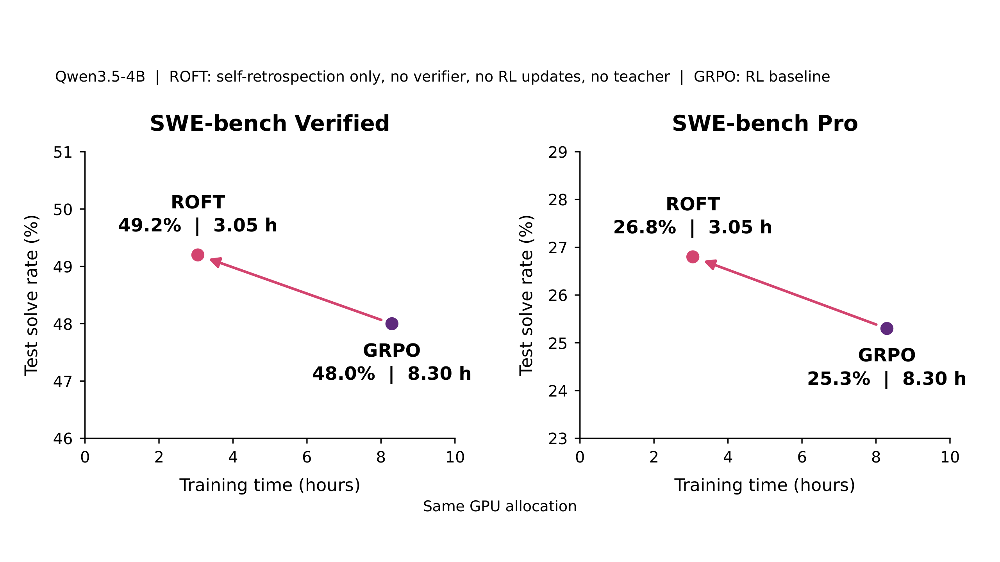

# 只训练"复盘"，不训练"动作"：不用 RL 也能让软件工程 Agent 变强

训练 Agent 一定要靠 RL 给动作打分吗？这篇论文提出了一个反直觉的答案：让模型对自己的尝试写"复盘"（retrospection），然后 **只在复盘文本上做 SFT** ，完全不监督任何动作、不用 reward、不用外部 teacher。这个极简方法叫 ROFT（Retrospection-Only Fine-Tuning）。结果相当硬：在 SWE-bench Verified 上，ROFT 只用 20 次更新就达到 49.2% 的 solve rate，超过了 GRPO 跑 40 次更新的 48.0%，而训练时间约为后者的六分之一；更夸张的是，它还能在 64 次采样全败的"不可能任务"上从零学会解题。

## 为什么需要新的训练信号？

目前训练 Agent 的主流路线是 RLVR（Reinforcement Learning with Verifiable Rewards，可验证奖励的强化学习），代表作是 GRPO：对同一任务采样一组尝试，用组内相对 reward 来更新策略。

这条路有个根本性短板： **一个二值 outcome reward 说不清"哪一步错了"** 。成功/失败只告诉你结果，不告诉你哪个假设是错的、哪个决策是关键、教训在什么场景下适用。在 reward 稀疏的长程任务里这个问题尤其致命——如果一组采样全部失败，组内没有任何对比信号，GRPO 的优势直接为零，这次采样等于白跑。

人类的经验恰好相反：我们不光靠"重复成功动作"来学习，更靠 **复盘** ——回头解释自己当时为什么那么做、错在哪、下次遇到类似信号该怎么办。作者在引言里举了个很生活化的例子：一个人复盘一场糟糕的谈话，起初以为是自己"没把观点讲清楚"，但重建对话过程后才发现，真正的问题是他一直在辩护方案，而对方其实在质疑前提。结局没变，变的是对经历的理解——而改变行为的是理解。

于是论文的核心问题被浓缩成一句话：

> **Agent 能否只通过训练自己生成的、对自身经历的回顾性解释，来改进未来的动作？**

这个研究方向被命名为 **Retrospection Reinforcement (RR)** ：学"解释"，用"做事"来考核。

## ROFT：一个刻意极简的训练循环

为了干净地验证"解释→行动"的迁移，作者设计了 ROFT，循环只有四步：

1. **收集经验** ：Agent 尝试任务 $x$，产生交互轨迹 $\tau$ 并收到反馈 $v$（动作、观察、提交的 patch、测试反馈）。成功和失败的尝试都算数——方法不需要一个"可供模仿的成功样本"。
2. **解释经验** ：同一个模型基于上下文 $h(x, \tau, v)$ 采样 $K$ 条复盘。默认 prompt 要求写一段短文字：指出一个有后果的假设或决策、支持或反驳它的证据、必要时的修正方案、以及未来应用这条教训的具体触发条件。
3. **只拟合解释，不拟合尝试** ：对复盘 token 做 next-token 交叉熵训练。任务、动作、观察、反馈全部作为 context 被 mask 掉，不产生任何 loss。
4. **用更新后的权重继续行动** ：后续尝试（包括评测） **拿不到** 保存的复盘文本，也没有额外的反思步骤。任何收益都必须通过权重本身迁移。

训练目标就是最普通的 SFT loss：

$$
\mathcal{L}_{\mathrm{ROFT}}(\theta; \mathcal{D}_t) = -\frac{1}{T_t} \sum_{(h,y) \in \mathcal{D}_t} \sum_{j=1}^{|y|} \log \pi_\theta(y_j \mid h, y_{<j}), \qquad T_t = \sum_{(h,y) \in \mathcal{D}_t} |y|
$$

这里 $\mathcal{D}_t$ 是第 $t$ 次更新保留的"上下文–复盘"对，$y$ 是复盘文本。注意它没有什么花活：没有动作目标 loss、没有 reward 加权、没有对复盘质量的语义过滤、没有 KL 惩罚。

> 博主点评：这个设计的聪明之处在于"排除法"式的实验洁癖。它故意排除了直接动作监督、排除推理时可见的复盘文本、排除外部 teacher，这样只要后续行为变好了，功劳只能记在"用解释做训练目标"这一条上。简洁不是工程妥协，而是科学设计。

论文给了一个复盘的实际例子：一次 **通过的** 尝试中，Agent 修复了一个 context manager 在异常退出时不清空交互状态的问题。复盘提炼出的教训是："正确的决策是在 `__exit__` 检测到异常时直接清空交互，确保无论 `verify()` 是否被调用，状态都能正确重置。"——注意，即使成功了，复盘依然能沉淀出一条关于具体决策的可复用经验。

## 实验设置

- **基座模型** ：Qwen3.5-4B（另有 9B 验证）。
- **训练集** ：SWE-rebench-767，从 SWE-rebench 中筛出的 767 个任务，特意只保留 base model 三次采样中既有成功又有失败的题目——这是 **故意偏袒 GRPO** 的选法，因为 GRPO 的组内相对优势必须有 reward 差异。
- **评测集** ：SWE-bench Verified（500 题，人工验证）和 SWE-bench Pro（更复杂的长程任务）。Qwen3.5-4B 基线为 44.2% / 23.9%。
- **训练配置** ：每次更新用 64 个源尝试、每个尝试采样 4 条复盘（共约 256 个目标），AdamW、恒定学习率 $10^{-6}$，8 张 B200（4 训练 + 4 推理）。

## 结果一：学习区内，更快也更好

> 图解：ROFT 与 GRPO 在 agentic coding 任务上的 held-out 表现对比。横轴为训练进度，纵轴为 SWE-bench Verified solve rate。ROFT（红色系）在早期就快速爬升并在约 20 次更新后饱和；GRPO（对比曲线）需要更多更新才追上，且更长时间训练后反而回落。ROFT 以少 63% 的训练时间达到了有竞争力的性能。

几个关键数字：

| 方法 | 更新次数 | SWE-bench Verified | SWE-bench Pro |
|---|---|---|---|
| Qwen3.5-4B 基线 | — | 44.2% | 23.9% |
| GRPO | 40 | 48.0% | 25.3% |
| ROFT | 20 | **49.2%** | **29.0%** |

训练效率的差距更大：同样 40 次更新，ROFT 用 4.32 小时、6,035 次尝试，GRPO 用 8.30 小时、11,576 次尝试——大约一半的时间和一半的采样量。更直观地说，ROFT 在第 10 次更新、仅 1.29 小时时就达到 49.0%，超过了 GRPO 用 8.30 小时跑 40 次更新才拿到的 48.0%， **约六分之一的训练时间拿到更高的分数** 。

另一个耐人寻味的现象：GRPO 的训练 reward 随训练持续上升，但 Verified solve rate 从第 40 次更新的 48.0% 跌到第 90 次更新的 46.0%——典型的对训练任务过拟合。ROFT 的曲线则在 20 次更新左右提前饱和。作者的假设是：随着训练反复重访相似任务，复盘变得越来越重复，新监督信号自然减少（复盘熵和 SFT loss 同步下降也佐证了这一点）。

> 博主点评：这个"早饱和"乍看是缺点，换个角度却是特性——它意味着 ROFT 把可学的经验快速榨干后就停了，而不是像 RL 那样为了继续推高 reward 把模型往训练集的怪癖上推。

与更多基线对比（均从 Qwen3.5-4B 出发）：ERL 45.6%、CFT 46.0%、SCFT 46.8%、SSD 47.0%、GRPO 48.0%，ROFT 以 49.2% 居首。而且 ROFT 与 GRPO 并不互斥——给每条 GRPO rollout 追加一步复盘、两个目标一起训，能达到 50.4%，超过两者各自的成绩。

## 结果二：越过能力边界，从全败中学会解题

解决了"学得更快"之后，下一个问题更尖锐： **当 base model 一次都解不出来时，学习还能启动吗？** 对 GRPO 来说答案是不能——全败组没有任何相对优势；对 ROFT 来说，失败的尝试照样能产出复盘。

作者在单个任务上做了极限实验：选取 base model 64 次采样全败的任务（如 SWE-bench Verified 的 SymPy 20916、SWE-rebench 的 SymbiFlow 17），只用自生成的复盘训练。40 次更新后，在线 solve rate 在 SymPy 上达到 1.75%、SymbiFlow 上达到 3.29%（延长到 60 次更新后达 4.49%）；另一起点为 2/64 的 Pylint 任务则从低基数一路爬到 12.0%（100 次更新后达 15.86%）。

数字不大，但意义不小：这证明 **学习可以在没有任何成功轨迹、没有任何 reward 对比的情况下冷启动** 。同时，单任务训练并没有显著拉低整体测试集表现。

## 结果三：行为分析——复盘到底改变了什么？

### 隐式的信用分配

只训练复盘，模型凭什么知道哪个动作是好的？作者用 GPT-6 Astra 把 base model 轨迹里的 14,200 个 assistant turn 标注为正确/错误/混合/不确定，然后比较训练前后每个 turn 的平均 token 对数似然变化。

结果是：训练 10 次更新后，RR 下 **正确 turn 的似然提升比例为 32.41%，错误 turn 仅为 21.21%** （差距 11.2 个百分点）；而 GRPO 下两者几乎无差别（44.14% vs 45.30%，差距 -1.2 个百分点）。也就是说，尽管没有任何动作级监督，复盘训练间接地、有选择地"奖好罚坏"——这正是 RL 里的信用分配（credit assignment），只不过通过语言解释绕了个弯实现。

### 改变复盘内容，就能改变行为

把复盘 prompt 换成"成功后反思怎样更直接地解题、失败后指出错误假设并给出修正"，其他一切不变。结果后续 rollout 的 token 数减少 11.7%、turn 数减少 13.1%—— **没有任何长度惩罚，仅靠改变复盘强调的内容就诱导出了更短的行为** 。这说明复盘不只是经历的记录，而是一个可以操控的监督源。

### 改变发生在哪？怎么加权更好？

单步更新的细粒度 KL 分析发现，变化最集中的是 **推理 token** （平均 forward KL 是工具调用参数的 3.45 倍）、 **读/搜索类工具** （Glob/Read 的 KL 是 Write/Edit 的 1.35–1.89 倍）、以及 **rollout 的前段** （第一个 decile 的 KL 最大）。这符合直觉：复盘主要重塑的是"怎么想、去哪找信息"，而不是直接改写具体编辑动作。

对复盘 token 做加权实验（64 个训练题、每模型 640 次评测尝试）：给"证据""修正"token 加倍权重，或按 token 对轨迹 prompt 的注意力质量加权，效果最好——Attention-up 54.69%、Correction-up 54.38%、Evidence-up 54.22%，均显著高于均匀加权的 50.63%。换句话说， **与具体经验证据锚定更紧的复盘 token，是监督价值最高的部分** 。

机制上，作者的解释是：预测复盘 token 时，梯度会通过 attention 回传到记录中动作与观察的表征上，从而更新共享参数——动作 token 本身没有 loss，但它们的表征被"解释"反向塑造了。

## 结果四：消融实验

- **verdict 可有可无** ：给不给最终的 pass/fail 判定，20 次更新后都是 49.2%。轨迹里 Agent 自己跑测试得到的观察已经够用了。
- **online 最重要** ：在线 RR（学习者自己不断生成新尝试和新复盘）49.2% > 完全离线 48.0% > 冻结复盘生成器的 off-policy 47.4%。让"做事的"和"复盘的"保持同步进化是有收益的。
- **每个 rollout 4 条复盘最优** ：2、4、8 条分别对应 47.8%、49.0%、46.2%，太少则源轨迹多样性占优但解释单一，太多则反之。
- **规模可扩展** ：Qwen3.5-9B 上，ROFT 20 次更新达 58.8%，GRPO 为 55.8%；训练时间 1.93 小时 vs 5.33 小时，优势依旧。

## 局限与成本

作者的态度相当克制：所有实验集中在软件工程任务和 Qwen3.5 系列上；一次 40 次更新的 GRPO 训练约需 500 美元 GPU 费用、一次 SWE-bench Pro 评测约 200 美元，这限制了实验广度。ROFT 被选中是因为简单而非最优；单跑一次的训练曲线对比也不能排除方差。复盘本身可能强化错误解释——行为标注也来自模型判断而非人工审计。

## 结语

- 论文提出 **Retrospection Reinforcement (RR)** ：训练目标是"解释自己的经历"，考核标准是"之后做得更好"。
- 极简实现 **ROFT** 只对自生成复盘 token 做 SFT，不用 reward、不用 teacher、推理时不携带复盘文本。
- 在 SWE-bench Verified/Pro 上以约 1/6 的训练时间超过 GRPO（49.2% vs 48.0%，且 Pro 上领先 3.7 个百分点）。
- 能在 64 次采样全败的任务上从零启动学习，突破了二值 reward 的先天盲区。
- 行为分析显示复盘训练实现了隐式信用分配，且复盘内容可定向操控后续行为（如更短的 rollout）。

这项工作打开的想象空间在于：对于长程 Agent，稀疏的最终结果几乎无法指导中间决策，而语言化的自我解释提供了一条不依赖标量 reward 的监督通道——下一个挑战是学会分辨哪些解释值得被内化，避免把"听起来合理但错了"的复盘也学进去。

> 本文参考自 [Shockingly Simple Self-retrospection Improves Agentic Models Without RL (Retrospection-Only Training for Software Engineering Agents)](http://arxiv.org/abs/2609.35741v1)