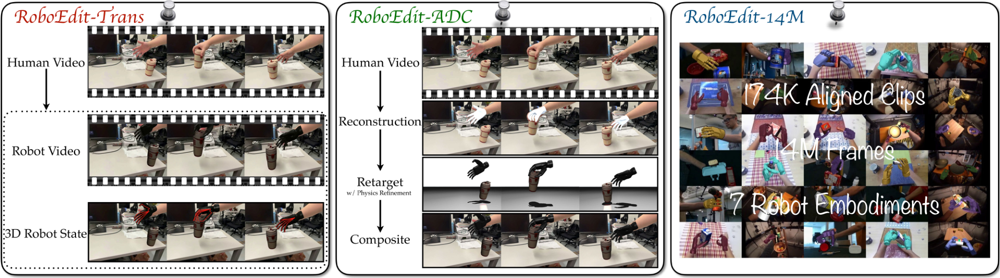
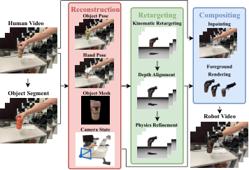
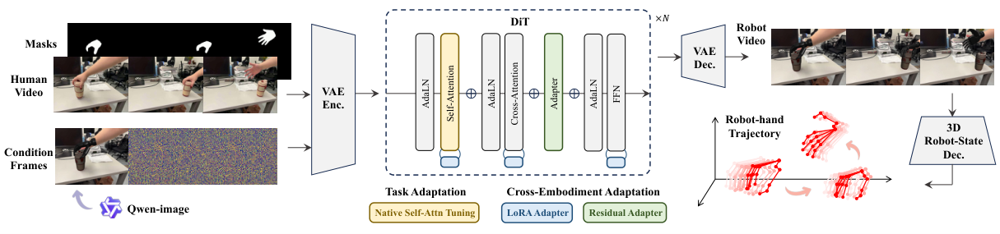
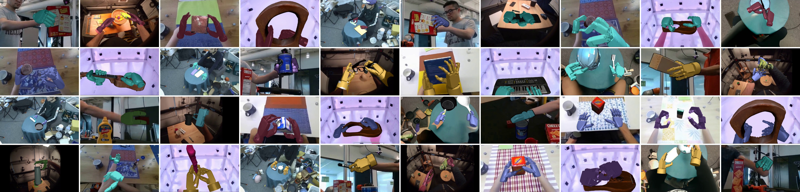
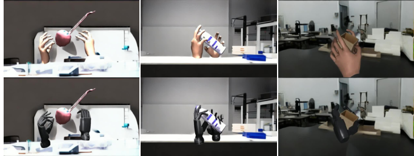
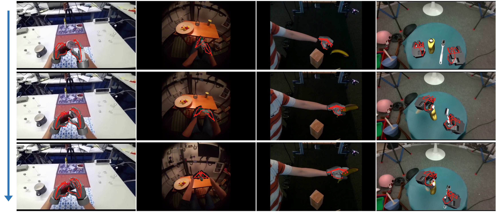
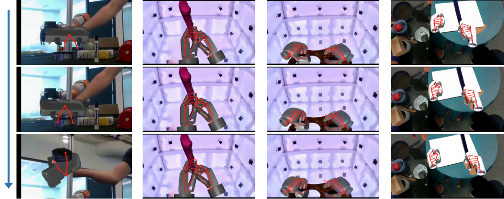
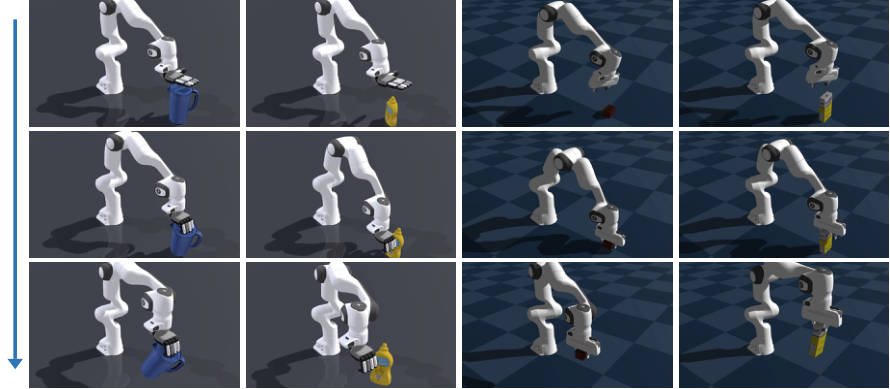
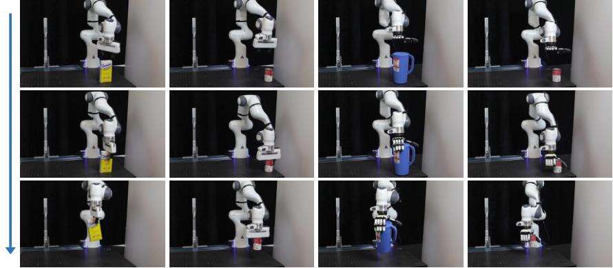
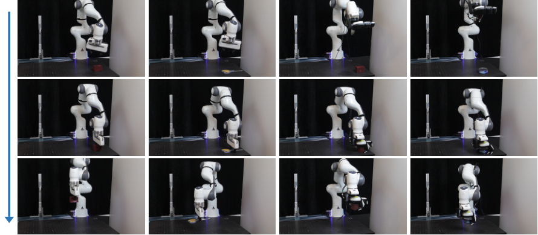

# RoboEdit 解读：把人类操作视频“一键变身”为可规模化训练的机器人经验

机器人学习越来越依赖视频作为监督信号，但采集机器人手-物交互数据既昂贵又强绑定具体机型；与此同时，互联网上人类操作物体的视频却海量存在，却因为“演员是人不是机器人”而无法直接使用。RoboEdit 这篇工作（UCLA、MIT、犹他大学联合出品）给出的答案非常直接：**把人类操作视频编辑成机器人操作视频**，同时恢复出逐帧的 3D 机器人手状态，让海量人类视频变成可规模化使用的机器人训练经验。

这篇文章的核心贡献可以概括为三个组件构成的完整套件：

- **RoboEdit-Trans**：机器人条件化的视频编辑模型，负责把人类视频编辑成目标机器人的交互视频；
- **RoboEdit-ADC**：自动化配对数据生产管线，从 RGB 视频重建 3D 交互并重定向到不同机器人本体；
- **RoboEdit-14M**：由此产出的超大规模配对数据集，包含 174K 对齐视频对（超过 1400 万帧），覆盖 7 种机器人本体。

> 图解：RoboEdit 框架总览。输入一段 RGB 人类操作视频和一个目标机器人，RoboEdit-Trans 生成物理上合理的机器人交互视频以及逐帧 3D 机器人手状态；这些状态可作为下游机器人控制的运动监督信号。下方的 RoboEdit-ADC 管线则负责自动化生产训练所需的大规模配对数据集 RoboEdit-14M。

## 一、问题定义：人类视频到机器人视频的“跨本体翻译”

先形式化一下问题。给定一段 RGB 人类手-物交互视频 $v^{h}_{1:T}$（$T$ 为帧数，$h$ 表示人类域）和目标机器人本体 $e$，RoboEdit 要合成同一场景下的机器人交互视频 $\hat{v}^{r,e}_{1:T}$（$r$ 表示机器人域），并预测对应的机器人手状态轨迹 $\hat{q}^{e}_{1:T}$。

为什么这件事难？因为跨本体翻译需要**同时**变换外观、运动学结构和运动动力学，同时还要保持交互语义（场景、相机运动、物体运动）不变。前人从人类视频中提取表征（R3M）、奖励函数（VIP）或 affordance 等间接监督，而直接把人类视频“翻译”成物理上合理的机器人视频，此前几乎无人做成。RoboEdit 的关键洞察是：**与其让生成模型从零生成机器人视频（容易破坏场景、产生物理不可信的运动），不如在观察到的人类视频基础上做“编辑”**——只换掉执行动作的本体，其余一切保留。

## 二、RoboEdit-ADC：自动化配对数据生产管线

训练视频编辑模型需要大量“人类视频 ↔ 机器人视频”的配对数据，而这种配对在现实中不存在。RoboEdit-ADC 的作用就是**从单目 RGB 视频全自动合成配对监督**，无需任何人工干预。

> 图解：RoboEdit-ADC 的三步流程。首先从 RGB 视频重建 3D 手-物交互与相机运动；然后经过深度正则化和物理引导的重定向，把人类手部动作迁移到目标机器人；最后把原视频中的人手和物体擦除（inpainting），并将渲染的机器人交互相合成回干净的背景中。

### 3D 交互重建

管线汇集了当前最强的单目重建工具链：

- **HaMeR** 估计关节化手部轨迹 $H_{1:T}$；
- **SAM 2** 分割被操作的物体，与手部掩码合并得到编辑掩码 $m_{1:T}$；
- **TRELLIS** 从物体裁剪图重建物体网格 $M_o$；
- **FoundationPose** 跟踪物体的 6D 位姿轨迹 $O_{1:T}$；
- **VGGT** 估计相机的内参、外参和深度图。

最终输出统一的手-物-相机表示：

$$
\mathcal{Z}_{1:T}=\left(H_{1:T},O_{1:T},M_o,m_{1:T},C_{1:T}\right)
$$

### 相机对齐与深度正则化（附录细节）

这里有两个容易踩坑的细节，附录给出了完整推导。

**相机对齐**：VGGT 重建的尺度和世界坐标系是任意的，需要用一个全局相似变换 $(s, R_a, t_a)$ 对齐到渲染坐标系。具体做法是对 VGGT 和渲染坐标系之间稀疏对应的相机中心做标准 SVD 闭式对齐，然后更新相机位置、朝向和深度图：$c'_t = s R_a c_t + t_a$，$R'_t = R_a R^{\mathrm{wc}}_t$，$\widetilde{D}_t = s D_t$。

**深度正则化**：单目 HaMeR 重建存在深度/尺度歧义——即使 2D 投影对齐，手在 3D 中也可能放错位置，导致接触缺失或穿透。作者的做法是：从 MANO 模型中取稳定的手腕和指根关键点作为手掌锚点集合 $\mathcal{A}$，把 HaMeR 相机空间位置 $H_{t,j}$ 投影到像素 $\mathbf{u}_{t,j}$，在对齐深度图的 $5 \times 5$ 邻域内取中位数深度 $d_{t,j}$，再反投影回米制 3D 锚点：

$$
p^{D}_{t,j} = d_{t,j} K_t^{-1} \bigl[u_{t,j}, v_{t,j}, 1\bigr]^{\top}
$$

对有效锚点集合分别取深度中位数 $\bar{z}_t^{D}$ 和 $\bar{z}_t^{H}$，得到缩放因子 $\alpha_t = \bar{z}_t^{D} / \bar{z}_t^{H}$，然后绕相机中心对整个手部重建做各向同性缩放 $\widetilde{H}_t = \alpha_t H_t$。这一步**只修正尺度和平移，不改变 MANO 的姿态、形状和相对关节角度**，因此在修正米制深度的同时保持了原有的图像投影一致性。

### 人类到机器人的重定向

有了 $\mathcal{Z}_{1:T}$ 和目标本体 $e$，重定向策略基于 SPIDER 改进：拟人灵巧手直接在 MuJoCo 中做手腕+指尖的 IK；形态差异大的两指/三指夹爪则用专门适配器——两指夹爪从手腕与拇食指几何推导夹爪位姿和张开度，三指夹爪估计手掌位姿并优化关节去贴合拇指、食指、中指指尖。由此得到初始运动学轨迹 $q^{e,\text{IK}}_{1:T}$。

但重建噪声和形态差异仍会导致穿透、悬空接触和关节抖动。作者引入**物理引导的精化（physics-guided refinement）**，优化目标为 $q^e_{1:T} = \arg\min \mathcal{L}_{\text{ret}}$，其中：

$$
\mathcal{L}_{\text{ret}} = \lambda_{\text{track}}\mathcal{L}_{\text{track}} + \lambda_{\text{geo}}\mathcal{L}_{\text{geo}} + \lambda_{\text{contact}}\mathcal{L}_{\text{contact}} + \lambda_{\text{temp}}\mathcal{L}_{\text{temp}}
$$

四个损失项的展开形式如下（记 $[x]_+ = \max(x, 0)$）：

$$
\begin{array}{l}
\mathcal{L}_{\mathrm{track}} = \sum_{t=1}^{T} \left\|q_t^e - q_t^{e,\mathrm{IK}}\right\|_2^2, \\[4pt]
\mathcal{L}_{\mathrm{geo}} = \sum_{t=1}^{T}\sum_{c\in\mathcal{P}_t} [-d_{t,c}]_+^2 + \beta_{\mathrm{geo}} \sum_{t=1}^{T}\sum_{u\in\mathcal{V}_t} [\delta - s_{t,u}]_+^2, \\[4pt]
\mathcal{L}_{\mathrm{contact}} = \sum_{t=1}^{T}\sum_{k\in\mathcal{C}_t} w_{t,k} \left\|p_k^e(q_t^e) - a_{t,k}\right\|_2^2, \\[4pt]
\mathcal{L}_{\mathrm{temp}} = \sum_{t=2}^{T} \left\|q_t^e - q_{t-1}^e\right\|_2^2
\end{array}
$$

各项含义：

- **跟踪损失** $\mathcal{L}_{\text{track}}$：保持对运动学参考的忠实度；
- **时序损失** $\mathcal{L}_{\text{temp}}$：抑制帧间抖动；
- **几何损失** $\mathcal{L}_{\text{geo}}$：第一项用 MuJoCo 简化碰撞几何检测粗穿透（$d_{t,c} < 0$ 表示穿透），第二项在机器人视觉网格上采样，惩罚细粒度穿透以及小于间隙阈值 $\delta = 0.005$ m 的贴面距离；
- **接触损失** $\mathcal{L}_{\text{contact}}$：保持有效接触。接触判定有一个精巧的滞回设计：指尖到物体表面距离 $\rho_{t,k} \leq \tau_k$（按本体在 2~6 cm 间选取）时接触激活，直到 $\rho_{t,k} > \tau_k + 0.01$ m 才退出，1 cm 的退出迟滞防止接触标签在阈值附近来回跳变；短于 10 帧的接触段直接丢弃。

### 机器人交互合成

最后三步合成配对视频：(1) 用 MiniMax-Remover 擦除编辑掩码内的人手和物体，得到干净背景 $b_{1:T}$；(2) 在相机 $C_t$ 下渲染机器人手和物体得到前景 $r_t$；(3) 把 $r_t$ 合成到 $b_t$ 上得到目标帧 $v^{r,e}_t$。这样源视频的背景、相机运动完全保留，只有手-物交互区域被替换为目标机器人。

## 三、RoboEdit-Trans：跨本体视频编辑模型

> 图解：RoboEdit-Trans 架构。模型基于 NovaEdit（Wan2.1-VACE-1.3B backbone），通过 LoRA 和残差 Adapter 做跨本体适配，输入掩码后的人类视频和稀疏的机器人关键帧条件，输出编辑后的机器人视频；3D Robot-State Decoder 从编辑视频中恢复逐帧 3D 机器人手状态。

### 模型概览与条件化

编辑器接收**掩码后的人类源视频**（提供场景、相机运动和物体动力学）和**稀疏的目标机器人条件帧**（指定目标本体和代表性的手-物构型）。记两者的隐空间表示为 $z^h$ 和 $z^{c,e}$，编辑器预测目标机器人隐表示 $\hat{z}^{r,e} = G_{\theta}(z^h, z^{c,e})$，用标准 flow matching 优化。推理时条件帧索引为 $\{0, 10, \ldots, 80\}$，由在 RoboEdit-14M 上微调过的 Qwen-Image-Edit 从人类帧生成。

### 跨本体适配模块

共享编辑器学习通用的人→机器人变换，而不同机器人在外观、形态、运动学和接触模式上的差异需要额外适配。作者引入两个互补模块——LoRA 适配时空表示以覆盖多样的机器人外观与运动，残差 bottleneck Adapter 精化本体特有的手部几何和交互模式：

$$
\begin{array}{l}
f_{\text{LoRA}}(x) = W_0 x + \frac{\alpha}{r} B A x, \\[4pt]
f_{\text{Ada}}(h) = h + W^{\text{Ada}}_2 \, \phi\!\left(W^{\text{Ada}}_1 \, \mathrm{LayerNorm}(h)\right)
\end{array}
$$

其中 $W_0$ 是冻结的预训练权重，$A$、$B$ 是可训练的秩 $r$ 矩阵，$\alpha$ 缩放 LoRA 更新量；$W^{\text{Ada}}_1$、$W^{\text{Ada}}_2$ 是 bottleneck 的降维和升维投影，$\phi$ 为非线性激活。两者结合让**一个共享编辑器适配所有目标本体**，同时保留原有的人→机器人编辑能力。

### 3D Robot-State Decoder（附录细节）

编辑视频本身不显式编码米制 3D 运动，所以需要一个解码器把 3D 状态“读”出来。这个模块的设计很工程化，值得细看：

- **共享骨干**：ResNet-34 特征金字塔提取局部和全局特征；
- **三个预测头**：手掌锚点头预测 8 个预定义 2D 手掌锚点的热力图和可见性；空间指尖热力图头定位至多 5 个指尖；MLP 状态头预测掌坐标系下的 3D 指尖坐标和归一化关节角；
- **相机头**：预测相机内参；
- **位姿恢复**：用 SQPnP 从预测的 2D 手掌锚点和预定义 3D 手掌几何恢复相机空间手腕位姿；
- **时序精化**：一个 temporal Transformer 在全部 81 帧上精化逐帧状态，最后经本体特定的前向运动学（FK）输出完整的相机空间机器人手轨迹。

训练目标分为三组（$a$、$s$、$t$ 分别表示锚点、空间、时序监督）：

$$
\begin{array}{l}
\mathcal{L}_{\mathrm{anchor}} = \lambda^{a}_{\mathrm{hm}}\mathcal{L}^{a}_{\mathrm{hm}} + \lambda^{a}_{\mathrm{uv}}\mathcal{L}^{a}_{\mathrm{uv}} + \lambda^{a}_{\mathrm{vis}}\mathcal{L}^{a}_{\mathrm{vis}}, \\[4pt]
\mathcal{L}_{\mathrm{spa}} = \lambda_{\mathrm{2D}}\mathcal{L}_{\mathrm{2D}} + \lambda^{s}_{\mathrm{palm}}\mathcal{L}_{\mathrm{palm}} + \lambda_{\mathrm{cam}}\mathcal{L}_{\mathrm{cam}} + \lambda^{s}_{\mathrm{qpos}}\mathcal{L}_{\mathrm{qpos}} + \lambda_{K}\mathcal{L}_{K}, \\[4pt]
\mathcal{L}_{\mathrm{tmp}} = \lambda^{t}_{\mathrm{palm}}\mathcal{L}_{\mathrm{palm}} + \lambda^{t}_{\mathrm{qpos}}\mathcal{L}_{\mathrm{qpos}} + \lambda_{\Delta\mathrm{palm}}\mathcal{L}_{\Delta\mathrm{palm}} + \lambda_{\Delta\mathrm{qpos}}\mathcal{L}_{\Delta\mathrm{qpos}} + \lambda_{\mathrm{res}}\mathcal{L}_{\mathrm{res}}
\end{array}
$$

各子项含义：锚点热力图用分布损失监督，锚点坐标和可见性分别用 Smooth-L1 和二元交叉熵；$\mathcal{L}_{\mathrm{2D}}$ 结合指尖热力图分布损失与 2D 坐标 Smooth-L1；$\mathcal{L}_{\mathrm{palm}}$、$\mathcal{L}_{\mathrm{cam}}$ 分别是掌坐标系和相机坐标系下 3D 指尖坐标的 Smooth-L1；$\mathcal{L}_{\mathrm{qpos}}$ 监督归一化关节状态；$\mathcal{L}_K$ 监督相机内参；$\mathcal{L}_{\Delta\mathrm{palm}}$、$\mathcal{L}_{\Delta\mathrm{qpos}}$ 匹配相邻帧的指尖和关节运动；$\mathcal{L}_{\mathrm{res}}$ 对时序修正量施加 L2 惩罚。不可见的指尖、关节和帧通过有效性掩码排除。

## 四、RoboEdit-14M：大规模人-机器人配对数据集

> 图解：RoboEdit-14M 覆盖多种日常操作任务和广泛的机器人本体，从平行夹爪到多指灵巧手，横跨真实与合成场景、第三人称与第一人称视角、单手与双手交互。

从 24,197 段人类交互片段出发，RoboEdit-ADC 生成 174,547 个对齐的人/机器人视频对，总计超过 1410 万配对帧，每个目标视频都附带重定向后的 3D 机器人手轨迹。与现有数据集对比，RoboEdit-14M 是唯一同时满足**自动化构建、配对 RGB 视频、机器人状态标注**且规模达 14.1M 帧的数据集：

| 数据集 | 帧数 | 视角 | 相机 | 场景 | 本体数 | RGB 配对 | 机器人状态 | 自动化 |
|---|---|---|---|---|---|---|---|---|
| H&R | ~1.2M | 第三人称 | 静止 | 真实 | 1 | ✓ | ✓ | ✗ |
| H2R | ~1M | 第一人称 | 运动 | 真实 | 3 | ✓ | ✗ | ✓ |
| UniDex | 9M | 第一人称 | 运动 | 真实 | 8 | ✗ | ✓ | ✗ |
| X-Humanoid | 2.8M | 第三人称 | 运动 | 合成 | 1 | ✓ | ✗ | ✗ |
| **RoboEdit-14M** | **14.1M** | 一+三人称 | 两者 | 两者 | **7** | ✓ | ✓ | ✓ |

**数据来源**（时长按 30 FPS 计算）：

| 源数据集 | 配对片段 | 配对帧数 | 时长 (h) |
|---|---|---|---|
| DexYCB | 67,200 | 5,443,200 | 50.40 |
| GigaHands | 11,715 | 948,915 | 8.79 |
| H2O | 7,955 | 644,355 | 5.97 |
| HOT3D | 35,591 | 2,882,871 | 26.69 |
| TACO | 52,086 | 4,218,966 | 39.06 |
| **总计** | **174,547** | **14,138,307** | **130.91** |

**本体分布**：7 种目标本体包括五种多指灵巧手（Inspire、XHand、Ability、SCHUNK SVH、Allegro，各 29,036 对）、三指 Unitree Dex3（14,684 对）和两指 Franka Panda 夹爪（14,684 对），其中真实场景 145,459 对、合成场景 29,088 对。

> 图解：合成配对视频示例。每列展示同一场景、同一物体状态、同一相机视角下对齐的合成人类帧与其机器人目标帧。合成增强通过变化相机视角和光照条件，把渲染的人手和机器人前景合成到 RoboEngine 生成的相同背景上，在保证源-目标对齐的同时大幅扩展了视觉多样性。

## 五、实验结果

### 定量对比

在固定的 300 个 81 帧人→机器人编辑基准上（覆盖多个源域、相机类型、交互和目标本体），RoboEdit-Trans 与 VACE、UniVideo、VINO、Kiwi-Edit、OmniWeaving、EditCtrl、AnyV2V、ReCo 等 8 个强基线对比：

| 方法 | 参数量 | 条件方式 | SSIM ↑ | LPIPS ↓ | Edit LPIPS ↓ | BG SSIM ↑ | AQ ↑ | DD ↑ | MS ↑ | OpenVE ↑ |
|---|---|---|---|---|---|---|---|---|---|---|
| VACE | 1.3B | 单参考图 | 0.8764 | 0.1070 | 0.0497 | **0.9487** | 0.4673 | 0.4867 | 0.9952 | 3.2270 |
| UniVideo | 14B | 单参考图 | 0.3249 | 0.6515 | 0.1043 | 0.4026 | 0.3871 | 0.4133 | 0.9890 | 2.2455 |
| VINO | 13B | 单参考图 | 0.5564 | 0.3348 | 0.0679 | 0.6041 | 0.4488 | 0.4433 | **0.9967** | **3.2711** |
| ReCo | 1.3B | 单参考图 | 0.8433 | 0.1366 | 0.0546 | 0.8869 | 0.4827 | 0.4967 | 0.9939 | 3.1255 |
| VACE | 1.3B | 多关键帧 | 0.8996 | 0.0778 | 0.0258 | 0.9419 | 0.4768 | 0.5667 | 0.9923 | 3.1446 |
| **RoboEdit-Trans** | 1.3B | 多关键帧 | **0.9282** | **0.0470** | **0.0171** | 0.9188 | **0.4832** | 0.6300 | 0.9956 | 3.2511 |

> 表格说明：AQ/DD/MS 分别为 VBench 的美学质量、动态程度、运动平滑度；OpenVE 为 OpenVE-Bench 总分。RoboEdit-Trans 在重建保真度（SSIM/LPIPS）和局部编辑质量（Edit LPIPS）上大幅领先，且只用了 1.3B 参数。其 BG SSIM 略低的原因是机器人手与人手占据的空间范围不同，编辑掩码边界附近的合理外观变化被计入了背景差异。

### 消融实验

跨本体适配模块的消融（300 个样本，相同稀疏关键帧条件）：

| LoRA | Adapter | SSIM ↑ | LPIPS ↓ | Edit LPIPS ↓ | BG SSIM ↑ |
|---|---|---|---|---|---|
| ✗ | ✗ | 0.9255 | 0.0494 | 0.0179 | 0.9174 |
| ✓ | ✗ | 0.9264 | 0.0490 | 0.0176 | 0.9181 |
| ✗ | ✓ | 0.9276 | 0.0478 | 0.0173 | 0.9186 |
| ✓ | ✓ | **0.9282** | **0.0470** | **0.0171** | **0.9188** |

可以看到两个模块各自都能带来全指标提升，残差 Adapter 的单独增益更大，两者组合最优——说明低秩适配和残差特征精化是互补的。

> 图解：RoboEdit-ADC 重定向的定性消融。没有深度正则化时，单目深度/尺度误差传播到重定向结果，机器人手在场景中位置偏移；没有物理精化时，纯运动学匹配会产生悬空或穿透的手指。两者结合才能得到对齐良好、接触合理的交互。

### 定性对比与解码结果

> 图解：四组人-物交互、四种机器人本体上的定性对比，展示的是稀疏关键帧之间的中间非关键帧（最能考验生成能力的位置）。左两列为 RoboEdit-ADC 结果，其余列对比各视频编辑基线。RoboEdit-Trans 能稳定合成目标本体并保持场景与物体运动；基线则经常残留人手、丢失机器人手，或生成不一致的手部几何。

> 图解：3D Robot-State Decoder 在 RoboEdit-Trans 编辑视频上的预测结果（红色叠加为预测的相机空间手部状态）。四种本体上预测状态都能跟随生成的机器人手运动，证明 RoboEdit-Trans 既完成了视频编辑，也恢复了对应的 3D 手部运动。

> 图解：附录中补充的五组人-物交互定性对比，同样取索引 5、35、65 的中间非关键帧，结论与主文一致。

> 图解：更多编辑视频上的 3D 机器人状态解码结果，红色叠加为预测的相机空间手部状态。

## 六、下游控制：解码轨迹驱动物理机器人

这是论文最有说服力的部分——解码出的 3D 轨迹不只是可视化，而是真的能控制机器人。

### 轨迹条件化残差控制

解码器提供机器人手轨迹 $\tau^h = \{h^{\star}_t\}_{t=1}^{T}$ 作为控制参考。给定当前任务状态 $s_t$ 和跟踪误差 $h^{\star}_t - p_t$，残差策略 $\pi_\phi$ 在 IK 标称关节命令之上预测一个有界修正：

$$
\begin{aligned}
a_t &= \pi_\phi\!\left(s_t, h^{\star}_t - p_t\right), \\
q^{\mathrm{cmd}}_t &= \mathrm{clip}\!\left(q^{\mathrm{IK}}_t + \rho_{\mathrm{act}} a_t,\; q_{\min},\; q_{\max}\right)
\end{aligned}
$$

其中 $a_t \in [-1, 1]^7$ 是残差手臂动作，$\rho_{\mathrm{act}} = 0.02$ rad 是动作缩放，clip 逐元素施加 Franka 关节限位。奖励函数同时监督轨迹跟踪与任务成功：

$$
r_t = w_{\mathrm{hand}} \exp\!\left(-\beta \left\|p_t - h^{\star}_t\right\|_2\right) + r_t^{\mathrm{task}} - w_{\mathrm{act}} \left\|a_t\right\|_2^2
$$

$r_t^{\mathrm{task}}$ 包含抓取保持、物体运动一致性和抬起完成的奖励。

### 仿真与真机结果

策略用 PPO 在 Genesis 仿真器中训练，512 个并行环境覆盖 18 个 YCB 物体，**单一策略跨所有物体**、不做逐物体拟合，训练时物体初始位置随机扰动 ±4 cm、偏航 ±23°。成功标准为物体保持抓握且终点位置在演示目标的 8 cm 以内：Panda 夹爪轨迹复现成功率 **71%**，XHand 为 **62%**。随后策略部署到真实的 7-DoF Franka Panda 上执行 YCB 物体操作。

> 图解：轨迹条件化控制器在四个 YCB 物体操作任务上的 Genesis 仿真 rollout。

> 图解：使用 3D Robot-State Decoder 解码轨迹的真机部署，跨四个 YCB 物体任务。这验证了 RoboEdit 的结构化 3D 预测在视频生成之外的实际价值。

> 图解：附录中更多真机部署结果，覆盖两种末端执行器（平行夹爪与 XHand 灵巧手）的 YCB 物体操作。

## 七、训练细节（附录）

- **算力**：Ubuntu 22.04.5 工作站，双 AMD EPYC 9354 CPU、1.5 TiB 内存、8 张 NVIDIA H100 NVL（各 94 GiB 显存）；
- **骨干训练**：视频编辑骨干先训约 10K 步，更新 283.4M 参数，AdamW 学习率 $5 \times 10^{-5}$，8 卡有效 batch size 12；随后冻结骨干，联合训练最后 10 个 Transformer 块中的 LoRA（2.5M 参数）与残差 Adapter（7.9M 参数），4 卡有效 batch size 16；
- **解码器**：先训手掌检测器和逐帧空间估计器，再冻结并训练时序精化；空间阶段约 8.9K 步、时序阶段约 1.5K 步，均用 AdamW、学习率 $2 \times 10^{-5}$；
- **Qwen-Image-Edit**：在 RoboEdit-14M 采样对齐图像对上微调约 4.9K 步，推理时生成索引 $\{0, 10, \ldots, 80\}$ 处的机器人参考帧；
- **随机性控制**：数据采样、解码器训练、模型推理的随机种子全部固定，保证可复现性。

## 八、总结与思考

RoboEdit 的核心贡献在于打通了一条**“人类视频 → 机器人视频 + 3D 状态 → 下游控制”**的完整链路：

1. RoboEdit-ADC 用现成的单目重建工具链加深度正则化、物理精化，全自动产出物理合理的配对数据；
2. RoboEdit-14M 以 14.1M 帧规模成为首个兼具自动化构建、配对 RGB 与机器人状态标注的数据集；
3. RoboEdit-Trans 以 1.3B 参数实现 SOTA 编辑质量，其 3D 解码轨迹可以直接监督真机控制。

个人认为最值得关注的设计哲学是**“编辑而非生成”**：与其让模型凭空想象机器人怎么动，不如锚定真实视频中已经发生的交互，只替换执行者。这一思路既保住了场景真实性，又让物理约束有处安放。局限方面，当前轨迹复现成功率（62%~71%）仍有提升空间，且编辑质量依赖 Qwen-Image-Edit 生成的关键帧质量——但作为一个“把人类视频变成机器人经验”的接口，RoboEdit 的方向无疑是可扩展机器人学习的重要一步。

> 本文参考自 [RoboEdit: Turning Human Manipulation Videos into Scalable Robot Experience](https://arxiv.org/abs/2608.18948)