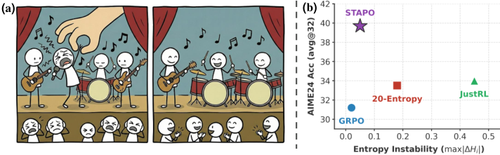

# STAPO：通过“静音”极少数伪噪声 Token，稳定 LLM 强化学习

## 一句话结论
这篇论文的核心观点很直接：LLM 在 RL 训练时不稳定的“罪魁祸首”，往往是 **极少数** （约 0.01%）低概率、低熵但被错误奖励强化的 token。把它们“静音”，训练就稳了，性能也更高。

> 图解：左侧用合唱类比说明“伪噪声 token”会破坏整体训练协调性；右侧展示在 Qwen3-8B 上，屏蔽约 0.01% 的 spurious tokens 后，性能与熵稳定性同时逼近 Pareto 最优。

## 背景与问题：LLM 强化学习为什么容易“炸”
强化学习用于提升 LLM 推理能力（尤其是数学、代码）已经很有效，但训练稳定性极差，常见两类灾难：
- **Entropy collapse** ：模型变得过度确定，推理退化成重复模式。
- **Entropy explosion** ：分布发散，输出越来越不可控。

以往方法大多在“表面信号”上做修补（比如 entropy 正则、采样重权），但论文指出真正的问题更“微观”： **token 级别梯度更新极不均衡** 。

## 关键机制：梯度为何被低概率 token 主导
论文给出一个核心结论：token 的梯度幅度与其 **概率** 和 **局部熵** 负相关。直觉上：
- 低概率 token 的梯度会被放大。
- 低熵区域已经“很确定”，再更新收益低但风险高。
- 如果此时 token 还带着 **正的 advantage** ，就会把错误强化得更快。

因此，那些 **低概率 + 低熵 + 正 advantage** 的 token 会成为“破坏性更新源”。

## 理论要点：梯度界与熵变化
论文复用并拓展了 token 梯度与熵之间的分析，保留核心公式即可。

**梯度范数上下界：**

$$
|w_{i,t}|^2 \left( 1 - 2\pi_\theta(y_{i,t}) + e^{-\mathcal{H}(\pi_{\theta})} \right) 
\leq \|\nabla_{\bm{a}} \mathcal{J}(y_{i,t})\|^2 
\leq |w_{i,t}|^2 \left( 2 - 2\pi_\theta(y_{i,t}) - C_V \mathcal{H}(\pi_{\theta})^2 \right)
$$

核心含义：
- $\pi_\theta(y_{i,t})$ 越小，梯度越大。
- $\mathcal{H}(\pi_\theta)$ 越小，梯度下界越高。

**熵更新近似公式（自然梯度视角）：**

$$
\mathcal{H}(\pi_{\theta_{k+1}}) - \mathcal{H}(\pi_{\theta_k})
\approx
-\eta \,
\mathrm{Cov}\left(
\log \pi_{\theta_k},
\, \hat{A}_i
\right)
$$

说明熵的变化与 token 概率和 advantage 的协方差直接相关。

## 关键定义：什么是 Spurious Token
论文给出的定义可以总结为：

**Spurious token = 在正确回答中出现，但对推理贡献极小，却获得正奖励并被异常放大的 token。**

这类 token 的特征是：
- 低概率
- 低熵
- 正 advantage

它们虽稀有，但会对训练产生“巨幅更新”。

## 方法：STAPO 的核心设计
STAPO 的核心是 **S2T（Silencing Spurious Tokens）机制** ，直接把危险 token 的梯度贡献置零。

**S2T mask：**

$$
\mathbb{I}^{\mathrm{S2T}}_{i,t} = 
\begin{cases} 
0, & \hat{A}_i > 0 \land \pi(y_{i,t}) < \tau_p \land \mathcal{H}_t < \tau_h \\
1, & \text{otherwise}
\end{cases}
$$

**STAPO loss：**

$$
\mathcal{J}_{\mathrm{STAPO}}(\theta) =
\mathbb{E}\left[
\frac{1}{\sum \mathbb{I}^{\mathrm{S2T}}_{i,t}}
\sum
\mathbb{I}^{\mathrm{S2T}}_{i,t}
\cdot
\min\left(
\rho_{i,t}\hat{A}_i,
\mathrm{clip}(\rho_{i,t}, 1-\epsilon_\mathrm{low}, 1+\epsilon_\mathrm{high})\hat{A}_i
\right)
\right]
$$

理解方式很简单：只对“可靠 token”做更新，对 spurious token 的梯度全部静音。

## 实验设置概览
- 训练框架：`veRL`
- 模型规模：Qwen 1.7B / 8B / 14B
- 数据：DAPO-Math-17K
- 训练资源：64 × NVIDIA H20
- 核心超参：
  - $\tau_p = 0.002$
  - $\tau_h = 80\%$（实际为低熵阈值分位数）
- 任务评测：AIME24、AIME25、AMC23、MATH500、Minerva、OlympiadBench

## 主要结果：稳定 + 提升
论文在三种规模上都展示了稳定收益，核心结论有两点：
1. **熵稳定性显著提升** ：GRPO 会 collapse，20-Entropy/JustRL 可能爆炸，而 STAPO 最稳定。
2. **精度普遍领先** ：无论 training-aligned 还是 JustRL 设置都领先 baseline。

一个关键数字：
- 只屏蔽 **约 0.01%** 的 token，就带来显著性能提升。

## 超参敏感性：为什么不能“乱屏蔽”
- $\tau_p$ 过大（太激进）会误杀有用的低概率推理 token，性能急剧下降。
- $\tau_h$ 提升（屏蔽范围变小）也会降低表现。

结论： **必须非常选择性地屏蔽，仅针对真正 spurious token** 。

## 消融实验：为什么必须同时看概率与熵
论文对三种策略做消融：
- 只看概率：效果 **低于 baseline**
- 只看高熵低概率：小模型会“崩”
- STAPO（概率 + 熵 + 正 advantage）：所有规模都稳

这说明 spurious token 的判别必须是三条件联合。

## 深度分析：spurious token 的“质”
论文给出 token 统计与词云分析结果，典型 spurious token 包含：
- 数字错误（4、1、2）
- 数学符号（`$`、`-`）
- 连接词（Wait、But、Since）
这些 token 可能出现在正确回答里，但并不构成核心推理步骤，却被放大强化。

## 结论与展望
STAPO 的价值在于：
- 它不是改奖励函数，而是 **改梯度更新路径**
- 只对极少数 token 动刀，却显著稳定 RL 训练
- 提供了一个更“微观”的 RL 稳定性解释框架

未来方向：
- 扩展到非数学任务（代码、开放域推理）
- 分析错误回答中的 token 行为
- 更细粒度的 token 级策略控制

> 本文参考自 [STAPO: Stabilizing Reinforcement Learning for LLMs by Silencing Rare Spurious Tokens](https://arxiv.org/abs/2602.15620)