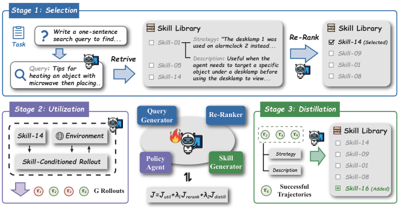

# Skill1 解读：让 Skill-Augmented Agent 的选择、使用与沉淀一起进化

## 这篇论文解决了什么问题？

Skill1 关注的是 **带技能库的 LLM Agent** 。这类 Agent 会把过去成功的经验沉淀成 skill，下次遇到相似任务时直接复用，而不是每个任务都从零开始探索。

问题在于，一个技能库真正好用，至少依赖三件事：

1. **Skill selection** ：能不能从库里选到相关 skill。
2. **Skill utilization** ：选到以后，Agent 能不能真正用好它。
3. **Skill distillation** ：任务结束后，能不能把新经验压缩成可复用 skill。

过去很多方法只优化其中一部分，比如只训练执行能力，selection 仍然依赖 frozen embedding 或启发式规则；或者 distillation 依赖额外的 teacher / self-reflection 信号。Skill1 的核心观点是：这三件事不是孤立模块，而应该围绕同一个任务成功信号一起优化。

## 方法核心：一个策略模型，统一进化三种能力

> 图解：Skill1 的整体流程分为三段。首先，policy 根据任务生成 query，从 skill library 中检索 Top-K 候选 skill，并重新排序选择最合适的一个；然后，policy 在环境中执行多轮 action；最后，policy 根据完整 trajectory 反思并蒸馏出新的 skill。关键点在于，selection、utilization、distillation 都由同一个 $\pi_\theta$ 完成，并且都从最终任务结果 $r(\tau)$ 中获得学习信号。

Skill1 的一条完整 trajectory 可以写成：

$$
\tau = (q, z, a_1, o_1, \ldots, a_T, o_T, s_{\text{new}})
$$

其中，$q$ 是检索 query，$z$ 是选中的 skill，$a_t, o_t$ 是交互轨迹，$s_{\text{new}}$ 是新蒸馏出的 skill。环境最终只返回一个二值奖励 $r(\tau) \in \{0,1\}$。

难点是：只有一个最终 reward，怎么分别训练三个阶段？

Skill1 的做法是把任务结果拆成两类信号：

- **低频趋势 trend** ：衡量一个 skill 长期是否好用，用来训练 selection。
- **高频变化 variation** ：衡量当前经验是否超越已有 skill library，用来训练 distillation。
- **当前任务结果** ：直接训练 utilization。

具体来说，每个 skill 维护一个 utility score：

$$
U(s) \leftarrow (1 - \alpha) U(s) + \alpha r(\tau_i)
$$

selection 阶段会用 NDCG 奖励 policy 排出更符合 utility 顺序的 skill：

$$
R_i^{\text{rerank}} = \mathrm{NDCG}(\sigma_i, \operatorname{argsort}(-U(\mathcal{B}_K^i)))
$$

distillation 阶段则看当前结果是否超过已检索 skill 的最佳水平：

$$
R_i^{\text{distill}} = r(\tau_i) - \hat{U}_i
$$

如果 $R_i^{\text{distill}}$ 为正，说明这次 trajectory 提供了库里还没有覆盖好的经验，值得沉淀成新 skill；如果为负，则说明只是重复已有能力，不应鼓励。

最终目标函数是：

$$
\mathcal{J}(\theta) =
\mathcal{J}^{\text{util}}(\theta)
+ \lambda_1 \mathcal{J}^{\text{rerank}}(\theta)
+ \lambda_2 \mathcal{J}^{\text{distill}}(\theta)
$$

这里 utilization 和 distillation 使用 GRPO，rerank 使用类似 REINFORCE 的排序优化。

## 实验结果：Skill1 在 ALFWorld 和 WebShop 都领先

论文主要在两个 text-based agent 环境上评测：

- **ALFWorld** ：家居环境中的多步规划与物体操作。
- **WebShop** ：电商购物环境，需要搜索、筛选并购买符合要求的商品。

核心结果如下：

| Method | ALFWorld Avg. Success | WebShop Score | WebShop Success |
|---|---:|---:|---:|
| GiGPO | 90.8 | 84.4 | 72.8 |
| SkillRL | 89.9 | 85.2 | 72.7 |
| RetroAgent | 94.9 | 88.9 | 82.3 |
| **Skill1** | **97.5** | **89.7** | **82.9** |

可以看到，Skill1 在 ALFWorld 上比此前最强的 RetroAgent 高出 2.6 个点，在 WebShop 上也取得最佳结果。更重要的是，它不是简单依靠更强的执行模型，而是通过统一优化 skill lifecycle，让 skill selection、utilization、distillation 相互促进。

## 消融实验：三个模块缺一不可

论文还做了比较关键的 ablation：

| Variant | ALFWorld Avg. Success |
|---|---:|
| **Skill1** | **97.5** |
| w/o Selection | 91.8 |
| w/o Distillation | 92.4 |
| w/o Library | 80.9 |
| $\lambda_1 = 0$ | 94.0 |
| $\lambda_2 = 0$ | 94.9 |
| $\lambda_1 = \lambda_2 = 0$ | 90.2 |

这里最直观的结论是： **skill library 是基础，selection 和 distillation 的学习信号决定了它能不能真正变强** 。

去掉 library 后性能直接掉到 80.9，说明显式复用经验确实重要；去掉 selection 或 distillation 后，也会明显退化。尤其是 $\lambda_1$ 和 $\lambda_2$ 同时置零后，虽然 utilization 仍然可以依靠任务 reward 训练，但整体能力掉到 90.2，说明三个阶段存在强耦合，不能只训练执行环节。

## 结论

Skill1 的创新点不在于提出一种新的 skill 形式，而在于把 skill-augmented agent 的完整生命周期放进同一个 RL 框架里训练。它用最终任务结果 $r(\tau)$ 同时派生出 selection、utilization、distillation 的学习信号，避免了过去方法中多模块、多 reward 来源导致的目标不一致问题。

这篇文章给 skill library agent 提供了一个很清晰的方向：未来的 Agent 不只是“会存经验”，而是要学会 **选对经验、用好经验、沉淀更好的经验** ，并且这三件事应该一起进化。

> 本文参考自 [Skill1: Unified Evolution of Skill-Augmented Agents via Reinforcement Learning](https://arxiv.org/abs/2605.06130)