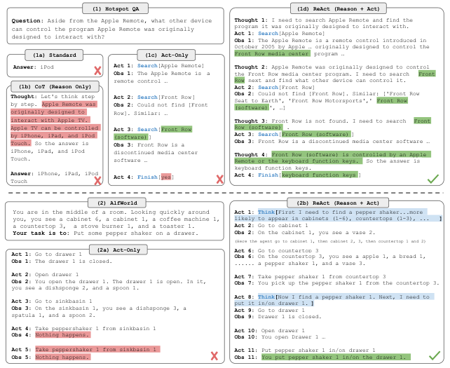
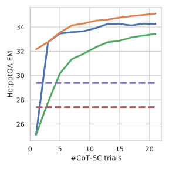
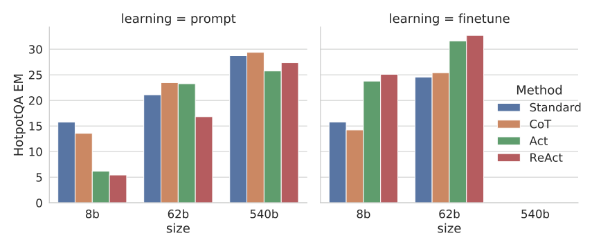
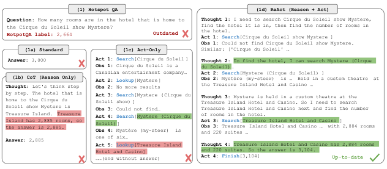
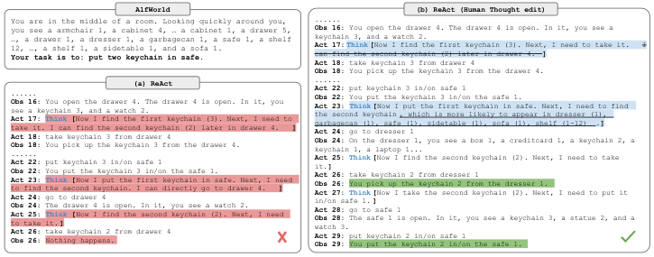

# ReAct 论文深度解读：让大模型「边思考边行动」，Reasoning + Acting 的协同范式

> 论文：ReAct: Synergizing Reasoning and Acting in Language Models（ICLR 2023）
> 作者团队：Princeton University + Google Research Brain
> 项目主页与代码：https://react-lm.github.io/

## 一句话概览

这篇文章提出了 **ReAct** （Reasoning + Acting）范式：让 LLM 以交错的方式同时生成 **推理轨迹（reasoning traces / thoughts）** 和 **任务动作（actions）** —— 推理帮助模型制定、跟踪、更新行动计划并处理异常，行动则让模型与外部环境（如 Wikipedia、网页、文字游戏）交互来获取新知识。仅靠 1~6 个 few-shot 示例，ReAct 就在问答、事实验证、文字游戏、网页购物四类任务上全面超越「只推理」或「只行动」的基线，甚至打败了用 $10^3 \sim 10^5$ 条数据训练的模仿学习 / 强化学习方法。

## 背景：Reasoning 和 Acting 一直是「两条平行线」

人类智能的一个独特之处，就是能把「动手做」和「心里琢磨」无缝结合起来。认知科学里称之为 inner speech（内部言语）—— 做菜时我们会自言自语「菜切好了，该烧水了」（跟踪进度）、「没盐了，用酱油代替吧」（处理异常）、「面团怎么揉？上网搜一下」（意识到需要外部信息）。

但在 LLM 研究里，这两条路线此前是分开发展的：

- **Chain-of-Thought（CoT）推理**：让模型生成中间推理步骤，在算术、常识推理上效果显著。但 CoT 是一个 **静态黑盒** —— 模型只能用内部参数知识「闭门造车」，不与外部世界交互，因此极易产生 **事实幻觉（hallucination）** 和 **错误传播（error propagation）**。
- **Acting / 决策类工作**：如 WebGPT、SayCan 等，把多模态观测转成文本，让 LM 生成动作或计划去执行。但这些方法没有用 LM 对高层目标做抽象推理，也没有维护一个「工作记忆」来支撑行动，往往需要昂贵的模仿学习或 RL 训练。

这篇文章要回答的核心问题就是：**推理和行动能否以协同（synergistic）的方式结合？这种结合能否比单独推理或单独行动带来系统性收益？**

## 核心方法：ReAct 到底怎么做的

### 形式化定义

先考虑一个通用的 agent-环境交互设定：在时间步 $t$，agent 从环境接收到观测 $o_t \in \mathcal{O}$，并按照某个策略 $\pi(a_t \mid c_t)$ 采取动作 $a_t \in \mathcal{A}$，其中上下文为：

$$
c_t = (o_1, a_1, \cdots, o_{t-1}, a_{t-1}, o_t)
$$

当 $c_t \mapsto a_t$ 的映射高度隐含、需要复杂计算时（比如要综合前面所有的搜索记录才能给出最终答案），直接学这个策略非常困难。

ReAct 的想法非常简单：**把 agent 的动作空间扩充为 $\hat{\mathcal{A}} = \mathcal{A} \cup \mathcal{L}$**，其中 $\mathcal{L}$ 是语言空间。一个落在语言空间里的动作 $\hat{a}_t \in \mathcal{L}$ 被称为 **thought（思考 / 推理轨迹）** —— 它不影响外部环境，因此不会得到观测反馈；它的作用是 **对当前上下文做推理、提炼有用信息，并把结果写回上下文**：

$$
c_{t+1} = (c_t, \hat{a}_t)
$$

从而支撑后续的推理或行动。说白了，**思考就是一个「只对上下文生效、不对环境生效」的动作**。由于语言空间 $\mathcal{L}$ 是无限的，在这个扩充动作空间里直接学习很难，所以本文采用 **冻结的 PaLM-540B + few-shot in-context prompting** 的方式：每个 in-context 示例就是一条人类书写的「思考-动作-观测」交错轨迹。

> 图解：这是全文最重要的一张图。(1) 部分对比了四种 prompting 方法解决同一道 HotpotQA 多跳问题：(a) **Standard** 直接给答案，答错；(b) **CoT**（Reason Only）有推理但不查证，幻觉出错误事实；(c) **Act-only** 只查不想，虽然查到了信息却无法综合出正确答案；(d) **ReAct**（Reason + Act）交替生成 Thought / Act / Obs，先拆解问题、再搜索、再从观测中提取关键信息，最终答对。(2) 部分对比 AlfWorld 文字游戏：(a) Act-only 因无法分解目标、丢失状态而陷入循环；(b) ReAct 用稀疏的 thought 分解目标（找胡椒瓶→用台灯查看），并注入「台灯一般在桌上/架子上」这类常识来指导搜索，顺利完成任务。图中 Act / Thought 由模型生成，Obs 由环境返回。

### 思考的类型与生成节奏

论文指出 thought 可以承担多种职能：

- **分解任务目标、制定行动计划**（"I need to search x, find y, then find z"）
- **注入与任务相关的常识**（"台灯更可能在桌子或架子上"）
- **从观测中提取关键信息**（"x was started in 1844"）
- **跟踪进度、切换子目标**（"Now I clean a knife. Next, I need to put it..."）
- **处理异常、调整计划**（搜索不到时改用别的关键词重新搜索）
- **常识 / 算术推理**（"1844 < 1989"）与 **合成最终答案**

针对不同任务，思考出现的节奏也不同：

- **知识密集型推理任务**（HotpotQA / FEVER）：思考与动作 **密集交替**，轨迹由多个 thought-action-observation 三元组构成；
- **决策任务**（ALFWorld / WebShop）：动作数量可能很多，思考只需 **稀疏地** 出现在最关键的位置，由 LM 自己决定何时想、何时做。

### 相比前人的四个优势

1. **直观易设计**：标注者只需要把自己解题时的想法用自然语言打在动作旁边，无需特殊格式设计；
2. **通用灵活**：灵活的 thought 空间让它适用于问答、事实验证、文字游戏、网页导航等动作空间迥异的任务；
3. **性能强且鲁棒**：只用 1~6 个 in-context 示例就能泛化到新任务，跨领域一致超过只推理 / 只行动的基线；
4. **对人类友好且可控**：整个决策过程可解释、可诊断，人类甚至可以通过 **编辑 thought** 实时纠正 agent 行为（后文有实验）。

## 实验一：知识密集型推理任务（HotpotQA & FEVER）

### 实验设置

两个数据集：**HotpotQA**（需要对两个以上 Wikipedia 段落做多跳推理）和 **FEVER**（事实验证，判断 claim 是 SUPPORTS / REFUTES / NOT ENOUGH INFO）。采用 **question-only** 设定：模型只拿到问题 / 断言，不给支撑段落，只能依靠内部知识或与外部环境交互检索。

作者设计了一个极简的 Wikipedia API，只有三个动作：

- `search[entity]`：返回对应维基页面的前 5 句，若不存在则给出 5 个相似实体建议；
- `lookup[string]`：返回页面中包含该字符串的下一句（模拟浏览器 Ctrl+F）；
- `finish[answer]`：提交答案结束任务。

注意这个检索能力 **远弱于** SOTA 的 lexical / neural retriever —— 这是故意的，目的是模拟人类逛维基的方式，强迫模型用语言推理来驱动检索。

对比方法由 ReAct 轨迹消融而来：**Standard**（去掉 thought 和 action）、**CoT**（去掉 action 和 observation，纯推理）、**CoT-SC**（采样 21 条 CoT 轨迹做 self-consistency 多数投票）、**Act**（去掉 thought，纯行动）。ReAct 的 prompt 用 6 个（HotpotQA）/ 3 个（FEVER）手工编写的 few-shot 轨迹。

### 主要结果

| Prompt 方法 | HotpotQA (EM) | Fever (Acc) |
|---|---|---|
| Standard | 28.7 | 57.1 |
| CoT | 29.4 | 56.3 |
| CoT-SC | 33.4 | 60.4 |
| Act | 25.7 | 58.9 |
| ReAct | 27.4 | 60.9 |
| CoT-SC → ReAct | 34.2 | **64.6** |
| ReAct → CoT-SC | **35.1** | 62.0 |
| Supervised SoTA（参考） | 67.5 | 89.5 |

几个关键观察：

- **ReAct 稳定超过 Act**（两个任务都是），说明「用推理指导行动」有价值，尤其是在合成最终答案这一步；
- **ReAct 在 FEVER 上明显超过 CoT**（60.9 vs. 56.3），因为 SUPPORTS/REFUTES 往往只差一个细节，必须查证；但在 HotpotQA 上略逊于 CoT（27.4 vs. 29.4）；
- **最好的方法是 ReAct 与 CoT-SC 的组合**（两个方向各赢一个任务）。

### 人工分析：ReAct 和 CoT 到底差在哪

作者随机抽了 ReAct 和 CoT 各 50 条正确 + 50 条错误轨迹（共 200 条），人工标注成功 / 失败模式：

| 类别 | 类型 | 定义 | ReAct | CoT |
|---|---|---|---|---|
| Success | True positive | 推理与事实都正确 | 94% | 86% |
| Success | False positive | 推理或事实有幻觉 | 6% | 14% |
| Failure | Reasoning error | 推理链错误（含陷入重复循环） | 47% | 16% |
| Failure | Search result error | 搜索为空或无有效信息 | 23% | - |
| Failure | Hallucination | 幻觉的推理或事实 | 0% | 56% |
| Failure | Label ambiguity | 预测对但与标签不精确匹配 | 29% | 28% |

可以看到一个清晰的 **trade-off**：

- **幻觉是 CoT 的头号杀手**：占其失败案例的 56%，而 ReAct 失败案例中的幻觉率为 **0%** —— 外部知识库让 ReAct 的轨迹更 grounded、更可信；
- **但交错结构也限制了 ReAct 的推理灵活性**：其 reasoning error（47%）高于 CoT（16%），其中一个特有错误模式是模型陷入「重复生成相同 thought 和 action」的死循环（作者猜测是 greedy decoding 的锅）；
- **搜索质量对 ReAct 至关重要**：23% 的失败源于搜索没有返回有效信息，模型很难从中恢复。

### 组合策略：内部知识 + 外部知识

基于上述互补性，作者提出两种启发式切换策略：

- **ReAct → CoT-SC**：ReAct 在规定步数内没给出答案（HotpotQA 设 7 步、FEVER 设 5 步），就退回 CoT-SC；
- **CoT-SC → ReAct**：$n$ 条 CoT-SC 样本中多数答案出现次数不足 $n/2$（说明内部知识不自信），就退回 ReAct。

> 图解：横轴是 CoT-SC 的采样数量，纵轴是 HotpotQA EM。两条 ReAct + CoT-SC 组合曲线在所有采样数量下都显著高于纯 CoT-SC —— 组合方法只用 3~5 个样本就达到了 CoT-SC 用 21 个样本的水平，说明「内部知识 + 外部检索」恰当组合的性价比极高。（FEVER 上的对应曲线见原文 fever_cots_scale 图，趋势一致。）

### 微调实验：ReAct 是更可迁移的技能

作者还做了 bootstrap 式微调：用 ReAct 自己生成的 3,000 条答对的轨迹，微调较小的 PaLM-8B / 62B。

> 图解：横轴/分组为不同方法与模型规模（PaLM-8B、62B、540B），纵轴为 HotpotQA EM。可以看到：小模型直接 prompt ReAct 效果最差（同时学推理和行动太难了），但 **微调后 ReAct 逆袭成为最佳** —— 微调后的 PaLM-8B ReAct 超过所有 PaLM-62B 的 prompting 方法，微调后的 PaLM-62B ReAct 甚至超过所有 540B prompting 方法。而微调 Standard / CoT 效果差得多，因为那本质上是在教模型 **背诵（可能幻觉的）知识**；微调 ReAct / Act 教的是 **如何检索和使用知识**，是一种更可泛化的技能。

## 实验二：交互式决策任务（ALFWorld & WebShop）

### ALFWorld：文字版家务游戏

ALFWorld 是与 embodied benchmark ALFRED 对齐的合成文字游戏，包含 6 类任务（如「把干净的生菜放到餐桌上」），一个任务实例可能有 50+ 个位置、需要专家策略 50+ 步才能完成。它内置的挑战是：agent 需要用常识推断物品的可能位置（台灯多半在桌子上）—— 恰好是 LLM 预训练常识的用武之地。

ReAct 为每类任务手工标注 3 条轨迹，每条轨迹包含 **稀疏 thought**，承担四种职能：分解目标、跟踪子目标完成、决定下一个子目标、用常识推断物品位置。评测在 134 个未见过的游戏上进行，每个任务类型用 3 条标注轨迹的两两排列构造 6 个 prompt 做鲁棒性测试。基线是 BUTLER（每类任务用 $10^5$ 条专家轨迹训练的模仿学习 agent）。

| 方法 | Pick | Clean | Heat | Cool | Look | Pick 2 | All |
|---|---|---|---|---|---|---|---|
| Act (best of 6) | 88 | 42 | 74 | 67 | 72 | **41** | 45 |
| ReAct (avg) | 65 | 39 | 83 | 76 | 55 | 24 | 57 |
| ReAct (best of 6) | **92** | 58 | **96** | 86 | **78** | **41** | **71** |
| ReAct-IM (best of 6) | 62 | **68** | 87 | 57 | 39 | 33 | 53 |
| BUTLER (best of 8) | 46 | 39 | 74 | **100** | 22 | 24 | 37 |

结果相当惊人：**ReAct 最佳 trial 达到 71% 平均成功率**，远超 Act 的 45% 和 BUTLER 的 37%；甚至 ReAct **最差的** trial（48%）都比这两个方法的最佳 trial 强。6 组对照实验中 ReAct 对 Act 的相对提升在 33%~90% 之间，平均 62%。定性看，没有任何 thought 的 Act 无法正确分解目标，还会丢失环境状态（附录里有个典型例子：Act 还没走到水槽边就试图洗菜，失败后陷入无限循环）。

### WebShop：网购决策

WebShop 是一个更「真实世界」的环境：118 万真实商品、1.2 万条人类购物指令，要求 agent 通过搜索、点选商品、选规格、下单来满足指令（如「我要 3 盎司装亮柑橘味敏感肌除臭剂，价格低于 50 刀」）。指标是平均分（所选商品覆盖目标属性的比例）和成功率（完全满足所有要求的比例）。基线为 IL（1,012 条人工轨迹模仿学习）和 IL+RL（再加 10,587 条指令做 RL）。

| 方法 | Score | 成功率 |
|---|---|---|
| Act | 62.3 | 30.1 |
| ReAct | **66.6** | **40.0** |
| IL | 59.9 | 29.1 |
| IL+RL | 62.4 | 28.7 |
| Human Expert | 82.1 | 59.6 |

one-shot 的 Act 就已经和 IL / IL+RL 打平，加上稀疏推理后 ReAct 把成功率绝对提升了 **10 个百分点**。作者发现 ReAct 更擅长用推理弥合嘈杂观测与动作之间的鸿沟（例如：「这个商品有 'apple cinnamon' 和 '0.53 ounce (pack of 16)' 选项，符合要求，可以买」）。不过与人类专家（59.6%）仍有不小差距 —— 人类会做更多探索和查询改写，这对 prompting 方法仍具挑战。

### 消融：内部推理 vs. 外部反馈（对比 Inner Monologue）

最接近的先前工作是 Inner Monologue（IM），其「内心独白」其实只是对环境状态的复述。作者构造了 **ReAct-IM** 消融：把同样的专家轨迹用 IM 风格的稠密外部反馈重新标注，只允许思考「分解当前目标」和「当前子目标是什么」，**不允许** 判断子目标是否完成、决定下一子目标、调用常识推断物品位置。

结果 ReAct 以 71% vs. 53% 大幅胜出，6 类任务中 5 类占优。定性看，ReAct-IM 常搞错子目标是否完成（比如一个错误 thought「我需要找一把干净的刀」会让模型误以为刀已经洗好了，然后反复执行放置动作卡死），也缺乏常识定位能力。这证明 **灵活、稀疏、多样的内部推理** 才是 ReAct 的关键，而不是简单复述环境反馈。

## 附录亮点

### GPT-3 上同样有效

| 任务 | PaLM-540B | GPT-3 |
|---|---|---|
| HotpotQA (EM) | 29.4 | **30.8** |
| ALFWorld（成功率 %） | 70.9 | **78.4** |

GPT-3（text-davinci-002）在两个任务上都超过 PaLM-540B，可能因为经过了指令微调，说明 ReAct prompting 的效果可以跨模型迁移。

### ReAct 能拿到「最新」知识

> 图解：一个关于酒店规模的 HotpotQA 问题，数据集标注的答案已过时（酒店后来扩建了）。Standard 和 CoT 因幻觉给出错误答案；Act 虽然能联网却缺乏推理指导而失败；只有 ReAct 通过「推理 + 真实网络交互」检索到了最新信息并给出合理答案。这说明对于 Internet-augmented LM 来说，推理能力是获取 up-to-date 知识的关键拼图。

### 人类可以「编辑思考」来纠正 agent

> 图解：AlfWorld 中一个人类实时纠正 ReAct 的例子。(a) ReAct 轨迹因 Act 17 处一条幻觉 thought 而失败；(b) 人类只需删掉那句幻觉、并在 Act 23 处加一句提示，ReAct 就调整行为并成功完成任务。对人类来说，解题从「敲几十条动作」变成「改两句想法」，且这种 on-the-go 的策略编辑对 Act 和 RL 方法几乎不可能（你没法改模型参数，改几个动作也改变不了整体行为）。这开启了新型人机协作的可能。

## 局限与展望

- **上下文长度瓶颈**：复杂任务、大动作空间需要更多 demonstration，容易超出 in-context learning 的输入长度限制；
- **推理灵活性受损**：交错结构带来 groundedness 的同时也降低了推理自由度，易出现「重复循环」错误（可能与 greedy decoding 有关，更好的解码策略或许能缓解）；
- **依赖检索质量**：搜索无效时模型难以恢复；
- **微调方向有潜力**：3,000 条轨迹微调已展现很好效果，用更多高质量人工标注 + 多任务训练 + 结合 RL，可能进一步释放 LLM 的 agent 潜力。

## 总结

ReAct 的贡献不在于复杂的技术，而在于一个 **简单却深刻的视角转换**：把「思考」看作一种不改变环境、只更新上下文的动作，推理与行动便能在同一个自回归生成过程中自然交错 —— reason to act（用推理指导行动），act to reason（用行动获取知识）。这种范式在四类任务上证明了系统性收益，同时带来了可解释、可诊断、可被人类实时编辑的决策轨迹。今天我们在各类 LLM Agent 框架中习以为常的 Thought-Action-Observation 循环，正是从这里开始的。

> 本文参考自 [ReAct: Synergizing Reasoning and Acting in Language Models](https://arxiv.org/abs/2210.03629)