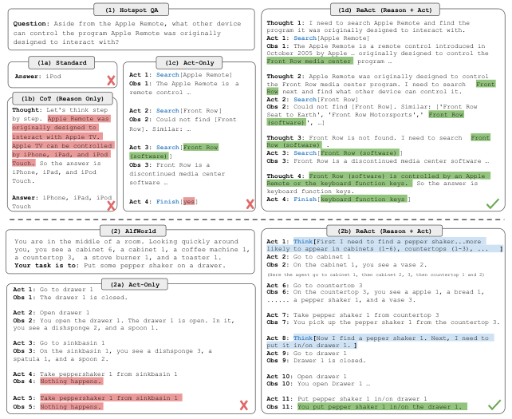
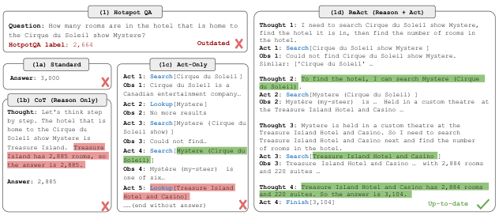
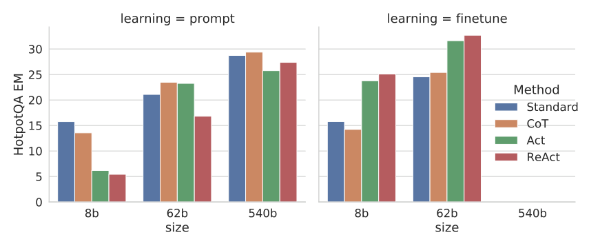
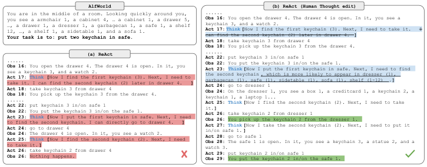

# ReAct：让大模型边想边做，推理与行动的协同之道

大语言模型（LLM）擅长"想"（Chain-of-Thought 推理），也能被训练去"做"（生成动作与环境交互），但在 ReAct 之前，这两件事一直被当作两个独立的问题来研究。这篇来自 Princeton 和 Google Brain 的 ICLR 2023 论文提出了一个简单却影响深远的范式： **让模型交替生成推理轨迹（Thought）和任务动作（Action）** ，用推理来指导行动，用行动来获取信息反哺推理。效果有多硬？在 ALFWorld 和 WebShop 两个交互式决策任务上，仅凭一两个 in-context 示例的 prompting，成功率就分别绝对提升 **34%** 和 **10%**，超过用 $10^3 \sim 10^5$ 条数据训练的模仿学习/强化学习方法。可以说，今天几乎所有 Agent 框架里"思考-行动-观察"的循环，都源自这篇工作。

## 背景：会想的不会做，会做的不会想

先从一个生活直觉说起。人在厨房做菜时，行动和内心独白是无缝交织的：切完菜会想"现在该烧水了"（跟踪进度），发现没盐会想"用酱油代替"（处理异常），不知道怎么做面团会去上网搜（主动获取信息）。 **推理指导行动，行动支撑推理** ，这是人类智能的核心特征。

但在 LLM 研究中，这两种能力是割裂的：

- **只推理（Reason Only）** ：以 CoT 为代表，模型在封闭的内部表示里"空想"，不与外部世界交互。问题是它无法更新知识，容易产生事实幻觉，而且一步错步步错（error propagation）。
- **只行动（Act Only）** ：以 WebGPT、SayCan 为代表，模型把观测转成文本、生成动作去执行，但缺乏对高层目标的抽象推理和工作记忆，容易在长程任务中迷失方向、陷入重复。

一个很自然的问题就出来了：能不能让推理和行动像人类一样 **协同（synergize）** 起来，并且比单独使用其中任何一个都强？ReAct 给出了肯定的答案。

## ReAct 方法：把"思考"也定义为一种动作

### 核心思想：扩展动作空间

形式上，考虑一个与环境交互的 Agent：在时间步 $t$，它接收到观测 $o_t$，并根据上下文 $c_t = (o_1, a_1, \cdots, o_{t-1}, a_{t-1}, o_t)$ 按策略 $\pi(a_t | c_t)$ 选择动作。当从上下文到动作的映射高度隐含、需要复杂推理时，直接学这个映射非常困难。

ReAct 的想法简单到令人惊讶： **把动作空间从 $\mathcal{A}$ 扩展为 $\hat{\mathcal{A}} = \mathcal{A} \cup \mathcal{L}$** ，其中 $\mathcal{L}$ 是语言空间。一个落在语言空间里的"动作"就是一条 **思考（thought / reasoning trace）** ——它不改变外部环境、不产生观测反馈，只是对当前上下文做推理，把有用信息写回上下文 $c_{t+1} = (c_t, \hat{a}_t)$，为后续的推理或行动铺路。

这个设计的聪明之处在于：它 **完全没有引入新架构、新训练目标** ，只是把"想"和"做"统一到了同一个序列生成问题里。于是整个能力可以直接由冻结的大模型（论文用 PaLM-540B，附录含 GPT-3 实验）通过 few-shot prompting 激发出来——每个 in-context 示例就是一条人类书写的"思考-行动-观测"交替轨迹。

### 思考的密度：因任务而异

论文区分了两种用法：

- **知识密集型任务** （如问答）：思考与行动 **密集交替** ，轨迹由多个 Thought-Action-Observation 步骤组成。
- **决策型任务** （如游戏、网页导航）：动作可能多达几十步，思考只需 **稀疏地出现在关键位置** （分解目标、跟踪进度、判断下一步），由模型自己决定何时思考。

思考的类型也是自由多样的：分解任务目标、注入常识知识、从观测中提取关键信息、跟踪子目标完成进度、处理异常并调整计划等等。

> 图解：上半部分 (1) 是解决 HotpotQA 问题时四种 prompting 方法的对比。(a) Standard 直接给答案；(b) CoT 只推理，因幻觉（把不存在的事实编出来）而答错；(c) Act-only 只与环境交互，因缺乏推理无法综合出最终答案；(d) ReAct 交替生成 Thought 和 Act，通过 Wikipedia API 查证事实后答对。下半部分 (2) 是 ALFWorld 游戏：Act-only 因没有推理而在房间里反复打转产生幻觉动作，ReAct 则先分解目标（找胡椒瓶 → 检查桌面 → 放到抽屉），逐步完成任务。

### 为什么 ReAct 好用

作者总结了四个特性，值得逐条看：

- **设计直观** ：标注者只需像人一样边做边把想法写下来，不需要特殊的格式设计或示例筛选。
- **通用灵活** ：自由文本的思考空间 + 灵活的出现时机，同一范式覆盖 QA、事实核查、文字游戏、网页导航。
- **性能强且鲁棒** ：只用 1~6 个示例就能泛化到新任务，且对 prompt 选择不敏感。
- **人类对齐、可控** ：推理过程完全透明，人甚至可以直接 **编辑模型的思考** 来纠正其行为（后文有实验展示）。

## 实验一：知识密集型推理任务（HotpotQA 与 FEVER）

### 任务设置与动作空间

先看推理主导的场景。两个基准：

- **HotpotQA** ：需要在两篇以上维基百科段落间做多跳推理的问答；
- **FEVER** ：判断一个陈述是 SUPPORTS、REFUTES 还是 NOT ENOUGH INFO 的事实核查。

论文刻意采用 **question-only** 设定：模型只拿到问题，不给任何支持段落，只能靠内部知识或与外部交互获取信息。环境是一个极简的 Wikipedia API，只有三个动作：

- `search[entity]`：返回对应词条页面的前 5 句，或给出最相似的 5 个词条建议；
- `lookup[string]`：模拟 Ctrl+F，返回页面中包含该字符串的下一句；
- `finish[answer]`：提交答案结束任务。

注意，这个检索能力远弱于 SOTA 的检索器——这是故意的，目的是模拟人查维基的方式， **逼着模型用显式的语言推理来驱动检索** 。

### 与基线的对比结果

基线由对 ReAct 轨迹做消融得到：Standard（去掉一切推理和动作）、CoT（去掉动作和观测，纯推理）、CoT-SC（CoT + 21 次采样自洽投票）、Act（去掉思考，纯动作）。PaLM-540B 上的结果：

| 方法 | HotpotQA (EM) | FEVER (Acc) |
|---|---|---|
| Standard | 28.7 | 57.1 |
| CoT | 29.4 | 56.3 |
| CoT-SC | 33.4 | 60.4 |
| Act | 25.7 | 58.9 |
| ReAct | 27.4 | 60.9 |
| CoT-SC → ReAct | 34.2 | **64.6** |
| ReAct → CoT-SC | **35.1** | 62.0 |
| 监督学习 SOTA | 67.5 | 89.5 |

几个关键观察：

- **ReAct 稳定优于 Act** （两个任务都是），说明"推理指导行动"确实有价值，尤其是在综合最终答案这一步。
- **ReAct 与 CoT 各有胜负** ：FEVER 上 ReAct 明显更好（60.9 vs 56.3），因为核查任务对事实准确性敏感；HotpotQA 上 ReAct 略逊于 CoT（27.4 vs 29.4）。
- **组合方法最强** ：ReAct 与 CoT-SC 互为兜底（一个失败就切换到另一个），在两个任务上分别达到 35.1 和 64.6，全面超越单一方法。

为什么组合有效？因为两种方法的知识来源互补：CoT 依赖参数化的内部知识，擅长组织推理结构但会幻觉；ReAct 依赖外部检索，事实性强但推理灵活性受限。组合策略让模型在"内部知识不自信"时去查，在"查不到"时退回推理。

### 人工剖析：ReAct 到底赢在哪、输在哪

论文随机抽取了 200 条轨迹做人工标注，按成功/失败模式分类，结论非常有信息量：

| 模式 | 类型 | 定义 | ReAct | CoT |
|---|---|---|---|---|
| 成功 | 真阳性 | 推理轨迹与事实均正确 | 94% | 86% |
| 成功 | 假阳性 | 存在幻觉的推理或事实 | 6% | 14% |
| 失败 | 推理错误 | 推理轨迹错误（含陷入重复循环） | 47% | 16% |
| 失败 | 检索错误 | 搜索为空或无用 | 23% | - |
| 失败 | 幻觉 | 编造的推理或事实 | 0% | **56%** |
| 失败 | 标签歧义 | 答案对但没精确匹配标签 | 29% | 28% |

三点 takeaway：

- **幻觉是 CoT 的头号杀手** ：占其失败案例的 56%，而 ReAct 因接地于外部知识库，失败案例中幻觉为 0%。
- **ReAct 的代价是推理灵活性** ：交替结构约束了推理步的组织，其推理错误率（47%）高于 CoT（16%），典型失败是模型陷入"重复上一步思考与动作"的死循环（作者推测 greedy decoding 难辞其咎）。
- **检索质量是 ReAct 的生命线** ：23% 的失败源于搜索没有返回有用信息，一旦检索跑偏，模型很难恢复。

> 博主点评：这张表其实预言了后来 Agent 工程的两大主题——"如何让推理跳出循环"和"检索失败如何兜底"。ReAct 不是完美的终态，但它把问题结构清楚地暴露了出来。

另外一个有趣的发现：有些 HotpotQA 问题的标准答案本身已经过时，只有 ReAct 能通过与真实 Wikipedia 交互拿到最新答案。

> 图解：一个 HotpotQA 案例，数据集的标注答案已过时。Standard、CoT、Act 都只能复现旧答案或答错，而 ReAct 通过搜索-查证-再搜索的循环，结合推理得出更新后的正确答案。这展示了"接地的推理"相对"背下来的知识"的本质优势。

### 微调：ReAct 的 scalability 更好

论文还做了 bootstrap 式微调实验：用各方法生成的 3000 条答对的轨迹，微调较小的 PaLM-8B/62B。

> 图解：横轴是模型规模（prompting 的 540B、微调的 8B 和 62B），纵轴是 HotpotQA 准确率。prompting 阶段小模型的 ReAct 反而最差（同时学推理和行动太难）；但只用 3000 条数据微调后，ReAct 一跃成为最优——8B 微调的 ReAct 超过所有 62B prompting 方法，62B 微调的 ReAct 超过所有 540B prompting 方法。相比之下，微调 Standard/CoT 效果差得多，因为那本质上是教模型"背（可能幻觉的）知识"，而微调 ReAct 教的是"如何推理和查证"这种可泛化的技能。

## 实验二：交互式决策任务（ALFWorld 与 WebShop）

解决了"行动帮推理"之后，下一个问题是反过来： **推理能不能帮行动** ？作者在两个长程、稀疏奖励的交互任务上做了验证。

### ALFWorld：文字版家庭机器人

ALFWorld 是一个合成文字游戏，Agent 要在模拟家庭环境中完成"把干净的刀放到台面上"这类高层目标。一个任务实例可能包含 50+ 个位置、需要 50+ 步操作，挑战在于子目标规划、状态跟踪和系统性探索（比如逐个检查柜子）。ReAct 的 prompt 为每类任务标注 2~3 条轨迹，思考是稀疏的：分解目标、跟踪子目标、确定下一步、用常识推断物品位置。

134 个未见游戏上的成功率（%）：

| 方法 | Pick | Clean | Heat | Cool | Look | Pick 2 | 总体 |
|---|---|---|---|---|---|---|---|
| Act（6 次最优） | 88 | 42 | 74 | 67 | 72 | 41 | 45 |
| ReAct（6 次平均） | 65 | 39 | 83 | 76 | 55 | 24 | 57 |
| ReAct（6 次最优） | **92** | 58 | **96** | 86 | **78** | 41 | **71** |
| ReAct-IM（6 次最优） | 62 | **68** | 87 | 57 | 39 | 33 | 53 |
| BUTLER（模仿学习，$10^5$ 条专家轨迹） | 46 | 39 | 74 | **100** | 22 | 24 | 37 |

结果相当惊人：

- ReAct 最优达到 **71%**，大幅超过 Act 的 45% 和 BUTLER 的 37%——而且 ReAct **最差的一次（48%）都比另两者最好的成绩高** 。
- 6 次受控对比中，ReAct 相对 Act 的提升稳定在 33%~90%（平均 62%），说明稀疏思考的价值是系统性的，不是 prompt 运气。
- 定性看，没有思考的 Act 无法把目标分解成子目标，会丢失环境状态（比如忘了自己已经拿着刀），陷入"去台面→清洗→什么都没发生→再去台面"的死循环。

### 消融：什么样的思考才有用？——ReAct vs. Inner Monologue

最接近的先前工作是 Inner Monologue（IM），它也闭环、也有"内心独白"，但独白内容仅限于对环境状态的复述和待办事项。论文构造了 IM 风格的密集外部反馈思考作为对照（ReAct-IM）。

结果是 ReAct 以 71 vs 53 的总体成功率明显胜出，并在 6 类任务中的 5 类占优。原因在于 IM 式思考缺乏两样东西： **高层目标分解** （导致搞不清子目标是否完成、下一步该做什么）和 **常识推理** （导致不知道台灯大概率在桌子上，只能盲目乱找）。

> 博主点评：这个消融很关键——它说明值钱的不是"在动作之间插话"这个形式，而是插进去的话里有没有 **抽象推理和常识** 。这也解释了为什么后来很多 Agent 系统中 prompt 里那句"先规划再执行"如此重要。

### WebShop：真实网页导航

WebShop 是一个模拟网购环境，包含 118 万真实商品和 1.2 万条人类指令，Agent 要通过搜索、点选选项、下单，买到满足全部属性要求（如"3 盎司、柑橘味、敏感肌适用、低于 50 美元"）的商品。对比基线是用 1012 条人工轨迹训练的 IL，以及再加 10587 条指令训练的 IL+RL。

| 方法 | Score | 成功率 |
|---|---|---|
| Act（one-shot） | 62.3 | 30.1 |
| **ReAct（one-shot）** | **66.6** | **40.0** |
| IL | 59.9 | 29.1 |
| IL+RL | 62.4 | 28.7 |
| 人类专家 | 82.1 | 59.6 |

one-shot 的 ReAct 成功率 40.0%，比此前最好的 IL+RL 绝对提升约 10%。案例显示，ReAct 会通过思考弥合噪声观测与指令之间的差距（"这个商品有 'apple cinnamon' 和 '16 包装' 选项，符合要求，可以买了"），而 Act 常常在第一个看起来差不多的商品上直接下单、买错属性。当然，与人类专家（59.6%）仍有明显差距——人会做更多探索和查询改写，这对 prompting 方法仍是难点。

### 人在回路：直接编辑模型的"想法"

最后一个展示非常优雅。既然思考是显式的文本，人就能直接改它。

> 图解：ALFWorld 中一段 ReAct 轨迹 (a) 在第 17 步产生了幻觉式思考（误以为任务已完成），导致后续动作跑偏、任务失败；(b) 人类只手动编辑了第 17 和 23 步的两条思考，轨迹立刻恢复正确的推理与动作并最终成功。这说明 ReAct 的决策过程不仅可解释、可诊断，还 **可编辑、可控制** ——这是黑盒式 Agent 难以企及的特性。

## 与相关工作的关系

简要看定位：推理一侧，CoT、least-to-most、Self-Consistency、STaR 等都只做"孤立、固定的推理"，不与环境交互；行动一侧，WebGPT 靠昂贵的 RLHF 学浏览器操作，SayCan 用 affordance 模型给动作打分，Inner Monologue 只有环境反馈式独白。ReAct 的独特位置在于： **纯 prompting、零训练成本、思考与行动在统一序列中交替** ，且思考内容是自由形式的高层推理而非状态复述。它的决策过程只需要自然语言标注，远比收集人类反馈便宜。

## 总结

- **核心思想** ：把"思考"视为不改变环境的特殊动作，让 LLM 交替生成 Thought 与 Action，实现推理与行动的双向协同（reason to act, act to reason）。
- **推理任务上** ：ReAct 消除了 CoT 最主要的失败模式——幻觉（失败案例占比 56% → 0%），与 CoT-SC 组合后在 HotpotQA/FEVER 上取得 prompting 最佳成绩（35.1 / 64.6）。
- **决策任务上** ：仅 one/two-shot 的 ReAct 在 ALFWorld 上成功率 71%（vs 模仿学习 37%）、WebShop 上 40.0%（绝对 +10%），远超用数万条数据训练的 IL/RL。
- **思考的质量比形式重要** ：消融显示稀疏、含常识与目标分解的思考显著优于 IM 式的状态复述（71 vs 53）。
- **附带红利** ：轨迹天然可解释、可诊断，人类可通过编辑思考直接纠正 Agent 行为。
- **可扩展性** ：微调实验中 ReAct 展现出最好的 scaling 特性——它教模型的是"如何查证"而非"背诵知识"。

局限与展望：复杂任务下 prompt 需要的示例容易超出上下文长度；推理错误（死循环）和检索失败仍是主要瓶颈。作者认为用更多高质量人工轨迹微调、结合强化学习，是进一步释放 LLM 智能体潜力的方向——从今天 Agent 生态的发展看，这个判断相当有先见之明。

> 本文参考自 [ReAct: Synergizing Reasoning and Acting in Language Models](https://arxiv.org/abs/2210.03629)