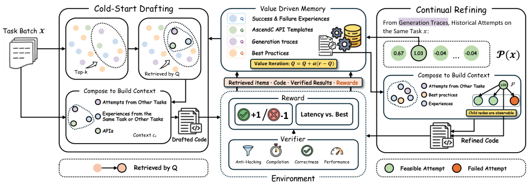
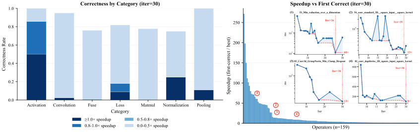
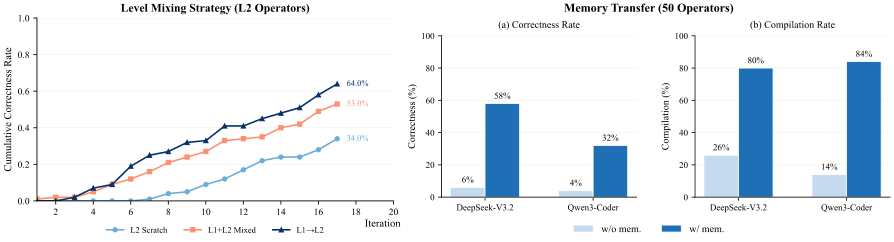
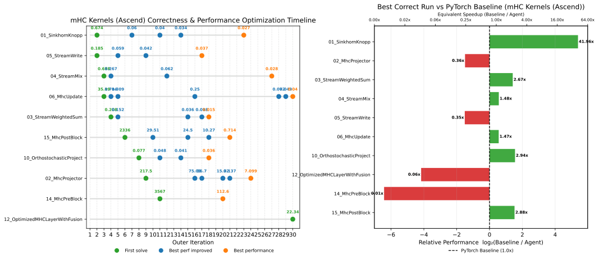
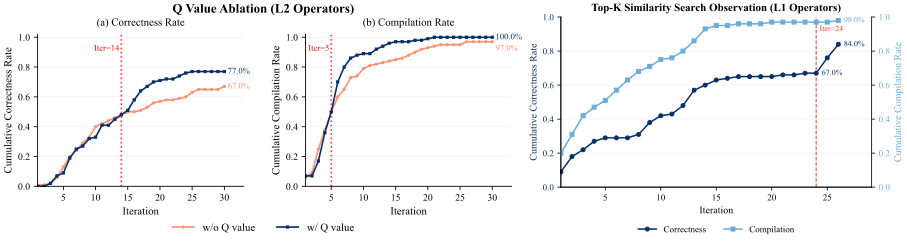

# 从冷启动到持续进化：EvoKernel 如何让大模型学会 NPU Kernel 合成

这篇论文要解决一个非常现实的问题：大模型在 CUDA 这种“数据富矿”平台上写 Kernel 很强，但一到 Ascend C 这类数据稀缺的 NPU 生态，性能就会断崖式下滑。作者提出的 EvoKernel 不依赖昂贵 SFT，也不改模型参数，而是用“可进化记忆 + 价值驱动检索”的 Agent 框架，把 Kernel 生成拆成两个阶段：先写对，再写快。

---

## 问题背景：为什么 NPU Kernel 合成是“冷启动地狱”？

在新兴 DSA（Domain-Specific Architecture）上，公开代码少、文档碎片化、工具链反馈复杂，形成了典型的 Data Wall。论文中的对比非常直观：同一批前沿模型在 CUDA 上 `pass@4` 很高，但迁移到 Ascend C 后几乎失效。

| 模型 | CUDA L1 Correctness | Ascend C L1 Correctness | Ascend C L2 Correctness |
|---|---:|---:|---:|
| GPT-5.2 | 92.0% | 14.0% | 2.0% |
| DeepSeek-V3.2 | 50.0% | 8.0% | 0.0% |
| Qwen3-Coder-30B | 46.0% | 7.0% | 0.0% |

核心矛盾是：
- SFT 需要大量专家标注，成本过高。
- 参数化 RL 的样本复杂度高，还可能遗忘通用能力。
- 传统 RAG 在稀疏知识库中的检索质量不稳定。

---

## EvoKernel 总览：把 Kernel 合成建模成“带记忆的 RL”

> 图解：左侧是冷启动 Drafting，先从记忆里取上下文生成“可行初稿”；中间是多门验证器（反作弊、编译、正确性、时延）返回奖励并更新记忆价值；右侧是 Continual Refining，围绕可行起点持续做 latency 优化。整条链路不是一次性生成，而是“生成-验证-记忆更新-再生成”的闭环。

论文将过程形式化为 Memory-based MDP。状态不仅包含任务本身，还包含动态生成状态（如当前最好 latency）。记忆随交互持续增长：

$$
\mathcal{M}_{t+1} = \mathcal{M}_t \cup \{(s_t, a_t, r_t)\}
$$

策略被分解成两层：

$$
\pi(a_t \mid s_t, \mathcal{M}_t) = G_\theta(a_t \mid s_t, c_t)\cdot \mu(c_t \mid s_t, \mathcal{M}_t)
$$

- $G_\theta$：LLM 生成策略（参数固定，不微调）。
- $\mu$：检索策略（论文重点优化对象）。

---

## 核心创新：Value-Driven Retrieval（不是相似度检索，而是“有用性检索”）

EvoKernel 为不同阶段学习不同 Q 值：
- $Q_1$：某条记忆能否帮助“先生成可行 Kernel”。
- $Q_2$：某条记忆能否帮助“进一步降低时延”。

检索流程是先 Dense Retrieval 得到 top-$K$ 候选，再按 Q 值筛成最终 top-$N$ 上下文。并且使用统一的 Monte-Carlo 更新：

$$
Q(s,m)\leftarrow Q(s,m)+\alpha \cdot (r-Q(s,m))
$$

这点很关键：它让系统能在“当前模型能力 + 当前任务阶段”下动态判断记忆价值，而不是静态依赖语义相似度。

---

## 两阶段机制：先过可行性，再追性能

### 阶段一：Cold-Start Drafting

目标是拿到第一个可行解（反作弊、编译、正确性同时通过）。奖励非常直接：

$$
r_{1,t}=
\begin{cases}
+1, & g_{\text{feas}}(o_t)=1\\
-1, & \text{otherwise}
\end{cases}
$$

这本质上是“可行性驱动”的探索过程。

### 阶段二：Continual Refining

有了可行初稿后，优化目标切到 latency。奖励是相对最好历史结果的改进：

$$
r_{2,t}=
\begin{cases}
-1, & g_{\text{feas}}(o_t)=0\\
\tanh(\log b_t - \log \ell_{\text{lat}}(o_t)), & g_{\text{feas}}(o_t)=1
\end{cases}
$$

再做在线归一化，减少奖励尺度漂移。这样可以在保证可行性的前提下稳定推进性能优化。

---

## 多门验证器：把“写对”定义得非常严格

验证器输出：

$$
o_t = (g_{\text{hack}}, g_{\text{comp}}, g_{\text{corr}}, \ell_{\text{lat}})
$$

只有当 $g_{\text{hack}} \wedge g_{\text{comp}} \wedge g_{\text{corr}}=1$ 才算可行。  
这里的 anti-hacking 很有意思：不仅查规则（禁止在 Python/C++ glue 层偷算），还用 LLM 审计是否“把数学逻辑真正写进 kernel”。

---

## 主实验结果：冷启动被显著打通

在 Ascend C KernelBench（每算子预算 30 次）上，EvoKernel 的提升非常明显，尤其配合强基座模型时。

| 模型 | 方法 | Overall CR | Overall Acc |
|---|---|---:|---:|
| GPT-5.2 | Pass@k | 24.5% | 11.0% |
| GPT-5.2 | Refinement | 71.5% | 22.0% |
| GPT-5.2 | Codex | 83.0% | 46.0% |
| GPT-5.2 | EvoKernel | **98.5%** | **83.0%** |

论文最核心结论之一：从 Round 1 到最终，GPT-5.2 的 Acc 从 4.0% 提升到 83.0%，说明“经验可积累的记忆检索”在冷启动场景里有效。

---

## 持续优化效果：不仅能写对，还能越改越快

> 图解：左图按算子类别展示 speedup 分布分层；右图展示每个算子从“首个正确版本”到“预算内最优版本”的提升轨迹。横轴是算子/迭代，纵轴是 speedup，长尾明显，说明少数算子可获得极大收益。

在已解决算子上，Refining 阶段相对初稿达到：
- 中位数加速：$3.60 \times$
- 四分位区间：$1.38 \times$ 到 $10.05 \times$
- 部分算子超过 $200 \times$（相对首个可行版本）

---

## 记忆迁移能力：从“会一道题”到“会一类题”

> 图解：左图是跨难度迁移曲线，纵轴是 L2 累积成功率；右图是跨基座模型迁移，显示 GPT-5.2 构建的记忆可被弱模型复用，显著提升编译率与正确率。

跨难度对比（L2 最终）：

| 设置 | CR | Acc |
|---|---:|---:|
| L2 Scratch | 88.0% | 34.0% |
| L1+L2 Mixed | 98.0% | 53.0% |
| L1→L2 | 97.0% | **64.0%** |

跨模型迁移也成立：用 GPT-5.2 记忆初始化后，DeepSeek/Qwen 的编译率和正确率都显著上涨，说明记忆中沉淀的是较“骨干无关”的调试线索与结构约束。

---

## 超出主基准的泛化：Attention Set 与 mHC

> 图解：左图展示 mHC 任务随迭代的正确性和性能优化进程；右图给出每个算子相对基线的 $\log_2$ speedup。可以看到不少算子进入明显正加速区间。

扩展结果（节选）：
- Attention Set（CUDA, 70 ops）：CR 100%，Acc 97.1%
- Attention Set（Ascend, 70 ops）：CR 100%，Acc 78.6%
- mHC（Ascend, 15 ops）：CR 86.7%，Acc 66.7%，其中 60% 的算子优于 PyTorch 基线

这说明方法不是死记 KernelBench 模板，而是能迁移到新算子族和新架构模式。

---

## 消融：为什么必须是 Value-Driven，而不是 Heuristic？

> 图解：左图对比价值检索与启发式检索在 L2 上的累积表现，前期接近，后期价值检索拉开差距；右图展示候选池大小对收敛的影响，池子适度放大后可挖到更高价值记忆。

结论很直接：
- 早期 bootstrap 阶段，两者都能起步。
- 后期长尾难题上，学习到的 Q 值是关键 exploitation 信号。
- 共享全局记忆相对单任务 Refinement 有显著增益，尤其在 L2。

---

## Appendix 里的理论与工程亮点（长文模式重点）

### 1) 理论保证：Q 更新稳定、可收敛

论文在附录给了三个层面的保证：
- 奖励有界时，$Q_t$ 始终有界。
- 在线均值方差估计在平稳遍历条件下收敛，归一化映射稳定。
- 常步长下收敛到稳态分布；递减步长满足 Robbins-Monro 条件时，几乎必然收敛到期望回报。

这让 Value-Driven Memory 不只是工程技巧，也有理论可解释性。

### 2) 反作弊设计非常务实

规则层 + 模型审计层双重门控，核心是保证“数学逻辑发生在 kernel/tiling 层”，而不是在 Python bind 层用 torch/ATen 偷算。  
这对代码生成评测很重要，否则 Correctness 可能被投机实现污染。

### 3) 评测反馈粒度高

不仅返回 pass/fail，还返回 shape mismatch、数值误差 bounding box、超时、OOM、向量核异常等结构化信号。  
这些细粒度反馈正是 Agent 在后续迭代中做有效修复和优化的基础。

---

## 总结：这篇工作的真正价值

EvoKernel 的核心价值不只是把某个 benchmark 做高，而是证明了一个更通用的范式：  
在“数据稀缺 + 验证信号明确（二值或可度量）”的任务里， **不改模型参数** 的记忆驱动 RL 检索，能让通用大模型逐步获得领域能力。

对 NPU Kernel 合成来说，这意味着一条现实路径：
- 冷启动可行（先把正确率拉起来）
- 持续进化可行（再把 latency 压下去）
- 经验可迁移（跨任务、跨难度、跨模型复用）

> 本文参考自 [Towards Cold-Start Drafting and Continual Refining: A Value-Driven Memory Approach with Application to NPU Kernel Synthesis](https://arxiv.org/abs/2603.10846)