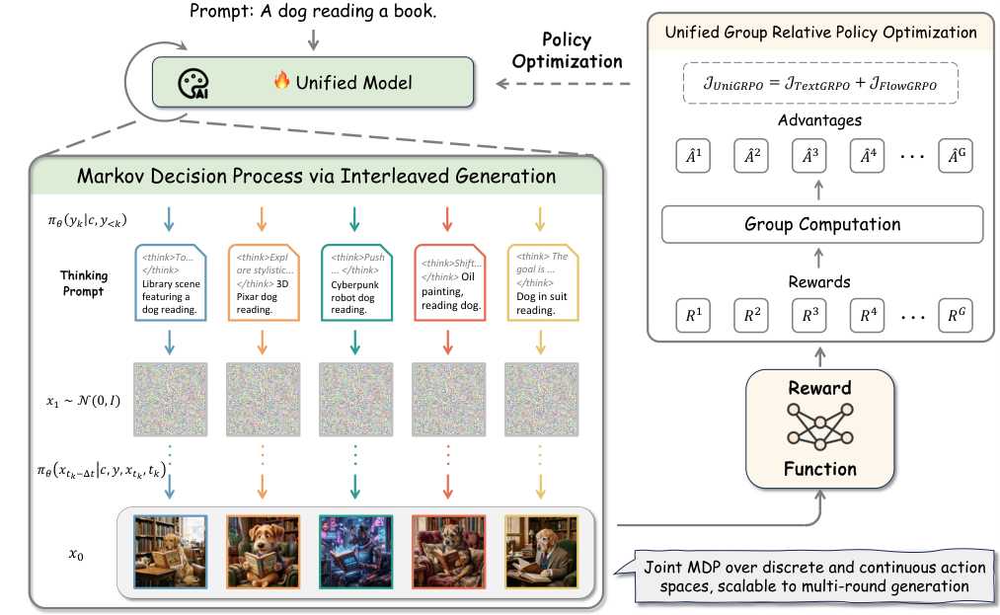
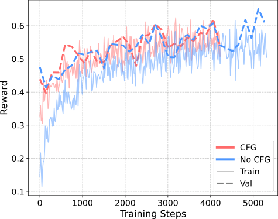
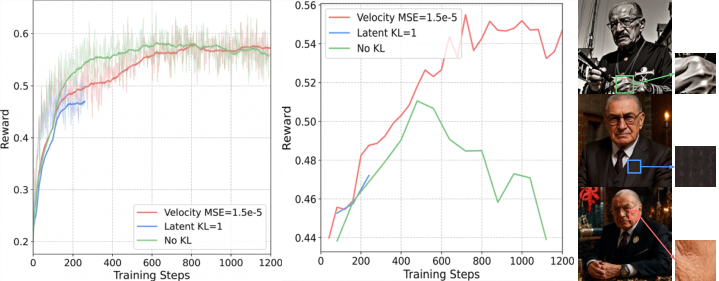
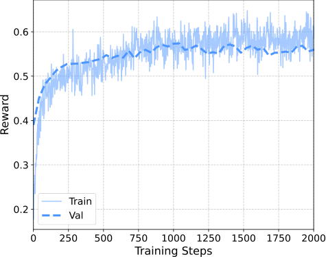
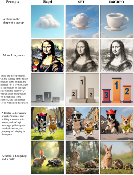
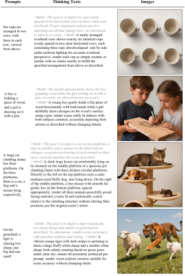

# UniGRPO 论文深度解读：把「思维链」和「图像生成」放进同一个 RL 回路

## 这篇论文在解决什么问题？

现在很多统一多模态模型都在做一件事：先“想”（文本推理），再“画”（图像生成）。  
问题是，这两步通常分开优化：文本用 LLM 的 RL 方法，图像用 diffusion/flow 的 RL 方法，彼此目标不一致，容易出现“想得好但画不好”或“画得好但推理无用”。

这篇 UniGRPO 的核心思路很直接：把 `Prompt -> Thinking -> Image` 当成一个完整决策过程，用一个统一的 Reinforcement Learning 框架一起优化。

---

## 先看整体框架：一个 MDP，两个动作空间

> 图解：这张图展示了 UniGRPO 的统一建模方式。前半段是离散文本动作（逐 token 生成推理链），后半段是连续视觉动作（逐步去噪 latent）。两段共享同一个终局奖励，并通过组内相对优势统一回传梯度。

作者把整个流程建模为 MDP：

- 状态 $s$
  - 文本阶段：$s_k^{txt} = (c, y_{<k})$
  - 图像阶段：$s_k^{img} = (c, y, x_{t_k}, t_k)$
- 动作 $a$
  - 文本阶段：从词表采样 token
  - 图像阶段：预测下一个去噪 latent
- 转移：给定动作基本确定
- 奖励：只有最终图像给稀疏终止奖励，中间步骤奖励为 0

这就把“思考 + 绘图”变成了一个可联合优化的策略学习问题。

---

## 方法细节：UniGRPO = Text GRPO + Flow GRPO（再加两处关键改造）

### 1) 文本端：标准 GRPO

文本端沿用 GRPO 的组内相对优势：

$$
\hat{A}_i = \frac{R_i - \mathrm{mean}(\{R_j\}_{j=1}^{G})}{\mathrm{std}(\{R_j\}_{j=1}^{G})}
$$

直觉上就是：同一组样本里，谁最终图像奖励更高，谁的推理链就被强化。

### 2) 图像端：FlowGRPO（SDE 采样 + RatioNorm）

Flow matching 原本是确定性 ODE，不利于 RL 探索。论文采用 SDE 形式给采样加噪声，从而可做策略优化。  
同时引入 RatioNorm，修正 diffusion/flow 里 importance ratio 分布偏移，避免 clipping 失效导致 reward hacking。

### 3) 统一目标函数

$$
\mathcal{J} = \mathcal{J}_{\text{Text}} + \lambda \mathcal{J}_{\text{Flow}}
$$

文中统一设 $\lambda = 1$，强调“推理和生成同等重要”。

---

## 论文真正的创新点：不是“拼接”，而是“可扩展的训练设计”

作者强调“最小设计原则”，但有两刀很关键：

### (a) 去掉 CFG（Classifier-Free Guidance）

传统 CFG 在每步要做条件/无条件多次前向，遇到多条件编辑、多轮交互会爆炸。  
UniGRPO 训练时直接不用 CFG，保持线性、无分叉 rollout，这对未来多轮 interleaved generation 很关键。

> 图解：横轴是训练步数，纵轴是 reward/性能指标。图中结论是：训练阶段去掉 CFG 并不会伤最终效果（评测时仍可加 CFG），反而让训练路径更干净、成本更低。

### (b) 用速度场 MSE 取代 latent KL 正则

论文指出 latent KL 的天然权重与噪声方差相关，不同时间步约束强度不一致，给 reward hacking 留漏洞。  
因此改成直接约束速度场：

$$
\mathcal{L}_{\text{MSE}}(\theta) =
\left\| v_{\theta}(x_{t_k}, t_k, y) - v_{\text{ref}}(x_{t_k}, t_k, y) \right\|^2
$$

核心收益：在所有噪声水平上都保持一致约束，更稳地贴住基座模型先验。

> 图解：左中右分别是训练 reward、验证 reward、生成样例。无正则会出现典型“指标涨、图像坏”的 hacking；latent KL 也会出现网格伪影；速度场 MSE 曲线最稳、视觉质量最好。

---

## 实验结果：联合优化明显优于单边优化

### 主结果（TA + GenEval）

论文表格结论很明确：

- `UniGRPO`：TA = **0.8381** ，GenEval = **0.90** （最优）
- `FlowGRPO` 或 `TextGRPO` 单独优化都不如联合
- `UniFPO` 直接训练崩溃（未收敛）

这说明一个重要点：  
在“先想后画”的链路里，只优化图像或只优化文本都不够，必须让推理策略和生成策略共享同一奖励闭环。

### 训练动态与可视化结果

> 图解：横轴为 gradient update steps，纵轴为训练/验证 reward。曲线整体稳定上升，说明在稀疏终止奖励下，统一策略优化仍然可收敛。

> 图解：这是定性对比图。原始 Bagel 容易过饱和和合成感强；SFT 虽减少伪影但偏糊；UniGRPO 在细节、真实感和文本一致性上更均衡。

---

## 附录里值得关注的复现信息

### 1) GenEval 分项表现

论文给了六类分项（Single/Two Objects、Counting、Colors、Position、Attribute Binding）。  
UniGRPO 的 overall 最高，且在计数、属性绑定等复杂组合能力上保持领先，说明不是“刷单一指标”。

### 2) 关键超参数（复现实用）

- Group size: 24
- Batch size: 32
- Text LR: $1 \times 10^{-6}$
- Denoising LR: $3 \times 10^{-5}$
- PPO epochs: 2
- 图像分辨率：1024
- SDE window: [0, 5]
- MSE loss weight: $1.5 \times 10^{-5}$

这套配置体现了一个工程取向：文本端保守更新，图像端较大学习率，靠 MSE 正则稳住分布漂移。

---

## 我对这篇工作的判断

UniGRPO 的价值不在“再提一个 RL 名词”，而在于它把统一模型 post-training 的工程路径跑通了：

- 用一个 MDP 打通离散 token 与连续去噪动作
- 用统一优势信号连接“思考质量”和“成图质量”
- 用去 CFG + 速度场 MSE 解决可扩展性与稳定性

如果未来要做多轮编辑、视觉对话、长程图文交互，这篇方法很可能是可落地的 baseline 之一。  
论文也坦承当前仍是终止奖励范式，下一步关键就是 Multimodal Process Reward Model（对中间推理过程打分），这会决定样本效率和可解释性上限。

> 图解：图中展示了推理文本和最终图像的对应关系。UniGRPO 的 reasoning 更任务导向，不再是“冗长但无用”的思维链，而是直接服务图像生成决策。

---

> 本文参考自 [UniGRPO: Unified Policy Optimization for Reasoning-Driven Visual Generation](https://arxiv.org/abs/2603.23500)