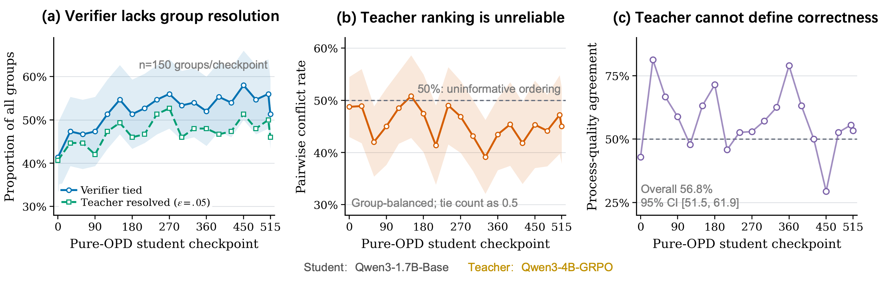
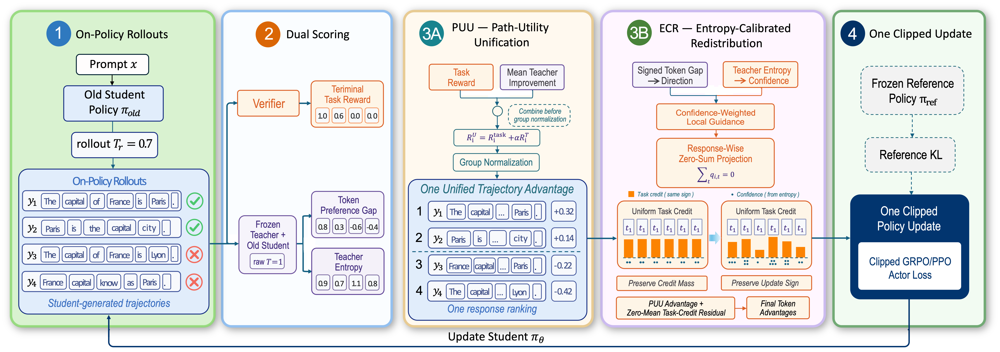
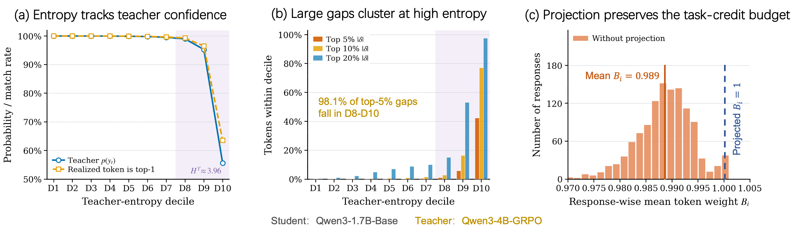
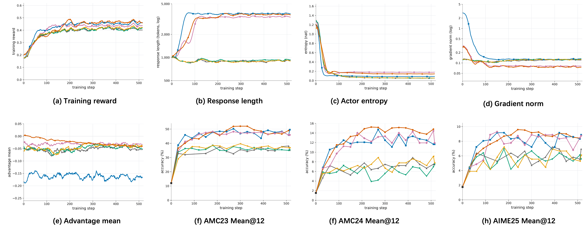
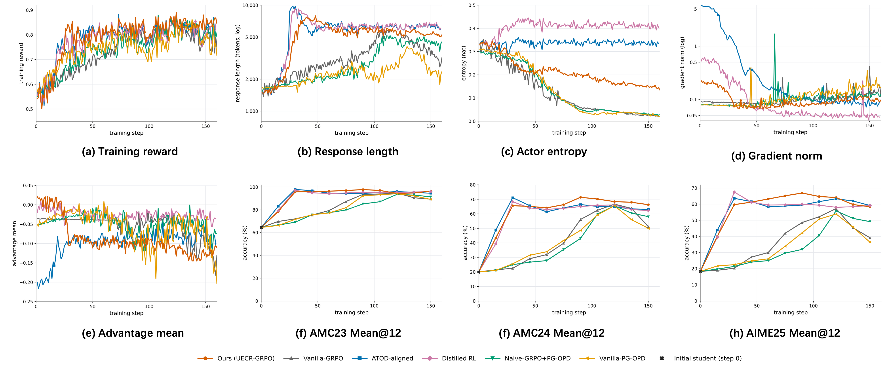
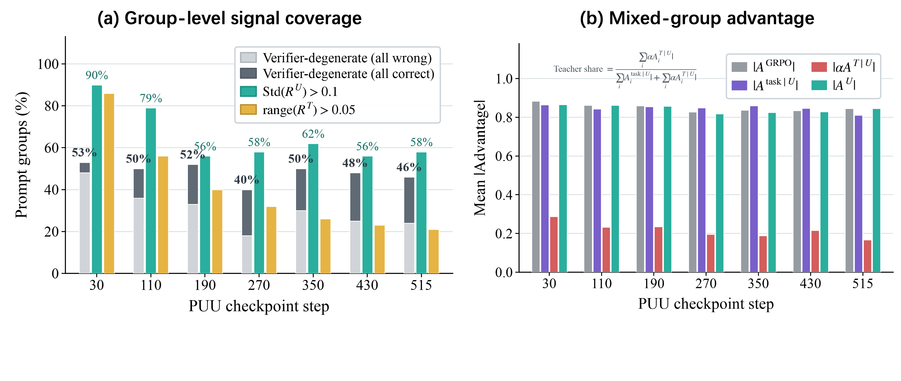
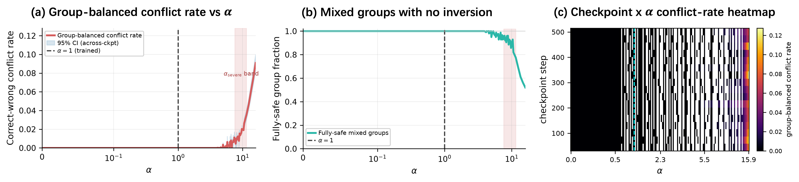
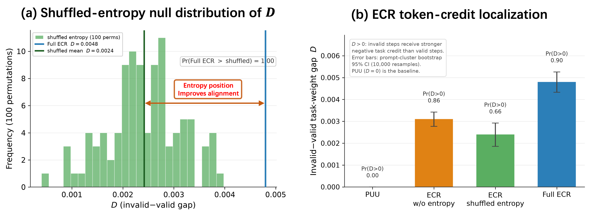

# 何时、何地信任 Teacher：用熵校准的信用分配统一 On-Policy 蒸馏与 GRPO

在数学推理的强化学习训练中，我们一直面临一个"信号两难"：Verifier（验证器）能告诉我们一条回答 **对不对**，但说不清 **哪一步对、哪一步错**；Teacher 模型能在每个 token 上给出稠密的偏好反馈，但它的偏好并不等同于正确性。这篇来自上海交通大学与浙江大学的论文提出了 UECR-GRPO（Unified Entropy-Calibrated Credit Redistribution for GRPO），用两个相互配合的模块——轨迹级的 PUU 和 token 级的 ECR——把 Verifier 与 Teacher 两种信号在同一个 GRPO 式更新中有机地统一起来。下面我们按照"提出问题 → 分析问题 → 解决问题 → 实验验证 → 结论展望"的逻辑来完整解读这篇工作。

## 一、提出问题：粗粒度信用与不可信的 Teacher

### GRPO 的信用分配困境

基于可验证奖励的强化学习（RLVR）已经成为激发语言模型数学推理能力的主流路线。其中 GRPO（Group Relative Policy Optimization）尤其受欢迎：它不需要训练 Value Model，而是对同一个 prompt 采样 $G$ 条回答，用组内奖励的相对高低来构造优势函数：

$$
A_i^{\mathrm{GRPO}} = \frac{R_i^{\mathrm{task}} - \operatorname{Mean}_{j \le G} R_j^{\mathrm{task}}}{\operatorname{Std}_{j \le G}(R_j^{\mathrm{task}}) + \epsilon}
$$

这个设计有两个根深蒂固的缺陷：

- **信用广播（Credit Broadcasting）**：一个标量优势被原封不动地广播到回答中的每一个 token。于是，一个决定性的代数变形步骤、一个无关痛痒的语气词、以及第一条出错的推理步骤，收到的是 **完全相同** 的更新信号。
- **组内信号消失**：当组内所有回答的二值奖励完全相同（全对或全错，即 verifier-degenerate group）时，组内相对优势直接归零，这批样本对训练毫无贡献。

### OPD 的互补性与不可信性

On-Policy Distillation（OPD，在线策略蒸馏）提供了天然的互补信号：一个更强的 Teacher 模型对 **学生自己生成的前缀** 逐 token 打分，因此反馈恰好落在学生实际访问的状态上，密度极高。在状态 $s_{i,t} = (x, y_{i,<t})$ 处，Teacher 相对于行为策略 $\pi_{\mathrm{old}}$ 的原始温差 log 概率差定义为：

$$
\delta_{i,t} = \log \pi_{\mathrm{T}, T=1}(y_{i,t} \mid s_{i,t}) - \log \pi_{\mathrm{old}, T=1}(y_{i,t} \mid s_{i,t})
$$

但论文反复强调一个关键观点：**稠密偏好 ≠ 过程正确性**。正的 gap 只能说明 Teacher 比旧学生更看好这个 token，它不能证明这个 token 数学上有效、因果上重要，或者属于一条最终成功的回答。Teacher 可能偏爱一条最终错误的路径，可能打压一种陌生但合法的推导方式，也可能只传递了"风格"而非"数学实质"。

### 用数据说话：Verifier 与 Teacher 不可互相替代

> 图解：作者跨 19 个 Pure-OPD 训练 checkpoint 做了系统诊断（每个 checkpoint 对 150 个 prompt 各采样 8 条回答）。图 (a) 显示 verifier-degenerate 组（组内奖励全同）中，有 84.3%–98.4% 的组其 Teacher 分数范围超过阈值 $\epsilon_{\mathrm{gap}} = 0.05$，即 Teacher 能在 Verifier 失效处提供区分度；但图 (b) 显示，在"一对一错"的回答对上，Teacher 给出的排序与 Verifier 正确性冲突的比例高达 39.1%–50.8%；图 (c) 进一步显示，在 347 对 Verifier 打平的回答对中，Teacher 偏好与盲审的过程质量评判（Opus 4.8）一致率仅为 56.8%。结论：Teacher 信号有信息量，但既不能替代终局验证，也不是可靠的过程质量标签——这就是"何时信任 Teacher"的实证基础。

## 二、分析问题：现有组合方式的根本缺陷

近年已有不少方法尝试把 GRPO 与 Teacher 监督结合起来，论文把它们归纳为三类，并指出了各自的核心问题：

1. **独立目标相加（Independent Objectives）**：把分别裁剪（clip）过的 GRPO loss 和 OPD loss 直接相加。由于裁剪是非线性操作，"两个裁剪后的 loss 之和"不等于"先合并证据再裁剪"，Teacher 证据完全无法影响 GRPO 优势所依赖的奖励排序。
2. **归一化之后整合（Post-normalization Integration）**：ATOD 把 OPD 的 token 级优势加到 **已经归一化好** 的 GRPO 优势上；Distilled RL 则用归一化的 Teacher 比率去 **乘性加权** 正的 GRPO 优势（GRPO 优势为零时更新直接归零）。它们确实是整合式更新，但 Verifier 排序在 Teacher 信息进入之前就已经固定了。
3. **归一化之前的轨迹统一（Pre-normalization Unification）——即本文路线**：先把 Verifier 奖励和 Teacher 证据合并成单一的 **回答级效用**，再做组内相对优势计算；token 级信用则通过单独的重分配机制处理。

这个分类正是全文的"题眼"：Teacher 证据应该在 **什么时候**（归一化前还是后）以及 **在什么地方**（轨迹级还是 token 级）进入更新。

## 三、解决问题：UECR-GRPO 的两层设计

> 图解：UECR-GRPO 的整体流水线。左侧的 PUU（Path-Utility Unification）先把 Verifier 奖励 $R^{\mathrm{task}}$ 与 Teacher 相对锚点的改进量 $R^T$ 合并成统一效用 $R^U = R^{\mathrm{task}} + \alpha R^T$，再做组内归一化得到轨迹级优势 $A^U$；右侧的 ECR（Entropy-Calibrated Redistribution）只改动其中 Verifier 来源的分量：用带符号的 Teacher gap 定方向、用 Teacher 全词表熵定置信度、再用响应内零和投影做重分配，最终得到 token 级优势 $A_{i,t}^{\mathrm{final}}$。两层解耦使得实验可以分别回答两个独立问题：归一化前的轨迹统一是否有用？受约束的 token 定位是否在此之上还有增益？

### 3.1 PUU：路径效用统一

#### 从 token 比到路径比：一个精确的恒等式

把每条回答看作一条自回归路径。由自回归分解，token 级 log 比率之和恰好等于路径级的 log 密度比（论文附录 Lemma 1，"望远镜求和"）：

$$
\sum_{t=1}^{L} \log \frac{\pi_T(y_t \mid x, y_{<t})}{\pi_0(y_t \mid x, y_{<t})} = \log \frac{P_T(y \mid x)}{P_0(y \mid x)}
$$

这意味着 OPD 信号的累加并不是一个"拍脑袋的辅助 loss"，而是一个 **精确的** 路径对数密度比——Teacher 相对锚点策略 $P_0$ 对整条路径的偏好程度。

#### 统一的 KL 正则目标与 Gibbs 最优解

对任意候选路径分布 $Q$，定义联合目标：

$$
J(Q) = \mathbb{E}_{y \sim Q}\left[ R_{\mathrm{task}}(x, y) + \alpha \log \frac{P_T(y \mid x)}{P_0(y \mid x)} \right] - \beta \, \mathrm{KL}\left( Q(\cdot \mid x) \, \| \, P_0(\cdot \mid x) \right)
$$

三项各司其职：Verifier 指定任务效用，log 比率度量 Teacher 相对锚点的改进，KL 项约束对锚点的偏离。该目标有唯一的 Gibbs 最优解（附录 Proposition 2，用 $\mathrm{KL}(Q \| Q^*) \ge 0$ 即可证明）：

$$
Q^*(y \mid x) \propto \exp\left( \frac{R_{\mathrm{task}}(x, y)}{\beta} \right) P_T(y \mid x)^{\alpha / \beta} P_0(y \mid x)^{1 - \alpha / \beta}
$$

这个最优目标分布有几个漂亮的退化性质（附录 Corollary 3）：

- $\alpha = 0$：退化为标准的 KL 正则奖励倾斜（reward-tilted）RL；
- $R_{\mathrm{task}} = 0$ 且 $\alpha = \beta$：恰好恢复 Teacher 分布 $P_T$，即纯蒸馏；
- $R_{\mathrm{task}} = 0$ 且 $\alpha > \beta$：得到沿"Teacher 优于锚点"方向的 **外推** 分布；
- 两项同时激活时，任务奖励与 Teacher 偏好共同塑造同一个目标分布。

作者也诚实地指出：这些是 **目标分布层面** 的性质，并不声称有限样本、带裁剪的实际算法与对应的训练过程完全等价。

#### On-policy 的组相对实现

直接在全体语言路径上归一化是不可行的。实际算法中每轮令 $P_0 = P_{\mathrm{old}}$，从 $\pi_{\mathrm{old}}$ 采样 $G$ 条回答，用 $\pi_T$ 与 $\pi_{\mathrm{old}}$ 给已实现的 token 打分。由于精确的路径奖励是随长度机械增长的 token 和，论文改用 **长度归一化** 的替代量：

$$
R_i^T = \frac{\sum_t m_{i,t} \delta_{i,t}}{\sum_t m_{i,t}}, \qquad R_i^U = R_i^{\mathrm{task}} + \alpha R_i^T
$$

其中 $m_{i,t}$ 是有效回答 token 的掩码。然后对统一效用做组内归一化：

$$
\mu_U = \frac{1}{G} \sum_{j=1}^{G} R_j^U, \quad \sigma_U = \operatorname{Std}_{j=1}^{G}(R_j^U), \quad A_i^U = \frac{R_i^U - \mu_U}{\sigma_U + \epsilon}
$$

这样 Teacher 证据就能在裁剪更新之前 **改变采样回答之间的排序**——这正是 post-normalization 方法做不到的。对于 verifier-degenerate 组，统一优势近似退化为组标准化的 OPD 分数，信号不再消失。

#### 精确的加法分解

为给 token 级重分配做准备，统一优势被分解为共享同一分母的两个分量：

$$
A_i^{\mathrm{task} \mid U} = \frac{R_i^{\mathrm{task}} - \mu_{\mathrm{task}}}{\sigma_U + \epsilon}, \qquad A_i^{T \mid U} = \frac{R_i^T - \mu_T}{\sigma_U + \epsilon}
$$

由于中心化是线性的，$A_i^U = A_i^{\mathrm{task} \mid U} + \alpha A_i^{T \mid U}$ **精确成立**（附录 Proposition 4，一行可证：$\mu_U = \mu_{\mathrm{task}} + \alpha \mu_T$，除以共同分母即得）。共享分母保证了系数 $\alpha$ 的语义不变；若两个奖励各自标准化，有效系数会随每组的统计量漂移。

### 3.2 ECR：熵校准的信用重分配

PUU 解决了轨迹排序，但它仍然把一个标量广播到所有 token。ECR 要回答"**在哪里**信任 Teacher"，其设计动机来自一组初始化时刻的诊断实验。

> 图解：作者用 1.7B 学生对 300 个训练 prompt 各采样 8 条回答（共 2400 条、2155 万有效 token），在冻结的 4B Teacher 下逐 token 评估。图 (a) 按 Teacher 熵分层，显示高熵前缀处 Teacher 给已实现 token 的概率更低、top-1 匹配率更差——高熵意味着 Teacher 自己也不确定；图 (b) 显示大的 Teacher–旧策略 log 概率 gap 主要集中在高熵区间（top-10% 的大 gap 中有 82.4% 落在最高熵四分位）；图 (c) 显示如果直接拿这些局部信号当 token 权重，响应内的算术平均值会偏离 1（未投影时在 0.98–1.02 间漂移），也就是 **不仅重分配、还悄悄改变了任务信用总量**。这两个观察直接催生了 ECR 的两个机制：熵校准 + 零和投影。

#### 方向与置信度

设 $s_i = \operatorname{sign}(A_i^{\mathrm{task} \mid U})$。ECR 用 Teacher gap 构造有界的局部方向，并用 Teacher 的不确定性进行衰减：

$$
d_{i,t} = \tanh\left( \frac{s_i \, \delta_{i,t}}{2 \tau_\delta} \right), \qquad c_{i,t} = \exp\left( -\frac{H^T_{i,t}}{\tau_H} \right)
$$

其中 $H^T_{i,t}$ 是冻结 Teacher 在当前前缀下的全词表熵，$\tau_\delta$ 控制方向随 gap 饱和的速度，$\tau_H$ 控制熵衰减的强度。gap 越大方向越强，熵越高置信度越低。

这套设计的精妙之处体现在四种情形（对应原文 Table 2）：

- $A_i^{\mathrm{task} \mid U} > 0$（好回答）：Teacher 偏好的 token（$\delta > 0$）获得 **更强** 的正信用，Teacher 不看好的 token 获得的正信用被削弱；
- $A_i^{\mathrm{task} \mid U} < 0$（坏回答）：符号翻转，Teacher 偏好的 token 收到 **没那么负** 的任务信用——但注意，它只是"少扣分"，并不会变成正的模仿目标。

熵只影响调整的力度，不决定方向，也不判定对错。

#### 零和响应内投影

直接把局部信号当权重会改变任务信用总量。ECR 改为减去置信度加权的响应均值：

$$
\mu_i^c = \frac{\sum_t m_{i,t} c_{i,t} d_{i,t}}{\sum_t m_{i,t} c_{i,t}}, \qquad q_{i,t} = \tfrac{1}{2} m_{i,t} c_{i,t} (d_{i,t} - \mu_i^c), \qquad w_{i,t} = 1 + \rho \, q_{i,t}, \quad 0 \le \rho < 1
$$

附录 Proposition 5 证明这是带零和约束的加权最小二乘投影的 **闭式唯一解**；Proposition 6 进一步证明了两条不变量：由于 $\sum_t q_{i,t} = 0$，权重 $w_{i,t}$ 在有效 token 上的算术均值 **恒等于 1**（实测数值误差不超过 $2.22 \times 10^{-16}$）；又因 $|q_{i,t}| \le 1$ 且 $\rho < 1$，所有权重恒正，每个 token 的任务分量符号保持不变。注意这与 Distilled RL 的几何均值归一化有本质区别：策略梯度实际依赖的是算术均值 $L_i^{-1} \sum_t w_{i,t}$，ECR 保持的正是这个量。

#### 最终优势与目标函数

最终 token 级优势把零均值的重分配残差加到 PUU 优势上：

$$
A_{i,t}^{\mathrm{final}} = A_i^U + \rho \, A_i^{\mathrm{task} \mid U} q_{i,t} = A_i^{\mathrm{task} \mid U} (1 + \rho \, q_{i,t}) + \alpha A_i^{T \mid U}
$$

这个形式清楚表明：**ECR 只重分配 Verifier 来源的分量，PUU 引入的 Teacher 分量原封不动**。Actor 最小化：

$$
\mathcal{L} = \mathcal{L}_{\mathrm{PG}}(A^{\mathrm{final}}) + \beta_{\mathrm{ref}} \, \mathcal{L}_{\mathrm{low\text{-}var\text{-}KL}}
$$

其中 $\mathcal{L}_{\mathrm{PG}}$ 是标准的 PPO 裁剪代理损失（rollout 温度 $T_r = 0.7$，而 Teacher gap 用原始温度 $T = 1$），参考 KL 只进 actor loss，不进任何奖励。当 $\rho = 0$、或置信度处处为零、或响应内方向全同，方法精确退化为 PUU——作者在实现中用回归测试验证了这些退化路径。

## 四、实验验证

### 4.1 设置

- **1.7B 档位**：Qwen3-1.7B-Base 学生 + 冻结的 Qwen3-4B-GRPO Teacher，在 DeepMath-103K 难度 5–7 子集上训练 515 步；
- **4B 档位**：Qwen3-4B 学生 + 冻结的 Qwen3-8B-Math-GRPO Teacher，难度 6–8 子集，训练 160 步；
- 每 prompt 采样 $G = 8$ 条，全局 batch 126，非思考模式；rollout 与 PPO 重要性比率用 $T_r = 0.7$，Teacher 打信用 $T = 1$；
- **基线**：Vanilla GRPO、Vanilla PG-OPD、Naive-GRPO+PG-OPD（独立 loss 相加）、Distilled RL、ATOD-aligned（单回答对齐版）；
- **评测**：AIME 2024 / 2025、AMC 2023、HMMT 2025 Feb / Nov 五个基准的 Avg@12 准确率。

### 4.2 主结果

| 方法 | AIME24 | AIME25 | AMC23 | HMMT25-Feb | HMMT25-Nov | 平均 |
| --- | --- | --- | --- | --- | --- | --- |
| **Qwen3-1.7B 学生 / Qwen3-4B-GRPO Teacher** | | | | | | |
| 初始学生 | 1.53 | 1.75 | 12.02 | 0.00 | 1.94 | 3.45 |
| Vanilla-GRPO | 7.78 | 6.39 | 37.50 | 0.28 | **5.28** | 11.45 |
| Vanilla-PG-OPD | 9.17 | 7.22 | 39.69 | 0.28 | 4.72 | 12.22 |
| Naive-GRPO+PG-OPD | 7.50 | 6.94 | 38.54 | 0.28 | 3.89 | 11.43 |
| Distilled RL | 14.44 | 9.31 | 48.23 | 4.44 | 4.17 | 16.12 |
| ATOD-aligned | 14.72 | 9.17 | 50.21 | 4.17 | 3.33 | 16.32 |
| **UECR-GRPO** | **15.24** | **9.59** | **52.04** | **4.72** | 4.44 | **17.21** |
| **Qwen3-4B 学生 / Qwen3-8B-Math-GRPO Teacher** | | | | | | |
| Vanilla-GRPO | 66.67 | 57.22 | 94.79 | 36.67 | 44.44 | 59.96 |
| Vanilla-PG-OPD | 65.56 | 53.89 | 94.17 | 31.94 | 42.50 | 57.61 |
| Naive-GRPO+PG-OPD | 65.56 | 55.83 | 93.54 | 33.61 | 44.72 | 58.65 |
| Distilled RL | 68.33 | **67.50** | 97.08 | 40.83 | **48.89** | 64.53 |
| ATOD-aligned | 71.11 | 63.61 | **97.92** | 40.28 | 48.06 | 64.20 |
| **UECR-GRPO** | **71.39** | 66.94 | 97.78 | **41.01** | 48.33 | **65.09** |

两个尺度上 UECR-GRPO 都拿下五基准平均第一：1.7B 档平均 17.21%，超过最强的 ATOD-aligned 0.89 个百分点（且在五个基准中的四个领先）；4B 档平均 65.09%，超过 Distilled RL 0.56 个百分点。作者也特别指出，平均分领先并不意味着每个单项都赢——例如 4B 档在 AIME25、AMC23、HMMT25-Nov 上分别以 0.56、0.14、0.56 分落后最强基线，这种坦承在论文中并不多见。

> 图解：1.7B 档位各方法的训练动态，包含训练奖励、回答长度、actor 熵、梯度范数、优势统计量与固定解码下的验证准确率。UECR-GRPO 的验证准确率高于纯 OPD 和朴素混合方法，且没有 ATOD 那种训练初期巨大的梯度范数，训练过程更平稳。

> 图解：4B 档位（Qwen3-4B 学生 + Qwen3-8B-Math-GRPO Teacher）对应的训练动态曲线，各方法共享相同的数据、解码、优化器、裁剪与参考 KL 配置，便于公平对比。

### 4.3 消融实验：两层各自的贡献

内部消融（1.7B 学生，$\alpha = 1.0$）把轨迹构造与 token 重分配拆开验证：

| 变体 | AIME24 | AIME25 | AMC23 | 三者平均 |
| --- | --- | --- | --- | --- |
| Task only（仅 Verifier） | 7.78 | 6.39 | 37.50 | 17.22 |
| + Separate norm.（两优势分别归一化） | 8.50 | 7.13 | 38.94 | 18.19 |
| + PUU（联合归一化） | 12.32 | 8.02 | 40.50 | 20.28 |
| PUU + ECR 无熵校准 | 12.64 | 8.24 | 42.46 | 21.11 |
| PUU + ECR 无投影 | 15.04 | 9.17 | 51.32 | 25.17 |
| **Full UECR-GRPO** | **15.24** | **9.59** | **52.04** | **25.62** |

结论很清晰：联合归一化（PUU）相对分别归一化带来约 2 个点的提升，证明"Teacher 证据进排序"确实重要；在此之上，完整的 ECR（gap + 熵 + 投影）又带来明显增益，且两个组件缺一不可。

### 4.4 离线诊断：信号确实按设计的方式工作

> 图解：在 AMC 2023 的离线审计中（40 题、每题 12 条回答、伪分组）。图 (a) 显示 verifier-degenerate 组占 40%–53%，但其中 56%–90% 的组在统一效用 $R^U$ 上仍有非平凡变化——PUU 把"废组"救活了；Teacher 范围的统计量从 step 30 的 86% 降到 step 515 的 21%，说明 Teacher 提供的额外区分度在训练早期最强。图 (b) 显示混合组中 Teacher 分量占总绝对优势幅度的 17%–25%，且 $|A^U|$ 与纯 GRPO 优势的尺度接近——Teacher 信号"可见但不喧宾夺主"。

> 图解：对 Teacher 系数 $\alpha$ 的固定 rollout 敏感性审计（17 个 checkpoint、451 个混合组、22811 对"一对一错"回答对）。图 (a) 为组平衡的严格冲突率（95% 按题目聚类的 bootstrap 区间）；图 (b) 为"所有正确回答仍排在所有错误回答之上"的组比例；图 (c) 为逐 checkpoint 冲突率。虚线标出训练所用设置 $\alpha = 1$：此处 17 个 checkpoint 上 **没有观察到任何一次** 对错排序翻转；阴影带标出各 checkpoint 首次出现 10% 组翻转的系数区间 7.6–11.5。也就是说训练取值远在经验安全区内。作者明确声明这是离线排序审计而非普适保证，也不等同于换 $\alpha$ 重训的效果。

> 图解：这是全文最有说服力的一张诊断图。作者取出混合组中任务优势为负的 **错误回答**，由盲审的 Opus 4.8 逐步标注推理步骤的有效性（看不到任何方法信号与模型身份），然后比较"无效步骤 token 的平均权重 − 有效步骤 token 的平均权重"（记为 $D_i$，由于任务信用为负，$D_i > 0$ 意味着错误步骤被扣了更多分）。图 (a) 把响应内熵的位置随机打乱 100 次作为对照：完整 ECR 的 $D = 0.0048$，超过全部 100 个打乱对照（对照均值仅 0.0024），说明熵提供的是 **位置信息** 而非仅仅是边际分布；图 (b) 对比四个变体：PUU 恒为 0（广播权重），无熵、无投影变体居中，完整 ECR 最强。这证明 ECR 确实把负信用集中到了被独立判定的错误步骤上，同时保护了有效推理——即"在哪里信任 Teacher"这个问题的实证回答。

### 4.5 与最接近方法的概念对比

论文附录给出了一张简洁的定位表，值得直接引用：

| 方法 | Teacher 参与排序 | 单一裁剪更新 | 负任务信用处理 | 熵衰减 | 精确信用预算 |
| --- | --- | --- | --- | --- | --- |
| Naive GRPO+OPD | 否 | 否 | OPD 独立处理 | 否 | 否 |
| ATOD | 否 | 是 | 通过加性 OPD | 否 | 否 |
| Distilled RL | 否 | 是 | 退化为 GRPO | 否 | 否（几何均值） |
| PUU | 是 | 是 | 轨迹级处理 | 否 | 广播 |
| **UECR-GRPO** | **是** | **是** | **带符号保护** | **是** | **是（算术均值）** |

## 五、结论与展望

UECR-GRPO 的核心思想可以概括为一句话：**把轨迹排序与 token 信用分配解耦**。PUU 在组归一化之前把 Verifier 与 Teacher 效用统一进一个 KL 正则目标（并有 Gibbs 最优解作为理论锚点），让 Teacher 证据影响回答排序；ECR 用带符号的 Teacher gap 定方向、用全词表熵做置信度衰减、用零和投影保证每条回答的任务信用总量与符号不变，把 Verifier 来源的信用精准地"搬"到该去的地方。跨五个数学推理基准、两个 Qwen3 尺度的实验表明其平均准确率超过所有对比目标，且离线诊断证实了两个机制确实按设计意图工作。

这篇工作的价值不仅在于 0.89 / 0.56 个点的提升，更在于它给出了一套干净的分析框架：Teacher 信号是"策略相对的参考信号"而非"正确性标签"，因此应该被用来 **提供分辨率**（resolving），而不是 **定义任务**（defining）。何时信任 Teacher——当它能在 Verifier 沉默处区分轨迹时；何地信任 Teacher——在它自己低熵（确定）且偏好方向明确的前缀处。标题之问，论文用自己的方式给出了回答。

> 本文参考自 [When and Where to Trust the Teacher: Unifying On-Policy Distillation and GRPO through Entropy-Calibrated Credit Assignment](http://arxiv.org/abs/2609.28385v1)