# 为什么 Self-Distillation 会“越训越短、却越训越笨”？——一篇把机制讲透的论文解读

## 1. 一句话先看懂这篇论文

这篇文章的核心发现是：Self-Distillation 在很多任务里确实能让推理更短、更快，但在数学推理这类高泛化需求任务上，它可能会压制模型表达不确定性的能力（epistemic verbalization），导致 OOD（分布外）性能明显下滑，最严重可到约 **40%** 的跌幅。

---

## 2. 研究问题：为什么“朝正确答案学”反而性能下降？

很多工作观察到：用 teacher（拿到更丰富上下文）指导 student 后，模型回答更短、分数更高。  
但作者在数学任务上看到了反常现象：

- 回答长度持续下降；
- 训练分数不一定上涨，甚至下降；
- OOD 基准（AIME/AMC）显著变差。

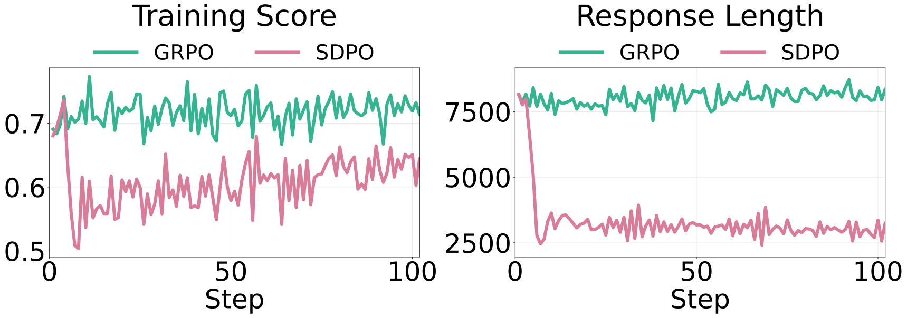

> 图解：在数学场景（右图）里，Self-Distillation 随训练让响应更短，但分数没有同步提升，甚至下滑；这和化学等相对“任务结构更稳定”的场景形成鲜明对比。

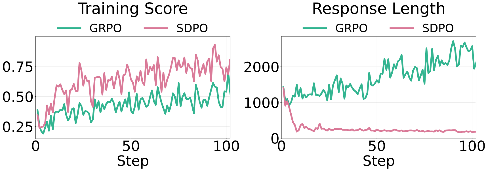

> 图解：化学任务中，压缩长度和提升性能可以同时发生；这说明“短”本身不是问题，关键在任务是否允许你安全压缩不确定性表达。

---

## 3. 关键机制：被压掉的不是废话，而是“认知刹车”

作者把问题归因到一个很重要的概念： **epistemic verbalization** （认知不确定性外显）。  
比如模型在 CoT 中出现 `wait / hmm / maybe / check` 这类词，常常意味着它在进行路径回退、假设切换和自校正。

如果这些 token 被过度压掉，模型会更“自信地错下去”。

> 图解：左图表达的是“保留不确定性”时，模型会探索替代路径并逐步收敛；反之会更早锁死在错误分支。

> 图解：teacher 看到额外信息后，输出天然更笃定、更短。student 学这种风格时，可能学到“结果像对的”，却没学到“如何在未知时纠错”。

---

## 4. 理论框架：信息越丰富，输出越自信、越短

论文用条件互信息描述 teacher 上下文的信息量：

$$
I(y;c \mid x)=H(y\mid x)-H(y\mid x,c)
$$

其中 $c$ 是 teacher 额外看到的信息（如标准解）。  
信息越多，$H(y\mid x,c)$ 越低，teacher 越“确定”。

Self-Distillation 的目标（逐 token 分布对齐）是：

$$
\mathcal{L}_{\mathrm{SD}}(\theta)=
\sum_t \mathrm{KL}\!\left(
\pi_\theta(\cdot \mid x,y_{<t})
\;\|\;
\mathrm{stopgrad}\big(\pi_\theta(\cdot \mid x,c,y_{<t})\big)
\right)
$$

直观上：student 被训练去模仿“看过答案后”的 next-token 分布。  
如果这种分布本身几乎没有不确定性表达，student 就会把这部分行为删掉。

---

## 5. 受控实验：随着信息量提升，不确定性 token 单调下降

作者在 DAPO-Math-17k 上做了 4 种生成设定（信息量从低到高）：

1. 无引导 $c=\emptyset$
2. 完整解引导 $c=s$
3. 去掉 `<think>` 的解引导 $c=s_{\setminus think}$
4. 用再生成答案引导 $c=\tilde y$

信息量顺序：

$$
0=I(y;c\mid x)_{(1)}<I(y;s_{\setminus think}\mid x)_{(3)}\le I(y;\tilde y\mid x)_{(4)}\le I(y;s\mid x)_{(2)}
$$

实验结果非常整齐：信息越丰富，长度和 epistemic token 越低。  
其中一个关键表格可总结为：

- 无引导：平均长度约 13054，epistemic token 约 182.5；
- 完整解引导：平均长度约 1873，epistemic token 约 8.8。

这不是随机波动，而是行为模式发生了系统性迁移。

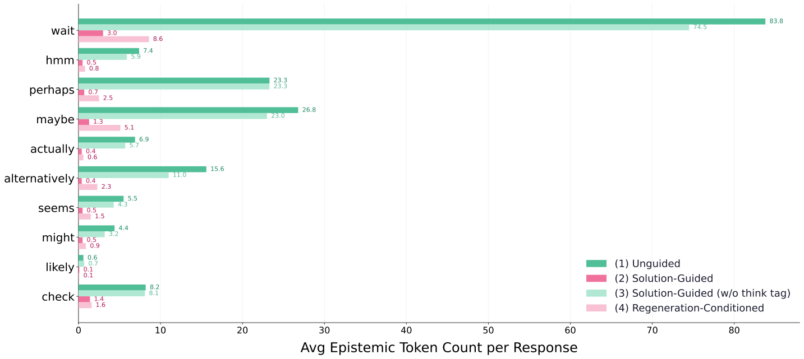

> 图解：`wait / maybe / perhaps` 等 token 在高信息 teacher 条件下明显减少，说明被压缩掉的是“探索和自校正语气”。

---

## 6. Off-policy SFT：全是正确轨迹，为什么还能训坏？

作者构造两套都“正确”的 800 条数据：

- $\mathcal D_{ug}$：无引导生成，长、epistemic 多；
- $\mathcal D_{sg}$：solution-guided 生成，短、epistemic 少。

在 DeepSeek-R1-Distill-Qwen-7B 上做 SFT 后：

- 用 $\mathcal D_{ug}$：性能基本稳定；
- 用 $\mathcal D_{sg}$：AIME/AMC/MATH500 全线崩塌（如 AIME24 从 54.79 到 20.21）。

结论很强： **正确答案轨迹不等于可迁移的推理行为轨迹** 。  
如果轨迹默认“你已经知道答案附近的信息”，那 student 在真实推理时会失去自主探索能力。

---

## 7. On-policy（GRPO vs SDPO）：三类模型都看到同样趋势

### 7.1 DeepSeek-R1-Distill-Qwen-7B

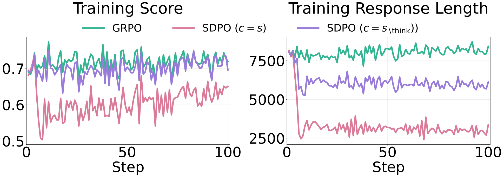

> 图解：SDPO 比 GRPO 更快压短长度，但分数恢复慢且峰值更低。

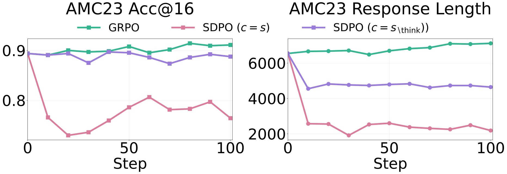

> 图解：在 AMC23 上，GRPO 稍有提升；SDPO（尤其 $c=s$）出现明显下滑。

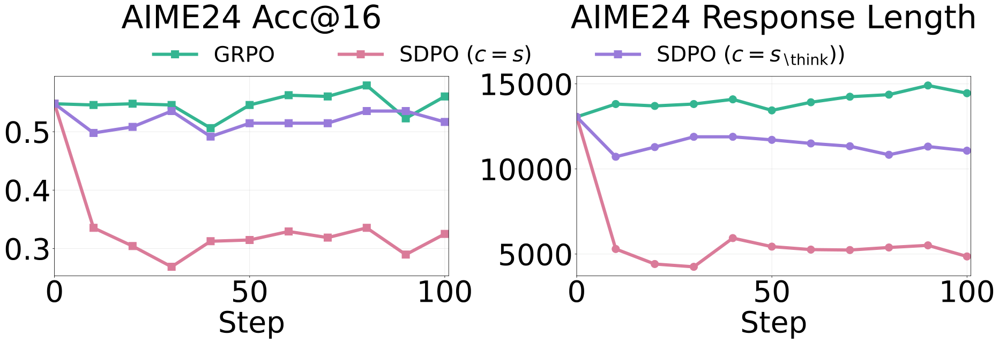

> 图解：AIME24 是更难的 OOD 基准，SDPO 的损失更显著，接近论文所说的大幅退化区间。

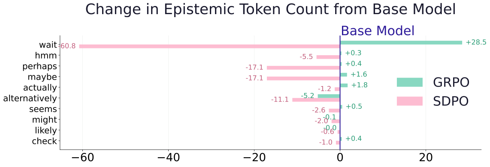

> 图解：GRPO 会略增加 epistemic token，SDPO 则显著压低；与性能变化方向一致。

---

### 7.2 Qwen3-8B（Thinking ON）

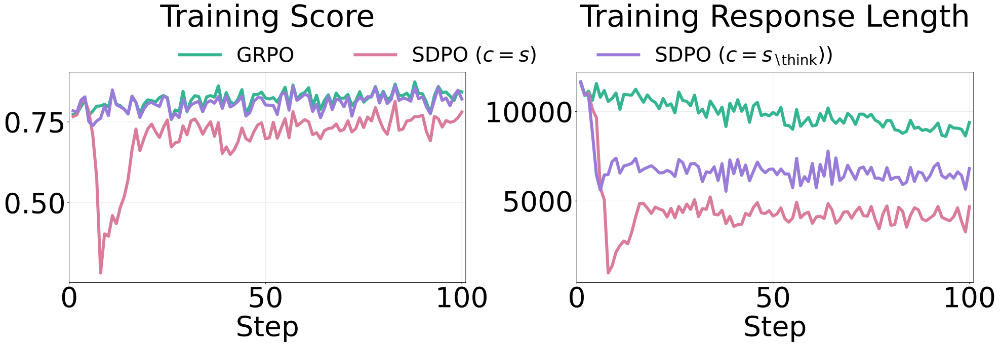

> 图解：GRPO 和 SDPO 都会缩短回答，但 SDPO 压得更狠，性能掉得也更明显。

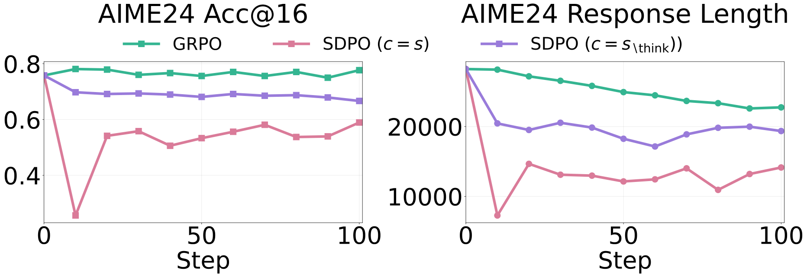

> 图解：AIME24 上差距放大，说明难题更依赖不确定性驱动的探索行为。

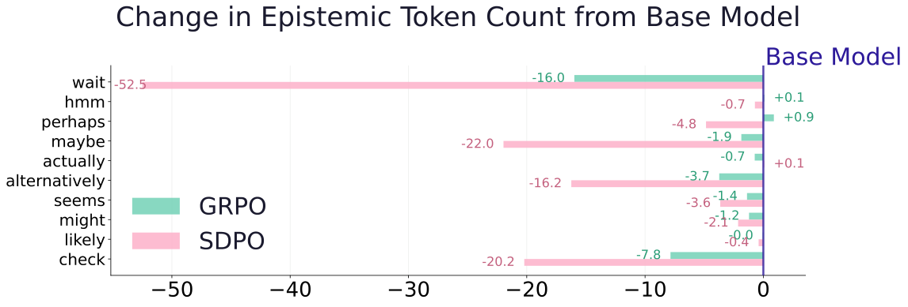

> 图解：这类本来“想得很多”的模型，适度压缩有益，但过度压缩会伤害泛化。

---

### 7.3 Qwen3-8B（Thinking OFF）

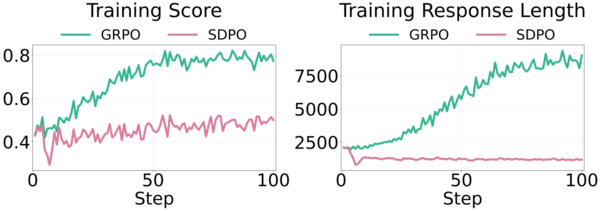

> 图解：GRPO 反而把长度拉长并快速提分；SDPO 继续压缩长度，但提分慢，且 OOD 有轻微退化。

这说明：在低思考模式下，模型本来就缺少探索性推理，继续压缩只会雪上加霜。

---

## 8. 一个很关键的训练细节：Teacher 设成移动目标会更糟

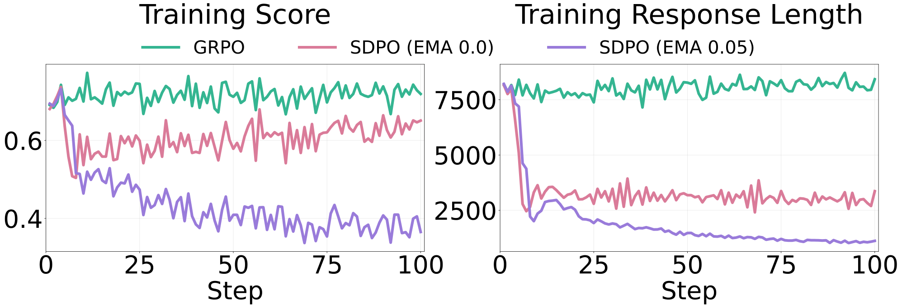

> 图解：teacher 若跟着 student 更新（EMA），会形成“越来越自信、越来越短”的正反馈，退化更快。

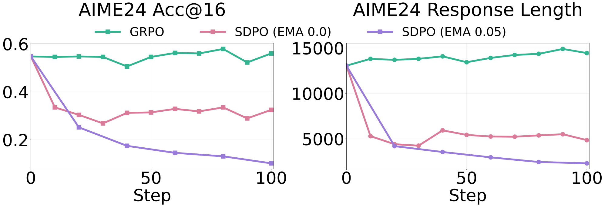

> 图解：固定 teacher（EMA=0）比移动 teacher 更稳，OOD 损失更小。

---

## 9. 为什么化学能涨、数学会掉？——任务覆盖率（Task Coverage）是分水岭

作者给了一个很有解释力的视角：  
Self-Distillation 的“压缩”在低覆盖、重复模式任务里收益大；在高覆盖、组合复杂任务里会牺牲泛化。

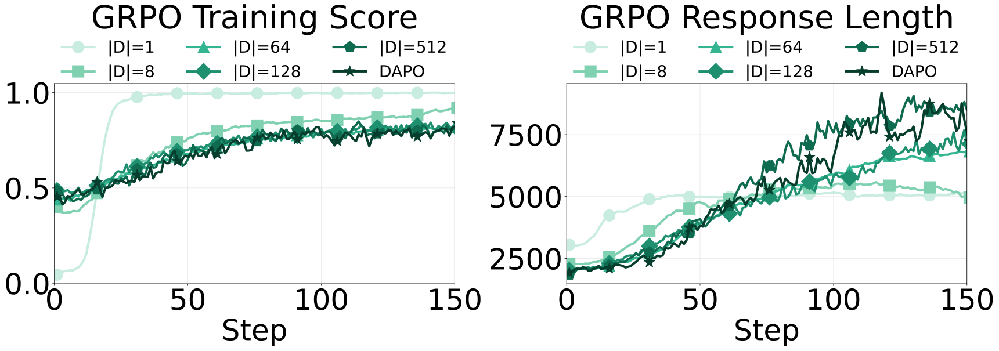

> 图解：随着训练任务数 $|D|$ 增大，GRPO 往往允许更长推理并持续提高表现。

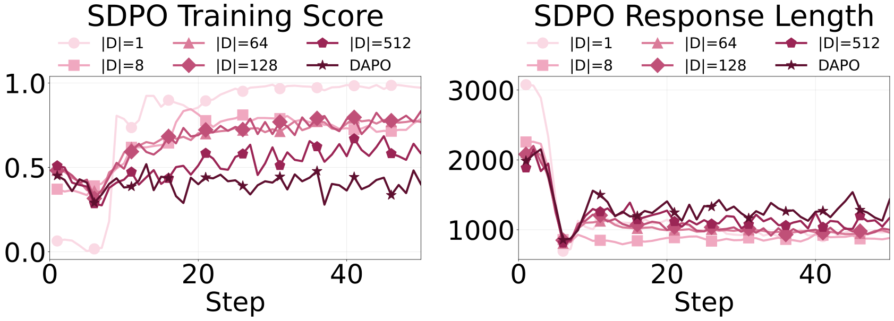

> 图解：小 $|D|$ 时 SDPO 很高效；但 $|D|$ 变大后，继续压缩长度会限制模型适应多样任务。

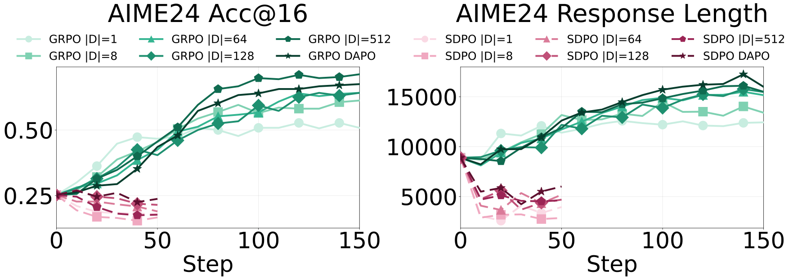

> 图解：在 OOD 上，GRPO 随覆盖率提升而更稳步上升；SDPO 在小数据覆盖下退化更严重。

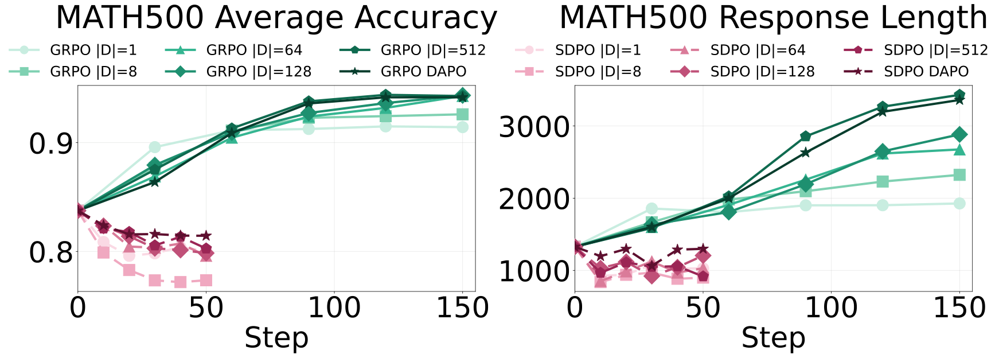

> 图解：趋势与 AIME24 一致，验证“泛化需求越高，epistemic verbalization 越有价值”。

---

## 10. 附录里值得关注的补充结论

### 10.1 不同模型的 epistemic 风格不同，但规律一致

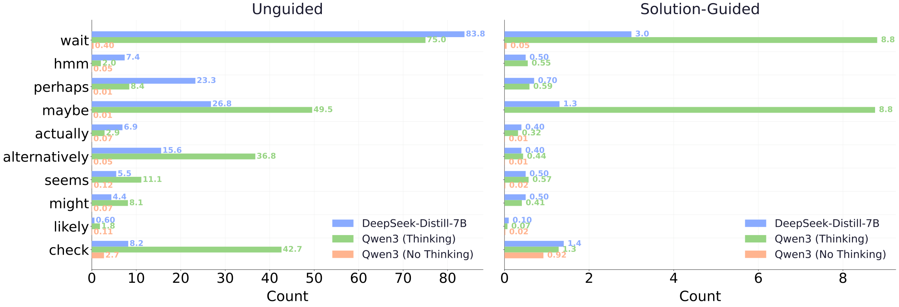

> 图解：Thinking ON 的 Qwen3 和 DeepSeek 都比 Thinking OFF 有更多不确定性 token；但只要 teacher 信息过强，都会被压低。

### 10.2 OPSD 的“混合模式”有早期收益，但后期也会回落

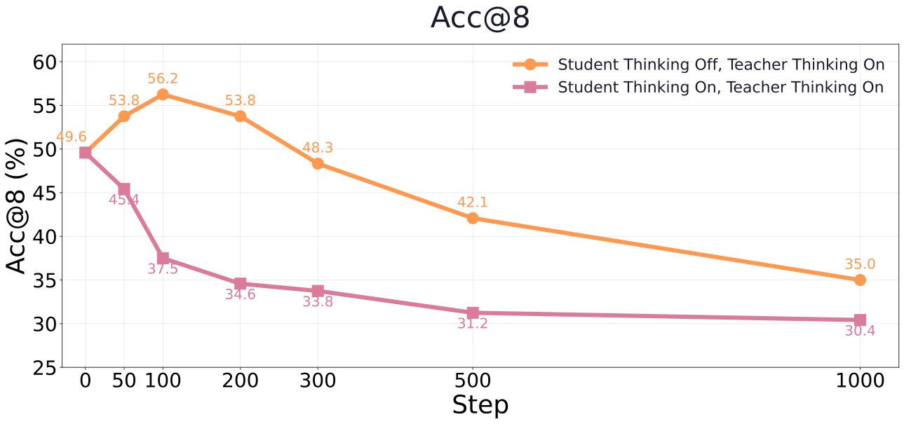

> 图解：teacher 开 thinking、student 关 thinking 的混合设定，前期可能涨分，后期仍出现回落。

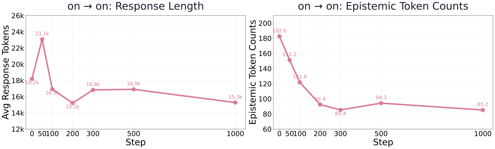

> 图解：当 teacher/student 同质且都 Thinking ON 时，长度与 epistemic 持续下降，性能也同步下行。

### 10.3 不是超参小修小补能救

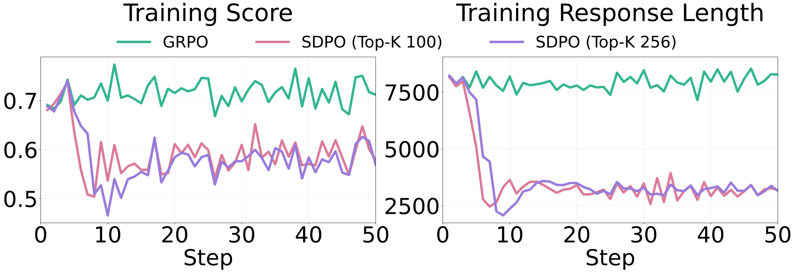

> 图解：把 distillation top-k 从 100 提到 256，趋势几乎不变。

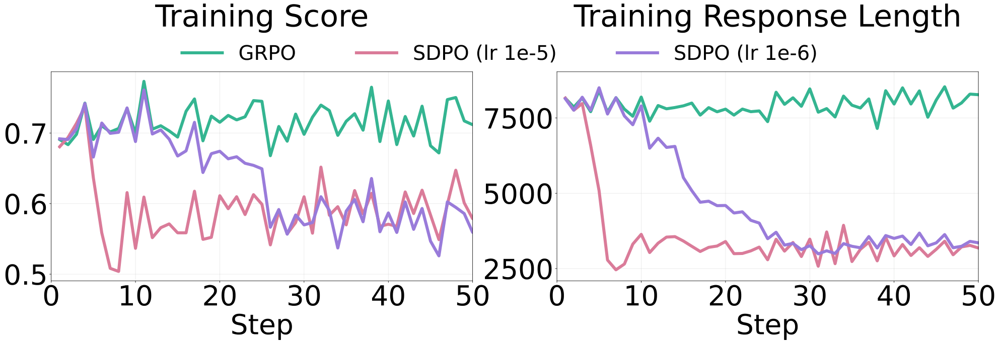

> 图解：学习率从 $1\times10^{-5}$ 降到 $1\times10^{-6}$ 只会“延迟退化”，不会改变最终行为收敛方向。

---

## 11. 我的技术解读：这篇论文真正贡献了什么？

我认为有三点特别关键：

1. 它把“推理变短”从经验现象上升到信息论解释：$I(y;c\mid x)$ 越大，teacher 越确定，student 越倾向压缩探索过程。
2. 它把“正确轨迹”与“可泛化推理行为”明确区分开了：监督信号对不对，不等于行为风格对不对。
3. 它给出了一个可操作判断标准：看任务覆盖率和 OOD 难度，再决定你是该压缩推理，还是保留不确定性表达。

换句话说，后训练优化不该只盯 `answer correctness`，还要显式关心 `uncertainty-aware reasoning behavior`。

---

## 12. 对实践者的直接建议（可复现导向）

- 若任务是高覆盖数学推理，不要把“更短响应”当成默认优化目标。
- Self-Distillation 的 teacher context 不宜过强，尤其应避免把完整思维链当硬监督目标直接迁移给 student。
- 监控除了 accuracy 之外，至少再加两类指标：平均长度 $\mathbb E[L(y)]$ 与 epistemic token 统计 $\mathbb E[E(y)]$。
- OOD 验证必须早做、持续做；只看 in-domain 训练曲线很容易误判。
- teacher 若采用 moving target，要警惕“自信放大反馈环”；固定 teacher 在该文设置里更稳。

---

> 本文参考自 [Why Does Self-Distillation (Sometimes) Degrade the Reasoning Capability of LLMs?](https://arxiv.org/abs/2603.24472)