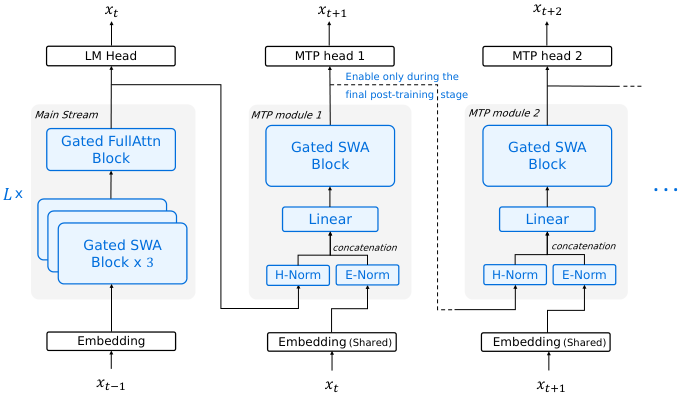
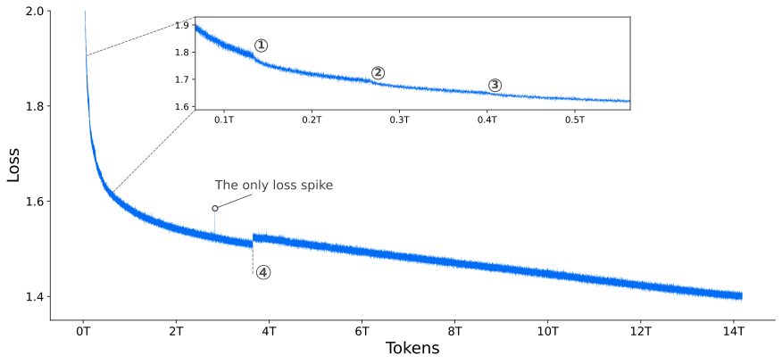
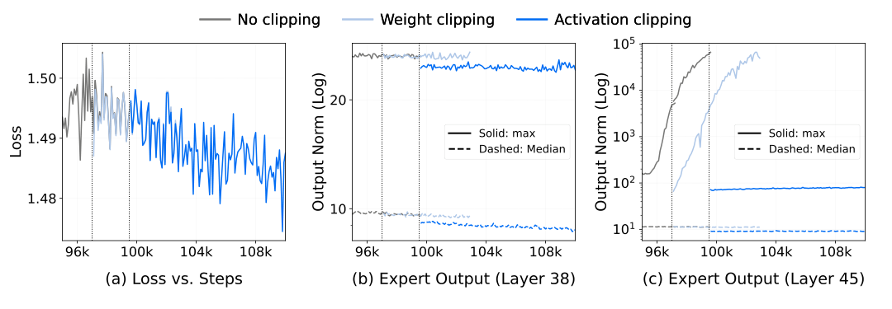

# Step 3.5 Flash：11B 激活参数也能打到前沿智能的稀疏 MoE 体系

## 一句话总结
这篇论文给出的核心答案很明确：用 **196B 总参数 + 11B 激活参数** 的稀疏 MoE 架构，配合 **3:1 滑动窗口/全注意力混合布局** 与 **多 Token 预测 (MTP-3)**，把“前沿智能”和“低延迟部署”同时拉到可用水平。

---

## 1. 研究背景：Agent 时代的三重约束
传统大模型优化目标是 **智能** 与 **成本**，但在 Agent 场景里，多轮交互的 **推理延迟** 成了第三个关键指标。  
Agent 工作流常见模式是：  
- 大上下文预填充 (prefill)  
- 长时间多轮解码 (decode)

因此模型必须同时兼顾：长上下文效率、解码吞吐、并行可扩展性。  
这就是 Step 3.5 Flash 的总体设计动机。

---

## 2. 模型架构总览：稀疏 MoE + 混合注意力 + MTP
模型名： **Step 3.5 Flash**  
总参数： **196B**  
激活参数： **11B / token**

### 2.1 主干结构
- 45 层 Transformer  
- 3 层 Dense + 42 层 MoE  
- 每层 MoE：288 routed experts + 1 shared expert  
- 路由 Top-$k=8$

核心思路：  
**“容量要大，但推理要轻”**  
因此只激活少量专家，保持推理延迟低。

---

### 2.2 混合注意力布局 (S3F1)
采用 **3:1 Sliding Window Attention : Full Attention** 的布局。

$$
S3F1 = \underbrace{SWA, SWA, SWA, Full}_{\text{重复结构}}
$$

这样做的意义：  
- SWA 降低长上下文复杂度  
- Full Attention 保留全局依赖  
- 兼容 speculative decoding 的并行验证

---

### 2.3 多 Token 预测 (MTP-3)
加入 3 个轻量级 MTP Head，预测 $x_{t+2}, x_{t+3}, x_{t+4}$，用于 speculative decoding 加速。

$$
\text{MTP-}h: \quad \hat{x}_{t+1+h} \mid h_t
$$

训练成本控制策略：  
- 主训练阶段只训练 MTP-1  
- 后期复制并轻量微调 MTP-2/3

---

### 2.4 架构图

> 图解：该图展示了 Step 3.5 Flash 的整体结构。左侧是首层 Full Attention，后续 11 个 Hybrid Block 以 **S3F1** 交替堆叠。前 3 个 block 用 Dense FFN，其余换成 MoE FFN。每个 MTP 头都带 SWA + Dense FFN，用于加速解码阶段的多 token 预测。

---

## 3. 注意力优化细节：为什么不是线性注意力
论文明确选择 **SWA 而不是 Linear Attention**，理由很工程化：  
- Linear Attention 的 state update 机制不适合 speculative decoding  
- SWA 保留标准注意力语义，易于并行验证

最终取 $W=512$ 窗口大小，是速度与建模能力的折中。

---

## 4. 两个关键增强：SWA 头数 + Head-wise Gated Attention
### 4.1 SWA 头数增加
SWA Query Heads 从 64 增加到 96，可以显著缓解 S3F1 带来的质量损失。

核心发现：S3F1 单独使用会掉分，增加 SWA heads 可以“免费补回来”。

### 4.2 Head-wise Gated Attention
代替 sink token，给每个 head 引入输入相关的门控：

$$
g_i = \sigma(\mathbf{w}_{gate}^\top \mathbf{x}_i), \quad o_i^{gate} = g_i \cdot y_i
$$

直观理解：  
这是 **动态 sink token**，能自动过滤无用 attention 权重。

---

### 4.3 实验对比表

> 图解：该图展示预训练 loss 曲线，几乎无剧烈波动，只出现一次明显 spike。说明训练稳定性极强，尤其对 MoE 这种易崩溃结构而言很关键。

---

## 5. MoE 训练稳定性：三个关键失败模式
论文把稳定性当成一等公民，主要发现了三类问题：

1. **Muon 优化器的数值不稳定**  
   Polar Express 迭代在 bfloat16 下偶发极端值；解决方案是仅在 NS 迭代中强制 float16。

2. **Expert Collapse**  
   即使 router 统计正常，专家仍可能失活；监控指标应是 **专家激活 norm 与参数 norm**。

3. **局部激活爆炸**  
   深层 MoE 专家激活值爆炸；对比策略是 Weight Clipping vs Activation Clipping，结论是 Activation Clipping 明显更有效。

---

### 5.1 激活爆炸可视化

> 图解：面板 (a) 中 loss 看似正常，但 (b)(c) 显示深层 MoE 的激活最大值远高于中位数，出现严重不稳定。Activation Clipping 能显著约束爆炸趋势。

---

## 6. 训练体系：预训练 + Mid-training + Post-training
### 6.1 预训练与中期训练
- 预训练：17.6T tokens  
- 中期训练：750B tokens  
- 上下文长度逐步从 4k → 32k → 128k

### 6.2 后训练框架
重点是提出 **统一 RL 框架**：先做多领域 SFT，构建领域专家模型，再通过 Self-Distillation 合并回统一模型，RL 阶段引入 **MIS-PO (Metropolis Independence Sampling-Filtered Policy Optimization)**。

---

### 6.3 MIS-PO 公式

$$
\mathcal{L}_{actor} = - \mathbb{E}_{\tau \sim \pi_{\theta_{vllm}}} \left[ \mathbb{I}(x_t)\mathbb{I}(\bar{\rho}(\tau)) \log \pi_\theta(a_t|s_t)\hat{A}_t \right]
$$

核心思想：用二值过滤代替重要性权重，降低梯度方差。

---

## 7. 评测亮点
论文把重点放在 **Agent + Code + Math** 三条主线。

关键指标：  
- IMO-AnswerBench：85.4%  
- LiveCodeBench-v6：86.4%  
- $\tau^2$-Bench：88.2%  
- BrowseComp (Ctx Manage)：69.0%  
- Terminal-Bench 2.0：51.0%

### 7.1 大表格综合对比

> 图解：该图表明 Step 3.5 Flash 用 11B 激活参数，就能与 GPT-5.2 xHigh、Gemini 3.0 Pro 等前沿系统接近，核心优势是高性能密度。

---

## 8. 关键创新点总结
1. **三重目标优化**：智能、成本、延迟。  
2. **混合注意力设计**：S3F1 + SWA Head 增强，兼容 speculative decoding。  
3. **高效 MoE 训练稳定性体系**：细粒度监控 + 失稳诊断，激活裁剪优于权重裁剪。  
4. **MIS-PO 强化学习框架**：面向长链推理，稳定 off-policy 学习。

---

## 9. 局限性与未来方向
论文明确指出局限性：  
- 需要更长推理轨迹才能达到同等质量  
- 计划通过“思考压缩”提升 Token Efficiency  
- 未来会探索 **on-policy distillation**  
- RL 仍需扩展到真实复杂任务

---

## 10. 总结
Step 3.5 Flash 的核心价值不是“模型大”，而是 **“单位激活参数的智能密度”**。  
它证明了在 Agent 场景下，真正的突破来自 **架构 + 系统 + 训练策略** 的协同设计，而不是单纯堆参数。

---

> 本文参考自论文：Step 3.5 Flash: Open Frontier-Level Intelligence with 11B Active Parameters（arXiv:2602.10604）