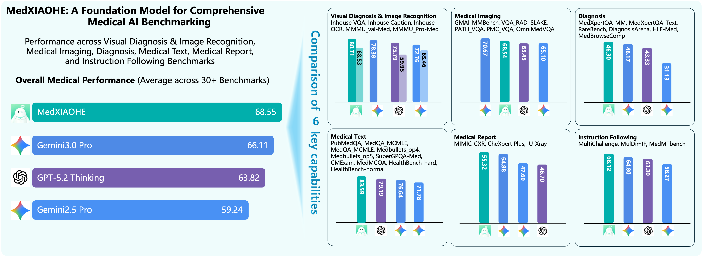

# MedXIAOHE：面向医疗多模态推理的全栈配方

## 一句话总结
这篇报告提出了 **MedXIAOHE** —— 一个以医疗场景为核心的视觉-语言基础模型，核心目标是：在真实临床任务中，既能看图、读文、做推理，又能降低幻觉、可追溯证据，并且通过系统化训练与评测框架获得稳定性能。

---

## 1. 这篇论文到底解决了什么问题？
医疗场景是多模态、长尾、强安全要求的复杂系统：  
- 仅靠通用 VLM 很难覆盖 **罕见病 / 复杂合并症 / 细粒度影像差异** 。  
- 临床任务要求 **证据一致性** 与 **可解释性**，而不是只看最终答案。  
- 医疗评测高度碎片化，模型看起来进步，实际缺乏可复现比较。

作者的主线非常清晰：  
**构建一个可部署的医疗多模态基础模型，并且用统一评测体系证明它是真的更好。**

---

## 2. 整体架构：不改模型结构，但改训练配方
论文强调 **不做大改架构**，而是通过训练策略让能力显性提升。

核心结构：  
1. 视觉编码器（Seed-ViT）  
2. 轻量多模态连接器  
3. 自回归 LLM 解码器  

优势：  
- 多任务统一接口  
- 支持多轮对话、证据融合  
- 医疗文本、影像、报告、OCR 全覆盖  

---

## 3. 整体训练流程：从预训练到后训练的三段式能力构建

### 3.1 Continual Pretraining：医学知识覆盖与长尾补齐
最大亮点：引入 **Medical Entity Tree (MET)** 作为数据组织基座，让预训练更“医学化”。

关键机制：  
- 使用 MET 做 **实体驱动采样**，补齐长尾  
- 海量医学文本 + 影像数据  
- 三阶段清洗 pipeline  

核心数据规模：  
- 约 **640B tokens** 医学数据  
- 覆盖 web、书籍、论文、影像、公开数据集  

---

### 3.2 Mid-Training：把“会答题”升级为“会推理”
中期训练的重点是：  
**构建临床推理能力 + 多步骤工具使用能力 + 结构化思考**

关键模块：  
- KG 驱动的多跳 QA 合成  
- 多专家 reject sampling  
- Structured CoT（理解 → 观察/知识回忆 → 推理 → 结论）  
- Personalized Visual CoT（短推理保护视觉感知）  

> 这一部分是模型能“像医生一样推理”的核心来源。

---

### 3.3 Post-training：强化可靠性 + 合规性
重点目标：  
- **临床可靠性**  
- **安全合规**  
- **偏好对齐**

方法组合：  
- 高质量 SFT  
- RL 强化推理能力  
- 多层奖励系统（规则 + rubric + 过程监督）  

---

## 4. 关键创新点拆解

### 4.1 Medical Entity Tree：让知识覆盖可量化
MET 的作用不是“炫技”，而是解决长期痛点：  
- 如何衡量医疗知识覆盖？  
- 如何系统补齐长尾？  

引入语义覆盖指标 AMCS：

$$
\text{AMCS}(A, Ref) = \frac{1}{|A|} \sum_{i=1}^{|A|} \max_{j \in [1, |Ref|]} \text{CosineSimilarity}(\mathbf{a}_i, \mathbf{r}_j)
$$

解释：  
- Forward Coverage 高 → 表示覆盖能力强  
- Backward Coverage 低 → 说明树更完整、包含更多长尾  

---

### 4.2 Think with Medical Image：工具驱动视觉推理
模型不仅“看”，还会“放大、旋转、定位”。  
这套机制让视觉推理具备 **证据链**。

总结：  
- 把 **影像细节识别** 与 **推理链条** 显式绑定  
- 避免模型凭空猜测  

---

### 4.3 统一评测框架：把碎片化 benchmark 做成可复现实验
作者构建 Unified Med-VLM Benchmark：

目标：  
- 覆盖能力面更完整  
- 评分更一致  
- 更接近真实临床部署需求  

包含 6 大能力分类：  
- Visual Diagnosis  
- Medical Imaging  
- Diagnosis  
- Medical Text  
- Medical Report  
- Instruction Following  

---

## 5. 性能结果亮点
整体结论：MedXIAOHE 在大部分能力上实现或接近 SOTA。

关键方向：  
- 医学图像理解和多模态推理提升明显  
- 多项文本 QA 达到领先  
- 报告生成稳定性较强  
- Instruction Following 效果提升明显  

这不是单个 benchmark 的提升，而是跨能力面系统性提升。

---

## 6. 图解：整体性能对比（来自原文）

> 图解：左侧展示在 30+ 医学 benchmark 上的整体平均分对比，MedXIAOHE 明显领先。右侧拆分为 6 类能力维度，能看到模型不仅在公共数据集上表现好，也在内部测试中保持优势。

---

## 7. 结论与趋势判断
这篇报告最大的价值不是“又一个模型”，而是提供了一个 **可复用的医疗多模态训练配方**：  
- 以实体树驱动知识组织  
- 强化推理链条与证据一致性  
- 用统一评测框架解决“对不上指标”的问题  

从研发角度看，它是目前医疗多模态模型向 **真实临床可用** 迈出的一次非常系统化的尝试。

---

> 本文参考自 [MedXIAOHE: A Comprehensive Recipe for Building Medical MLLMs](https://arxiv.org/abs/2602.12705)