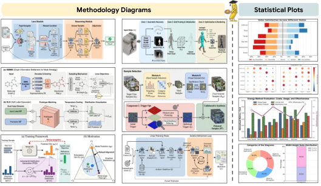
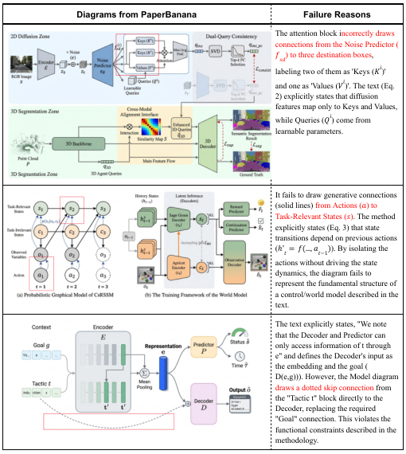

# PaperBanana：自动化生成学术插图的 AI 科研助理

## 一句话看懂这篇论文
这篇文章关注一个被低估但极其耗时的环节： **学术论文里的方法图与统计图** 。作者提出 PaperBanana——一个由多智能体协作的自动插图系统，并配套了 PaperBanana-Bench 基准来评估“画得准不准、简不简、好不好看”。

---

## 背景与问题：AI 科研自动化的最后一公里
大模型已经能写文本、跑实验、做总结，但 **论文里的“图”仍然是人工瓶颈** 。尤其是方法图（Methodology Diagram）和统计图（Plot），需要同时满足：

- **内容准确** （Faithfulness）
- **结构简洁** （Conciseness）
- **版式清晰** （Readability）
- **审美专业** （Aesthetics）

而传统基于 TikZ / SVG / PPT 的代码化方案在视觉表达上不够灵活；纯图片生成模型又容易 **逻辑错、数值错、排版乱** 。

---

## 核心任务建模：从“文本意图”到“视觉结果”
作者将学术插图生成建模为：

$$
I = f(S, C)
$$

其中：
- $S$ 是方法描述（源上下文）
- $C$ 是图注（表达意图）

如果加入参考示例集合 $\mathcal{E}$，则：

$$
I = f(S, C, \mathcal{E})
$$

这也是 PaperBanana 的核心： **靠高质量参考来“教”模型该怎么画。**

---

## 方法总览：PaperBanana 的 5 个 Agent
PaperBanana 由 5 个专职代理组成，分成 **线性规划阶段 + 迭代优化阶段** ：

- **Retriever** ：从参考库中找最像的图例  
- **Planner** ：将方法文本转换为图描述  
- **Stylist** ：自动总结“学术美学风格”并优化描述  
- **Visualizer** ：生成图像（或生成代码画图）  
- **Critic** ：对生成图进行批判性检查，再反馈修正  

> 图解：蓝色区域是“Linear Planning Phase”，通过参考图例和美学指南生成优化描述；橙色区域是“Iterative Refinement Loop”，Visualizer 与 Critic 迭代 3 轮生成最终图像。

---

## 关键机制详解

### 1) Retriever：先找到“长得像”的参考图
Retriever 不追求语义相似，而是 **优先找结构、布局、图类型相似的参考图** ，因为画图更依赖结构模板而非主题一致。

### 2) Planner：把方法“翻译”为图结构
Planner 使用检索到的示例做 in-context learning，输出结构化图描述 $P$：

$$
P = \text{VLM}_{\text{plan}}(S, C, \mathcal{E})
$$

### 3) Stylist：自动总结“NeurIPS 2025 风格”
Stylist 遍历全库，生成一份 **审美指南 $\mathcal{G}$** （颜色、容器、箭头、字体、图标），再把 $P$ 美学增强：

$$
P^* = \text{VLM}_{\text{style}}(P, \mathcal{G})
$$

### 4) Visualizer + Critic：迭代 3 轮自我修正
每轮生成：

$$
I_t = \text{Image-Gen}(P_t)
$$

Critic 检查错误并修正描述：

$$
P_{t+1} = \text{VLM}_{\text{critic}}(I_t, S, C, P_t)
$$

最终 $I = I_T$。

---

## 统计图扩展：改用代码生成确保数值准确
对于统计图，直接用图像生成容易数值错。作者改为：

- Visualizer 生成 Matplotlib 代码
- Critic 校验图像并修正描述

这样能兼顾 **美观与数值精度** 。

> 图解：横向对比 Vanilla Gemini-3-Pro 和 PaperBanana 在统计图上的表现，后者在 Faithfulness/Readability/Aesthetics 等指标上更稳定。

> 图解：代码生成方式更准确但风格略保守；图像生成更好看但容易出现数值幻觉。

---

## 基准数据集：PaperBanana-Bench
由于缺乏评测基准，作者构建了专门的 **方法图生成基准** ：

- 来源：NeurIPS 2025 论文  
- 总样本：584  
- 测试集 / 参考集：各 292  
- 限制宽高比 $[1.5, 2.5]$，保证模型支持与公平对比  

> 图解：测试集统计信息。平均方法文本长度约 3020 词，平均图注约 70 词。

---

## 评估协议：VLM-as-a-Judge
评估方式是： **模型图 vs 人工图，逐维度对比判断胜负** ：

- Faithfulness  
- Conciseness  
- Readability  
- Aesthetics  

并采用 **层级聚合** ：先看 Faithfulness + Readability，再看 Conciseness + Aesthetics。

作者验证了 VLM 评估与人类评估高度相关（Kendall tau > 0.4）。

---

## 主实验结果：PaperBanana 全面领先

> 图解：方法图与统计图的整体效果示例，展示了自动生成学术插图的潜力。

核心结果（相对 Vanilla Nano-Banana-Pro）：

- Faithfulness +2.8%  
- Conciseness +37.2%  
- Readability +12.9%  
- Aesthetics +6.6%  
- Overall +17.0%

---

## 消融实验：每个 Agent 都有贡献
去掉 Retriever / Stylist / Critic 会明显下降：

- Stylist 提升美观与简洁，但可能牺牲部分准确性  
- Critic 能显著补回 Faithfulness  
- Retriever 的“随机选”竟然接近语义检索，说明 **结构示例比主题更重要**

---

## 失败案例与讨论

> 图解：主要错误集中在“细粒度连接错误”，如箭头方向或模块连线错位，这类细节目前 Critic 不容易发现。

---

## 讨论：进一步的应用与启发

### 1) 美化人工图
基于自动总结的美学指南，对人类图做“润色”，胜率 56.2%。

> 图解：对人类图进行风格增强后，配色、字体与模块结构更统一。

### 2) 代码 vs 图像生成的取舍
图像生成更美观，代码生成更准确。未来可做混合策略。

---

## 相关工作对比
- TikZ / PPTX / SVG 等代码生成方案：结构准确但表达力弱  
- 图像生成方案：视觉强但逻辑易错  
- AutoFigure、Paper2Any 等工作与本文目标接近，但 PaperBanana 更强调检索 + 风格迁移 + 可扩展到统计图

---

## 局限与未来方向

- **输出是位图** ，难以编辑  
- **风格统一 vs 多样性** 之间存在冲突  
- **细粒度连接错误** 难以检测  
- 评估仍依赖 VLM-as-a-Judge  
- 未来可探索 test-time scaling（生成多个候选让用户选）

---

## 总结
PaperBanana 给出了一条很清晰的路径：  
**用检索获得结构范式 → 用风格总结获得美学规范 → 用多智能体生成与校验保证专业度** 。  
它不仅能生成方法图，还能较好地生成统计图，并且配套基准保证可评测性。

---

> 本文参考自 [PaperBanana: Automating Academic Illustration for AI Scientists](https://arxiv.org/abs/2601.23265)