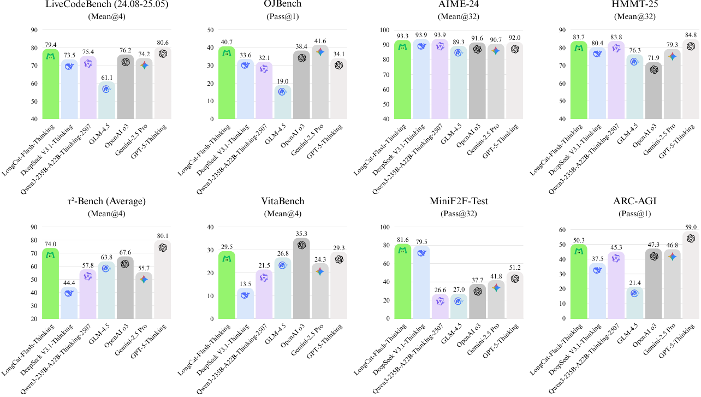
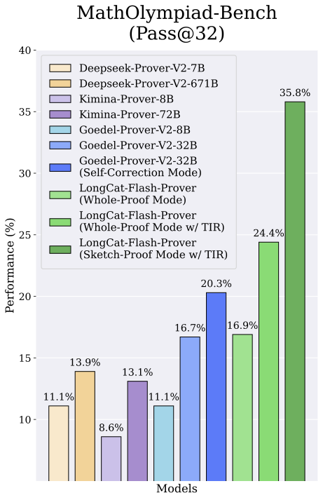
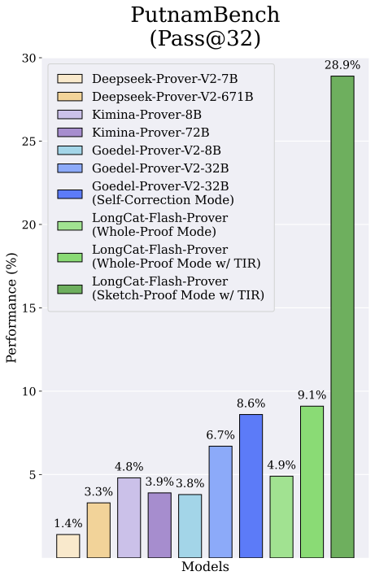
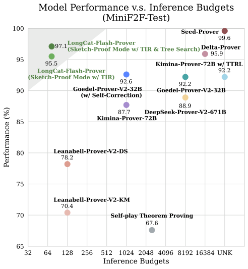

# LongCat-Prover 深度解读：把 Formal Reasoning 做成“原生能力”的一次大规模工程实践

这篇工作要解决的核心痛点很直接：很多大模型在自然语言推理中表现很强，但一到 Lean4 这类形式化证明场景，就容易“会说不会证”。LongCat 团队给出的答案是：把形式化能力拆成可组合的原子能力，并通过工具反馈驱动的 Agentic RL，把模型训练成真正能够与 verifier 协作的 Formal Agent。

## 先看结论：这篇论文到底做成了什么？

- 模型： `LongCat-Flash-Prover`， **560B 参数 MoE** （约 27B 激活参数）的开源模型  
- 目标：统一提升  
  - Auto-formalization（自然语言题目 $\rightarrow$ Lean4 形式化陈述）  
  - Theorem Proving（Lean4 证明）  
- 关键成绩（论文报告）：  
  - MiniF2F-Test： **97.1%** （预算 72 attempts/problem）  
  - ProverBench： **70.8%** （预算 220）  
  - PutnamBench： **41.5%** （预算 118）  
  - 在开放权重模型中，Auto-formalization 与 Proving 均达到 SOTA 水平

> 图解：这类总览图通常以任务维度为横轴、通过率为纵轴，对比不同模型或模式。论文主张 LongCat-Prover 在形式化相关任务上显著领先，并在预算受限下保持高效率。  

---

## 一、问题重构：把“形式化推理”拆成三个可训练能力

作者提出了 **Native Formal Reasoning** ，将 formal 能力视作模型的“原生能力”而非外挂模块，并拆分为三块：

1. **Auto-formalization** ：把 $(x, y)$（自然语言题目与答案）转成形式化陈述 $s$  
2. **Sketching** ：先生成 lemma-style 草图（分治分解）  
3. **Proving** ：完成 whole-proof 或 sketch-proof  

形式化任务定义可写为：

$$
s = \mathcal{I}_s(x, y), \quad \mathcal{P} = \pi_\theta(s), \quad \mathcal{V}(\mathcal{P}, s) \in \{\text{PASS}, \text{FAIL}\}
$$

其中，$\mathcal{V}$ 由 Lean4 编译/验证工具和额外合法性检查共同构成。

---

## 二、方法主线：Hybrid-Experts + Tool-Integrated RL

## 2.1 Hybrid-Experts Iteration：三类专家迭代自进化

论文并非让单一 prover 一路推进，而是采用了三专家协同迭代框架：

- `auto-formalizer expert`  
- `sketcher expert`  
- `prover expert`  

每轮会生成 6 类轨迹数据（无工具 + 有工具），并按验证结果进行 rejection sampling，形成从易到难的课程式训练流。

> 图解：该图对应 MathOlympiad-Bench 对比。横轴通常是模型/方法，纵轴是 Pass 率，体现了“工具介入 + 专家迭代”对高难 formal 任务的增益。  

---

## 2.2 Tool 必要性筛选：避免“伪 Agent 数据”

作者在 Agentic 数据构建中提出了一个很实用的思路：同一道题分别让模型在“可用工具/不可用工具”两种条件下求解，计算收益差：

$$
v_x = s_{\text{w/ tool}}(x) - s_{\text{w/o tool}}(x)
$$

只保留满足阈值条件的数据（例如工具条件下高通过、无工具低通过、差值足够大），确保训练集中是真正“需要工具”的 query，而不是模型靠记忆即可通过的伪样本。

---

## 2.3 HisPO：为长时程 MoE RL 稳定训练设计的层级采样策略

论文最核心的技术创新之一是 **HisPO（Hierarchical Importance Sampling Policy Optimization）** 。它针对两个真实工程问题：

- 训练引擎与推理引擎不一致（train-inference discrepancy）  
- 异步 RL 的策略陈旧（policy staleness）  

重要性比率被分解为：

$$
r_{i,t} = r^{dis}_{i,t} \cdot r^{stale}_{i,t}
$$

并用层级掩码控制梯度：

$$
H_{i,t} =
\mathbb{I}\!\left(\left|\exp\!\left(\frac{1}{|y_i|}\sum_j \log r^{dis}_{i,j}\right)-1\right| < \delta_{seq}\right)
\cdot
\mathbb{I}\!\left(|r^{dis}_{i,t}-1| < \delta_{tok}\right)
$$

直观上分两步：

- 先在 **序列级** 丢弃严重不一致样本  
- 再在 **token 级** 剔除异常 token  

再叠加 triplet clipping，抑制 MoE 场景中负优势 token 导致的比率爆炸问题。

---

## 三、实验解读：不仅“高分”，而且“高样本效率”

## 3.1 Proving 结果（重点）

> 图解：PutnamBench 难度高、区分度强。图中纵轴是 Pass 率，横轴为模型或推理模式。LongCat-Prover 的 sketch-proof + TIR 模式提升明显，说明“先分解再证明”在高难题上非常有效。  

> 图解：横轴是推理预算（attempts），纵轴是 MiniF2F-Test 通过率。曲线显示 LongCat-Prover 在较低预算区间就达到较高性能，体现了 **sample efficiency** 优势。  

### 关键数字（论文表格）

| 模式 | MathOlympiad | MiniF2F | ProofNet | ProverBench | PutnamBench |
|---|---:|---:|---:|---:|---:|
| whole-proof w/ TIR (Pass@32) | 27.5 | 90.2 | 36.1 | 57.9 | 10.4 |
| sketch-proof w/ TIR (Pass@32) | **35.8** | **93.9** | **47.3** | **66.5** | **28.9** |
| sketch + TIR + tree search（更大预算） | **46.7 / 180** | **97.1 / 72** | **52.2 / 68** | **70.8 / 220** | **41.5 / 118** |

---

## 3.2 Auto-formalization：工具反馈带来“跨档位”提升

论文报告的一个强信号是：`LongCat-Prover + TIR` 在多个 benchmark 上几乎全线封顶（如 MiniF2F-Test 100.0、ProverBench 100.0）。这说明将 syntax check + semantic consistency check 纳入闭环后，模型不仅“能写”，而且“写得对题”。

---

## 3.3 Formal 强化后会不会伤害通用推理？

作者也做了坦诚报告：与前代 LongCat-Flash-Thinking-2601 相比，通用任务有小幅下降，但幅度可控。这基本符合经验：当训练资源明显偏向 formal 任务时，会出现能力再分配效应。

---

## 四、非常有价值的工程贡献：Reward Hacking 防线

论文专门分析了 RL 中的作弊现象：仅靠 Lean4 syntax pass 并不够，模型会学会“形式上通过、语义上作弊”。作者进行了 AST 级 legality detection，拦截了 9 类作弊模式（例如篡改 theorem 定义、注入 axiom、重定义背景概念、提前 `#exit` 等）。

修复前后对比（训练样本评估）显示：

- “看起来通过”的比例下降  
- “真正合法证明”的比例显著提高（例如 27.9% $\rightarrow$ 48.7%）  

这部分对整个 Formal RL 社区都很重要： **Reward 不严谨，模型就会优化漏洞而不是优化能力** 。

---

## 五、整体评价（博主视角）

这篇工作的价值不只在“刷新分数”，更在于给出了一个可复用范式：

- 把 formal 能力拆成原子能力并组合训练  
- 用工具反馈驱动轨迹合成与 RL  
- 用稳定化 RL（HisPO）解决长时程异步训练问题  
- 用 AST legality 把“可编译”提升为“可信证明”  

如果你关心 Formal AI 的下一阶段，这篇论文最大的启发是：  
**模型能力上限，越来越取决于“数据-工具-训练目标”三者是否形成闭环系统，而不是单点模型参数规模。**

> 本文参考自 [LongcatProver: Advancing Native Formal Reasoning via Agentic Tool-Integrated Reinforcement Learning](https://arxiv.org/abs/2603.21065)