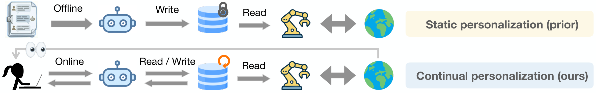
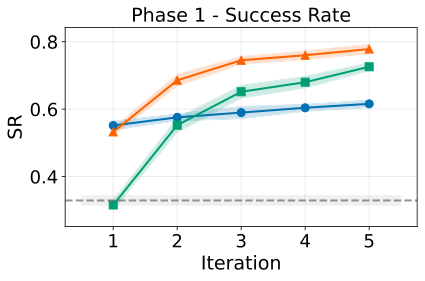
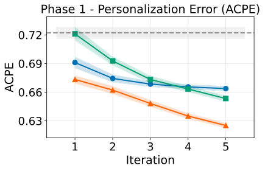
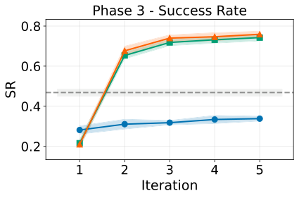
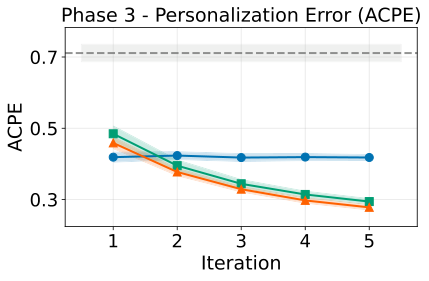

# Learning Personalized Agents from Human Feedback：用人类反馈训练可持续个性化智能体

## 这篇论文解决什么问题
很多 AI 助手在 **初次见面** 和 **用户偏好变化** 时会掉链子。传统方法依赖历史数据或静态用户画像，一旦用户换了口味、场景变了，系统就会“自信但错误”。这篇论文提出 **PAHF（Personalized Agents from Human Feedback）**，把互动本身当作学习信号，让智能体在 **行动前问清楚**、**行动后及时纠错**，并把这些信息写入显式记忆，从而实现 **持续个性化**。

## 核心思路：双通道反馈 + 显式记忆
作者把个性化学习分成两个错误来源：
- **部分可观测性**：新用户没历史，指令含糊，容易猜错。
- **偏好漂移**：用户偏好随时间变，旧记忆会误导。

PAHF 用两种反馈通道互补解决：
- **Pre-action（行动前澄清）**：在不确定时先问清楚，避免第一次就犯错。
- **Post-action（行动后纠错）**：行动错了就更新记忆，修正“自信但错误”的旧认知。

### 整体框架图

> 图解：上半部分是静态个性化，部署时只能读取旧记忆；下半部分是 PAHF 的在线交互闭环，行动前检索并提问，行动后根据反馈更新记忆，实现持续适应。

### 三步循环（核心算法）
1. **Pre-action 交互**：先检索记忆，若信息不足则向用户提问。
2. **Action 执行**：综合指令、环境、记忆和澄清结果执行动作。
3. **Post-action 更新**：如有错误反馈，更新记忆以修正偏好。

对应公式（去掉宏，保留核心）：

$$
\hat M'_t = \mathcal{F}^{pre}_{update}(\hat M_t, I_t, O_t, m_t, q_t, f_t^{pre})
$$

$$
a_t = \pi_{act}(I_t, O_t, m_t, q_t, f_t^{pre})
$$

$$
\hat M_{t+1} = \mathcal{F}^{post}_{update}(\hat M'_t, I_t, m_t, q_t, f_t^{pre}, a_t, f_t^{post})
$$

## 理论直觉：为什么必须双通道
论文给出明确结论：
- **只有 pre-action**：能减少初始错误，但遇到偏好漂移会“卡死”。
- **只有 post-action**：能纠错，但必须先犯错才能学，用户体验差。
- **两者结合**：初期少犯错，漂移时能快速更新，整体错误率最低。

核心理论结论（简化表述）：
- 如果偏好会变，**只靠 pre-action 会出现线性错误积累**。
- 如果任务模糊，**只靠 post-action 依然会犯大量初始错误**。
- 双通道可将动态遗憾降为 $O(K + \gamma)$ 量级（$K$ 为偏好切换次数，$\gamma$ 为模糊轮次比例）。

## 实验设计：四阶段验证“学得快 + 改得快”
### 评价协议（4 阶段）
1. **Phase 1**：初始学习（有反馈）
2. **Phase 2**：初始测试（无反馈）
3. **Phase 3**：偏好漂移后的再学习
4. **Phase 4**：漂移后测试（无反馈）

### 两个评测场景
- **Embodied Manipulation**：室内任务（拿物品、放位置），偏好依赖情境。
- **Online Shopping**：购买任务，需满足多维产品特征偏好。

## 结果解读：PAHF 为什么更稳
### 1) 行动前澄清减少初始错误
Pre-action 的方法在 Phase 1 的第一轮成功率更高，ACPE 更低。

> 图解：横轴为迭代轮数，纵轴为成功率（SR）。Pre-action 与 PAHF 在初始阶段起步更高，说明行动前澄清能有效降低第一次犯错。

> 图解：横轴为迭代轮数，纵轴为平均累计个性化错误（ACPE）。Pre-action 系列在前期下降更快，意味着初期用户成本更低。

### 2) 单独 pre-action 在漂移后失效
偏好改变后，Pre-action Only 很难自我纠正，因为它认为自己“已经知道答案”。

> 图解：Phase 3 的成功率曲线显示 Pre-action Only 提升缓慢，甚至不如无记忆基线，说明旧记忆成为负担。

### 3) Post-action 能快速纠错，但代价是先犯错
Post-action Only 在漂移后能迅速恢复，但初期必须经历试错。

> 图解：Post-action Only 在 Phase 3 的 ACPE 下降很快，说明纠错有效，但初期 ACPE 明显更高。

### 4) PAHF 融合优势，整体最优
PAHF 同时保留 **早期低错误率** 和 **漂移快速恢复**。

> 图解：PAHF 曲线几乎贴合 Post-action Only，但初期错误更少，显示双通道互补。

## 关键表格：Phase 2/4 成功率对比
| 方法 | Embodied Phase 2 | Embodied Phase 4 | Shopping Phase 2 | Shopping Phase 4 |
|---|---|---|---|---|
| No memory | 32.3 | 44.8 | 27.8 | 27.0 |
| Pre-action only | 54.1 | 35.7 | 34.4 | 56.0 |
| Post-action only | 67.9 | 68.3 | 38.9 | 66.9 |
| **PAHF** | **70.5** | **68.8** | **41.3** | **70.3** |

> 图解：Phase 2 代表“初始偏好测试”，Phase 4 代表“漂移后测试”。PAHF 在两领域都取得最高成功率，说明它既能学得快，也能改得快。

## 记忆系统：不追求复杂，只保证可用
论文强调：重点不是新型记忆架构，而是 **反馈如何写入记忆**。  
实现上提供两种后端：
- **SQLite**：简单可复现。
- **FAISS**：支持规模化检索。

记忆写入流程是：  
反馈 → 判断是否重要 → 摘要 → 与旧记忆比相似度 → 更新或新增。

## 两个数据集的设计亮点
### Embodied
- 40 个 persona，每个有复杂条件偏好（情境驱动）。
- “Evolved” 版本通过逻辑翻转制造强烈漂移。

### Shopping
- 10 个类别，每类 3 维特征。
- 用户偏好分为 **Preferred / Acceptable / Disliked**。
- Phase 3 通过重新采样偏好模拟漂移。

## 局限与未来方向
- 反馈可能有噪声，目前只做基础过滤。
- 只允许单轮澄清，现实可考虑多轮对话策略。
- 购物场景仍很难，模型能力可能是瓶颈。

## 总结
PAHF 的核心贡献不是“更强模型”，而是 **把人类反馈嵌入到持续学习闭环**。  
它用 **Pre-action** 解决冷启动，用 **Post-action** 处理漂移，并通过显式记忆把信息沉淀下来。对于现实世界中“偏好经常变化、没有历史数据”的智能体，这是一个非常实用的方向。

> 本文参考自 [Learning Personalized Agents from Human Feedback](https://arxiv.org/abs/2602.16173)