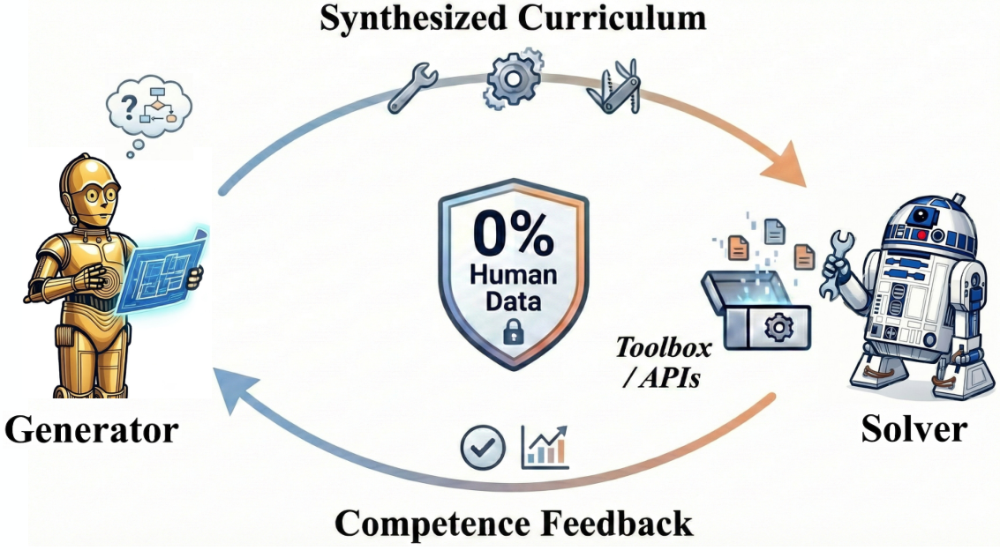
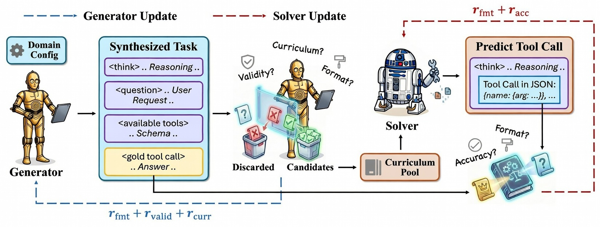
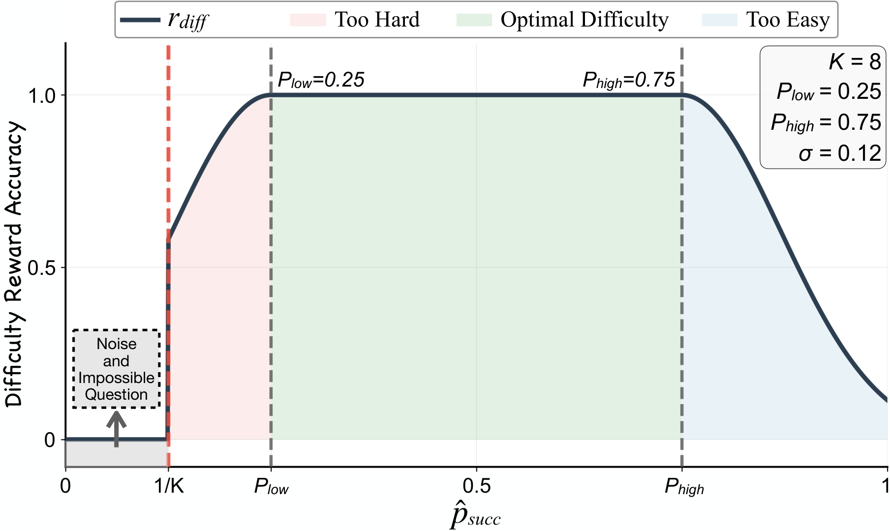
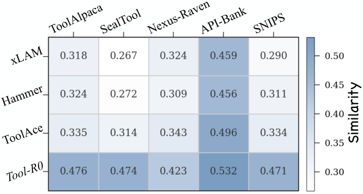
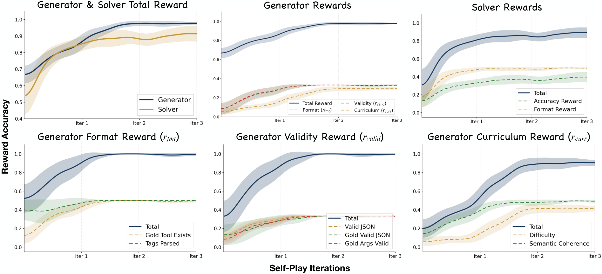
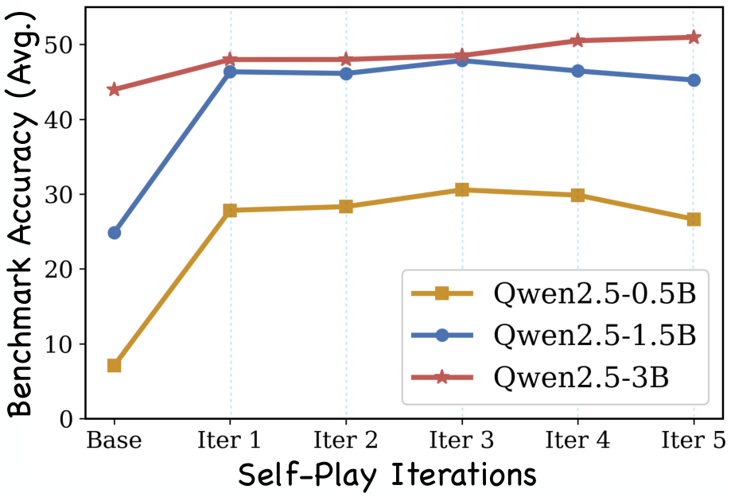
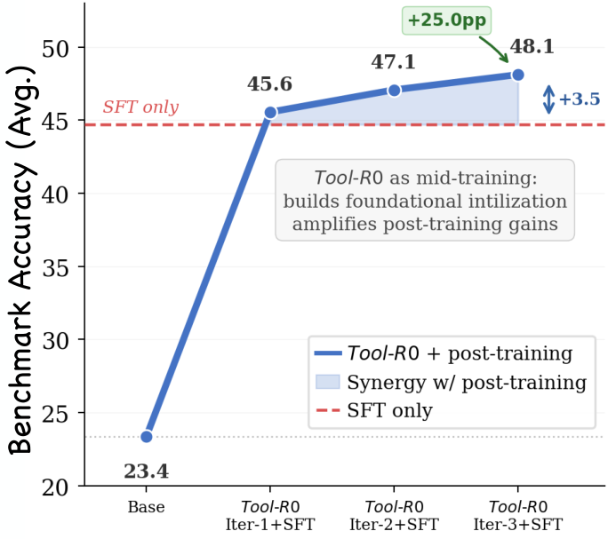
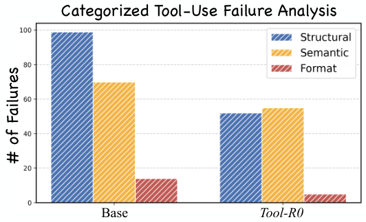

# Tool-R0：零数据起步，让 LLM Agent 通过自博弈学会 Tool Calling

## 这篇论文在解决什么问题？

当前很多 Tool-Calling Agent 的训练范式，本质上都依赖大量人工标注数据：需要人工编写任务、工具 schema 和正确调用轨迹。问题在于，这条路径成本高、迭代慢，而且长期看扩展性有限。

这篇论文直接提出了一个非常关键的问题： **能不能完全不用人类数据，让一个基础 LLM 自己“出题—做题—进化”，最终学会通用工具调用能力？** 

作者给出的答案是：可以。方法名为 **Tool-R0** ，核心是两个角色的自博弈共进化：

- **Generator** ：自动生成工具调用任务（用户请求 + 可用工具 + 标准答案调用）
- **Solver** ：学习解决这些任务并输出正确工具调用

关键不在于“生成更多数据”，而在于“生成对当前 Solver 最有学习价值的数据”。

---

## 方法总览：从“闭环训练”到“能力自举”

> 图解：这张图展示了论文最核心的训练闭环。Generator 持续合成任务，Solver 持续解题；Solver 的表现又反过来决定 Generator 下一轮出题难度，形成能力共进化。

> 图解：完整流程分三段：先训练 Generator，再构建课程数据集，最后训练 Solver。每次迭代都将“当前最合适难度”的样本喂给 Solver，而不是使用固定静态语料。

### 1) Generator 如何学会“出好题”？

Generator 的目标不是随意生成任务，而是同时满足三类奖励：

- **格式奖励** ：输出必须可解析、可验证（tag 完整、JSON 可解析）
- **有效性奖励** ：gold tool call 必须存在于工具菜单中，参数齐全，且取值与问题语义对齐
- **课程奖励** ：任务难度应卡在 Solver 能力边界附近（既不太简单，也不完全不可解）

核心有效性奖励可写为：

$$
r_{\text{valid}}(x)=
\lambda_{\text{menu}}\mathbf{1}[n^\star\in\mathcal{T}]
+\lambda_{\text{gold}}\mathbf{1}[\operatorname{req}(n^\star)\subseteq \operatorname{keys}(a^\star)]
+\lambda_{\text{value}}\mathbf{1}[\operatorname{vals}(a^\star)\hookrightarrow q]
$$

直观理解：工具名要合法、必填参数要完整、参数值要在用户请求中“有据可依”。

### 2) 难度奖励是这篇论文最有技术含量的设计

> 图解：横轴是 Solver 对题目成功率的估计 $\hat{p}_{\text{succ}}$，纵轴是难度奖励。中间区间奖励最高，两端平滑衰减。题目过易或过难都不是最优训练信号。

$$
r_{\text{diff}}(x)=
\begin{cases}
1, & \hat{p}_{\text{succ}}\in[P_{\text{low}},P_{\text{high}}]\\
\exp\left(-\frac{(\hat{p}_{\text{succ}}-P_{\text{low}})^2}{2\sigma^2}\right), & \hat{p}_{\text{succ}}<P_{\text{low}}\\
\exp\left(-\frac{(\hat{p}_{\text{succ}}-P_{\text{high}})^2}{2\sigma^2}\right), & \hat{p}_{\text{succ}}>P_{\text{high}}\\
0, & \hat{p}_{\text{succ}}<1/K
\end{cases}
$$

这里的高明之处在于，它不是硬阈值，而是高斯平滑边界。因此在能力边界附近，不会因采样噪声导致训练信号突变或消失。

### 3) Solver 怎么学？

Solver 的训练奖励分两层：

- 结构格式正确（可解析为规范调用）
- 语义准确（工具名、参数 key、参数 value 匹配）

同时对“额外乱加调用”施加惩罚：

$$
r_{\text{acc}}
=
\bar{s}\cdot
\frac{1}{1+\alpha\cdot \max(0,|\hat{C}|-|C^\star|)}
$$

这使模型不仅要“答对”，还要“答得克制”。

---

## 关键实验：零数据，真的能赢监督数据吗？

### 主结果（Qwen2.5-1.5B）

- Base：24.85
- Tool-R0：47.84
- 绝对提升：+22.99
- 相对提升：+92.52%

而且该提升并非单一 benchmark 的偶然结果，在 ToolAlpaca / SealTool / NexusRaven / API-Bank / SNIPS 上都出现了明显增长。

### 小模型是否吃亏？

恰恰相反。0.5B 模型提升最明显，说明 Tool-R0 对“弱先验模型”的能力激活尤为有效，能显著缩小其与大模型的工具调用差距。

### 跨架构泛化（Qwen vs Llama）

同样有效。不同模型家族都获得提升，说明这并非只对某个 backbone 生效的“定制技巧”。

---

## 为什么自生成课程会超过人工数据？

> 图解：作者比较了训练语料与测试集分布相似度。静态人工数据覆盖有偏且固定；自博弈课程覆盖更均衡，也更贴近评测需求。

论文给出一个非常值得记住的观察：  
**静态 curated 数据学到的是“人预设的分布”，自博弈课程学到的是“模型当前真正欠缺的能力”。**

这也解释了为什么 Tool-R0 在零 curated data 条件下，平均性能仍能超过多种监督 baseline。

---

## 消融告诉我们的“机制真相”

- 共享 Generator/Solver 参数：性能暴跌（-17.42 pp）
- 冻结 Generator 不学习：明显下降（-6.19 pp）
- 去掉难度奖励：下降（-4.30 pp）
- 将高斯平滑改为硬截断：下降（-3.74 pp）

结论很清晰：  
**角色分离 + 难度感知课程 + 平滑奖励** 是系统有效的三根支柱。

---

## 训练动态与收敛现象

> 图解：Generator 奖励收敛更快，Solver 收敛较慢；格式奖励先饱和，准确率后提升，符合“先学会输出结构，再学会语义正确”的学习顺序。

> 图解：小模型通常在第 3 轮附近进入平台期；更大模型仍能继续提升。模型容量越大，持续进化空间越大。

> 图解：将 Tool-R0 用作 mid-training 后再接 SFT，效果强于“仅做 SFT”，说明自博弈阶段先夯实了基础能力。

> 图解：Tool-R0 对结构错误（错工具名、参数缺失、调用次数不对）的抑制最明显；格式错误几乎清零，剩余瓶颈更多在语义细节对齐。

---

## 我的解读：这篇工作真正的贡献是什么？

### **贡献 1** ：将“零数据自进化”从数学/代码拓展到通用 Tool Calling

过去很多 self-play 工作局限在可验证的封闭环境，这篇工作将其推进到异构 API、多域工具调用场景。

### **贡献 2** ：提出可操作的“能力边界课程学习”

它不是泛泛而谈 curriculum，而是直接利用当前 Solver 的 pass@$K$ 估计来定义“该学什么难度”。

### **贡献 3** ：证明“数据量不是唯一答案，数据-能力对齐更关键”

相比动辄数万到数十万监督样本的 baseline，Tool-R0 在零 curated data 下实现了更强的平均表现。

### **贡献 4** ：给出工程上可复用的训练范式

Generator 训练、过滤、交叉验证、难度分桶、Solver 训练的流水线非常清晰，后续可直接迁移到企业私有工具生态。

---

## 局限与下一步

论文也坦诚指出了问题：

- 小模型更容易早饱和，长期上限受模型容量限制
- 难度估计依赖多次采样，计算成本较高
- 语义一致性判别仍可能漏掉细粒度错误

未来方向也很明确：  
更好的难度信号（如 loss/gradient 级别）、外部教师注入以突破知识边界，以及更系统的生成质量度量。

---

> 本文参考自 [Tool-R0: Self-Evolving LLM Agents for Tool-Learning from Zero Data](https://arxiv.org/abs/2602.21320)