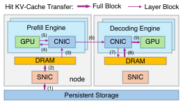
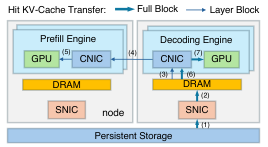
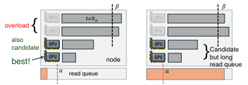
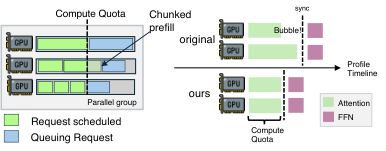
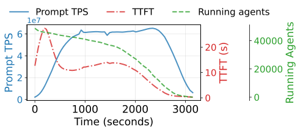

# DualPath：打破 Agentic LLM 推理中的存储带宽瓶颈

## 背景与问题：Agentic 工作负载为何被 I/O 卡死
Agentic LLM 的核心特征是 **多轮、长上下文、短追加** 。每一轮只新增少量 token，但需要重复读取极长上下文的 KV-Cache，因此 KV-Cache 命中率通常 $\ge 95\%$。这意味着系统从 “算力瓶颈” 变成了 “存储 I/O 瓶颈”。

在主流 **Prefill–Decode (P/D) 解耦** 架构中：
- Prefill 引擎（PE）负责从存储读取 KV-Cache 并执行预填充。
- Decode 引擎（DE）负责自回归生成，并将新 KV-Cache 写回存储。

问题是： **所有 KV-Cache 读流量都集中在 PE 侧的存储 NIC（SNIC）** ，而 DE 侧 SNIC 处于空闲。最终导致 **PE 端存储带宽饱和、DE 端带宽闲置** ，系统整体吞吐被单点瓶颈限制。

> 图解：左侧是传统架构，KV-Cache 仅从存储加载到 PE，导致 PE SNIC 饱和；右侧是 DualPath，KV-Cache 可以先加载到 DE，再经 RDMA 传给 PE，均衡所有 SNIC 负载。

## DualPath 的核心思路：Dual-Path KV-Cache Loading
DualPath 提出 **双路径 KV-Cache 加载** ：
1. **传统路径（Storage → PE）**
2. **新路径（Storage → DE → PE）**

通过调度器动态选择路径， **利用 DE 侧 SNIC 带宽分担读取压力** ，把原本单点的存储瓶颈转化为可调度的全局带宽池。

> 图解：PE 读路径。KV-Cache 从存储读入 PE buffer，再逐层加载到 HBM，计算后转移到 DE buffer 完成聚合。

> 图解：DE 读路径。KV-Cache 先读入 DE buffer，再通过 RDMA 分层传给 PE HBM，实现读取负载在 DE 侧完成。

## 关键组件拆解

### 1. Layerwise Prefill：用空间换并行
长上下文 prefill 的主要障碍是 HBM 容量。Layerwise Prefill 将 KV-Cache 按层分块，只在单层内驻留，显著提升 token batch size 和 GPU 利用率。

### 2. CNIC-Centric Traffic Manager：避免通信互相干扰
DualPath 强制所有 GPU 数据流量（H2D/D2H、KV-Cache 传输）都走 Compute NIC (CNIC)，并通过 QoS 分级隔离：

- 高优先级：模型执行通信（AllToAll / ReduceScatter）
- 低优先级：KV-Cache 读写

在 InfiniBand 中使用 VL（Virtual Lane）实现 99% 带宽留给高优先级流量。

> 图解：存储 NIC 负载均衡效果，纵轴是最大/平均流量比，越接近 1 越均衡。

### 3. 动态调度：同时平衡 NIC + GPU
调度分两层：
- **跨引擎调度** ：选择 PE/DE 组合，并决定 KV-Cache 从哪条路径读取。
- **引擎内调度** ：按 “计算配额” 选择 batch，避免 attention 阶段同步等待造成 GPU bubble。

> 图解：跨引擎调度示意。调度器优先选取读队列短、负载轻的 PE。

> 图解：引擎内调度，通过计算配额保证 attention 计算时长一致，减少 GPU 空闲等待。

## 理论分析：双路径是否会引入新瓶颈？
论文给出 **P/D 比例的可行范围** 。在典型配置 $g=8, s=1$ 下（每节点 8 GPU，1 个 SNIC）：

$$
\frac{1}{7} \le P/D \le \frac{7}{2}
$$

这覆盖了常见的 1P1D、1P2D、2P4D 等配置，说明双路径在实践中具备可扩展性。

## 实验设计与评估结果

### 硬件与模型
- 集群：8×Hopper GPU / 节点，双 400Gbps CNIC，独立 400Gbps SNIC
- 存储：3FS（无 DRAM cache）
- 模型：DS 660B（MoE）、DS 27B、Qwen 32B

### 数据集：Agent Trace
平均 turn 数 60–157，context 平均 17k–32k，append 仅 429–608 token，KV-Cache 命中率超 98%。

> 图解：一个 Agent 轨迹示例，context 每轮递增，append 很短，导致 KV-Cache 读远多于计算。

### 离线推理（Rollout）
在离线 batch 推理场景中，DualPath 显著降低 JCT：

- DS 660B：最高 **1.87×** 提升
- DS 27B：最高 **1.78×** 提升
- Qwen 32B：趋势一致

> 图解：不同 batch size 和 MAL 下的 JCT。越大 batch、越长上下文，DualPath 优势越明显。

> 图解：不同 P/D 比例下的 JCT。DualPath 在所有比例下稳定领先。

> 图解：append 长度越短，DualPath 提升越大，说明瓶颈在存储 I/O 而非计算。

### 在线服务（Serving）
在 SLO（TTFT ≤ 4s, TPOT ≤ 50ms）下，DualPath 支持更高 APS：

- DS 27B： **1.67× APS**
- DS 660B： **2.25× APS**

> 图解：随着 APS 提升，DualPath 在 TTFT、TTST、TPOT 上都保持稳定，不引入额外解码开销。

> 图解：平均 JCT 随 APS 增长趋势，DualPath 能维持低延迟区间更久。

### 消融实验
三项核心技术贡献如下：
- Layerwise Prefill：JCT 降低 17.21%
- Dual-Path Loading：JCT 降低 38.19%
- 调度算法：JCT 降低 45.62%

> 图解：左图是 TTFT 拆解，DualPath 显著减少读取队列等待；右图是消融结果。

## 规模化实验
在 1,152 GPU 的大规模实验中：
- 离线推理：2P4D → 48P96D，JCT 3167s → 3201s（近线性扩展）
- 在线服务：0.4 APS → 8.8 APS，吞吐提升 22×

> 图解：大规模 rollout 的吞吐和 KV-Cache 读写统计，吞吐随规模线性增长。

## 总结与启示
DualPath 的核心贡献是： **不再把 KV-Cache 读取绑定到 Prefill 引擎** ，而是让所有 SNIC 共同承担，从架构上解决 “存储带宽不均衡” 这一根本瓶颈。结合 CNIC QoS 隔离与动态调度，系统在离线和在线场景都获得 **接近 2× 的吞吐提升** 。

对未来系统设计的启示是：
- Agentic 推理的瓶颈已经是 **存储 I/O + NIC 调度** ，而不是纯算力。
- 计算网络在多轮推理中存在 “间歇性空闲带宽”，可以被系统级策略充分利用。
- 调度层的全局视角与 NIC QoS 配置同等重要。

> 本文参考自 [DualPath: Breaking the Storage Bandwidth Bottleneck in Agentic LLM Inference](https://arxiv.org/abs/2602.21548)