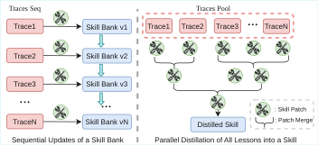

# Trace2Skill 解读：把“单条轨迹经验”蒸馏成可迁移的 Agent Skill，到底怎么做到？

## 一句话先说结论
这篇工作最有价值的一点是：它不把经验当作“检索记忆库”来使用，而是把大量成功/失败轨迹中反复出现的规律，蒸馏为可直接注入系统提示词的 **声明式技能目录** （`SKILL.md + references/`）。并且，这种形式在跨模型规模与 OOD 任务上都展现出可迁移性。

---

## 研究动机：为什么需要 Trace2Skill？

当前 Agent Skill 生态里有两个典型问题：

- **人工编写 skill 扩展性差**：场景一多，维护成本暴涨。
- **纯参数知识生成的 skill 不可靠**：内容往往泛化空泛，难覆盖真实失败模式。
- **在线逐条更新容易“漂移”**：后续编辑受前序改动影响，顺序依赖强。
- **检索式经验库存在耦合与召回问题**：检索不到就失效，还占用推理上下文预算。

论文的核心主张是：与其把每条轨迹单独存储并在推理时检索，不如先离线并行分析，再统一归纳成“高频 SOP（标准操作流程）”。

---

## 方法总览：三阶段流水线

> ⚠️ 图片文件可能缺失：`figures/trace2skill_framwork`
>
> 图解：这张图是全文核心。横向是三阶段流程：轨迹采样 → 多分析器并行产出 patch → 分层合并为单一技能更新。关键不在“多 agent”本身，而在最终的 many-to-one 归纳与冲突消解。

### 1) Skill 形式化

作者将 skill 定义为：

$$
\mathcal{S} = (M, \mathcal{R}), \quad \mathcal{R} = \{\text{scripts}, \text{references}, \text{assets}\}
$$

其中 `M` 是主文档 `SKILL.md`，用于记录流程、策略与失败规避；资源目录用于存放脚本与长尾参考材料。

### 2) 目标定义（不改模型参数）

固定 agent $\pi_\theta$ 参数，仅进化 skill：

$$
\mathcal{P}(\mathcal{S}; \pi_\theta, \mathcal{D})
= \frac{1}{|\mathcal{D}|} \sum_{t \in \mathcal{D}} \mathbf{1}[\pi_\theta(t; \mathcal{S}) = y_t^*]
$$

目标是从 $\mathcal{S}_0$ 进化出 $\mathcal{S}^*$，使测试集成功率更高：

$$
\mathcal{S}^* = \mathcal{E}(\mathcal{S}_0, \mathcal{D}_{evolve}; \pi_\theta), \;
\mathcal{P}(\mathcal{S}^*; \pi_\theta, \mathcal{D}_{test}) > \mathcal{P}(\mathcal{S}_0; \pi_\theta, \mathcal{D}_{test})
$$

### 3) Stage 1：轨迹生成

用 ReAct 跑任务，得到轨迹集合 $\mathcal{T}$，并按结果切分为失败集 $\mathcal{T}^-$ 与成功集 $\mathcal{T}^+$。

### 4) Stage 2：并行产出 patch（重点是角色不对称）

- **Success Analyst**：单次分析成功轨迹，提炼可复用模式。
- **Error Analyst**：多轮 agentic 诊断失败根因，可读文件、验证修复、再回查。

关键观点是：失败归因比成功总结更难，因此失败分析器必须具备“交互式诊断能力”，而非单次 LLM 调用。

### 5) Stage 3：分层合并 + 冲突防护 + 归纳推理

将所有 patch 分层 merge，同时进行编辑冲突处理与“高频模式优先”的归纳：

- 高频出现的 patch 提升为主流程原则。
- 低频但有价值的 patch 下沉到 `references/`。
- 通过程序化 guardrail 防止坏 patch 落地（如文件不存在、同区域冲突、格式校验失败）。

---

## 与在线顺序更新的差异：为什么并行整合更合理？

> 图解：左图是“来一条轨迹改一次 skill”的在线范式；右图是先收集大量轨迹再统一归纳。前者容易受时间顺序绑架，后者更接近“先形成领域认知，再写 SOP”的专家流程。

作者给出的解释较为扎实：

- **效率优势**：并行分析 + 分层合并显著降低 wall-clock 时间。
- **稳定性优势**：所有 patch 基于同一份冻结初始 skill，避免 sequential drift。
- **泛化优势**：从“跨轨迹重复出现”中抽取规律，而非追逐最近样本。

---

## 主实验怎么读？

### 任务与设置

- 主战场：SpreadsheetBench（ID）+ WikiTableQuestions（OOD）。
- 额外验证：Math（DAPO / AIME 2026）与 DocVQA。
- 双模型：Qwen3.5-122B-A10B 与 Qwen3.5-35B-A3B。
- 两种模式：
  - Deepening：从人工 skill 出发继续强化。
  - Creation：从参数知识草稿出发“从零做强”。

### 核心结果（提炼版）

- **Deepening 有效**：人工 skill 可被持续显著增强。
- **Creation 也可行**：从弱初始 skill 出发仍能达到强效果。
- **跨模型迁移成立**：35B 进化的 skill 能提升 122B，反向亦成立。
- **OOD 迁移成立**：在 WikiTQ 上仍有明显收益，而非仅记住训练分布。

一个亮点是：文中报告在部分设置下，35B 产出的 skill 可让 122B 在 WikiTQ 获得大幅增益（最高 +57.65 个百分点）。

---

## 三组关键消融：论文最“硬”的部分

### 1) Agentic 错误分析 vs 单次 LLM 错误分析

结论：前者在四种 Author-Mode 组合的平均指标上更优。  
原因：可验证修复、可反复定位根因，减少“看日志即下结论”的误判。

### 2) 并行整合 vs 顺序编辑

结论：并行方案整体质量更高且速度更快。  
文中示例时间量级：并行约 3 分钟，顺序约 15～60 分钟（取决于 batch 设置）。

### 3) 蒸馏 skill vs 检索记忆库（ReasoningBank 风格）

结论：统一 skill 文档优于在线检索记忆。  
解释：检索依赖 query 相似度，OOD 场景易失配；而 skill 作为先验流程直接进入系统上下文，更稳定。

---

## 论文给出的“可迁移 SOP”是什么样？

高频规则几乎都不是花哨技巧，而是工程硬规范，例如：

- 写公式后必须重算并回读验证。
- `pandas` 负责变换，`openpyxl` 负责写回，避免公式/结构损坏。
- 写完必须显式 read-back 校验目标单元格。
- 行删除按降序执行，避免索引漂移。

这说明 Trace2Skill 真正学到的是 **稳定工作流约束**，而不是某题答案模板。

---

## 局限与可预期改进

作者也较为坦诚，当前仍有两点不足：

- **单个 patch 的因果贡献难量化**：整体 merge 后难以拆解“谁贡献了多少”。
- **skill 各章节在推理时的真实利用率不透明**：未来需要细粒度 attribution，并自动裁剪低效段落。

---

## 结语

Trace2Skill 的价值不只是“自动改文档”，更在于提出了一条对 Agent 体系更现实的路径：在不进行参数更新、也不依赖检索模块的前提下，将执行经验压缩为可共享、可迁移、可部署的 declarative skill 资产。  
这篇论文在多模型协作、跨任务复用与工程可落地性方面，提供了值得借鉴的设计取向。

> 本文参考自 [Trace2Skill: Distill Trajectory-Local Lessons into Transferable Agent Skills](https://arxiv.org/abs/2603.25158)