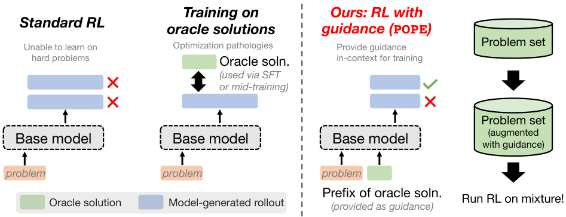
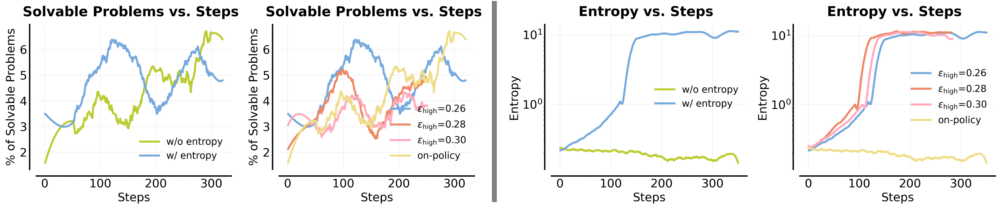
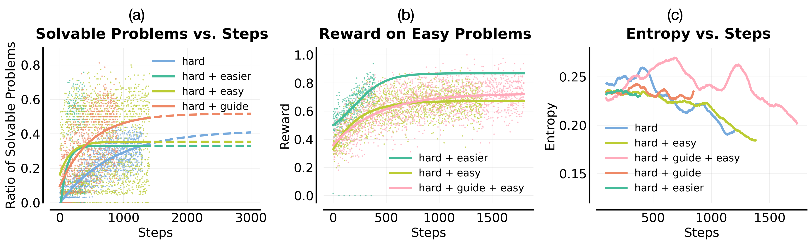
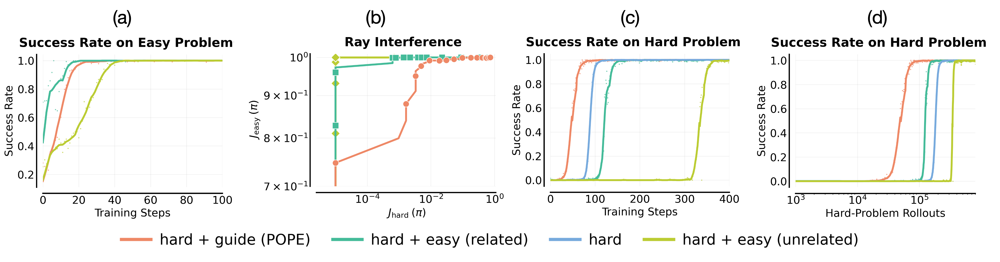
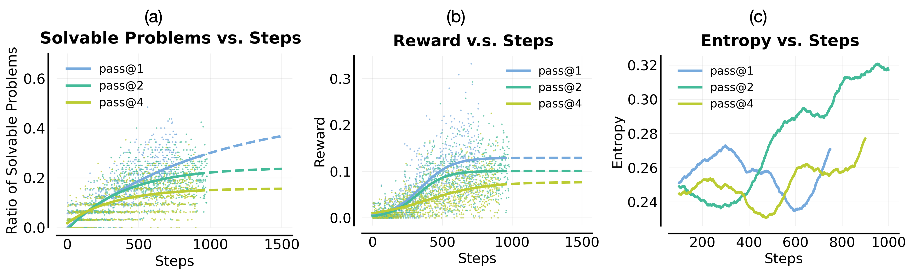
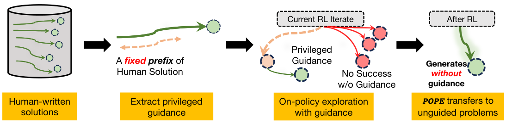
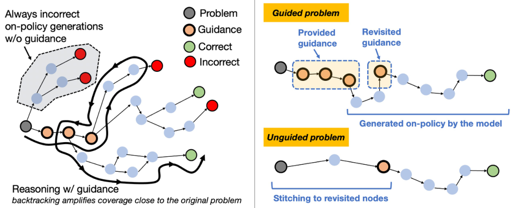
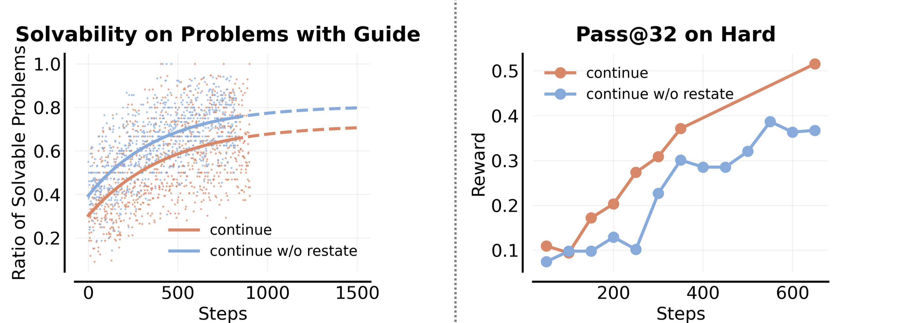
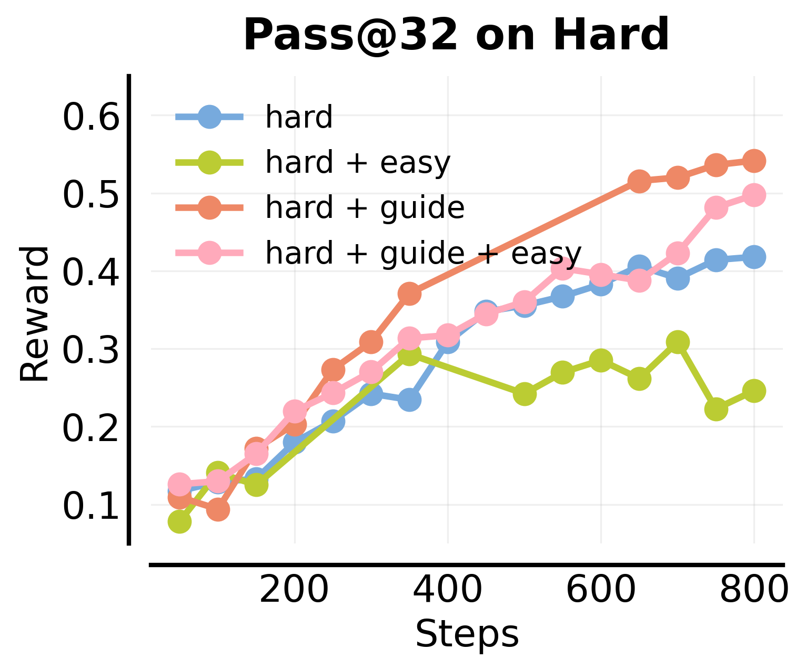
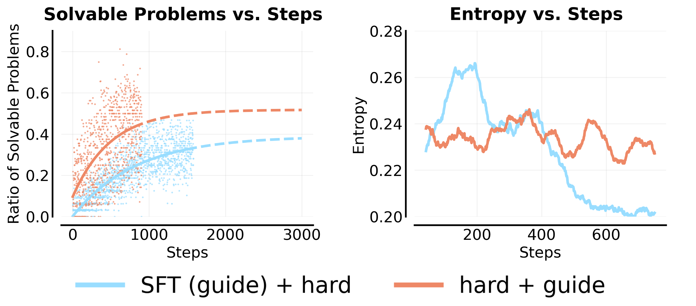

# POPE：用特权引导的 On-Policy 探索，让 LLM 学会攻克 Hard Problem

## 这篇论文到底在解决什么？

如果你做过 LLM 的 RL（比如 GRPO/PPO 风格的 outcome-reward 训练），大概率会遇到一个非常现实的问题：  
模型在 **easy problem** 上越训越好，但在 **hard problem** 上长期 0 奖励、0 梯度、0 进展。

这篇论文的核心贡献是提出 **POPE（Privileged On-Policy Exploration）**：  
它不把人类/Oracle 解答当监督标签去拟合，而是只把它当成“引导探索的前缀”，让模型在 guided rollout 中先拿到非零奖励，再把能力迁移回 unguided 问题。

---

## 1. 先把“卡住”的根因讲清楚

在论文设定里，单题的可解性用 pass@k 衡量：

$$
\text{pass@}k(x)=\Pr\left[\exists\, y_1,\dots,y_k \sim \pi(\cdot|x),\ \max_j r(x,y_j)=1\right]
$$

当某个 hard problem 的 pass@k 近似 0 时，GRPO 这类方法会出现经典困境：  
同批采样全是 0 reward，优势函数全是 0，梯度直接消失。

$$
A_i(x,y_i)=r(x,y_i)-\frac{1}{n}\sum_{j=1}^n r(x,y_j)
$$

这就是论文反复强调的瓶颈：**不是优化器不会调参，而是根本采不到正样本。**

  
> 图解：这张主图对比了几类思路。横向可以理解为“在 hard problem 上拿到有效探索信号的能力”，纵向是“训练稳定性”。POPE 通过前缀引导让 on-policy rollout 更容易进入可得分区域，同时避免直接蒸馏 Oracle 带来的优化病态。

---

## 2. 为啥常见补救方案不奏效？

### 2.1 Token-level exploration：看起来合理，实际容易炸

论文测试了 entropy bonus、放宽 clip ratio 等做法。结论很直接：  
它们并没有显著提升 hard problem 可解性，反而让 token entropy 失控上升，训练不稳定。

  
> 图解：左图看“可解题比例（pass@8）”几乎没被真正拉起来；右图看“token entropy”明显上扬甚至爆炸。说明这类方法更多是在制造随机性，而不是制造有效探索。

---

### 2.2 混 easy+hard 的 transfer：会被 ray interference 抵消

直觉上“先学简单题再迁移到难题”是对的，但论文指出在 on-policy RL 里常出现 **ray interference**：  
优化会优先强化已经能拿分的 easy 子集，hard 子集反而停滞甚至退化。

  
> 图解：混入 easy 后，easy 奖励上升很快，但 hard 可解性（如 pass@32）会更早平台化，说明学习资源被“可得分样本”吸走了。

  
> 图解：两题玩具实验（1 easy + 1 hard）很有说服力。轨迹在奖励平面上明显先冲 easy 方向，hard 方向推进缓慢；POPE 才能在 hard 方向持续前进。

---

### 2.3 直接优化 pass@k：也救不了“初始几乎全错”的场景

论文还试了 pass@k 目标优化。结果是：  
当 pass@1 本来极低时，pass@k 并不能凭空造出成功轨迹，反而可能削弱正负样本区分，拖慢收敛。

  
> 图解：随着优化目标的 k 提高，hard problem 的可解性并没有上去，训练奖励反而更差。说明“目标函数变了”不等于“探索能力变强了”。

---

## 3. POPE 方法：不用蒸馏 Oracle，只借它“引路”

POPE 的关键是：  
把 Oracle 解答前缀作为 **privileged guidance**，但不把这些 token 当监督 target 去拟合。

### 3.1 训练数据怎么构造？

给定 hard problem $x$ 和 Oracle 解答 $z$，选一个短前缀 $z^{0:i^*(x)}$，构造 guided prompt：

$$
\mathcal{D}_{\text{hard}}^{\text{guided}}
=
\left\{
\text{concat}\left(x, z^{0:i^*(x)}, I\right)\mid x\in \mathcal{D}_{\text{hard}}
\right\}
$$

其中 $I$ 是系统指令：让模型“接着这个 partial solution 往下解”。

训练时用 1:1 混合：
- 原始 hard 问题（unguided）
- 对应的 guided hard 问题（带前缀）

### 3.2 为什么这和 SFT/Off-policy 本质不同？

- SFT/Off-policy：把 Oracle 轨迹当“该输出什么”去拟合。
- POPE：只把前缀当“从哪儿开始探索”去引导。

所以 POPE 保持了 on-policy 学习主体，减少了“风格错配导致的推理能力塌陷”。

  
> 图解：流程上可以理解为“先借助前缀进入高价值状态区域，再由 RL 学会从这些区域继续推理”。最终目标是让 unguided 也能到达这些区域。

---

## 4. 为什么能从 guided 迁移回 unguided？

论文给了一个很好的解释：**stitching + overlap**。

- Guidance 先把模型带进“更可能拿奖励”的中间状态区域。
- 模型在这些区域学会 continuation policy（后半段推理）。
- 借助 LLM 的 instruction-following、self-verification、backtracking，这些行为会扩展到与 unguided rollout 有重叠的状态邻域。
- 最终 unguided 只需要“到达附近”，而不用“从零复刻整段 Oracle 前缀”。

  
> 图解：左侧强调 guided roll-in 如何进入可得分区域；右侧强调回溯与反思行为如何扩大与 unguided 的状态重叠，从而实现迁移。

论文还做了反事实干预：  
把指令改成“禁止复述/回看前缀内容”，结果 guided 内表现更好，但 unguided 迁移变差，支持 overlap 假设。

  
> 图解：该图左边显示 guided 任务可能更容易了；右边却显示 unguided pass@32 下降，说明“只会接着前缀做题”不等于“学会独立解题”。

---

## 5. 实验结果：不是小修小补，而是 hard set 的实打实提升

### 5.1 关键设定

- Base model：`Qwen3-4B-Instruct-2507`
- RL：GRPO，max response 16384，temperature 0.8
- 评估 hard 集常用更大预算（如 32k token、更多采样）做 stress test

### 5.2 最重要的数字（节选）

- `+ hard`：hard 集 pass@1 = 13.55，pass@16 = 32.89  
- `+ hard + guide (POPE)`：hard 集 pass@1 = 15.50，pass@16 = 42.53  
- 同时在 AIME 2025、HMMT 2025 也普遍提升（尤其更难的 HMMT）

当 easy 数据大量混入时（Hard + 1K Easy）：
- 无 guidance：hard pass@1 掉到 2.24  
- 有 POPE guidance：hard pass@1 回到 13.98，pass@16 到 36.42

  
> 图解：横轴是训练步数，纵轴是 hard 集 pass@32。`hard+easy` 很快平台化；`hard+guide` 持续上升，明显缓解 interference。

---

### 5.3 与“用 Oracle 当训练标签”方法对比

论文对比了两类 SFT warm-start：
- Full-oracle SFT
- Prefix + rejection-sampled SFT

结论：两者都不如 POPE，Full-oracle SFT 甚至在多个评测上明显退化。  
原因是直接拟合 off-policy 轨迹会改变模型原有推理分布，带来熵坍塌或不稳定。

  
> 图解：SFT warm-start 曲线显示 hard 可解性提升更差，并伴随低熵状态持续，探索能力受限。

---

## 6. 这篇工作的价值与边界

**价值：**
- 把 hard problem 的“零奖励死区”问题讲透了。
- 给出一个工程上可落地、且对现有 on-policy 管线兼容的方案。
- 在 heterogeneous mixture 下仍能保持 hard 学习能力。

**边界：**
- 需要 Oracle / 人类解答前缀。
- 对“模型本身是否有足够 instruction-following 能力”有依赖。
- 对极难题（模型完全缺乏基础知识）可能仍需更强的 target-based 或 value-based 机制。

---

## 7. 复现时最该关注的实践点

- hard/easy 划分必须在足够大采样预算下做（否则会把可压缩思维链的问题误判为 hard）。
- guidance 前缀不宜过长，核心是“刚好把 rollout 推进到可得分区域”。
- 训练要保留 unguided+guided 混合，避免只在“有拐杖”条件下学会解题。
- 评估要同时看 pass@1 和 pass@k，且包含更难分布（如 HMMT）来检验真实泛化。

---

> 本文参考自 [POPE: Learning to Reason on Hard Problems via Privileged On-Policy Exploration](https://arxiv.org/abs/2601.18779)