# 42 倍提速：把 llama.cpp 的 Prompt Lookup 草稿机制压榨到极致

这篇文章解决的问题很朴素：llama.cpp 里的 Prompt Lookup Decoding（一种用 n-gram 做投机采样的加速技术）在生成"草稿 token"时太慢了，而且语料越大越慢。作者没有改动任何算法逻辑，只靠四个"纯工程"的数据结构优化——去掉多余的 Map 拷贝、换扁平哈希表、把内层哈希表换成有序数组、用 Daniel Lemire 的 constmap 存静态缓存——就把每个草稿 token 的延迟从最高 165.48 µs 压到 3.98 µs，提速最多 **42 倍** ，峰值内存最多省 **2.6 倍** 。后来 Lemire 本人又送来一个 PR，把整体提速拉到了 **140 倍** 。这篇文章最值得学习的地方在于：它展示了"读懂数据分布 + 选对数据结构"这种老派基本功，在 AI 基础设施里依然能打出惊人的效果。

## 背景：什么是 Prompt Lookup Decoding

先建立直觉。投机采样（Speculative Decoding）的思路是：用一个便宜的"草稿模型"先猜几个 token，再让大模型一次性验证，猜对了就白赚。Prompt Lookup Decoding 是投机采样的一个特例，它的"草稿模型"蠢得可爱——就是一个 **n-gram 统计模型** ，不用任何神经网络。

n-gram 模型的规则一句话就能说清：选一段语料，统计每个 n-gram（连续 n 个 token 的序列）后面最常跟哪个 token；要预测时，看当前最后 $n-1$ 个 token，直接查表取出语料里出现频率最高的后继 token。比如 "(of, the)" 后面跟过 "city" 6 次、"war" 3 次、"year" 1 次，那遇到 "of the" 就猜 "city"。

llama.cpp 维护三种 n-gram 缓存。对任意 n-gram $\eta$ 和 token $y$，缓存存的是 $c(\eta, y)$，即 token $y$ 跟在 $\eta$ 后面出现的次数：

- **上下文缓存** $c_{\text{ctx}}$：存当前会话中已处理 token 的 1~4 阶 n-gram，随生成不断更新；
- **动态缓存** $c_{\text{dyn}}$：存模型历史运行（比如之前的对话）中的 n-gram；
- **静态缓存** $c_{\text{st}}$：用 `llama-lookup-create` 从固定语料（本文用 WikiText-103）离线构建的 2-gram 缓存，加载后不再修改。

打草稿时，设最近处理的 $n$ 个 token 为 $X_n = (x_{t-n+1}, \ldots, x_t)$。llama.cpp 对词表中每个 token $y$ 计算一个分数，大致是：

$$
s_n^{f}(y) = w(y) \cdot f(X_n, y)
$$

其中 $f$ 是上下文缓存或动态缓存，权重 $w(y)$ 偏向那些也得到静态缓存"认可"的 token（没有静态缓存时 $w(y) = 1$）。取最高分 $y^* = \arg\max_y s_n^{f}(y)$ 后，还要过两道阈值：记 $F(X_n) = \sum_y f(X_n, y)$ 为 $X_n$ 出现的总次数，只有当

$$
F(X_n) \ge a_n \quad \text{且} \quad f(X_n, y^*) \ge p_n \cdot F(X_n)
$$

同时成立时，$y^*$ 才会被接受为草稿 token。也就是说：这个 n-gram 至少要出现过 $a_n$ 次，且 $y^*$ 的占比要达到 $p_n$。llama.cpp 按 $n = 4, 3, 2, 1$ 依次尝试，先查上下文缓存，全失败再查动态缓存，最后退回只用静态缓存；都失败就放弃这次草稿。这些阈值目前是硬编码的，比如上下文缓存 $(a_1, a_2, a_3, a_4) = (2, 2, 1, 1)$，$(p_1, p_2, p_3, p_4) = (0.66, 0.5, 0.5, 0.5)$。

## 实验设置：怎么测出来的

作者直接复用了 llama.cpp 仓库自带的两个工具：`llama-lookup-create` 从语料构建静态缓存，`llama-lookup-stats` 做基准测试——后者把一个文件的 token 当作"模型输出"来重放，统计草稿命中率、打草稿耗时和静态缓存加载耗时。

实验用 WikiText-103 构建静态缓存，并重放其测试集。除了完整的 541 MB 语料，还分别取前 25、50、100、200 MB 构建小缓存，观察性能随语料规模的变化；"语料为 0"表示完全不加载静态缓存，只测上下文和动态缓存。所有结果取 3 次运行的中位数，误差棒为最小/最大值，模型上下文长度设为 4096 token，机器是 Apple M4 Pro（14 核，48 GB 内存）。

有一点很关键：作者 **没有改变任何算法逻辑** ，所以草稿接受率理论上不变。为保险起见，他还是确认了每次改动后的接受率与原实现几乎一致。真正变化的指标只有三个：每个草稿 token 的延迟、静态缓存的加载时间、静态缓存的内存占用。

## 优化一：别再复制 Map 了

llama.cpp 的 n-gram 缓存是嵌套的 `std::unordered_map`：外层把 n-gram 映射到内层 Map，内层存"后继 token -> 出现次数"。作者发现 **每一步打草稿时，内层 Map 都在多个地方被整份拷贝** ——这与其说是优化，不如说是修 bug。他把这些读取改成按引用访问，仅此而已。

效果立竿见影：打草稿提速 **4.5 倍到 25.6 倍** （取决于语料大小）。

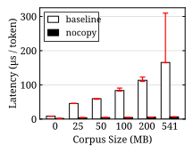

> 图解：横轴是静态缓存的语料大小（0 到 541 MB），纵轴是平均每个草稿 token 的延迟。基线（修复拷贝问题之前）在 541 MB 语料下要 165.48 µs，而这个一行级的修复把它压到 6.47 µs。曲线形态也很有意思：基线的延迟随语料增大而持续恶化，修复后则基本平坦——因为多余拷贝的成本正比于内层 Map 的大小。

加载时间和峰值内存基本不变（毕竟只是去掉了拷贝），这里就不贴图了。这个改动的教训很直白： **在审视高级优化之前，先确认你没有在热路径上做整份数据拷贝** 。

## 优化二：外层 Map 换成扁平哈希表

修掉拷贝之后，下一个目标是 `std::unordered_map` 本身。标准库的 unordered_map 用链地址法解决冲突，桶是链表，指针跳来跳去，对 CPU 缓存极不友好——这是 C++ 圈子里公认的性能黑洞。

替代品有很多，比如 Google 的 Swiss Tables（最近也被加入了 Go 语言）和 Martin Ankerl 的 unordered_dense。作者选了 **ankerl::unordered_dense** ，理由是设计优秀、性能好，而且不用把庞大的 abseil 拖进 llama.cpp 的依赖里。

有个细节值得注意：作者用的是 `segmented_map` 变体而不是默认的 `map`。默认变体把所有条目存在一个 vector 里，满了就翻倍扩容；作者在 541 MB 完整语料上实测发现，最后一次翻倍会让静态缓存的内存反而比基线 **多 16%** 。segmented_map 按 4096 字节的段增量增长，峰值内存更平滑。这个坑只有在超大语料上才暴露，小数据测试根本发现不了。

效果：静态缓存加载提速 **1.41~1.65 倍** ，打草稿提速 1.02~1.13 倍，内存省 1.07~1.11 倍。

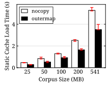

> 图解：横轴为语料大小，纵轴为静态缓存加载耗时。修复拷贝后的基线在 541 MB 时需要 5.28 秒，换扁平哈希表后降到 3.51 秒。加载提速比 drafting 提速更显著，因为加载过程是密集的哈希表插入，正好踩在 unordered_map 缓存不友好的痛点上。

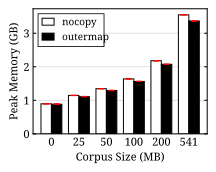

> 图解：峰值内存对比。各语料规模下新实现都略低，541 MB 时从 3.55 GB 降到 3.36 GB。注意这里的"基线"已经是上一步修复拷贝之后的版本——作者是逐层叠加优化的，每一步都跟前一步比。

## 优化三：内层 Map 换成有序数组

外层换成扁平哈希表之后，内层还躺着一个又慢又肥的 `std::unordered_map`。作者没有急着换，而是先看了一眼 **数据分布** ——这一步是全文最精彩的分析。

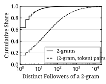

> 图解：这是对 WikiText-103 静态缓存的"街头数学"统计。横轴（对数刻度）是一个 2-gram 拥有的不同后继 token 数量，纵轴是累积占比。蓝色曲线显示： **64% 的 2-gram 只有 1 个后继** ，超过 99% 的 2-gram 后继不超过 100 个。而红色的 (2-gram, token) 对数曲线爬升很慢，要到最头部那些拥有上万个后继的高频 2-gram 才收敛到 1——典型的重尾分布。

这个分布说明了什么？给每个内层 Map 配一个哈希表是极大的浪费：64% 的 n-gram 只需要存 **一个** (token, count) 对，哈希表的桶、指针、元数据开销远超数据本身。直接用 `std::vector` 存就行。但重尾意味着少数高频 2-gram 有成千上万个后继，纯线性查找会让这些尾部 n-gram 的查询爆炸。折中方案是 **有序的 `std::vector`** ：内存极省，查询用二分查找保持 $O(\log n)$。

故事还没完。作者的第一版直接用 `std::lower_bound`，结果 drafting 速度反而 **变慢了** （只有基线的 0.89 倍）。问题出在二分查找的循环结构上。libc++ 的 `std::lower_bound` 简化后长这样：

```cpp
const value_type * first = pairs;
size_t len = n;
while (len != 0) {                 // 循环何时结束取决于 len
    const size_t half = len / 2;
    const value_type * mid = first + half;
    if (mid->first < token) {      // 比较结果依赖从内存读回的条目
        first = mid + 1;
        len -= half + 1;           // 新的 len 依赖这次内存读取
    } else {
        len = half;
    }
}
return first - pairs;
```

关键在于：每一轮循环的 `len` 都依赖上一轮的比较结果，而比较结果又要等内存读回来（对几千个条目的 vector 来说经常 cache miss）。CPU 无法提前判断 `len != 0`，迭代次数也不固定（8 个条目要搜 3 或 4 次），流水线被迫空转。作者改成了 **固定迭代次数的二分查找** ：

```cpp
const value_type * base = pairs;
while (n > 1) {                    // 循环何时结束只取决于 n
    const size_t half = n / 2;
    base = base[half].first < token ? base + half : base;  // 只有 base 依赖内存
    n -= half;                     // n 不依赖任何内存读取
}
return (base - pairs) + (base->first < token);
```

现在 `n` 每轮固定减半（8 → 4 → 2 → 1），与比较结果无关，CPU 不用等内存就能判断循环条件、提前发射下一次查找的指令。这个设计的聪明之处在于： **把循环控制流和内存依赖解耦** ，让 CPU 的乱序执行引擎在等当前查找的内存时，已经开始处理下一个候选 token 的查找了。这是典型的"让硬件替你干活"的优化。

效果：打草稿在无静态缓存时提速 **2.09 倍** ，有静态缓存时提速 1.19~1.25 倍；峰值内存最多省 **1.97 倍** （541 MB 时从 3.36 GB 降到 1.71 GB）；加载时间基本持平。

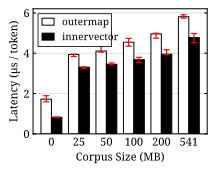

> 图解：与上一步（扁平哈希表）相比，每个草稿 token 的延迟全面下降，无静态缓存时从 1.72 µs 降到 0.82 µs，541 MB 时从 5.81 µs 降到 4.78 µs。

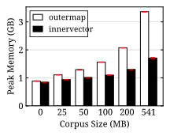

> 图解：内存收益是这一步最大的看点。峰值内存曲线被大幅压平，541 MB 语料下从 3.36 GB 砍到 1.71 GB——因为 64% 的内层"哈希表"现在只是一个条目的 vector。

## 优化四：静态缓存交给 constmap

静态缓存有个特殊性质： **加载之后就不再修改** 。这正好命中 Daniel Lemire 最近发布的数据结构 **constmap** 的靶心——一个基于 binary fuse filter 的不可变字符串到 64 位整数映射，提供 Python、C、Rust、Go 实现且可互操作，内存比 dict 小得多，还能直接序列化到磁盘。

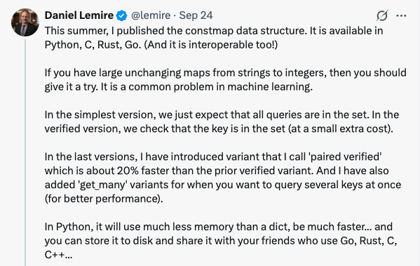

> 图解：Daniel Lemire 介绍 constmap 的帖子。要点：适合"大型、不变的字符串到整数映射"这类机器学习中常见的问题；verified 版本会校验 key 真的在集合中；还有更快的 paired verified 变体和批量查询的 get_many 接口。

作者把静态缓存的外层 Map 换成了 verified constmap。布局上，所有 2-gram 的后继 (token, count) 对被打包进一个连续数组，constmap 只存每个 2-gram 的 **(起始位置, 后继个数)** ，两者挤在一个 64 位整数里：位置占高 40 位，个数占低 24 位。还是 "of the" 的例子：

```text
pairs
  [1000]  ("city", 6)
  [1001]  ("war", 3)
  [1002]  ("year", 1)

constmap
  ("of", "the")  ->  (1000, 3)
```

缓存文件的结构也极简：一个小 header、pairs 数组、序列化的 constmap，依次排开。加载时把整个文件读进一块 buffer，用 `fcm_verified_constmap_view` 直接在 buffer 里"打开" constmap——没有解析、没有逐条插入。查询就是一次 constmap 查找加一次位运算：

```cpp
const uint64_t value = fcm_verified_constmap_lookup(
    nc_static.map.get(), key, STATIC_KEY_SIZE);
if (value == FCM_NOT_FOUND) {
    return {};
}
const uint64_t position = value >> STATIC_LEN_BITS;
const size_t   count    = value & STATIC_LEN_MASK;
return { nc_static.entries + position, count };
```

由于 pairs 数组的布局和上一节的有序 vector 完全一致，查找后继时继续用固定长度的二分查找，两处优化无缝衔接。

效果非常暴力：静态缓存加载提速 **6.32~16.12 倍** （541 MB 语料从 3.76 秒降到 **0.23 秒** ）；静态缓存的内存占用几乎等于文件本身的大小（467 MB 文件只占 463 MB 内存），峰值内存最多再省 1.30 倍；drafting 还额外快了 1.06~1.20 倍，且接受率与有序数组版本完全一致。

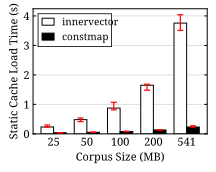

> 图解：这是全文最夸张的一张图。有序数组版本在 541 MB 时加载要 3.76 秒，constmap 版本只要 0.23 秒——因为"加载"本质上就是一次文件读取，构建成本被完全摊到了离线的 `llama-lookup-create` 阶段。

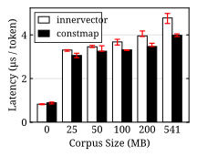

> 图解：drafting 延迟小幅下降，541 MB 时从 4.78 µs 降到 3.98 µs。到这里，四个优化叠加完成：相对最初的 165.48 µs，提速约 42 倍，这就是标题的由来。

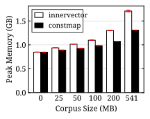

> 图解：峰值内存进一步降到 1.31 GB（541 MB 语料），对比最初基线的 3.47 GB，省了约 2.6 倍。

## 番外：Lemire 亲自下场，再快 4.2 倍

文章发布前还有个彩蛋：Daniel Lemire 看到这项工作后直接提了一个 PR，在作者全部优化的基础上又让 drafting 快了最多 **4.2 倍** （有静态缓存）/ 1.9 倍（无静态缓存），整体提速冲到 **140 倍** 。

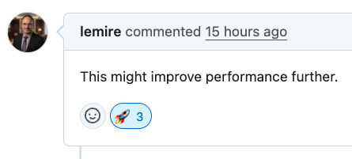

思路很优雅。回忆一下草稿的阈值检查：llama.cpp 原本是先给 n-gram 的 **所有** 候选 token 算分，再检查是否满足 $a_n$ 和 $p_n$。Lemire 的洞察是：

- 先检查 n-gram 的总出现次数是否达到 $a_n$，不够就直接跳过，一个分都不用算；
- 再检查 **最高频** 后继 token 能否过 $p_n$ 阈值——如果最高频的都过不了，其他候选必然也过不了，全部跳过。

本质上是把"算完再筛"改成"能提前判负就提前退出"。这种 cheap-check-first 的重排在任何带阈值的打分系统里都值得借鉴。

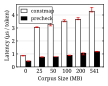

> 图解：Lemire 的 PR 叠加后的效果。各语料规模下延迟从 0.88~4.29 µs 进一步压到 0.45~1.18 µs，曲线几乎被拍平到地板——语料大小对草稿延迟的影响基本消失了。

## 总结

- Prompt Lookup Decoding 用 n-gram 查表当"草稿模型"，llama.cpp 靠上下文、动态、静态三层缓存打分出草稿 token，瓶颈全在数据结构上。
- 第一刀：修掉热路径上内层 Map 的多余拷贝，提速 4.5~25.6 倍——最大的收益往往来自最不起眼的 bug。
- 第二刀：外层 `std::unordered_map` 换成 ankerl 的 segmented_map，加载提速 1.41~1.65 倍；注意默认 map 的翻倍扩容在超大语料上会反噬内存。
- 第三刀：看清数据分布（64% 的 2-gram 只有 1 个后继）后把内层 Map 换成有序 vector，并手写固定迭代次数的二分查找解除内存依赖对流水线的阻塞，内存最多省 1.97 倍。
- 第四刀：利用静态缓存"只读"的性质换上 Lemire 的 constmap，加载提速 6.32~16.12 倍，内存占用≈文件大小；叠加 Lemire 的阈值预检查 PR 后整体提速达 140 倍。
- 全程零算法改动，接受率与原实现一致——纯粹的工程胜利。

展望：阈值 $a_n$、$p_n$ 目前仍是硬编码，动态缓存和上下文缓存还没享受到 constmap 这类不可变结构的待遇；而对于有更新需求的缓存，如何在"可变"与"扁平紧凑"之间取舍，可能是下一步有趣的方向。

> 本文参考自 [42x Faster Prompt Lookup Drafting in llama.cpp](https://jadidbourbaki.github.io/blog/prompt-lookup-llama-cpp/)