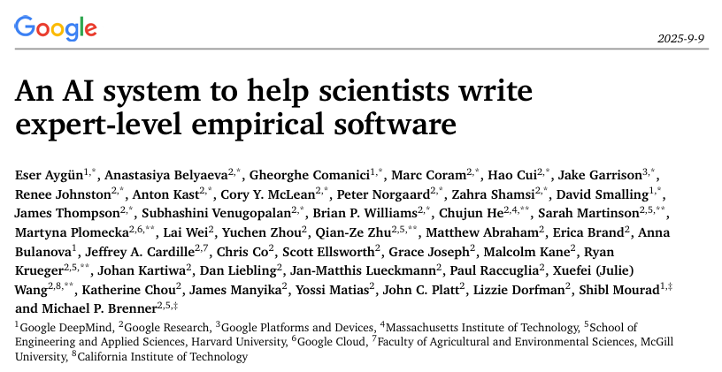
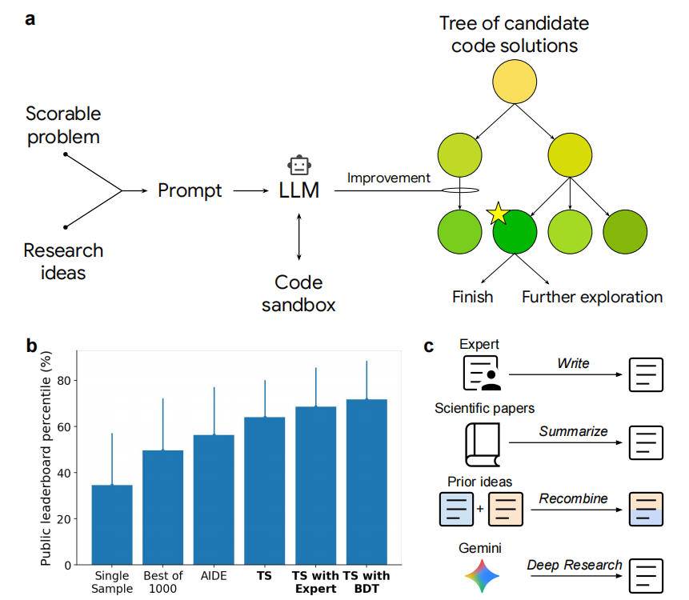
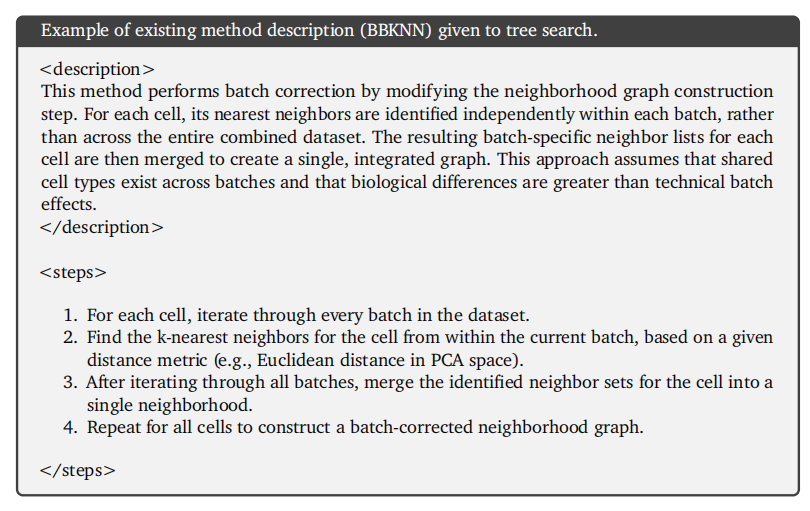
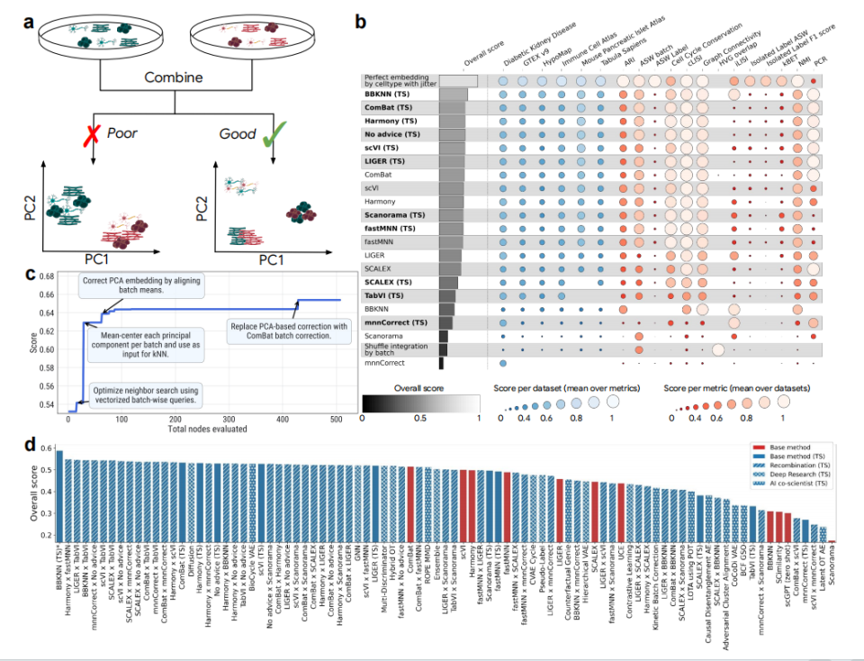
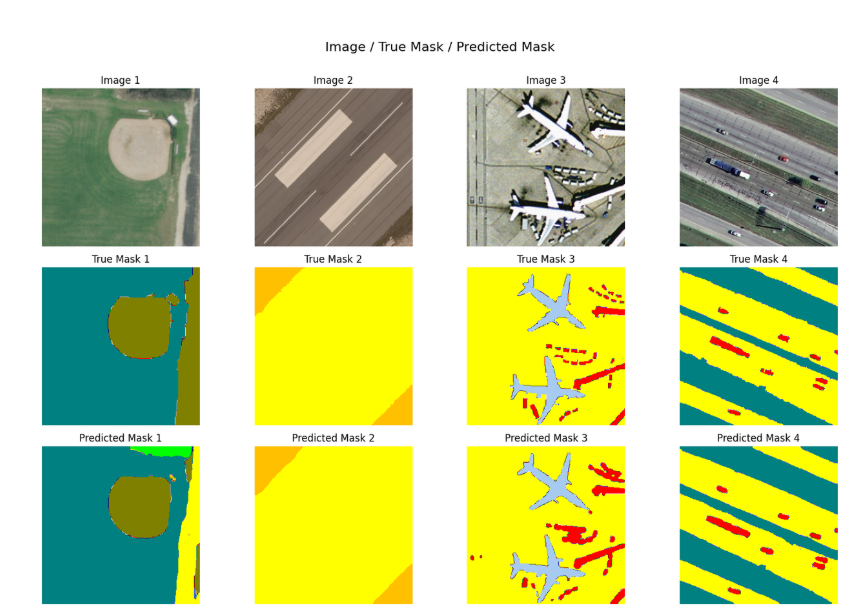
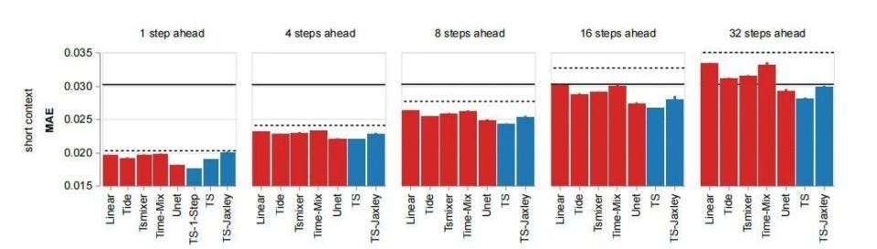
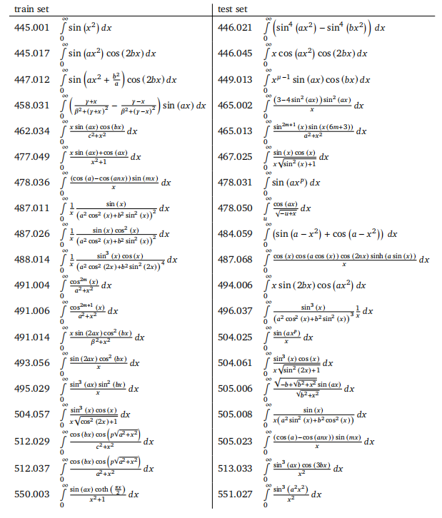

# 谷歌 71 页重磅报告解读：AI 在 6 大科学领域全面超越专家，几小时顶几个月

谷歌最近放出了一篇长达 71 页的论文（arXiv: 2509.06503），堪称给科研界丢下了一颗重磅炸弹。过去一年，DeepMind 的 FunSearch 已经展示了 AI 在数学发现中的潜力，MIT 等团队也提出了 AI co-scientist（AI 协同科学家）的概念。但与这些探索相比，谷歌这次的系统走得更远：它不仅能提出新方法、验证实验结果，还在 **六个完全不同的科学领域** 拿出了超越顶尖专家的成果。

这篇文章我们就来完整拆解一下：谷歌到底做了什么、背后的核心机制是什么、六个领域的成绩单究竟如何，以及这件事对未来科研范式意味着什么。

> 图解：谷歌这套 AI 科研系统的整体定位——科研问题被转化为可计分的优化目标，AI 在其中承担“高速实验员”的角色。

## 核心概念：什么是“实证软件”（Empirical Software）

要理解这篇论文，先要抓住它提出的一个关键概念—— **实证软件** 。

### 科研的瓶颈不在“想”，而在“验”

在科研中，最耗时的环节往往不是提出想法，而是验证想法。科学家们要为一个假设编写和调试大量实验代码，尝试几十甚至上百种模型和参数组合，这个过程动辄数月。谷歌的新系统正是瞄准这一环节，把它彻底加速。

### 从“功能正确”到“分数最高”

传统软件的评判标准是 **功能正确性** ——代码能跑、结果对，就算合格。而实证软件的目标只有一个： **让科研任务的指标分数尽可能高** 。

在这个框架下，科研问题被重新抽象为一种 **可计分任务（scorable task）** ：

  - 任务中包含清晰的问题描述；
  - 有明确的衡量优劣的指标和数据集；
  - AI 要做的，就是直接朝着分数最高的方向不断优化。

这意味着，AI 已经开始介入科学研究的最核心环节—— **假设验证与方法创新** 。

> 图解：传统软件追求“正确”，实证软件追求“最高分”。科研问题被抽象为可计分任务后，优化本身就可以被自动化。

## 系统如何工作：生成、沙箱运行、树搜索迭代

在这一机制下，AI 的角色已经不再是写代码的小助手，而更像是一个 **高速运转的实验员** 。整个工作流程可以概括为：

1. **生成研究思路** ：大语言模型（LLM）根据任务描述提出研究思路，并写出可执行的代码；
2. **沙箱中运行验证** ：代码在沙箱环境中实际执行，得到真实、可量化的评分；
3. **树搜索筛选候选** ：利用树搜索（Tree Search）的方法，从大量候选方案中筛选出值得深入的分支；
4. **反复改写优化** ：LLM 对表现好的代码进行反复改写和优化，循环往复，直到找到最优解。

> 图解：AI 科研系统的工作流程——科研问题被转化为可计分任务，经由大语言模型生成代码，并通过树搜索反复迭代优化，最终获得最佳方案。

研究人员特别强调：系统的输出是 **代码化的解决方案，可验证、可解释且可复现** 。换句话说，这不是简单的一段程序，而是真正符合科研标准的成果——这一点也是它区别于“AI 生成论文摘要”类工具的本质。

## 六大领域成绩单：全面超越专家

这套系统真正惊艳的地方，在于它在六个完全不同的科学领域都拿出了堪比甚至超越专家的成果。下面我们逐一来看。

> 图解：六大科学领域的成果总览——从基因组学到公共健康、从遥感影像到时间序列预测。

### 领域一：单细胞 RNA 测序批次整合

单细胞 RNA 测序（scRNA-seq）数据的 **批次整合（batch integration）** 是该领域的核心难题：不同实验批次之间会产生复杂的技术偏差，如何在消除偏差的同时保留真实的生物学信号，一直困扰着研究者。

值得注意的是，研究人员并没有让系统从零开始，而是把现有方法的文字说明直接输入给它。例如 **BBKNN** ——一种常见的批次校正方法，其核心思路是：在每个批次内部为细胞寻找最近邻居，再把这些邻居集合合并，得到一个批次校正后的整体图。

> 图解：BBKNN 的方法描述示例。研究人员将其输入系统，AI 在此基础上进行改写和优化。

在这样的基础上，AI 能够生成新的方法变体并进行组合。最终，它把 **BBKNN 和另一种方法 ComBat 拼接在一起** ，得到一个完全新颖的解法。结果显示：在 OpenProblems V2.0.0 基准的综合指标上，比最佳人工方法 **提升了 14%** 。

> 图解：在单细胞 RNA 测序批次整合任务上，AI 系统自动组合方法，整体得分超过现有专家工具。

### 领域二：新冠住院人数预测

在疫情期间，美国 CDC 的 **CovidHub Ensemble** 被视为预测住院人数的“黄金标准”——这是由大量专家团队模型集成而成的官方系统。而谷歌的系统自动生成的 14 个模型， **集体表现超过了官方 Ensemble** 。这意味着在公共健康这种数据噪声大、时效要求高的任务上，AI 的集成建模能力已经超过了顶级专家团队的集体智慧。

### 领域三：高分辨率遥感图像分割

在遥感图像分割任务中，系统生成的三种模型 **全部超过现有方法** ，分割精度指标 mIoU（mean Intersection over Union，平均交并比）突破 0.80。更重要的是，系统自主采用 U-Net、SegFormer 等架构并结合图像增强手段——说明它不仅是在“复制”已有方法，而是在“改造和优化”。

> 图解：AI 系统生成的分割结果（下排），与人工标注结果（中排）高度接近，明显优于传统模型。

### 领域四：斑马鱼全脑神经活动预测

在斑马鱼（Zebrafish）全脑神经活动预测任务中，AI 系统不仅打败了所有现有基线，还设计出一种 **能结合生物物理模拟器的混合模型** （TS-Jaxley）。这是非常有开创性的做法——把基于第一性原理的模拟器和数据驱动的深度模型拼接起来，既提升了预测精度，也增强了可解释性。

> 图解：在斑马鱼全脑神经活动预测中，AI 系统生成的模型（蓝色）整体误差更低，全面超越现有基线方法（红色）。其中 TS-Jaxley 将生物物理模拟器融入预测，提升了可解释性。

### 领域五：数值积分

数学问题一向最能考验算法的极限。谷歌的系统被拿来挑战 **19 个异常棘手的积分任务** ，结果出乎意料：标准数值方法几乎全军覆没，而 AI 系统成功算出了其中 **17 个** 。

> 图解：数值积分任务的部分示例。谷歌系统在 19 个测试积分中成功求解了 17 个，而标准数值方法未能给出结果。

这说明系统并不只是停留在表面拟合，而是真正学会了如何在复杂数学场景中找到突破口。对科研人员来说，这意味着在长期困扰的数值计算问题上，AI 已经能给出可用的答案。

### 领域六：通用时间序列预测

在通用时间序列预测的 **GIFT-Eval** 基准上，系统完成了一件近乎不可能的事：从零开始，只靠一段代码不断爬坡优化，硬是“炼”成了一个能覆盖 **28 个数据集、跨越 7 个领域、适配从秒到年的 10 种频率** 的通用预测库。

这意味着 AI 不仅能解决具体问题，还能自己总结出一套通用方法——科研里最难啃的“跨领域泛化”，它也啃下来了。

## 为什么说这是范式级的突破

### 从模仿到创新

如果说前面的六个案例只是成绩单，那么它们背后真正震撼的是：AI 已经不满足于模仿，而是在科研中展现出了 **创新能力与跨学科的通用性** ：

  - 在基因组学任务中，它能自动把两个不同的专家方法组合起来，得到比人类更优的解；
  - 在神经科学任务里，它首次把生物物理模拟器和深度模型拼接，开辟出一种全新的混合思路。

类似的尝试在学界和业界已有先例：比如 DeepResearchGym 提供了评测框架，OpenProblems.bio 社区建立了 scRNA-seq 的公开基准。但谷歌的系统 **首次在这些基准上全面跑通 pipeline** ，给出了可量化、可复现的专家级结果。

### 大规模试错，速度提升数百倍

这种创新不是单点突破，而是跨学科的普遍现象。从基因组学到公共健康，从遥感影像到时间序列预测，系统都能快速适配、找到新的路径。这些基准的多样性，使得研究者能够综合评估系统在 **零样本泛化、高维信号处理、不确定性量化、复杂数据语义解释和系统层面建模** 等方面的能力。

过去科学家依靠反复试验推进研究，如今 AI 系统也能以相同方式进行大规模试错，而且 **速度提升数百倍——把几个月的探索压缩到几小时** 。这意味着科研节奏可能迎来真正的“指数级加速”。

## 科学家的角色正在被重新定义

AI 已经能在多个前沿领域生成新方法、验证结果、超越专家，那么人类科学家的角色是什么？论文给出的图景是：

  - **AI 负责不知疲倦的实验与探索** ：成千上万种方案的尝试、优化和筛选，本来需要几个月甚至更久，如今压缩到几小时或几天。用研究者自己的话说：“我们的系统能够快速生成专家级别的解决方案，将一组想法的探索时间从数月缩短到数小时或数天。”
  - **科学家转向提出方向、判断价值、定义优先级** ：AI 可以在技术路径上无限拓展，但科研问题本身的意义、背后的社会价值，仍然需要人类去设定和把握。

这意味着科研分工正在走向一种新的格局：AI 成为高效实验员和方法发明者，人类则站在更高的维度上进行选择与决策。谷歌的系统也不再只是一个“研究工具”的实验，而是迈向了与 FunSearch、AI co-scientist 等项目同一赛道的下一步—— **从单点突破走向跨领域的科研合作者** 。

## 开源与可复现

值得一提的是，谷歌已经将这套系统产出的最佳方案 **全部开源** ，并提供交互界面让研究人员追踪整个搜索与突破过程。这种开放姿态意味着，科研界可以直接在真实任务里验证、扩展这些 AI 生成的解法——这本身就是“实证软件”理念的最好注脚：可验证、可解释、可复现。

> 本文参考自 [刚刚，谷歌发布71页AI科研报告！6大领域全面超越专家，几小时顶几个月](https://news.qq.com/rain/a/20250912A0424H00)（论文原文：[arXiv: 2509.06503](https://arxiv.org/abs/2509.06503)）