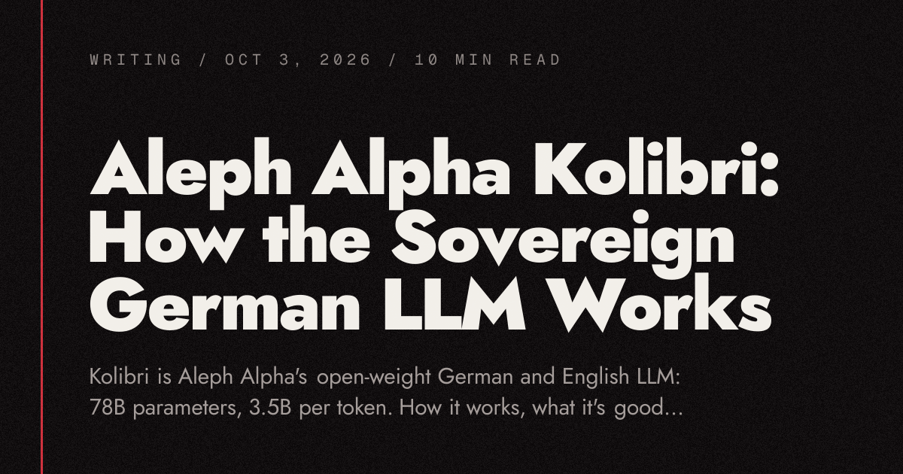

# Aleph Alpha Kolibri：德国主权大模型深度拆解

在"欧洲只会监管、不会创新"的质疑声中，德国 AI 公司 Aleph Alpha 交出了一份直接的答卷：Kolibri——一个从零训练、全程在德国和芬兰基础设施上完成的开放权重大模型。它是一个 781 亿参数的 Mixture of Experts（MoE）模型，但每个 token 只激活约 34.6 亿参数（仅 4.4%），原生支持 26 万 token 上下文、实测可扩展到 100 万。最硬的成绩是：在 Aleph Alpha 的同条件评测中，它的德语和英语总分都超过所有同规模对比模型，AIME 2025 数学测试英语拿到 96.9 分，甚至击败了一批激活参数 120 亿的 MoE 模型。这篇文章基于 Aleph Alpha 长达 189 页的技术报告和模型卡，完整拆解 Kolibri 的工作原理、强项与短板，以及什么时候该选它。



> 图解：Kolibri 发布封面图。Kolibri 在德语里是"蜂鸟"的意思——对一个整套设计就图一个"轻"字的模型来说，这个名字起得很贴切。

## 一、Kolibri 是什么：先看规格

先把关键参数摆出来，心里有个底：

| 项目 | Kolibri 1 |
| --- | --- |
| 参数量 | 总计 781 亿，每 token 激活 34.6 亿（4.4%） |
| 语言 | 德语和英语 |
| 上下文 | 原生 262,144 token，实测扩展到 1,048,576 |
| 许可证 | 权重与配置文件采用 Apache 2.0（训练代码和方法保留权利） |
| 显存占用 | FP8 下权重约 78 GB |
| 推理档位 | 4 档：none、low、medium、high |
| 工具调用 | 支持 |
| 知识截止 | 2026 年 6 月 18 日 |
| 训练规模 | 约 24 万亿 token，其中超过五分之一是德语，使用 768 块 NVIDIA B200 GPU |

### "主权"到底意味着什么

Aleph Alpha 把 Kolibri 称为 **sovereign（主权）** 模型，这个词有两层含义：

- **怎么造的** ：团队在德国组建，训练在德国和芬兰的基础设施上完成，受欧洲和德国法律约束，没有外国控制。
- **客户拿到什么** ：完全的部署自由和知识产权安全，"合规成为一种继承属性"。用大白话说：一个政府部门或汽车供应商可以把模型跑在自己的服务器上，数据不出大楼，也没有人能远程改掉或关掉你的模型。Aleph Alpha 还签署了欧盟的通用目的人工智能（GPAI）行为准则。

值得说明的是，"主权"不等于"零外援"——模型卡自己也承认：英文网页文本是用 Google 的 Gemma 4 改写的，德语用的是 Mistral-NeMo，质量过滤的数据标注用了 Qwen3-32B。随后他们对训练数据做了政治偏见过滤（这种偏见他们在中国开源模型上实测过）。笔者认为这种坦白反而加分：主权的本质是可控和合规，而不是闭门造车。

## 二、Kolibri 如何工作：六层设计

Kolibri 的核心是 6 个叠在一起的设计，每一个都指向同一个目标： **让德语更便宜、上下文更长、回答更诚实** 。

### 2.1 384 个专家，每个 token 只见 6 个

在普通稠密（dense）模型里，每个 token 都要流过全部参数。而 MoE 模型里，每一层有一群叫"专家"的小子网络，外加一个路由器（router），为每个 token 挑几个专家来处理。Kolibri 有 50 层，每层 384 个专家加 1 个所有 token 必经的共享专家，路由器把每个 token 分发给 384 个专家中的 6 个。这就是 781 亿总参数如何变成每 token 只有 34.6 亿实际计算量的原因。

一个贴切的类比：通科医生读遍了全世界所有医学书籍，血液科医生只精研血液——带着血液病去找前者，"他可能因为知道得太多反而搞错"。MoE 就是把一整个医院的专科医生装进一个模型里，路由器是分诊台，把每个 token 送到正确的 6 个专家那里。

但这个类比有两处不成立，需要说清：

- 专家并不是"德国法律"这样干净的主题划分。研究者们窥探 MoE 模型内部时，发现的专家大多对应 token 的 **模式** （比如标点、专有名词），而非人类会划分的学科。
- 医院必须养着全部 384 个专家，哪怕你每次只见 6 个。所以 Kolibri **按 35 亿参数模型的算力计算，却要按 780 亿参数模型的显存驻留** 。模型卡说得很直白："尽管任意时刻只有部分参数被激活，完整模型必须全部放在显存里。"

### 2.2 一个读得懂德语长词的 Tokenizer

模型读的不是字母或单词，而是 token：训练分词器时确定的固定词表中的文本片段。德语喜欢把词粘成长复合词，一个主要用英文语料训出来的分词器会把它们切得粉碎。看德国联邦宪法法院的德语名字，两种分词器的切法对比：

```text
o200k_base (GPT-5):  Bund | es | ver | fass | ungs | gericht     6 个 token
Kolibri:             Bundes | verfassungsgericht                 2 个 token
```

Kolibri 的分词器有 128,000 个 token，用 Aleph Alpha 称为 **UniBPE** 的新算法训练：保留 BPE 自底向上的合并方式，但换用 Unigram 目标函数来决定每次合并，更尊重德语的构词规律。官方报告称，德语文本所需 token 数比 GPT-5 的分词器少 11.2%——这是他们测过的 9 个对手中最好的成绩。

原文作者还亲自做了验证：拿 6 个分词器分别跑完整的《德意志联邦共和国基本法》（德国宪法，185 KB 的纯正德语法律文本）及其官方英译本：

| 分词器 | 德语 token 数 | 比 Kolibri 多 | 英语 token 数 | 比 Kolibri 多 |
| --- | --- | --- | --- | --- |
| Kolibri 1 | 35,190 | — | 39,875 | — |
| o200k_base（GPT-4o / GPT-5 / GPT-OSS） | 41,482 | 17.9% | 39,737 | -0.3% |
| Qwen3.5 35B-A3B | 42,907 | 21.9% | 41,650 | 4.5% |
| Mistral Small 4 | 43,478 | 23.6% | 41,301 | 3.6% |
| Gemma 4 | 43,850 | 24.6% | 41,564 | 4.2% |

在法律德语上，Kolibri 比 GPT-5 的分词器少用了 15% 的 token，比官方自己报的 11.2% 还好；英语上则打平。token 更少意味着读写同一段德语需要的步数更少，同样的上下文窗口能塞进更多德语内容。这个设计的聪明之处在于：它不花一分推理算力，却同时降低了成本、拉长了有效上下文。

### 2.3 大多数层只看附近

Kolibri 的 50 层中，有 40 层使用 **滑动窗口注意力（sliding-window attention）** ：每个 token 只能看到它前面的 512 个 token。每第 5 层才是全注意力层，能看到之前所有内容。

这就像读一份长合同：大部分时间只关注当前这句，每隔几页停下来把全文想一遍。正是这种结构让 100 万 token 的上下文变得负担得起。

里面还有一个巧妙的细节： **只有滑动窗口层通过 Rotary Position Embedding（RoPE）知道 token 的位置，全注意力层不做位置编码** 。这样一来，上下文可以超出训练时的 262,144 token 自然延伸，不需要任何额外的位置外推技巧——Aleph Alpha 实测验证到了 1,048,576 token。在 100 万 token 的 RULER 长上下文测试上，Kolibri 基座模型拿到 63.2 分，而 Qwen3.5 35B-A3B 的基座是 57.5 分。

### 2.4 它用德语思考

Reasoning 模型在回答前会先"想"，但即使面对德语提问，它们大多还是用英语思考。Aleph Alpha 专门研究过这个问题（报告标题很文艺，叫 *Through the Valley of Tears* ）：他们生成了约 80 万条德语推理样本，发现 **少量德语推理数据比没有还糟** ——模型的德语数学成绩从 70.2 掉到 48.3，因为它的德语思路会不停兜圈子、永远不收尾；只有灌入大量德语数据后，成绩才爬回 67.3。

Kolibri 拿到了"大量"的那一档：面对德语 prompt 时它用德语推理，德语数学成绩在同档（激活参数约 30 亿）模型中最好——AIME 2025 德语版拿到 87.5 分，第二名 NVIDIA Nemotron 3 Nano 是 84.4 分。

### 2.5 它被训练成会说"我不知道"

幻觉是生成式 AI 的头号顽疾，主流解法是 RAG（检索增强生成）：先查到权威资料再放进 prompt。但 RAG 要奏效，前提是模型在资料里没有答案时愿意承认——这正是 Aleph Alpha 用自己提出的 **Merlin-Arthur 协议** 训练的能力。

这个协议像一场三人游戏：

- **Arthur** 是模型，拿到一个问题，但支撑文档的部分内容被遮住了。
- **Merlin** 负责"善意遮挡"：藏起来的部分让正确答案更容易找到，Arthur 被训练来回答这类问题。
- **Morgana** 负责"恶意遮挡"：藏掉的恰恰是答案所依赖的证据，Arthur 被训练在这时说"我不知道"。

关键在于 Arthur 永远不知道自己面对的是 Merlin 还是 Morgana，所以唯一的取胜策略是 **真的去检查面前的证据是否支撑答案** 。笔者认为这是把"诚实"从一句口号变成了可优化的训练目标，设计相当漂亮。

效果在数据上体现得很直接：在 Artificial Analysis 的 Omniscience 测试里，当 Kolibri 不知道答案时，有 44% 的情况它选择明说（或给出部分回答）而不是编造；Qwen3.5 35B-A3B 只有 11.1%，GPT-OSS 120B 是 23.7%。在 Aleph Alpha 对比的所有 MoE 模型里，只有 Qwen3.6 35B-A3B 更高，为 56.7%。

### 2.6 思考深度由你定

每个请求都可以设置 `reasoning_effort` 为 none、low、medium 或 high：简单查询立刻回答，难题则深思熟虑——同一个模型、同一台服务器，按需分配算力。

## 三、实验验证：Kolibri 擅长什么

解决了"怎么工作"的问题，接下来看成绩单。以下都是 Aleph Alpha 同条件评测（所有模型用相同流程、按各家推荐的采样设置）中 Kolibri 领先同规模开放模型的项目：

| 项目 | Kolibri | 最接近的约 3B 激活参数模型 |
| --- | --- | --- |
| 总分（英语） | 75.5 | 74.7（Qwen3.5 35B-A3B） |
| 总分（德语） | 70.8 | 69.8（Qwen3.5 35B-A3B） |
| AIME 2025（英语） | 96.9 | 89.6（Nemotron 3 Nano） |
| AIME 2025（德语） | 87.5 | 84.4（Nemotron 3 Nano） |
| 未见过企业文档问答（英语） | 89.7 | 87.0（Qwen3.5 35B-A3B） |
| 100 万 token 长上下文（基座模型） | 63.2 | 58.5（Nemotron 3 Nano） |

两点值得展开：

- **数学是最突出的强项** ：AIME 2025 和 2026 英语版上，它击败了对比中的所有 MoE 模型，包括激活参数 120 亿的选手，只有稠密的 Qwen3.8 27B 分数更高。
- **企业文档问答** 这一行来自 Aleph Alpha 自建的 5 组测试，素材模拟半导体、德国公共部门、航空航天、汽车供应商和工业驱动领域的客户实际工作，且文档和问题都是模型训练时从未见过的——这基本就是在模拟真实 RAG 场景。

## 四、Kolibri 不擅长什么

Aleph Alpha 把最差的几项成绩和最好的一起放进了模型卡，这种透明值得点赞。短板如下：

- **闭卷记忆力差** ：在 RAG Benchmark 的无文档闭卷问答中，12 个模型里垫底（51.0 分）；Omniscience 测试只答对 14.8%，Qwen3.5 35B-A3B 是 22.2%。它很知道自己不知道，但它知道的确实也更少——给它文档没问题，当百科问答机不行。
- **多轮工具调用偏弱** ：Berkeley Function Calling Leaderboard 多轮测试得分 39.8，GLM-4.7 Flash 是 58.2，Qwen3.5 35B-A3B 是 54.0。
- **不是最好的编程 Agent** ：Terminal-Bench 2.1 得分 27.7（Qwen3.5 35B-A3B 为 39.7），SWE-bench Verified 得分 66.4（Qwen3.6 35B-A3B 为 73.8）。
- **中长上下文有凹陷** ：RULER 测试 128K token 处，Qwen3.5 基座拿 89.9 分，Kolibri 只有 67.9——它只在超长段才反超。
- **显存门槛** ：78 GB 权重意味着至少一两块数据中心级 GPU，笔记本想都别想，别被"3.5B 激活"迷惑。
- **基建很新** ：需要 Aleph Alpha 的 vLLM 插件，且插件一次只支持一个 vLLM 版本（目前是 0.29）；发布当天还没有任何托管服务商提供它。
- **只支持 2 种语言** ：这是有意为之——模型卡称之为"深思熟虑的深度优先于广度"。
- **更大的稠密模型能赢它** ：Qwen3.8 27B 英语 80.2、德语 79.9 都更高，但它每个 token 要用将近 8 倍的参数——这正是 Kolibri 设计时主动做的取舍。

## 五、如何部署 Kolibri

硬件要求：约 78 GB GPU 显存，至少 2 块 80 GB 的 NVIDIA A100 或 H100，或者单块 H200、B200、B300。以下命令直接来自模型卡，先装插件（会自动安装受支持的 vLLM 版本）：

```bash
pip install 'aleph-alpha-inference>=1'

vllm serve Aleph-Alpha/Kolibri-1 --kv-cache-dtype fp8 \
  --reasoning-parser kolibri1 \
  --tool-call-parser kolibri1 \
  --enable-auto-tool-choice
```

启动后就是一个兼容 OpenAI 接口的服务，任何 OpenAI 客户端都能直接对接。推理档位通过 chat template 传入：

```python
from openai import OpenAI

client = OpenAI(base_url="http://localhost:8000/v1", api_key="EMPTY")
response = client.chat.completions.create(
    model="Aleph-Alpha/Kolibri-1",
    messages=[{"role": "user", "content": "Erkläre kurz, was ein Mixture-of-Experts-Modell ist."}],
    extra_body={"chat_template_kwargs": {"reasoning_effort": "high", "enable_thinking": True}},
)
print(response.choices[0].message.content)
```

模型卡推荐采样参数为 temperature=1.0、top_p=0.97、top_k=128；对延迟敏感的场景上下文建议不超过 262,144 token。要跑满 100 万 token，再加两个参数：

```bash
vllm serve Aleph-Alpha/Kolibri-1 --kv-cache-dtype fp8 \
  --max-model-len 1048576 \
  --hf-overrides '{"max_position_embeddings": 1048576}'
```

## 六、什么时候该选 Kolibri

当 **德语文本** 和 **自有硬件** 同时是硬约束时，Kolibri 就是那个答案：政府机构、银行、制造商、航空航天供应商这类必须把文档留在内部的组织，需要以德语提问、用德语推理的回答，并且宁可听到"我不知道"也不要一个自信的错误答案。对长篇德语文档（法律、合同、手册）做 RAG，恰好同时踩中它的全部强项：分词器、100 万 token 上下文、拒答能力。

反过来，以下场景它不是正确选择：

- 编程 Agent（Qwen3.6 35B-A3B 领先）；
- 需要模型凭记忆回答的问题；
- 德语、英语之外的任何语言；
- 拿不出 78 GB GPU 显存的团队——这种时候，针对单一任务微调的小模型仍是正解。

## 七、总结

- **定位** ：781 亿参数 MoE，每 token 仅激活 34.6 亿，Apache 2.0 开放权重，专攻德语 + 英语的"主权"模型。
- **分词器** 是隐藏王牌：UniBPE 让法律德语 token 数比 GPT-5 少 15%，推理成本和有效上下文同时受益。
- **长上下文** 靠滑动窗口 + 无位置编码全注意力层的组合，实测扩展到 100 万 token 且超长段领先。
- **诚实是训练出来的** ：Merlin-Arthur 协议让它在不知道时 44% 的情况下明说，远好于多数同级模型。
- **短板明确** ：闭卷记忆、多轮工具调用、编程 Agent 和长上下文中段都偏弱，且硬件门槛是实打实的 78 GB。

一句话展望：Kolibri 证明了"合规优先"和"性能领先"不必二选一，它真正的试金石将是欧洲政企在真实德语 RAG 场景中的大规模落地——以及 Aleph Alpha 能否把推理生态（托管服务、框架支持）尽快补齐。

> 本文参考自 [Aleph Alpha Kolibri: How the Sovereign German LLM Works](https://tej.as/blog/aleph-alpha-kolibri)