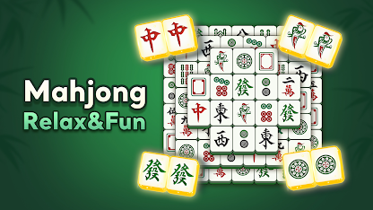
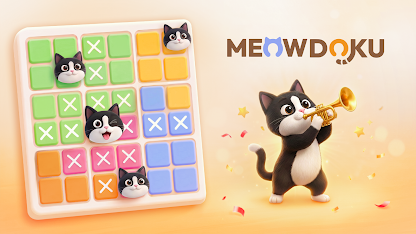
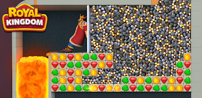
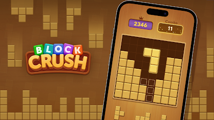
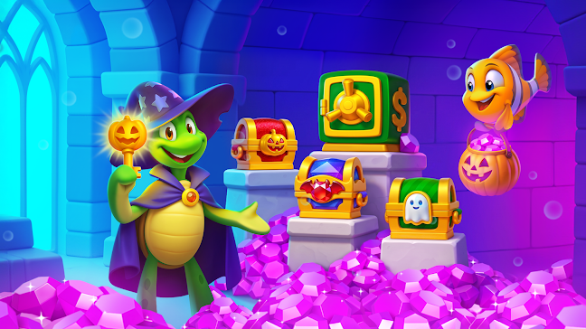
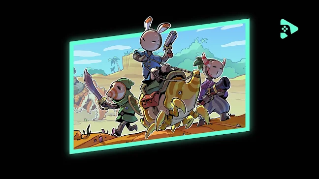

# Google Play 首页观察：一个应用商店的"橱窗"里，藏着移动游戏市场的哪些信号？

这篇内容要解决一个很具体的问题：打开 Google Play 首页，Google 到底在向用户推什么？为什么值得看——因为应用商店首页是全球最大的移动分发入口之一，它的"橱窗陈列"就是移动游戏市场风向的直接写照。核心观察一句话概括：这是一个被休闲解谜游戏、节日运营活动和跨端游戏战略三分天下的首页。最硬的两个信号是：首屏推荐位几乎被 Block Blast、麻将、数独类休闲解谜游戏包场，同时 Google Play Games 的 PC 端入口占据了显眼的横幅位置。

## 首屏陈列：一眼看穿的"推荐逻辑"

先看整体。这次抓取的 Google Play 首页（香港区），内容密度非常高：应用图标、游戏截图、专题横幅交替排布，是典型的"卡片流"陈列方式。

> 图解：这是 Google Play Games 的品牌横幅。画面左侧是主机级画质的城堡场景，右上方是二次元风格角色，右下方则是一台笔记本——三台设备并置，传递的信息很明确：手游不只在手机上玩，Google 正在把 Android 游戏推向 PC 大屏。

这个设计的聪明之处在于，它把"跨端"这个抽象战略翻译成了一个普通用户秒懂的画面：同一款游戏，手机、平板、笔记本无缝衔接。

另一张横幅则更直接地展示了平台的 IP 号召力。

> 图解：金色超级索尼克领衔的竞速主题横幅，角色脚下的滑板和赛道残影都指向竞速玩法。头部 IP（如 SEGA 的索尼克）依然是商店拉新和回流的主力武器。

> 图解：DC 绿灯侠三位绿灯军团成员的集结画面，典型的超级英雄题材 RPG/卡牌游戏宣传图。美漫 IP 与索尼克这类日系 IP 同台，说明商店的头部内容供给是全球化、多圈层的。

## 休闲解谜霸屏：消除、麻将、数独们的天下

看完横幅，真正占据推荐位大头的是另一类游戏——休闲解谜。这是本次首页观察中占比最高、也最值得琢磨的一块。

> 图解：Block Blast 的宣传图，彩色方块拼成类似俄罗斯方块的阵列，底部标注 "The Official Block Puzzle Game by Hungry Studio"。这类"块拼图"（Block Puzzle）玩法近两年在全球榜单上长期霸榜。

> 图解：一款麻将连连看（Mahjong Solitaire）游戏的截图，牌面是经典的中式麻将图案，主打 "Relax & Fun" 的放松定位。

> 图解：Vita Mahjong 的宣传图，Slogan 是 "Train Your Brain"。值得注意的是 Vita 系列专门面向中老年用户，大字、大图案是这类产品的标志性设计——"银发经济"已经悄悄成为休闲游戏的重要增长极。

> 图解：Meowdoku = Meow + Sudoku，把数独的数字换成了猫咪头像的萌系数独。经典玩法 + 治愈画风的"换皮创新"，是休闲赛道成本最低、见效最快的打法。

> 图解：Tile World 的截图，麻将牌被堆成了城市天际线的 3D 造型，"Welcome to the Tile World"。同样是麻将消除，它靠视觉奇观做差异化。

> 图解：Royal Kingdom（Dream Games 出品，Royal Match 的姊妹作）的三消关卡画面，国王角色被困在石堆上方，玩家需要消除宝石救人。剧情化三消是当前变现能力最强的休闲品类之一。

> 图解：Water Sort 类玩法——把试管里不同颜色的液体分类归拢，配上卡通猫角色。规则三秒看懂，是短视频买量素材的常客。

> 图解：Block Crush 的木块消除画面，分数 2346、连击 11 清晰可见。木质纹理的"禅意"包装是近两年块消除赛道流行的新皮肤。

一个值得点评的现象：这些游戏玩法各不相同（消除、连连看、数独、分类），但底层逻辑高度一致—— **低门槛、单局短、反馈即时** 。它们瞄准的不是"玩家"，而是所有人的碎片时间。在博主看来，首页的这个构成其实是一份市场答卷：在全球手游增长放缓的背景下，超休闲与混合休闲（Hybrid-casual）品类的广告 + 内购双引擎变现，已经比重度游戏更能撑起商店的流量基本盘。

## 节日运营：万圣节档期已经开打

解决了"推什么品类"的问题，下一个问题是"推什么时机"。首页的另一组横幅给出了答案：节日限定活动。

> 图解：南瓜灯、墓地、暗夜战车——标准的万圣节主题活动横幅。这类"节日皮肤 + 限时玩法"的运营活动，是拉长游戏生命周期、刺激回流的标准动作。

> 图解：乌龟巫师、南瓜宝箱、紫色水晶堆——又一款游戏的万圣节版本宣传图。注意画面里密集出现的宝箱和货币元素：节日活动的本质往往是"主题化的抽卡/开箱促销"。

> 图解：第一人称视角的吹风机清扫落叶画面，秋季主题。"模拟清洁/整理"类 ASMR 玩法近一年在移动端增长很快，主打解压体验。

> 图解：拟人化的大脑角色戴着毛线帽在秋林里奔跑的横幅，对应益智健脑类应用的秋季活动。卡通化的大脑形象是 Brain Training 品类的通用符号。

节日运营横幅扎堆出现，说明商店的推荐并非纯算法驱动，而是有明显的"运营排期"——十月初全面上线万圣节内容，这个节奏值得做手游运营的同学参考。

## 多元题材补位：从农场到空战

除了休闲解谜和节日档，首页还有一些题材各异的推荐位，用来覆盖更细分的兴趣圈层。

> 图解：西部小镇里动物们挤在一辆黄色皮卡上的卡通横幅，典型的农场/模拟经营题材，目标用户偏家庭与低龄。

> 图解：两个孩子在鬼屋里打着手电探险的画面，解谜冒险题材，画风明显面向青少年用户。

> 图解：夜间海空大战的宣传图——轰炸机低空掠过舰队，探照灯与炮火交织。这是少数出现在首页的重度军事题材，用来平衡休闲内容的"重度用户"缺口。

> 图解：丛林里的美洲豹，树叶和鹦鹉身上标着数字编号——数字填色（Color by Number）类应用。这类产品看似"不是游戏"，却常年位居下载榜前列，是解压赛道的隐形巨头。

> 图解：手绘卡通风格的角色冒险画面，右上角有 Google Play Games 的标识——这是 Play Games 频道内的编辑推荐内容，强调"独立气质"和美术风格。

## 生态配套：分级、订阅与家庭功能

最后看页面底部透露的"基础设施"信息，这部分经常被忽略，但其实最能体现平台的治理思路。

> 图解：首页推荐的游戏分别带有 Rated for 3+、7+、16+ 的内容分级标识。分级标识直接出现在推荐流里，说明年龄适配是商店推荐策略的一部分，而非详情页里的附属信息。

页脚的功能入口也值得逐一盘点，它们勾勒出 Google Play 的商业化与服务体系全貌：

- **Play Pass** ：订阅制服务，月费畅玩数百款无广告、无内购的游戏，对标 Apple Arcade。
- **Play Points** ：积分忠诚度计划，消费返积分、积分换内容，提高用户留存与付费黏性。
- **Gift cards / Redeem** ：礼品卡与兑换体系，覆盖没有信用卡的用户和送礼场景。
- **Refund policy / Parent Guide / Family sharing** ：退款政策、家长指南、家庭共享，三项合起来就是平台对家庭用户和未成年人的合规承诺。

这个组合的聪明之处在于：Play Pass 和 Play Points 负责"赚深度用户的钱"，礼品卡负责"拓宽付费渠道"，而分级与家庭功能负责"让家长放心"——三条线共同支撑起一个可持续的分发生态。

## 要点回顾

- Google Play 首页的主力推荐位被休闲解谜游戏（块拼图、麻将消除、三消、数独）占据，低门槛碎片娱乐是流量基本盘。
- 跨端是明确的战略信号：Google Play Games 把手机游戏推上 PC，横幅占据首屏显眼位置。
- 节日运营排期清晰：十月初万圣节主题活动已全面上线，商店推荐是"算法 + 运营"双轮驱动。
- 头部 IP（索尼克、DC）与细分题材（填色、清洁模拟、健脑）并存，覆盖面从核心玩家延伸到泛用户。
- 内容分级标识前置展示，配合 Play Pass、Play Points、家庭共享等配套，构成完整的平台生态闭环。

展望来看，这个首页释放的下一个值得追踪的信号是"跨端"：当 PC 端分发真正起量，Android 游戏的分发逻辑、付费设计乃至开发框架都可能随之改写——这或许是比任何一款霸榜游戏都更值得关注的变量。

> 本文参考自 [Android Apps on Google Play](https://play.google.com/)