# Disrupting AI-enabled "false front" operations：起底 AI 加持的假前台认知战

10 月 8 日，OpenAI 发布了最新一期威胁情报报告，披露其封禁了两起利用 ChatGPT 的隐蔽影响力行动（Influence Operations, IO）：一起来自俄罗斯、一起来自伊朗。这两起行动的共同特点是，攻击者不再满足于在社交媒体上刷量，而是用 AI 包装出"智库""记者"这类 **假前台（false front）** 实体，把地缘政治宣传"洗"进真实的主流媒体。其中最硬的数字是：俄罗斯行动被评为 IO Breakout Scale 的 **Category 5** ——这是 OpenAI 开始发布此类报告以来 **首次** 评出的 5 级行动；伊朗行动则成功以 7 个假记者身份在全球十几家媒体发表了近 **100 篇** 长文。笔者认为，这篇报告的价值不在于"AI 又能造假了"，而在于它揭示了一个更微妙的趋势： **AI 并没有发明新的认知战玩法，而是在给冷战时代的老套路降本增效** 。

## 背景：什么是"假前台"行动

所谓 false front，可以类比为谍战剧里的"白手套公司"：表面上是智库、媒体、记者，背后真正出钱出指令的却是情报机构。区别在于，过去养一个假记者、一家假智库需要真人、真金白银，如今很多环节——写稿、翻译、润色、写内部汇报——都可以交给大模型。

OpenAI 在报告中特别指出，这两起行动与 AI 时代之前的经典案例高度神似：

- 伊朗行动的"假记者"套路，几乎是 2016-17 年俄军情报机构假记者 **"Alice Donovan"** 的翻版——后者当年成功在多家西方媒体发稿；
- 俄罗斯行动收买不知情本地人运营"智库"的做法，则与 2020 年被 Meta 曝光的 **"PeaceData"** （俄罗斯互联网研究机构 IRA 相关人员运营的假新闻媒体）如出一辙。

值得注意的是，这两个老前辈都在被曝光后偃旗息鼓——这正是 OpenAI 高调披露此类行动的动机： **假前台行动天然怕光** 。

## 全景：30 起行动，谁的"破圈"能力最强

OpenAI 用一个矩阵总结了自己过去两年半曝光的 30 起隐蔽影响力行动，评估维度有两个：主要分发渠道（社交媒体 / 自营网站 / 外部出版物）和 IO Breakout Scale 得分（1 最低，6 最高）。

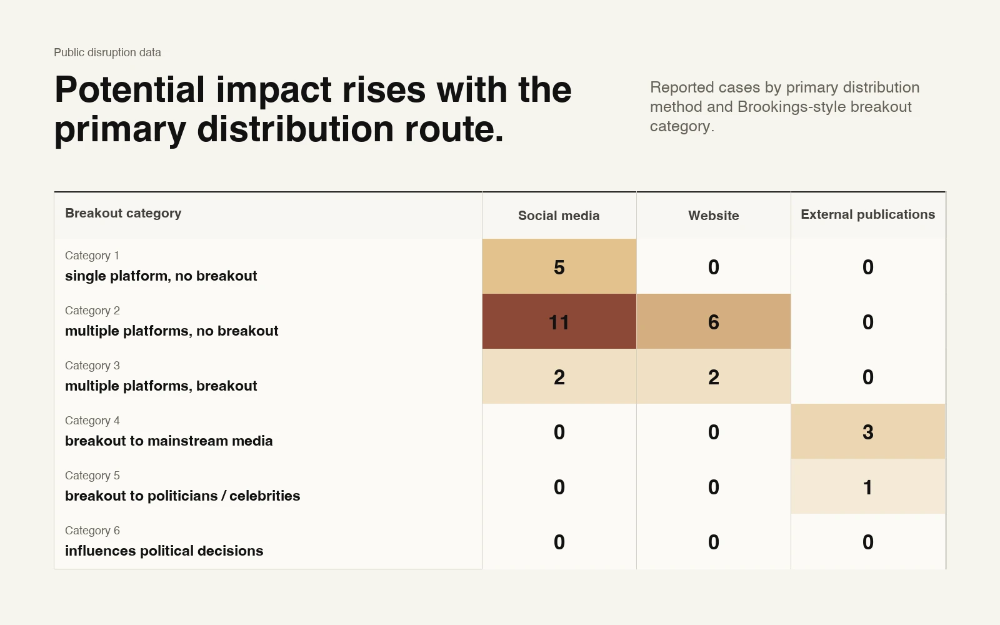

> 图解：图中每个点代表一起被 OpenAI 曝光的影响力行动，横轴是主要分发方式（社交媒体、行动方自营网站、外部出版物），纵轴是 Breakout Scale 等级。使用多种渠道的行动按其核心渠道归类。规律一目了然： **越是努力把内容塞进真实媒体（external publications）的行动，破圈等级越高** ；纯靠社交媒体刷帖的行动大多停留在低等级。本次的俄罗斯行动（Category 5）和伊朗行动（Category 4）都落在"外部出版物"一列的高分区。

这个观察其实给防御方指了条路：盯社交平台上的机器人账号只是底线防御，真正的突破口在编辑部的投稿邮箱里。

## 俄罗斯行动"Dark Clark"：用 AI 遥控一家拉美"智库"

先看更重头的俄罗斯行动。OpenAI 封禁了一组源自俄罗斯的 ChatGPT 账号（因俄罗斯无法直接访问，操作者全程走 VPN），并将其行动命名为 **"Dark Clark"** ——得名于他们虚构的一个叫 "Mia Clark" 的假身份，专门用来遥控一家名为 **Social Research Center（SRC，社会研究中心）** 的"研究平台"。

### 行动画像：AI 的第一用途竟是写"周报"

出乎很多人意料，这组操作者用 ChatGPT 做得最多的事不是造谣，而是 **给上级写内部工作报告** ——汇报自己在拉美搞的隐蔽行动、"顺带领功"别人的事、以及 SRC 这家"智库"的运营状况。其次才是少量地生成行动内容。

报告内容揭示了三大工作流：

1. **诋毁乌克兰** ：破坏乌克兰在拉美的声誉、干扰乌克兰武装力量的招募；
2. **干预内政** ：重点针对玻利维亚和阿根廷的国内政治；
3. **运营 SRC** ：管理这家以"印度侨民与拉美关系"为研究方向的假智库。

报告还透露了一个耐人寻味的细节：操作者频繁让模型翻译、解释关于 **"Politology"/"La Compania"** 的公开报道——这是被认为是普里戈任（瓦格纳集团创始人）系实体后继者的俄罗斯组织。开源研究者此前已把 Dark Clark 认领的部分假新闻归到 Politology 头上，比如 2024 年针对阿根廷总统米莱的"给狗买卡地亚珠宝项圈"谣言和"花钱雇人刷反米莱涂鸦"行动。

### 落地案例：假邮件如何撬动真实的地缘冲突

Dark Clark 的手法里，最值得警惕的是 **用伪造机构身份直接欺骗线下实体** ，再把线下反应"洗"成新闻。两个典型案例：

- **秘鲁"班德拉事件"（2026 年 5 月）** ：操作者伪造利马大区教育局的邮箱，指令辖区内学校在"国家文化与语言多样性日"举办致敬乌克兰的活动，并明确要求提及争议历史人物斯捷潘·班德拉（在乌克兰被部分人视为独立英雄，在俄罗斯和波兰则与法西斯、战时暴行挂钩）。有学校回信确认照办并附上照片。随后操作者在秘鲁、波兰媒体投放报道，指控乌克兰"输出"极端民族主义——波兰媒体、乃至一家匈牙利的英文媒体都上了钩， **至少一名波兰欧洲议会议员公开回应** ，提议把"反波兰"者列为不受欢迎人物。一条假邮件，同时消费并加剧了乌波之间的历史裂痕。
- **厄瓜多尔"效忠仪式"（2026 年 6 月）** ：换了个假邮箱，诱骗厄瓜多尔学校举行向总统诺沃亚和黑水公司前负责人 Erik Prince 效忠的仪式。事件在厄瓜多尔引发愤怒， **迫使教育部长公开辟谣** ——而辟谣本身又把谣言放大到了全国受众。这是认知战里的经典悖论：官方否认也是流量。

除此之外，报告还记录了一批造假手法各异的行动：伪造乌克兰驻厄瓜多尔领事贬低厄瓜多尔人的假音频、冒用真实新闻台标散布"政府招募青年赴乌作战"的假视频、玻利维亚抗议高潮期间伪造国企 EPSAS 员工"首都将断水并进入紧急状态"的录音等。其中多起都引来了事实核查机构的辟谣和政府否认——这恰恰说明其传播已经广到需要官方回应。

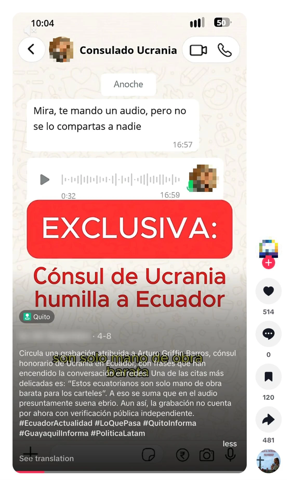

> 图解：2026 年 4 月 8 日发布于 TikTok 的视频截图，配有该行动伪造的音频，冒充乌克兰驻厄瓜多尔领事发表贬低厄瓜多尔人的言论。开源调查显示这条视频互动量有限——并非每个假料都能火。

### SRC：一家员工不知情的"真人智库"

笔者认为，Dark Clark 最"高级"的部分不是造谣，而是 **SRC 这个假前台本身** 。

内部报告显示，俄罗斯操作者对 SRC 是 **控制关系而非合作关系** ——报告里出现的是薪酬标准、招聘解雇、人员规划这类雇主视角的内容。他们通过假身份 "Mia Clark" 管理社交媒体并对接拉美本地员工，而 **这些本地员工完全不知道自己在为俄罗斯行动打工** ，只是在真诚地采访专家、撰写研究报告。SRC 网站上有超过 60 篇文章，绝大多数是原创内容，选题从金砖国家民意分析到博索纳罗与卢拉时期巴西经济对比，质量相当正经。

这与 OpenAI 此前曝光的另一起俄罗斯"假智库"形成鲜明对比：那家基本靠抄袭拼凑。Dark Clark 显然想打造一个 **更持久、有真实人脉网络的实体** ——这个设计的聪明之处在于，原创内容和真实员工让前台更难被识别，而且即便 AI 账号被封，"智库"外壳还能继续运转。

当然，运营也并非一帆风顺。操作者报告说，分布在世界各地的人登录同一批社媒账号导致账号被限制。开源痕迹印证了这点：

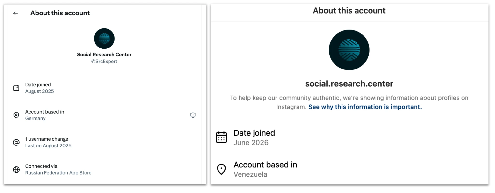

> 图解：左图为 SRC 关联的 X 账号，透明度设置显示该账号通过 **俄罗斯联邦区的 App Store** 连接（同时挂着德国位置，疑似 VPN 所致）；右图为 SRC 的 Instagram 账号，管理员位置显示在 **委内瑞拉** 。一边自称研究印度侨民的拉美智库，一边账号指纹横跨三国——这正是平台透明度功能在反认知战中的价值。

LinkedIn 上的操作更显笨拙：操作者建了一个假账号代表 SRC，发现没人关注，于是 **再造一批假账号去关注第一个假账号** 撑场面。截至 8 月 17 日，该账号有 961 名粉丝，宣称有 200-500 名员工，实际只列出 2 人。

### AI 在造假环节的真实分工

Dark Clark 直接让模型参与造假的比重其实不大（可能因为团队里有拉美本土的西语母语者），但几次出手都很典型：

- 俄语操作者让模型用俄语起草一封栽赃乌克兰驻巴拿马名誉领事贪腐的信，西语操作者再让模型翻译成西班牙语并生成配音脚本。最终成品——信件照片加配音——由一个冒用巴拿马 TVN Noticias 台标、只有 1 个粉丝的 TikTok 账号发布，发完即停更。

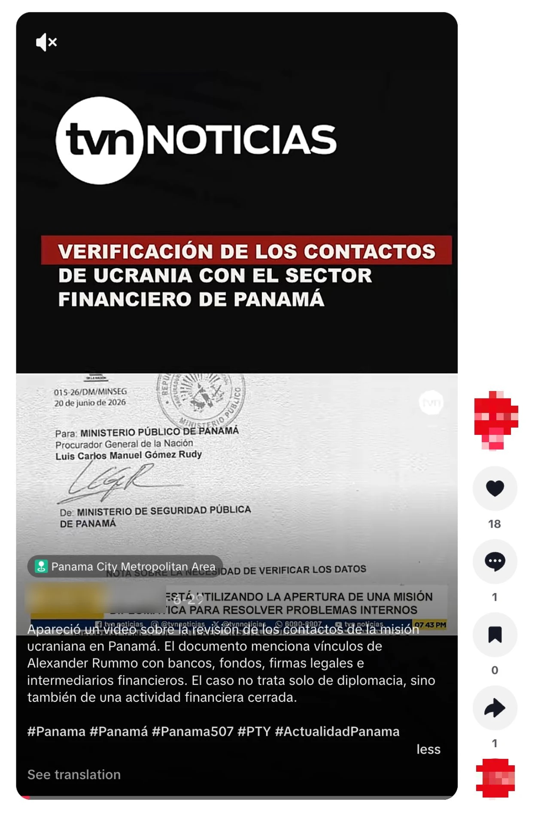

> 图解：TikTok 帖子截图，展示信件文本由该行动生成、配音脚本同样出自该行动的成品。冒用真实媒体台标是提升可信度的关键一步，但 1 个粉丝的账号说明分发环节成了短板。

- 另一次，操作者把一份"诺沃亚辱骂厄瓜多尔穷人"的俄语脚本交给模型翻译成厄瓜多尔腔西语；还有一次让模型校对一份 "International Security Solutions FZE" 公司与厄瓜多尔个人的虚假合同，细致到问哪些词该加粗。这份"合同"的照片随后在社交媒体流传，被用来佐证"厄政府伙同皮包公司骗人去乌克兰当兵"的说法，传播广到 4 月初引来了事实核查——核查结论是： **这家公司根本不在厄瓜多尔公司注册名录里** 。

### 影响评估：Category 5 的含金量与水分

评估 Dark Clark 的影响力必须打个折扣，因为操作者有个恶习： **给别人的功劳贴自己的标签** 。比如阿根廷外长引用"自决原则不适用于马岛"的立场——那是阿根廷几十年的官方立场；巴西媒体报道被俘巴西籍士兵的电视声明——操作者硬说"转载了我们的叙事"。某种程度上，这些操作者也在对自己的老板搞影响力行动。

但挤掉水分后，干货仍然可观：秘鲁班德拉事件确实在拉美和欧洲媒体上落地并引来波兰议员表态；多起假新闻逼得政府出面否认。综合来看，OpenAI 给出 **Category 5** ——多国政客公开回应级别——这是其披露史上首次。

## 伊朗行动"Bogus Bylines"：七个假记者的投稿流水线

解决了"AI 怎么帮人造谣"之后，下一个问题是：AI 能不能帮人 **一本正经地发稿** ？伊朗行动 "Bogus Bylines"（假署名）给出了肯定答案。

### 行动画像：更像商业化的"雇佣军"

这组账号源自伊朗（同样走 VPN 隐藏位置），用波斯语下指令、产出波斯语和英语内容。三条工作流：润色长文与投稿信、批量生成社媒评论、润色内部报告。整体特征更像一个 **接单的 commercial actor（商业雇佣影响力团队）** ，但 OpenAI 未能确认具体雇主，已将线索移交相关部门。

### 投稿流水线：AI 当"编务"，假记者当门面

这是该行动走得最远的一条线，流程已经相当工业化：

1. 把英文长文草稿（主题围绕美伊冲突）丢给 ChatGPT，要求 **对照目标媒体的投稿标准逐条评估并给出修改建议** ；
2. 操作者确认修改后，让模型 **生成给编辑的投稿邮件** ；
3. 用 7 个假署名投递：Ervin B. Hoskins、Noah Lamington、Sophia Gonzalez、Michael Harrison、Ericka Feusier、Jenny Williams、Alice Johnson。

这些 persona（人设）清一色包装成西方记者——多为美国人（Noah Lamington 自称在新西兰），关注国际政治、中东、人权等选题。"Michael Harrison" 的个人简介干脆也是模型写的——有意思的是，Meta 今年 3 月打掉的另一起伊朗行动里也出现过一个 "Michael Harrison"，撞名了。

人设还配了全套社媒"背书账号"：Harrison 有 Medium、X、Facebook；Hoskins 在 X、Facebook、Instagram、Threads 全线布局。但透明度设置再次出卖了他们：

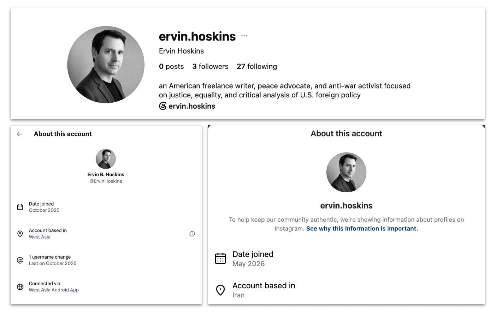

> 图解：上图为 "Ervin Hoskins" 的 Instagram 简介，自称"美国自由撰稿人"；左下为其 X 账号透明度信息，显示使用 **西亚区 Android 应用** ；右下为 Instagram 透明度信息，账号位置在 **伊朗** 。Meta 已于 8 月封禁该 Instagram 账号。嘴上是美国记者，指纹全在伊朗。

成果方面，OpenAI 通过开源调查定位到 **近 100 篇** 以这些署名发表或被转载的文章，遍布 **十几家** 中小型在线媒体（多关注国际事务、地缘政治、中东，部分持反战/进步立场）。时间跨度从 2025 年 7 月到 2026 年 10 月，且在美伊冲突爆发后发稿频率显著上升。

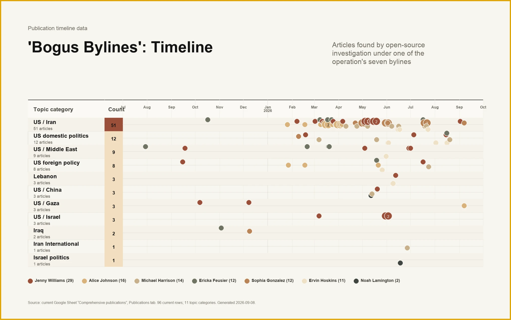

> 图解：2025 年 7 月至 2026 年 9 月的文章时间线，按作者（不同 persona）与主题着色。注意 2026 年 3 月之后美伊关系主题的文章密度陡增——热点冲突就是影响力行动的"春耕时节"。

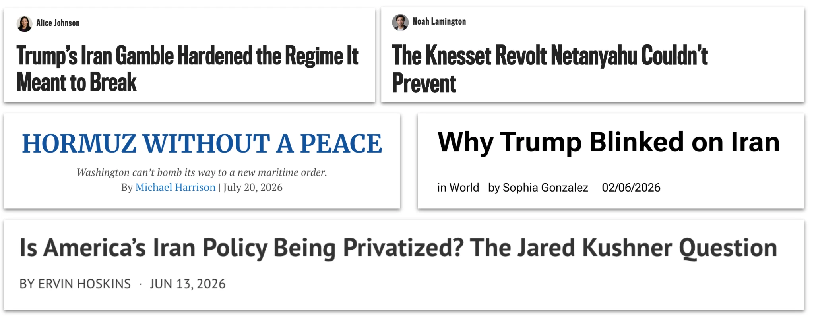

> 图解：2026 年 2 月至 7 月间，以该行动署名发表在多家在线媒体的文章标题样本。标题均为正经评论文章风格，毫无机器人痕迹——这正是 AI 润色 + 人工套壳投稿流水线的产出形态。

更关键的是，部分媒体还用自己的官方社媒账号推广这些文章，等于 **媒体自带的分发网络免费为伊朗操作者引流** ——其中一家媒体的 Facebook 粉丝接近 200 万，X 约 35.5 万，Instagram 超 54.4 万（2026 年 8 月数据）。

### 批量评论：量大但哑火

与投稿线的风光相比，评论线堪称惨淡。典型做法是输入帖子文本或截图，让模型批量生成立场一致的回复（英语或波斯语），然后几分钟内密集发出。立场模板很固定： **美国是侵略者、以色列是美国的不可靠盟友、伊朗是顽强反抗的受害者** 。针对伊朗政权批评者"伊朗国际"（Iran International）的帖子，就生成了二十多批波斯语敌意回复。还有一个小心机：给推广自家文章的帖子生成吹捧评论，制造"文章很受欢迎"的假象。

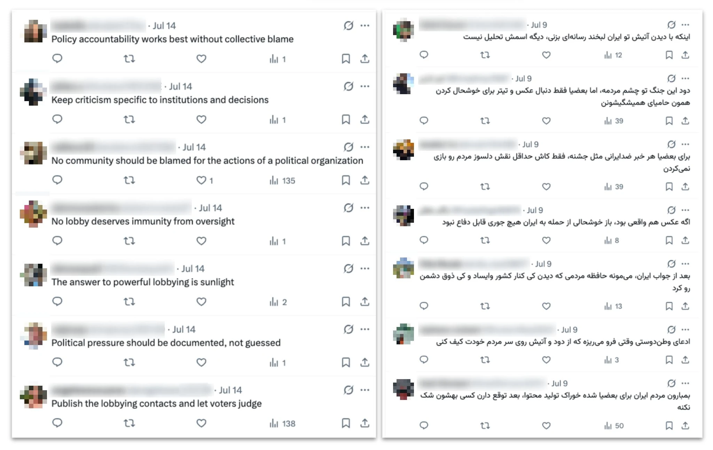

> 图解：左为英语推文回复、右为波斯语推文回复，均为该行动生成并于 7 月发布。英语评论回复的是"美国正准备对伊朗发动大规模攻击"的推文，图中全部评论集中在 **10 分钟内** 发出；波斯语评论针对美国打击伊朗的推文， **13 分钟内** 发完。这种时间密度本身就是机器协作的指纹。

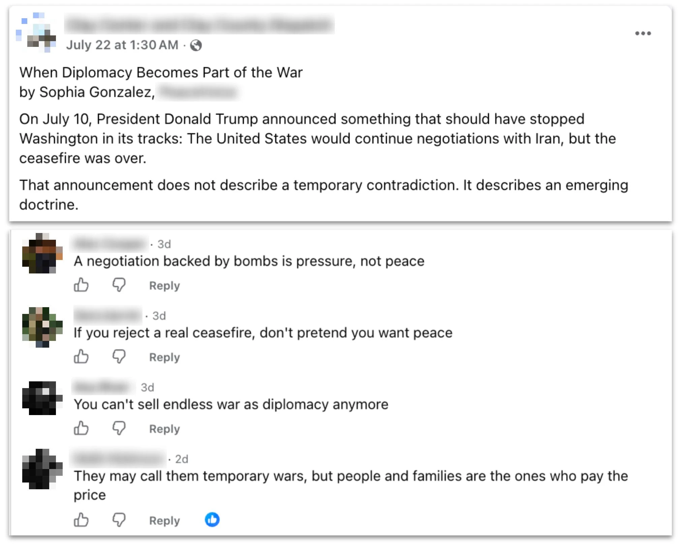

> 图解：美国一家地方新闻账号在 Facebook 转发该行动的文章，下方评论也由同一行动生成——左手发稿右手捧场，制造热度假象。

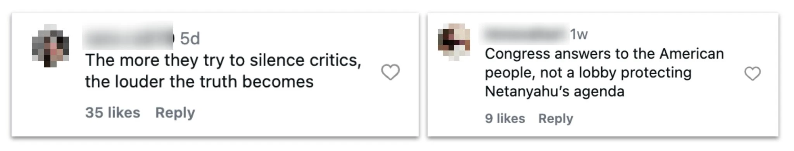

> 图解：该行动生成的、回复美国政治相关帖子的 Instagram 评论。少数评论批次涉及美国内政，但通常仍嵌套在美伊冲突的大叙事里。

实际效果呢？能被开源检索到的评论只占一小部分（很多账号已被封——三个 persona 简介里挂的 X 账号到 2026 年 8 月均已被冻结），而已发出的评论点赞、浏览多在个位数到两位数，在帖子总评论中也是少数派。连点赞里都有不少来自行动自己的关联账号。账号指纹同样露馅：

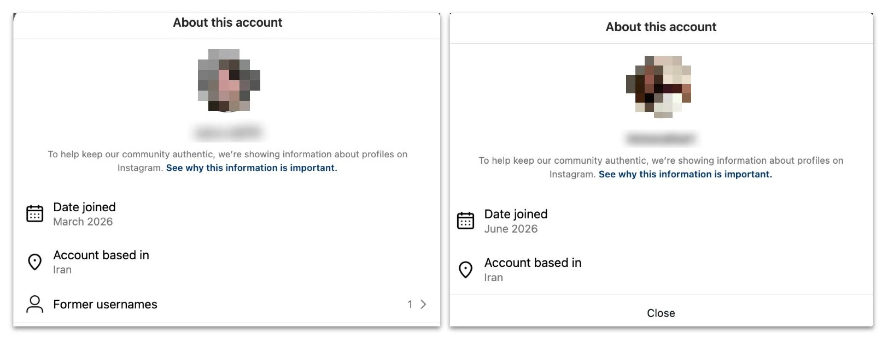

> 图解：发布上述评论的 Instagram 账号透明度设置——顶着西式名字的账号，位置显示全在 **伊朗** 。

### 内部报告：一场"自己给自己批作业"的注水

伊朗操作者同样用 ChatGPT 润色内部报告，而他们的"影响力"统计方法堪称行为艺术： **把自己回复的帖子的浏览量当成自己的战绩** （而非回复本身的浏览量），且在回复前后各统计一次。这个算法完全忽略了帖子本身的热度和时间因素，自然把数字吹得很大。要么是真不懂怎么算，要么是懂但故意不用——毕竟 KPI 压力不分国界。

### 影响评估：两条腿粗细悬殊

OpenAI 对两条工作流分别评级：

- **社媒评论线：Category 2** ——跨平台但无破圈迹象，评论区里连主导地位都谈不上；
- **假记者发稿线：Category 4** ——持续打入多家真实媒体，借助媒体自身渠道触达百万级粉丝受众。

同一行动、两个等级，恰好再次印证了开头那张矩阵的规律： **分发渠道决定天花板** 。

## 总结与启示

- **AI 是认知战的"降本增效器"，不是新武器** ：两起行动的剧本（假记者、假智库、假 leak）在 Alice Donovan 和 PeaceData 时代就写好了，AI 负责把写作、翻译、润色、汇报这些环节的成本打到地板。
- **最大的变化在分发层** ：操作者不再依赖社交媒体刷量，而是把内容"洗"进真实媒体——投稿邮箱成了新的攻击面，伊朗行动借此发表近 100 篇文章。
- **俄罗斯行动创下 Category 5 纪录** ：首次出现多国政客公开回应级别的 AI 涉入行动，且假前台 SRC 用不知情的真实员工生产原创内容，持久化意图明显。
- **平台透明度功能是防御利器** ：两起行动都栽在账号指纹上（俄罗斯 App Store、伊朗位置、西亚区应用），跨平台数据共享对归因至关重要。
- **披露即防御** ：假前台行动依赖隐蔽性，Alice Donovan 与 PeaceData 均在被曝光后停止活动——公开报告本身就是反制手段。

展望来看，真正的隐忧在于：当假前台开始雇用真实人类、生产真实原创内容时，"AI 生成检测"这条路会越来越窄，防御重心恐怕要从"识别内容"转向"识别实体与资金链"。

> 本文参考自 [Disrupting AI-enabled "false front" operations](https://openai.com/index/disrupting-ai-enabled-false-front-operations)