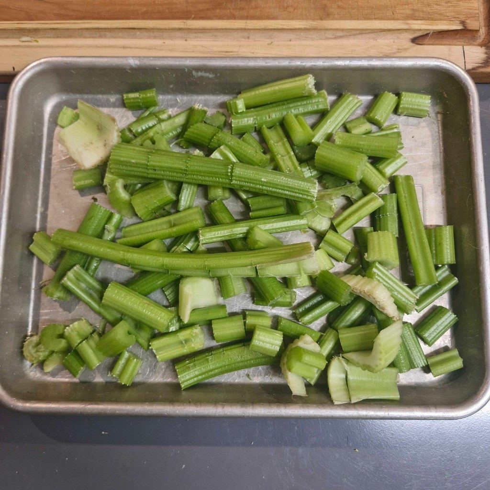
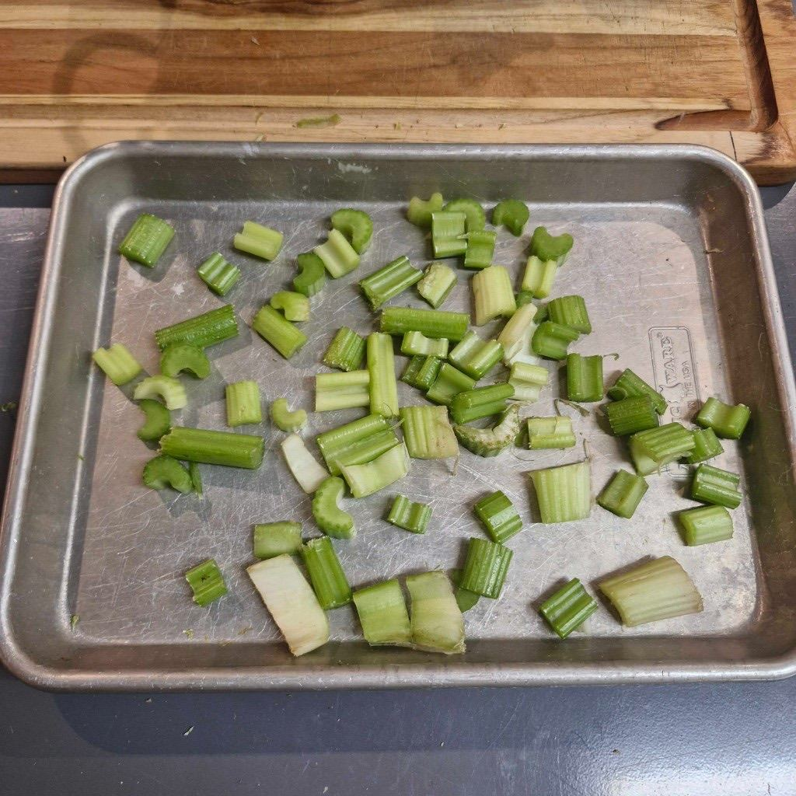
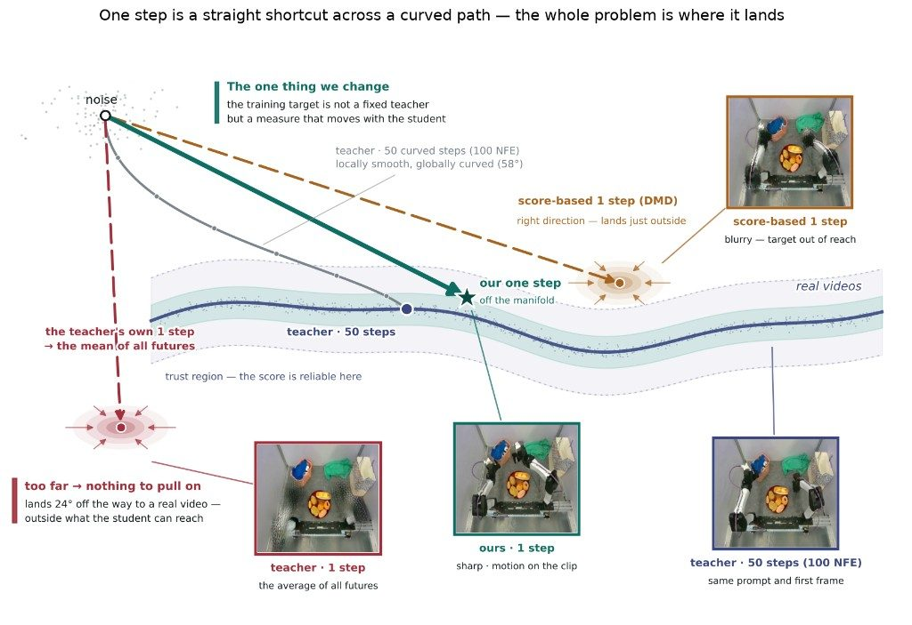
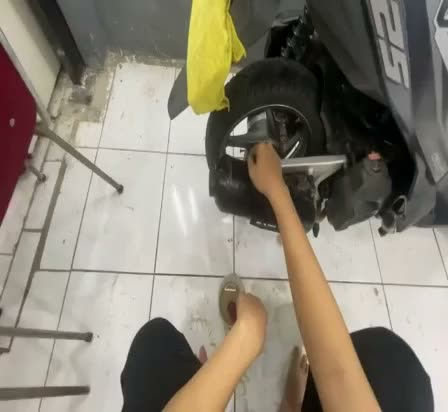
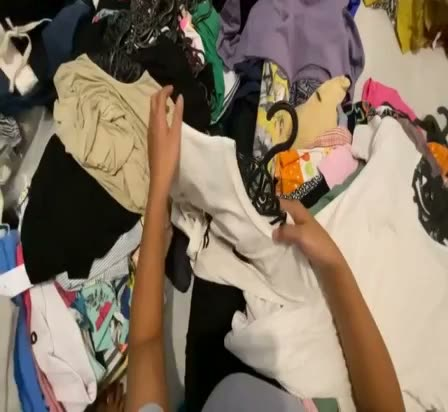
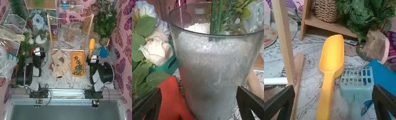
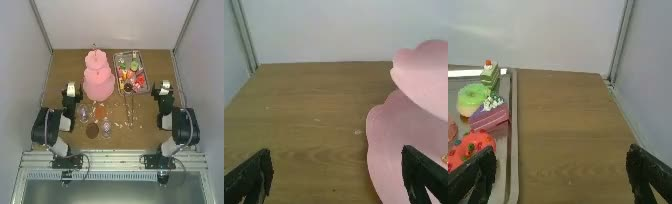
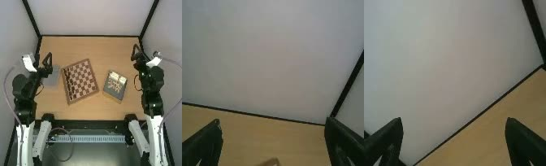

# Dyna-2：百万小时人类视频，炼出机器人领域的 Scaling Law

机器人基础模型该用什么数据预训练？遥操作数据太贵，仿真数据有鸿沟，业界吵了很多年没有共识。Dyna Robotics 的 Dyna-2 给出了一个相当硬核的回答：用 **超过 100 万小时的第一人称人类操作视频**（约等于 170 年的清醒人生）预训练一个 World-Action Model（WAM，世界-动作模型），结果不仅在人类数据上跑出了一条验证到百万小时量级的 Scaling Law，还 **首次证明了"人类到机器人"的迁移 Scaling Law**——模型预训练时完全没见过机器人数据，但人类视频喂得越多，它在机器人数据上的零样本预测就越好。更夸张的是，这个趋势能一路传导到真机：14 个任务的后训练平均得分从 20% 一路爬到 53%，其中一个任务只用了 10 分钟遥操作数据微调就学会了双手开瓶盖。

## 一、灵魂三问：机器人学习的数据从哪里来

先把问题摆清楚。这篇文章的开篇就抛出了一串连环问：

- 机器人学习的预训练数据，正确的来源是什么？
- 扩大这个数据源，能否在机器人性能上产生 Scaling Law？
- 需要什么样的建模和训练目标选择，这条 Scaling Law 才成立？

目前业界主流的预训练数据来源是遥操作和专用采集设备。这些数据质量高、带动作标签，但每一小时都要人工刻意生产，天花板肉眼可见。

Dyna 的第一性原理推导很直接：通用机器人的终极目标是做一切人类正在做的、有经济价值的事，那么正确的预训练数据就应该是 **人类做这些事情的传感记录（视频）**——它已经以近乎无限的规模存在，而且恰好包含操作策略需要学习的一切：场景如何演变、物体如何响应接触、手如何与物体交互。

当然，人类和机器人之间存在 Embodiment Gap（具身鸿沟）。但 Dyna 的逻辑是：只要 **迁移 Scaling Law 能被证实**（人类数据上的 Scaling Law 蕴含机器人数据上的 Scaling Law），那么技术路线就清晰了——一边收集更多人类数据，一边把机器人做得更像人。

## 二、Dyna-2 架构：一个模型，同时去噪未来视频和未来动作

Dyna-2 是一个 World-Action Model：建立在视频扩散骨干上的单一生成模型，可以联合或单独地对未来视频和未来动作去噪。

架构上它是一个 **Mixture of Transformers**（混合 Transformer）。每种输入模态（视频、动作）各自独立分词，并拥有各自独立的一组 DiT（Diffusion Transformer）层，层间通过注意力机制互相交流：

- **视频 Token** 使用因果掩码（causal masking），符合时序生成的直觉；
- **动作 Token** 使用双向自注意力（不做因果掩码），并 Attend 到观测上下文的视频 Token；
- **文本指令** 通过 Cross-Attention 注入视频 Token，但不直接作用于动作 Token；
- **本体感觉（Proprioception）** 分词后直接作为动作 Transformer 的输入。

一个值得玩味的设计细节：Dyna 在早期架构探索中发现，DiT 风格视频扩散架构的 **时序推理能力大部分保留在前几层**。因此他们故意把动作 Transformer 设计得更浅，只在早期层汇入视频流。这个设计在不牺牲性能的前提下大幅改善了实时推理延迟。笔者认为这是很聪明的取舍——动作本身是低维信号，没必要让它穿过整个视频模型的深度，"搭个早班车"就够了。

训练目标采用 **Flow Matching**。设 $c$ 为条件上下文（历史帧、本体感觉、语言指令），$z$ 为未来视频的隐表示，$a$ 为未来动作块（action chunk）。模型将真实样本沿直线路径向噪声腐蚀：

$$
z_t = tz + (1-t)\varepsilon_z, \quad a_t = ta + (1-t)\varepsilon_a, \quad \varepsilon_z, \varepsilon_a \sim \mathcal{N}(0, I)
$$

然后训练网络 $u_\theta$ 去预测去噪速度场。用于 Scaling Law 研究的 Dyna-2 变体采用 **视频预测与动作预测联合训练**，两个损失共享主干，但拟合两个独立的边缘速度场：

$$
\mathcal{L}_{\mathrm{co}}(\theta) = \mathbb{E}\left\lVert u_\theta^{\mathrm{vid}}(z_t; t, c) - (z - \varepsilon_z)\right\rVert^2 + \lambda\,\mathbb{E}\left\lVert u_\theta^{\mathrm{act}}(a_t; t, c) - (a - \varepsilon_a)\right\rVert^2
$$

注意一个关键细节：$u_\theta^{\mathrm{act}}$ 从不把 $z_t$ 作为输入。这意味着 **视频损失可以塑造共享表示，但推理时策略既不生成也不关注预测的未来视频**——模型在部署时保持完全的反应式（reactive），不需要先"想象"未来再行动。这个设计既享受了世界建模的表示红利，又避开了推理时生成视频的巨大延迟。

## 三、实验设计：干净的阶梯，挑剔的指标

在回答核心问题之前，先看实验设计，因为这部分做得相当讲究。

### 数据：嵌套的、精确小时数的人类经验子集

预训练语料总量超过 100 万小时，大部分是头戴式第一人称视角的日常操作录像——做饭、收拾、叠衣、组装。Dyna 建立了完整的数据清洗、手部姿态提取、验证与过滤流水线。通过手部姿态质量门槛的片段带有 3D 手部轨迹标注，由此导出动作流训练用的 **伪动作监督**：手腕位姿对应末端执行器轨迹，拇指-食指张合度导出连续抓取信号。

最重要的一点：他们 **不做任何** 缩小预训练数据与下游机器人数据之间视觉或运动学差距的处理。因为他们要研究的是"纯粹由规模带来的模型性质"——这个克制让结论更具普适性。

从语料中构建 1,000 / 10,000 / 100,000 / 1,000,000 小时的 **嵌套子集**，每个数据源保持相同比例。更大的预算只是"加数据"，从不"换数据"，因此 Scaling 曲线上任意两点的差异都无法用子集间的分布漂移来解释。另有独立的 100 小时验证集贯穿所有评测。训练与评测配置在所有点上完全一致——唯一的变量就是经验的小时数。

### 指标：连续误差 + 阈值化精度，双保险

Scaling 结论可能是指标选择造成的假象：非线性或不连续的指标会把平滑改进伪装成"涌现"。为此 Dyna 同时报告两类指标：对预测动作块 $\hat{a}$ 与真值 $a$，计算连续误差 MSE 与 L1，以及阈值化精度 accuracy@$\tau$——动作块中所有维度都落在真值 $\pm\tau$ 以内的时间步占比，取 $\tau = 0.5$ 和 $0.1$。他们发现 $\tau=0.5$ 适合衡量大体的运动意图（用于跨具身迁移研究），而 $\tau=0.1$ 是运动精度的良好指示器（用于同具身的域内 Scaling）。

## 四、四个核心问题，逐一验证

### 问题一：百万小时人类数据上，存在 Scaling Law 吗？

在 1k 到 1M 小时的数据阶梯上训练 Dyna-2，在留出的人类数据上评测（为消除 checkpoint 偏差，取后期窗口内 10 个 checkpoint 的均值与标准差）。结果：**所有四个指标单调改善，且都能被关于小时数的幂律很好地刻画**。例如 MSE 拟合为 $\text{MSE} = 0.0691 \cdot D^{-0.0184}$（$R^2 = 0.919$），accuracy@0.5 拟合为 $0.357 \cdot D^{+0.0203}$。

这是 **第一条验证到百万小时量级的真实世界操作数据 Scaling Law**，也证明 Dyna-2 架构能够吸收百万小时级数据并持续改进。一个有趣的细节：阈值化指标改善最快——accuracy@0.1 在整个阶梯上提升 51%，而 MSE 仅提升 12%。也就是说，规模增长主要带来的是 **精度** 而非大方向的改善。

> 小结：物理交互的预测精度，在同具身（人类）条件下，可以通过把数据扩到百万小时规模来可预测地提升。

### 问题二：人类数据上的 Scaling Law，能迁移到机器人数据吗？

这是全文最重磅的问题。据作者所知，此前没有任何工作展示过 **跨具身迁移 Scaling Law**——即在预训练中完全未出现的具身数据上直接评测、不做任何适配或微调。

评测集是一个精心构造的留出机器人数据集：两个固定式双臂 YAM 平台上的 **39 个任务**（12 个来自内部基准，27 个来自外部的 xdof ABC 数据集），覆盖布料处理、打结、打包、清洁、食品服务、装配等日常操作。刻意引入外部数据集是为了避免评测偏向自己设计的任务。没有任何 checkpoint 见过这两个来源的哪怕一条轨迹。

结果出人意料地干净：**所有指标随预训练人类数据规模单调排序**——机器人上的 MSE 拟合为 $0.306 \cdot D^{-0.0713}$（$R^2 = 0.884$）。注意机器人侧幂律指数的绝对值（-0.0713）远大于人类侧（-0.0184），说明迁移场景下 Scaling 的收益斜率反而更陡。作者还观察到 10k 到 100k 小时之间存在一个 **拐点**：数据覆盖度足够之后，跨具身知识迁移似乎仅凭规模就能涌现。

> **关键结论：Scaling Law 可以从人类迁移到机器人。** 仅扩大人类数据，就能改善 World-Action Model 在机器人上的预测。

### 问题三：离线 Scaling Law，能变成真机性能吗？

离线指标再好，最终也要上真机。作者将阶梯上 4 个档位的等价步数 checkpoint，在同一套 **14 个任务的内部基准** 上做后训练——每个任务最多 10 小时机器人数据，唯一的变量是预训练用了多少人类视频。注意：刻意 **不做** 人类-机器人对齐或联合训练，为的就是把改进完全归因于预训练规模。

14 个任务横跨多种操作能力，跑在三种机器人具身上：

- **双臂平台**（6-DOF YAM 臂 + 平行夹爪，11 个任务）：精确抓取放置（Pick & Place、Unsort、Trash Tray Pickup、First Aid Kitting）、可变形物体（Rope Tie、Pants Hanger）、精密操作（Food Scooping、Fridge Tube Insertion、Lockbox Key Turning）、铰接物体（Tote Construction、Mug Unboxing）；
- **灵巧手平台**（WUJI-2 20-DOF 五指灵巧手，2 个任务）：Highlighter in Drawer、Bottle Cap Untwisting；
- **半人形原型机**（1 个任务）：Targeted Drink Retrieval 语言跟随任务。

聚合结果：14 个任务的平均归一化得分随预训练规模单调增长，从 **20% → 28% → 45% → 53%**（归一化到各任务的理论上限）。百万小时档在 14 个任务中的 9 个上取得最佳。评测采用盲测协议（评测人员不参与模型开发），每任务 10 次试验。

几个任务的故事尤其值得单说：

- **Lockbox Key Turning** 是"阈值效应"最清晰的案例：10 万小时及以下的所有 checkpoint 从未成功转过钥匙，而百万小时档 **成功率 90%**——有些能力需要预训练越过某个阈值才"解锁"；
- **Bottle Cap Untwisting** 展示了数据效率的另一个极端：后训练只用了约 **10 分钟** 机器人示教数据，成功率仍随预训练规模从 10% 爬到 50%；
- 语言跟随任务（Targeted Drink Retrieval）从 58% 提升到 83%。

### 问题四：跨具身 Scaling Law 的涌现，到底靠什么？

Dyna-2 同时预测未来世界状态和机器人动作，但这个建模选择真的重要吗？作者做了一组三方对照消融：固定动作数据量（5k / 50k / 100k 小时），只改变训练目标与数据构成：

| 配方 | 内容 |
| --- | --- |
| **Action-only** | 只有动作损失，无世界建模 |
| **Joint** | 同一数据集上联合预测动作块和未来视频 |
| **Video co-training** | Joint 之外，再在等量无动作标签的人类视频上做视频预测 |

结果非常干脆：

- **任何形式** 的未来预测都以大优势击败 action-only——Joint 配方在每个动作规模下、39 个任务上 **全部** 胜出；
- Action-only 随数据增长出现严重且不可预测的过拟合；Joint 过拟合较轻，但也不随数据规模提升；
- 只有 **加入大量纯视频做视频预测** 时，曲线才随数据规模翻转向上。这个做法在小规模（5k 小时）时反而不占优，但差距随规模拉大——典型的"规模解锁型"配方。

### 视频是新的 Scaling 轴

更进一步：固定动作数据，只扩视频数据会怎样？这个问题有直接的现实背景——百万小时级的语料里，提取合格手部姿态并不容易，**永远会有大量无动作标注的人类视频**。这些"低质量"数据能利用起来吗？

实验：固定 50k 小时带动作标注的人类数据，纯视频数据从 0 / 1k / 10k 扩到 50k；再用 250k 小时动作数据搭配 0 / 250k / 750k 纯视频重复验证。结论一致：不加视频（action-only）一致垫底，**仅扩大视频数据就带来单调的泛化改善**。

而对照实验更有意思：扩视频数据对留出 **人类** 数据的评测没有帮助甚至略有损害（可能的解释是视频训练稀释了动作学习梯度，而域内评测中足够的动作数据已经够用）。也就是说，**视频数据在规模上的收益，专一指向跨具身泛化**。

> **关键结论：未来预测（世界建模）使跨具身迁移 Scaling Law 得以涌现，视频是具身智能新的 Scaling 轴。**

笔者认为这是全文最有范式意义的一点。世界建模的承诺一直是"给模型一个对物理世界的通用理解"，而这种理解理应帮助模型泛化到完全没见过的具身——这个假说第一次在大规模上被验证了。对行业的启示也很实际：无标注视频的成本远低于带动作标注的数据，如果视频 Co-training 就足以驱动迁移 Scaling，那么数据飞轮的门槛被大幅降低了。

## 五、Scaling 之外：Dyna-2 的更多能力

### WAM vs. VLA：一场苹果对苹果的比较

WAM 和 Vision-Language-Action（VLA）模型哪个更好，社区尚无共识，已发表的比较往往在数据、算力、评测协议上都不对等。Dyna 用早期版 Dyna-2 对比自家上一代生产级 VLA——Dyna-1（基于 Qwen3-VL-4B 初始化的 Mixture of Transformers），在 **相同预训练/后训练数据与超参** 下训练，每个架构从 3 个不同预训练 checkpoint 出发以消除选择偏差。

值得强调，这场比较对 WAM 其实是 **不公平的**：参测的早期 Dyna-2 没有百万小时预训练、用的是 action-only 损失；而且整条实验流水线（数据收集、超参）都是为 VLA 调优的。因此结果应被读作 WAM 的 **下界**。

即便如此：7 个基准任务 × 3 个 checkpoint 的聚合结果显示，WAM 的成功率达到 VLA 的 **1.55 倍**，质量评分为 **1.12 倍**；逐格对决中 Dyna-2 胜率 65%，Dyna-1 胜率 29%，平局 6%——且 VLA 的胜利大多集中在最早的预训练 checkpoint，彼时 WAM 的预训练优势尚未积累。

定性对比同样直观。以切芹菜任务为例，相同后训练数据下，Dyna-2 切出的芹菜片 **更薄、更均匀**，更贴近专家示教：

> 图解：同一任务、相同后训练配置下，生产级 VLA（Dyna-1）与早期 WAM（Dyna-2）切出的芹菜成品对比。可见 Dyna-2 的切片明显更薄更均匀。

更令人印象深刻的是鲁棒性。在后训练数据量很小、Dyna-1 对扰动很脆的条件下，Dyna-2 在极端工况下无需人工干预：

- **灯光剧变**：改变甚至撤走大部分工作区照明，照常精确作业（迪斯科灯光、黑暗环境都测了）；
- **视觉输入丢失**：运行中途遮住顶部相机，策略继续运行（作者严谨地注明：这报告的是对传感器丢失的鲁棒性，而非对不可观测场景的预测）；
- **目标状态坚持**：测试者站在机器人正前方，不断把切好的芹菜放回砧板"撤销"它的工作——Dyna-2 持续清理，既不在固定循环次数后停下，也不被带偏，**直到砧板清空才停**。

### 零样本真实部署：从"能完成"到"能过验收"

通用模型的承诺之一是无需额外微调就能直接部署到真实客户现场。Dyna-1 的零样本能力已经不错（在未见环境中接近 100% 任务完成率），但 **任务完成不是生产的验收标准**——生产看的是质量、吞吐、可靠性的综合。一个策略可以"完成"任务却三项全挂。

结果：室内同分布评测中两者都接近 100% 通过，无法区分；**但在从未见过的客户现场零样本部署时，Dyna-1 通过率 46%，Dyna-2 通过率 87%**——相同后训练预算下相差 41 个百分点。世界建模带来的泛化红利，在真金白银的生产环境里兑现了。

### 指令跟随：世界建模给语言接地

端到端机器人策略常常跟不好语言指令——图像信息量大得多，连续动作损失还会破坏预训练表示；反事实场景（相似场景给不同指令）尤其困难。VLA 路线往往需要多阶段训练和冻结骨干来保住语义知识，流水线又脆又慢。而 WAM 通过视频预测提供了学习语言的全新数据源：模型直接从海量第一人称数据中学习"物体和动作在物理世界中意味着什么"。

作者设计了四个固定场景、只改指令的基准：推/拉积木、指定物体分拣（5 选 1）、红/黄块堆叠（测语言-空间接地）、餐巾操作（8 种动作原语）。评分采用 0 / 0.5 / 1 三档。结果：

| 配置 | 四任务总分 |
| --- | --- |
| Action-only · 早期语料 | 0.35 |
| Video co-train · 早期语料 | 0.67 |
| Video co-train · 完整 Dyna-2 语料 | **0.96** |

从 action-only 换成视频联合训练，成功率从 35% 跳到 67%；再用完整语料做视频 Co-training，直接推到 96%。**训练目标与数据规模/多样性，两者都显著贡献于语言跟随能力。**

### 一步视频生成：把世界模型加速 93 倍

最后是一个偏生成方向的技术甜点：Dyna 开发了一条蒸馏流水线，把 Dyna-2 的视频生成器变成 **单步学生模型**，生成延迟降低约 90 倍。据作者所知，这是第一条能产出可用于规划与评测的、指令条件化操作视频的单步蒸馏流水线。

为什么单步难？文章给了相当扎实的分析：

- **轨迹回归类目标**（如 Rectified Flow 蒸馏）的最优解是条件均值 $\mathbb{E}[x_0 \mid z]$——一步从噪声出发只会返回"所有未来的平均"，必然模糊；
- **分布匹配类目标**（如 DMD）保细节，但其梯度要在教师模型从未训练过的位置评估教师 Score——概率流路径局部直、全局弯（教师模型上每步约偏 4°、全程累计 58°），一步就冲出了教师 Score 的支撑集；
- 维度灾难雪上加霜：在流形假设下，学生分布 $p_\theta$ 与目标 $q$ 是 $\mathbb{R}^D$ 中的低维集合，当 $\dim M_p + \dim M_q < D$ 时两者一般不相交，$\chi^2$ 散度饱和、梯度消失。多步采样器每步都重新投影回数据流形，一步法则必须独自扛下全部平滑。

Dyna 的解法是把单步视频生成当作 **一个控制问题：学生与一个随它移动的目标之间的追逐博弈**。不把教师固定为目标，而是让学生匹配一条从"初始化即可达"连续延伸到"数据本身"的目标路径 $\{q_r\}, r \in [0,1]$。训练是两个不同速率耦合的更新：

$$
\frac{d\theta}{dt} \propto -w(\hat{m})\,\nabla_\theta \mathbb{D}\left(p_\theta * \mathcal{D}_\sigma \,\|\, q_r * \mathcal{D}_\sigma\right), \qquad \frac{dr}{dt} = f(\hat{m})
$$

其中 $\hat{m}$ 是学生自身样本的在线读出，$w$ 是增益，散度 $\mathbb{D}$ 的具体形式留开放（可以是 mode-seeking、对抗式或混合）。慢速更新 $f$ 是控制律：只有当 $\hat{m}$ 表明学生已经追平当前目标时才推进 $r$，否则原地等待——**目标撤退的速度永远不超过学生能追上的速度**。笔者认为这个"移动靶"思路颇有 Curriculum Learning 的神韵，但用连续控制的语言写得更加干净。

效果对比（NFE 为函数评估次数，FVD 越低越好，Motion 为运动保真度，Flicker 为闪烁）：

| 采样器 | NFE | 耗时 (ms) | 加速比 | FVD ↓ | Motion ↑ | Flicker ↓ |
| --- | --- | --- | --- | --- | --- | --- |
| 真实录制的未来 | — | — | — | — | 100% | 2.37 |
| 教师模型，默认调度 | 100 | 10,203 | 1× | 80 | 94% | 2.69 |
| 教师模型，砍到 1 步 | 2 | 210 | 48.6× | 1039 | 27% | 15.81 |
| DMD2，2 步 | 2 | 211 | 48.4× | 115 | 79% | 2.95 |
| DMD2，1 步 | 1 | 109 | 93.6× | 599 | 56% | 5.81 |
| **本文方法，1 步** | **1** | **110** | **93×** | **121** | **75%** | **1.94** |

> 表格解读：直接把教师砍到 1 步完全崩溃（FVD 1039、Motion 27%）；DMD2 单步也不行（FVD 599）。本文的单步方法在 93 倍加速下拿到 FVD 121，逼近 DMD2 两步的水平，且 Flicker（1.94）甚至优于真实视频（2.37）。

> 图解：同一条指令、同一首帧下各方法生成末帧的对比。教师模型最接近真实，直接砍步数严重模糊，DMD2 保留细节但几何有偏差，本文单步方法在两者之间取得平衡。

生成效果上，开箱即可产出高保真、指令条件化的第一人称未来视频，覆盖切果冻、刷背包、洗餐具、熨衣服、浇花等大量日常操作：

> 图解：Dyna-2 单步蒸馏流水线生成的第一人称未来视频帧——清洁排气管、分拣衣物、切果冻等指令条件下的高保真结果。

在机器人数据后训练的模型上，还能生成多视角一致的未来：

> 图解：机器人数据后训练的 Dyna-2 单步蒸馏流水线生成的多视角一致未来——抓手套、夹蛋糕、摆棋子等任务。

## 六、总结

回看全文，几个要点值得带走：

- **百万小时 Scaling Law**：第一条验证到 1M 小时量级的真实世界操作数据 Scaling Law，人类数据上四个指标全部单调幂律改善；
- **首次证实人类→机器人迁移 Scaling Law**：预训练零机器人数据，机器人零样本评测随人类数据规模单调提升，且迁移侧幂律斜率更陡；
- **传导到真机**：14 任务后训练得分 20% → 53%，90% 的转钥匙成功率在 1M 小时档"解锁"，10 分钟示教学会开瓶盖；
- **世界建模是涌现的关键**：action-only 不 Scale，视频 Co-training 是唯一随数据改善的配方——**视频是新的 Scaling 轴**；
- **工程红利实打实**：WAM 对 VLA 成功率 1.55 倍，客户现场零样本通过率 87% vs 46%，指令跟随 96%，视频生成单步化加速 93 倍。

展望来看，这项工作把"数据、目标、规模"三要素中的前两个钉死了，但 **算力与模型规模的 Scaling 实验被留给了未来工作**——当模型规模也成为变量，这条迁移 Scaling Law 会延伸到哪里，是接下来最值得关注的悬念。如果这条路继续成立，机器人基础模型的竞争焦点，可能真要从此转向"谁能更低成本地获取和消化海量人类视频"。

> 本文参考自 [Dyna-2: A 1-Million-Hour Scaling Law for World-Action Models](https://www.dyna.co/dyna-2)