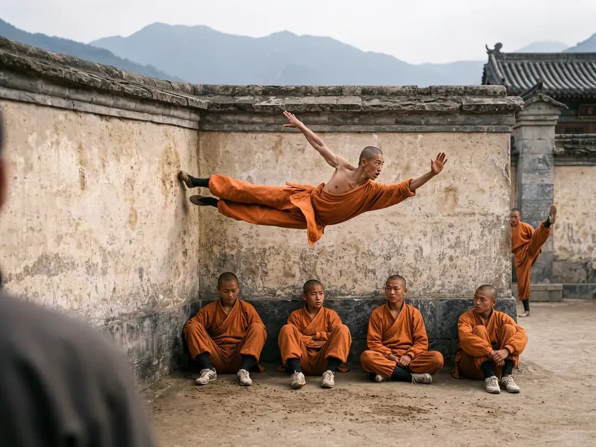
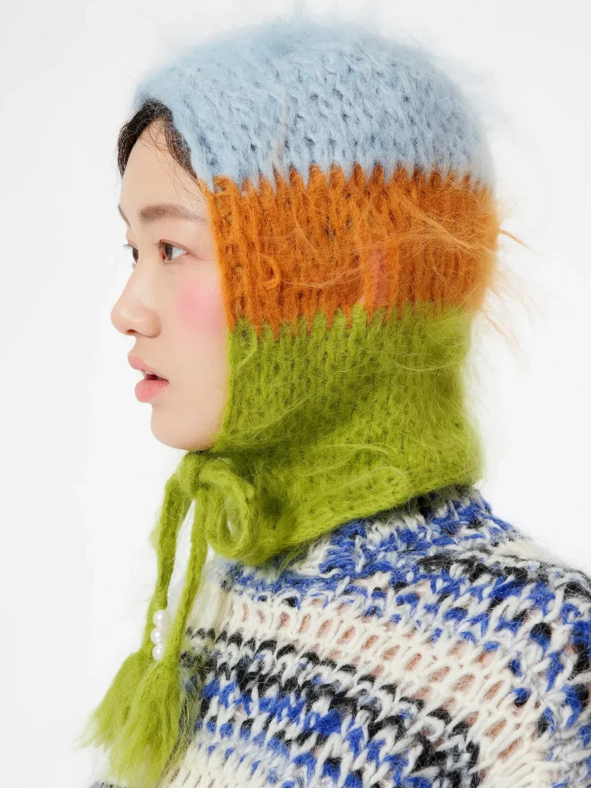
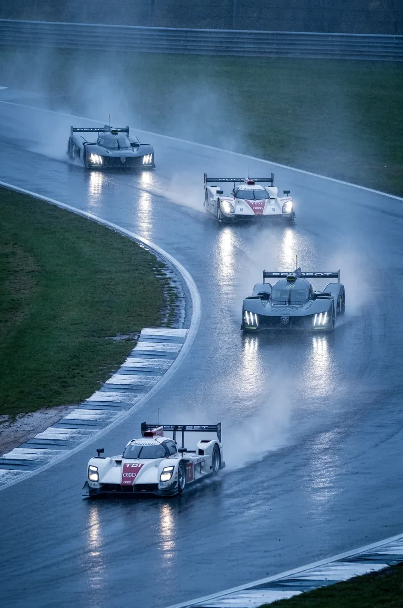
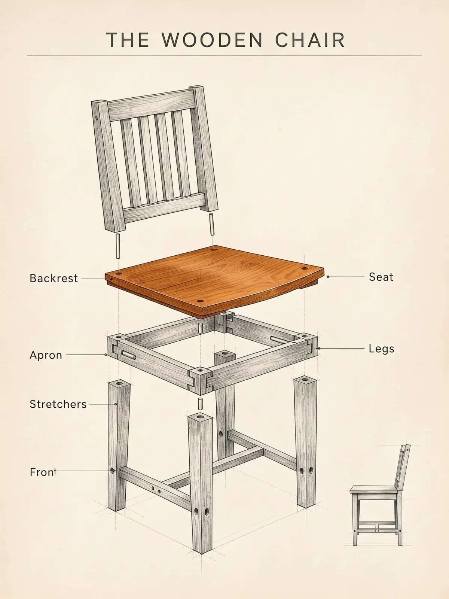
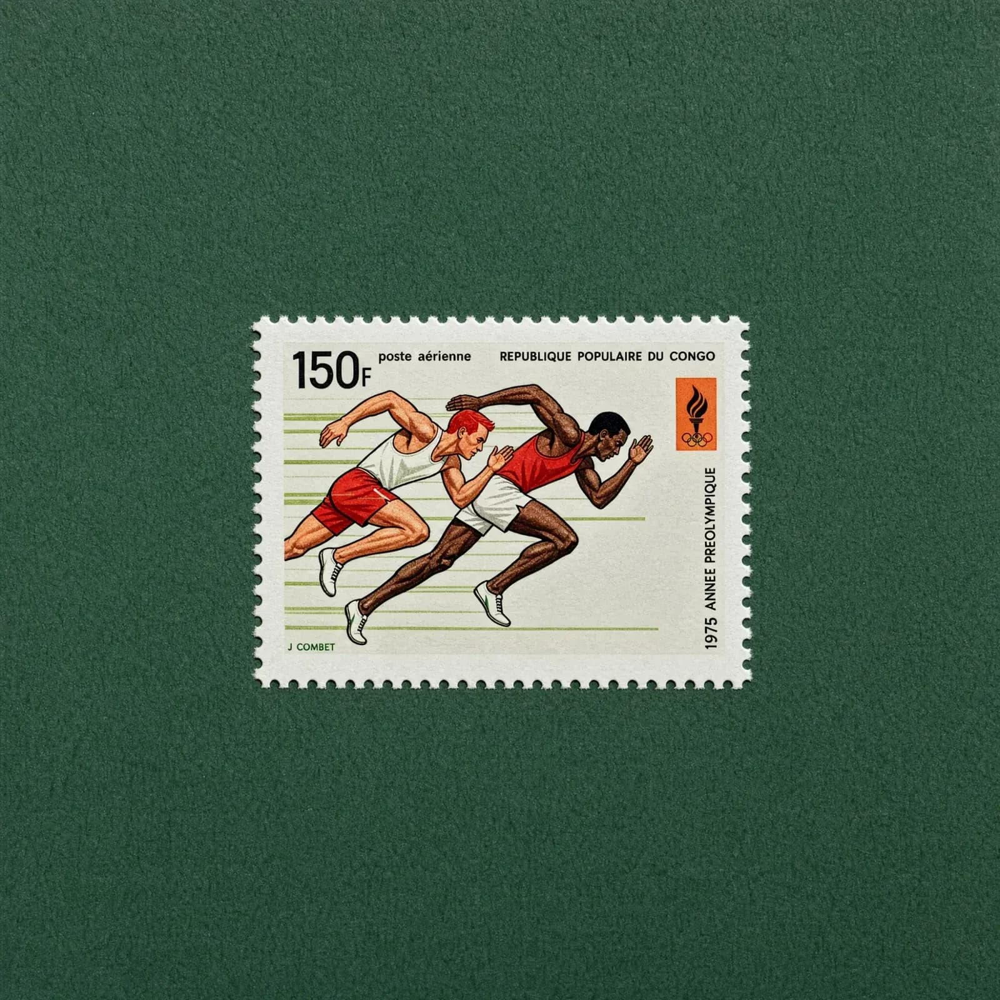
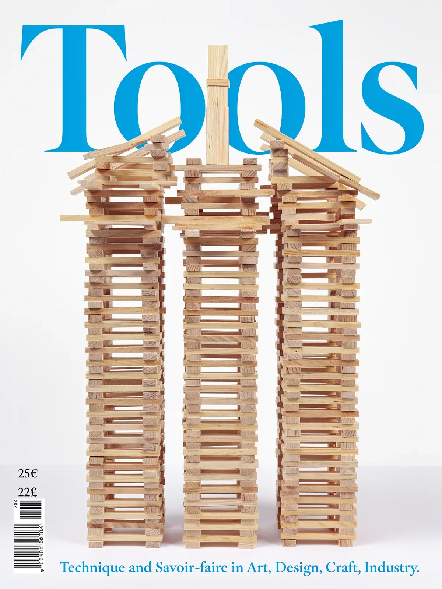
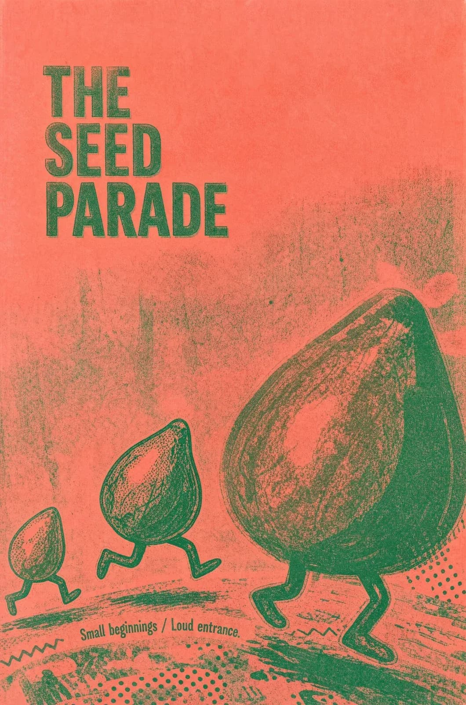

# FLUX 3 Image：用 Bounding Box 控制每一个像素

用过文生图模型的人都有过这种体验：prompt 写得再详细，画面里谁站左边、谁站右边、标题文字放哪里，基本靠抽奖。Black Forest Labs 最新发布的 FLUX 3 Image 就是冲着这个“失控感”来的——它把图像生成从“许愿”变成了“排版”：你可以用 Bounding Box（边界框）在画布上精确指定每个元素的位置和大小，模型保证每个元素都渲染在自己的框里。同时它还支持原生 2K/4K 输出（单图最高 5456 × 3072 像素、16.8 MP）、最多 10 张参考图融合，以及“改了 A 就不碰 B”的像素级精准编辑。这篇文章就带大家完整拆解这个模型的玩法和设计逻辑。



> 图解：FLUX 3 Image 官方展示图。一名武僧腾空横跃贴墙，下方四名僧人静坐，右侧门边还有一人探头——多主体、多空间关系的复杂构图，正是这个模型主打的能力场景。

## 为什么“可控”是文生图的下一个战场

扩散模型发展到今天，单张图的质感早已不是问题。真正的瓶颈在于 **构图控制权** ：

- 海报设计里，标题必须在左上角、产品必须在右下角——纯文本 prompt 很难稳定做到；
- 多主体场景里，元素之间的遮挡、比例、相对位置一复杂就崩；
- 编辑图片时，改一个物体往往连带整图“变脸”，无法迭代式精修。

过去的补救方案是 ControlNet 这类外部控制插件，或者生成后靠人工 PS。FLUX 3 Image 的思路不同：它把 **布局理解能力直接训进了模型本体** ，让“位置”成为和“内容”平级的一等公民。下面我们逐项看它怎么用。

## 玩法一：用 Bounding Box 从零构图

这是 FLUX 3 Image 最核心的新交互。整个流程像设计师排版一样分四步：

1. **定宽高比** ：先选画布比例。无论选什么比例，画布都被抽象成一个 $0$ 到 $1000$ 的归一化网格，两个坐标轴都是。
2. **拖框定元素** ：给每个重要元素画一个框，并写一句描述说明框里放什么。
3. **写场景句** ：用一句话把整个场景串起来，让元素之间产生联系。
4. **生成** ：模型渲染整张图，保证每个元素落在自己的框内。

框的坐标格式是 `[y_min, x_min, y_max, x_max]`。官方给出的示例是一张名为 “Le Festival du Soleil” 的海报，其布局 prompt 长这样：

```json
[
  { "id": "Fr_Text_1", "bbox": [10, 200, 170, 800], "desc": "\"LE FESTIVAL DU SOLEIL\" written in a thin, elegant, serif typeface in a light cream color" },
  { "id": "town_1", "bbox": [280, 700, 420, 1000], "desc": "faint lights and small buildings of a coastal town at the foot of the hills" },
  { "id": "dome_1", "bbox": [250, 150, 650, 850], "desc": "a massive, smooth parabolic dome of pale concrete" },
  { "id": "swimmers_1", "bbox": [580, 200, 720, 800], "desc": "dozens of small, silhouetted figures scattered in the dark water, wading" },
  { "id": "crowd_1", "bbox": [740, 0, 1000, 1000], "desc": "a large crowd of people seated on the beach in casual, light-colored summer attire" }
]
```

再配上一句场景 prompt："A glowing concrete dome rises from a twilight bay, a crowd on the beach before it." 模型就生成出暮色海湾中混凝土穹顶升起、海滩人群围坐的海报，文字、穹顶、泳者、人群各就其位。

笔者认为这个设计聪明的地方在于 **语义 id 机制** ：每个框不仅有坐标，还有一个可读的名字（如 `dome_1`），场景句通过引用 id 把布局和文字描述绑定起来。这使得布局 prompt 既是一组几何约束，又是一段结构化文本——人和 LLM 都能读写。

当然，Bounding Box 不是万能的。官方也明确说了适用场景： **元素多且位置关系严格的构图** ，比如围绕照片排版的文字、拼贴画、网格分镜、杂志跨页，或者“每张脸都有固定位置”的拥挤场景。如果只是画一只猫，直接写 prompt 就行。

## 玩法二：不用框，纯文本生成依然很强

解决了布局控制之后，一个自然的问题是：传统 text-to-image 的基本功还在吗？官方的说法是 FLUX 3 Image 具备强大的 prompt following 能力和对构图的原生理解，并放出了一大批样张。挑几张有代表性的：



> 图解：时尚肖像。蓝、橙、绿三色马海毛头套的绒毛质感纤毫毕现，考验的是材质渲染能力。



> 图解：雨战赛车场景。湿滑路面的车灯倒影、轮胎卷起的水雾、前后车的纵深感，都是多元素物理一致性的体现。



> 图解：技术插画风。“THE WOODEN CHAIR” 爆炸分解图，各部件标注线对齐准确——这类“图 + 精确文字标注”的图是文生图的传统难点。



> 图解：复古邮票设计。面值 “150F”、国名、年份、“J. COMBET” 签名等小字号文字全部清晰可读，置于深绿毛毡背景上。



> 图解：杂志封面排版。蓝色衬线大标题 “Tools” 被三座木条塔自然遮挡，左下角还有价格与条形码，整体层级关系非常“编辑部”。



> 图解：Risograph 印刷风海报 “The Seed Parade”。三颗长着小细腿的绿色种子列队行走，套色印刷的颗粒感和错位感都模仿到位。

从这组样张可以看出，FLUX 3 Image 在 **文字渲染、材质细节、风格化印刷品** 这三项上都站得很稳——这正是商业设计场景最看重的三项。

## 玩法三：一次编辑多个目标，其余像素纹丝不动

接下来是编辑能力。FLUX 3 Image 支持在一张已有图片上 **一轮同时做多处定向修改** ，没碰到的部分严格保持不变。注意这里沿用同一套 Bounding Box + 语义 id 的语言：框出要改的元素，重写它的描述即可。

官方给了三个递进式例子：

**重着色（Re-describe）** ：一张黑白冲浪照片，把冲浪者的潜水服从黑色改成亮红色氯丁橡胶材质、冲浪板从白色改成亮红色，海浪（`ocean_wave`）和多云天空（`cloudy_sky`）标记为 Locked 保持不变。编辑指令以自然语言写成，明确引用每个 id。

**替换（Replace）** ：竹林小径图中，把左侧持剑的拟人化狼（`wolf_1`）替换成一只狗；前景巨竹、空心倒木、结冰溪流、石灯笼、飘落的霜花和枝头小鸟全部锁定原样。

**风格替换** ：笔记本摊开的一页上，把抽象炭笔涂鸦（`drawing_1`）换成青金配色的植物水彩插画，纸张、螺旋线圈、印刷文字区域均保持不变。

这个“锁定”机制是实际工作流里最值钱的部分：修图可以一轮一轮迭代下去，图不会越修越散。对电商修图、海报改稿这类需要反复微调的业务来说，这比“重抽一张”实用得多。

## 玩法四：最多 10 张参考图融合成一张图

再进一步，FLUX 3 Image 支持 **多图参考生成** ：上传最多 10 张参考图，每张按顺序获得一个 token（从 `ref_image_0` 开始），然后在 prompt 里用一句话说明要做什么、引用各 token，模型自己决定每张参考图放在哪里、占多大，渲染出完整画面。

官方的演示是上传马甲、T 恤、牛仔裤、行李袋、针织帽、运动鞋 6 张单品图，prompt 写 "A fashion streetwear portrait in Times Square with ref_image_0, ref_image_1, ref_image_2, ref_image_3, ref_image_4 and ref_image_5"，输出一张模特穿着全套单品的时代广场街拍。

对服装、电商行业而言，这个能力的含义很直接： **无需训练 LoRA，即传即用** 的虚拟试穿和场景合成。

## 原生 2K/4K：细节不再被压缩

分辨率是另一个硬指标。FLUX 3 Image 直接以原生 2K 和 4K 渲染，不是先小图再放大。

官方示例是一家荞麦面店的全景图：整图 5456 × 3072 像素（16.8 MP），全部来自模型本身。放大后可以看到：

- 灯箱招牌上的手写体字符，在文件中约 225 像素高；
- 纸灯笼上的字符，透光透过灯笼骨架；
- 透过玻璃窗能看见食客手里握着筷子。

为什么强调“原生”？因为超分放大只能补“合理的模糊”，补不出真实的小字号文字和纹理。对于要交付印刷或大屏投放的素材，原生 4K 意味着 **生成图可以直接进入生产管线** ，省掉一轮放大和修瑕疵。

## Pixel-perfect editing：改动局部，保住原图

与 Bounding Box 编辑互补的是像素级精准编辑：在图的任意局部添加或修改内容（官方演示是在海面上“凭空”加入两名潜水员），同时严格保留原图的其余部分。

对比前面的框选编辑，两者的分工可以这样理解：框选编辑面向 **语义级** 的改动（换颜色、换物体、换画风），pixel-perfect editing 面向 **几何级** 的增删（这里加个人、那里去个物体），共同目标都是“原图不动的地方一个像素也不漂”。

## 为 Agent 而设计：LLM 帮你排版

最后一个面向未来的设计：FLUX 3 Image 原生训练了布局与构图理解能力，因此 **天然适合被 Agent 调用** 。

官方展示的工作流是：Agent 只拿到一句话 prompt 和宽高比，由一个 LLM 负责规划布局——写出全局 caption 和元素表（每个元素一个框加一个语义 id）；用户可以微调任意框；最后 FLUX 3 在布局内生成，每个元素各就各位。示例中，“从侧幕看三位跳《天鹅湖》的芭蕾舞者”这句话被 LLM 展开成 3 个观众剪影框 + 3 个舞者框的六元素布局。

还有一个细节值得注意：prompt upsampler（提示词扩写器）会把用户的简短请求扩写成模型训练时使用的密集 caption，它可能围绕你的框补充描述、甚至建议新元素，但 **你画的每个框都会原封不动地传给模型** ，id 和坐标一字不改；upsampler 新增的内容只有被 caption 引用才会存活。这个“用户约束不可篡改”的原则，是人机协作排版能成立的基础。

## 商用授权与上手方式

- **授权** ：FLUX 3 Image 提供 commercial weights license，企业可以在自有基础设施上微调和部署，适合规模化图像生产。
- **体验** ：可以在官方 Playground 里手动拖框体验，也可以通过 BFL API 直接发送布局 prompt 调用。

## 总结

- **布局即一等公民** ：Bounding Box + 语义 id 让“每个元素在哪”成为可编程的输入，画布归一化为 0–1000 网格，坐标格式为 $[y_{min}, x_{min}, y_{max}, x_{max}]$。
- **基本功扎实** ：纯文本生成在文字渲染、材质细节、印刷风格上表现稳定。
- **编辑可迭代** ：一轮多处定向修改 + 未触碰区域严格锁定，修图不再靠重抽。
- **多参考融合** ：最多 10 张参考图以 token 引用，模型自行构图，免去训练成本。
- **原生高分辨率** ：最高 5456 × 3072（16.8 MP），小字和纹理可直接用于生产。
- **为 Agent 而生** ：LLM 自动规划布局、用户框约束逐字保留，是图像生成接入 Agent 工作流的一次清晰示范。

一句话展望：当“布局语言”成为图像模型的通用接口，下一步自然是同一套坐标体系向视频和动作（FLUX 3 的多模态版图里已有 video、audio、actions）延伸——届时 Agent 编排的可能就不只是一张图，而是整个视觉内容生产线。

> 本文参考自 [FLUX 3 Image: Maximum control over every pixel | Black Forest Labs](https://bfl.ai/models/flux-3-image)