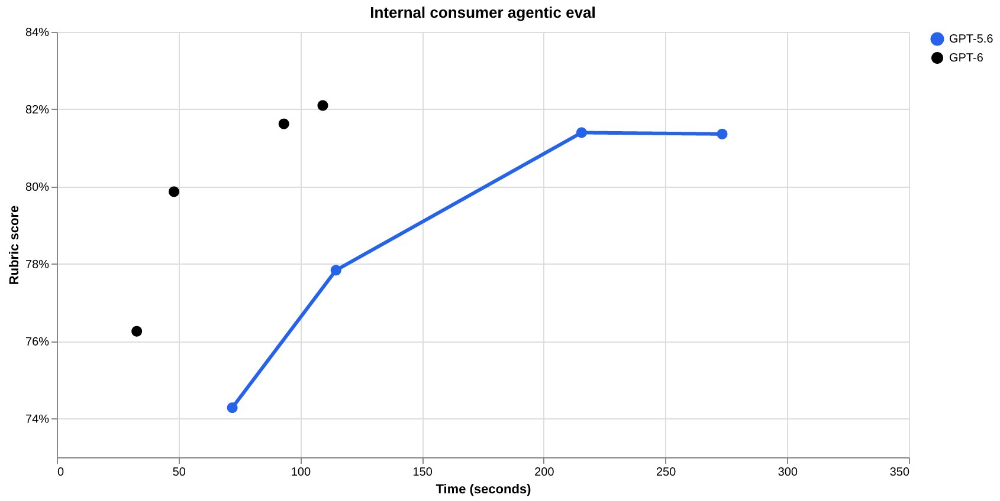
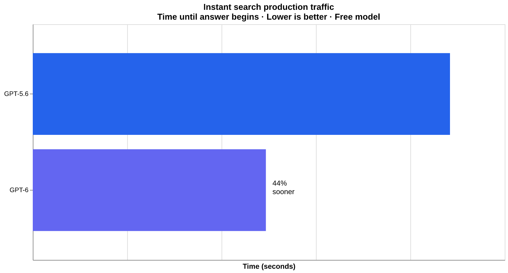
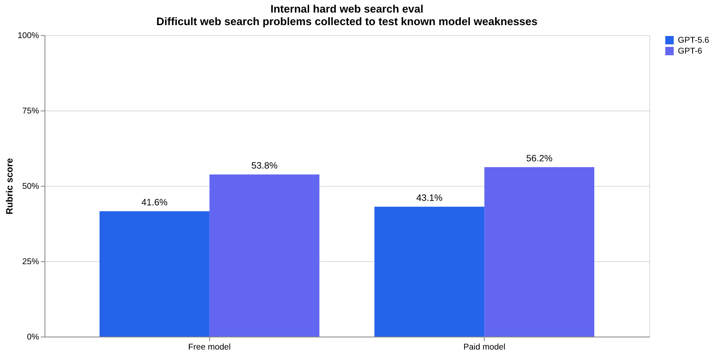

# GPT-6 and Intelligent UI for everyone：让模型自己画交互界面

每次问 ChatGPT 问题，得到的都是一大段纯文字——这大概是过去三年里所有聊天机器人的共同天花板。GPT-6 想要打破它：OpenAI 这次把 GPT-6 带给了每周使用 ChatGPT 的超 12 亿用户，核心新能力叫 **Intelligent UI**，让模型根据问题自己决定"该不该画个图、做个按钮、生成一个小工具"，而不只是写字。更关键的是速度：需要联网搜索时，GPT-6 Instant 平均比 GPT-5.6 Instant 提前 **44%** 开始回答（2.47 秒 vs 4.42 秒）；在高难度搜索评测中，正确命中问题关键点的比例从 41.6% 提升到 53.8%（免费档模型）。这篇文章就来拆解 GPT-6 这次更新的三个核心看点：会画界面的 Intelligent UI、边想边答的生成方式，以及配套的安全与部署策略。

> 图解：GPT-6 的 Intelligent UI 官方示意。与传统的纯文本对话不同，回答中可以内嵌图表、可点击按钮、表单甚至可交互的小工具，由模型根据问题类型自行决定呈现方式。

## 提出问题：聊天框装不下所有答案

纯文本对话这个形态，本质上是用一种格式硬套所有问题。

对比两款产品，文字罗列不如并排展示；学一个复杂概念，干读段落不如拖一拖滑块看变化；想算一笔账，看一段计算过程不如直接给你一个能用的计算器。

OpenAI 的判断是：**答案的"格式"本身应该是模型决策的一部分**。这正是 Intelligent UI 要解决的核心问题——让模型针对每个问题选择最有用的界面，而不是把所有回答都塞进同一个聊天模板里。

## Intelligent UI：回答从"写字"变成"搭界面"

GPT-6 被训练成用 **文本、视觉元素和交互组件** 组合出回答，并根据问题决定这些部分如何拼装。回答里可以出现图形、可点按的按钮、表单、图表，以及可以直接在对话中使用的交互体验。

具体来说，官方给了三类典型场景：

- **日常问题更视觉化**：周日烤肉的时间安排可以放在菜谱旁边，自驾游的停靠点可以直接画在地图上，并标注哪里值得绕路。
- **复杂主题更好学**：可视化的交互解释让你能改变输入看结果、一步步推演问题，而不是被动地读完一段解释。
- **随口一句话生成工具**：比如一个探索储蓄如何增长的计算器、一个聚餐账单分摊器，甚至一个可以在对话里直接玩的小游戏。

笔者认为这个方向的野心在于：它把 LLM 的输出空间从"文本 Token 流"扩展成了"界面流"。模型不再只是内容生成器，还成了临时的 UI 设计师——这与此前各种"AI 生成前端代码"的思路不同，因为界面是直接流式渲染在对话里的，用户无感知、零等待部署。

### 它是怎么实现的

这背后是两件工程+训练的配合：

- **原生可流式组件库 + 编译器**。OpenAI 构建了一套原生的、可流式渲染的组件库，配套一个编译器，在模型生成的同时处理界面。组件库保证每个回答有一致的设计基础，编译器则让界面 **随生成逐步出现**，不用等整个回答写完。
- **扩展训练方法**。训练目标里加入了界面质量这一维：对模型生成的界面按清晰度、有用性、完整性进行评估。GPT-6 由此学会了如何使用组件库、如何组织信息、什么时候该用交互、以及——同样重要的——**什么时候纯文本就是最好的回答**。

这个设计的聪明之处在于约束与自由的平衡：组件库是"栅栏"，保证界面不会跑偏出设计语言；模型在栅栏内自由组合，保证了灵活性。这与 React 生态里"设计系统 + 自由组合"的思路一脉相承，只不过组合者从程序员换成了模型。

官方也坦承，模型的"设计判断力"还有提升空间，但方向已经明确：**不再把每个问题塞进同一种对话格式，而是让 UI、数据和动作组合出全新的信息交互方式**。

## Frontier Intelligence：边想边答，速度和质量同时拿下

解决了"回答长什么样"之后，下一个问题是"回答什么时候到"。

推理模型（Reasoning Model）时代有个经典矛盾：想得越深，答案越好，但用户得干等模型"思考"完才能看到第一个字。GPT-6 的解法是 **交错式生成（interleave thinking with answering）** ——边思考边输出：

- 训练时显式把 **用户等待时间** 纳入考量，让模型基于截至当前的知识和发现，渐进式地组织答案。
- 完整答案被拆成多个部分响应逐步构建，每一段都补充有用信息、不加注水内容，同时保证整体连贯性和事实性与"一口气写完"的答案相当。

打个比方：过去的推理模型像一位必须打完整篇腹稿才开口的演讲者，GPT-6 则像一个边查资料边向你汇报进展的分析师——你更早看到阶段性结论，而最终成稿质量不打折。

### 内部评测数据

> 图解：内部消费级 Agent 任务评测。横轴是 **开始回答的时间（秒，越低越好）**，纵轴是 **Rubric 评分（越高越好）**，两条曲线分别是 GPT-6 和 GPT-5.6 在 Instant、Medium、High、Extra high 四个推理档位下的表现。整张图越靠 **左上角** 越好——可以看到 GPT-6 的曲线整体位于 GPT-5.6 左上方，即同等延迟下得分更高、同等得分下响应更快。

把图中关键数据整理成表格更直观（时间为开始回答所需秒数）：

| 推理档位 | GPT-6 得分 | GPT-6 开始回答 | GPT-5.6 得分 | GPT-5.6 开始回答 |
| --- | --- | --- | --- | --- |
| Instant | 76.3% | 32.8 s | 74.3% | 72.1 s |
| Medium | 79.9% | 48.1 s | 77.8% | 114.7 s |
| High | 81.6% | 93.3 s | 81.4% | 215.6 s |
| Extra high | 82.1% | 109.3 s | 81.4% | 273.3 s |

最抓眼球的一组对比是：**GPT-6 Extra high 开始回答的时间（109.3 s）与 GPT-5.6 Medium（114.7 s）相当，得分（82.1%）却超过了 GPT-5.6 Extra high（81.4%）**。换句话说，GPT-6 用上一代中档推理的等待时间，交付了超过上一代最高档推理的质量。这正是"边想边答"训练带来的实际收益。

### 搜索场景：更快，也更准

速度提升在联网搜索场景里体现得最直接：

> 图解：Instant 搜索场景的生产环境实测（免费档模型），横轴为"开始回答所需时间（秒）"，越低越好。GPT-5.6 为 4.42 秒，GPT-6 为 2.47 秒，平均 **提前 44%** 开始回答。

快只是其一，搜得准不准同样关键。GPT-6 在"什么时候该查资料"上做了更好的决策，也能更可靠地找到支撑答案的信息：

> 图解：内部高难度网络搜索评测（专门收集用于暴露模型已知弱点的难题），纵轴为 Rubric 评分，按免费档 / 付费档分组对比。免费档：GPT-6 **53.8%** vs GPT-5.6 41.6%；付费档：GPT-6 **56.2%** vs GPT-5.6 43.1%。两组均有约 12-13 个百分点的提升，指标含义是"正确回应了用户问题关键方面"的比例。

## 安全部署：能力越强，护栏越要跟上

能力下放给 12 亿用户的同时，安全策略也同步升级。GPT-6 延续了 Astra 模型的多项安全进展，要点如下：

- **抗绕过能力增强**：基于真实使用中的教训更新安全训练，强化对网络攻击、生物威胁、暴力等高风险滥用的防护；在对抗测试中，对 **跨多轮自适应演化的攻击** 表现出更强的抵抗力。
- **更少误伤**：在高风险场景中安全回应的同时，避免对无害请求的不必要拒绝——包括利用对话历史和上下文识别"单条 prompt 看不出来"的风险。
- **诚实性对齐**：训练全程跑对齐评估（诚实度、对安全限制的响应），GPT-6 在 **识别并沟通自身能力边界** 上更进一步——缺信息、缺工具时会更明确地承认，而不是硬答。

这部分没有给出具体数字，更详细的结果在随发布公开的 System Card 中。对普通用户来说，最可感的变化大概是"该拒的拒得更准，不该拒的不再乱拒"。

## 可用性：今天付费档，明天全量

- **今天起**：GPT-6（含 Intelligent UI）面向 ChatGPT Plus、Pro、Business、Enterprise 档在 Chat 标签页全球推送；Enterprise 实际可用性取决于企业管理员设置。
- **明天起**：推送范围扩大到 Free 和 Go 档。
- **模型分工**：付费档由 **GPT-6 Sol** 驱动，免费/Go 档由 **GPT-6 Luna** 驱动，两者均针对日常对话调校。
- **不受影响**：本次更新只涉及 Chat 体验，驱动 Work 和 Codex 的模型不变。

## 结语：从"人适应软件"到"软件适应人"

- **Intelligent UI** 让 GPT-6 的回答从纯文本升级为"文本 + 图形 + 交互组件"的自由组合，模型自己决定每个问题最适合的呈现形式。
- 实现上靠 **可流式组件库 + 实时编译器** 保证速度与一致性，靠在训练中引入界面质量评估来学会"何时该画、何时只写"。
- **边想边答** 的交错生成让 GPT-6 Extra high 用 GPT-5.6 Medium 的等待时间，交出超过 GPT-5.6 Extra high 的得分（82.1% vs 81.4%）。
- 搜索场景开始回答时间平均提前 44%（2.47 s vs 4.42 s），高难度搜索评测正确率提升约 12-13 个百分点。
- 安全上重点强化了多轮对抗攻击的抵抗力与能力边界的诚实表达，免费档明天起即可体验。

几十年来，一直是人去学习如何使用软件、适应那些为特定任务设计的固定界面。GPT-6 押注的是一个相反的愿景：**描述你想完成的事，让软件围绕它来构建体验**。Intelligent UI 只是这个方向的第一步——模型的"设计品味"能进化到什么程度，才是真正值得观察的下一步。

> 本文参考自 [GPT-6 and Intelligent UI for everyone](https://openai.com/index/gpt-6-for-everyone)