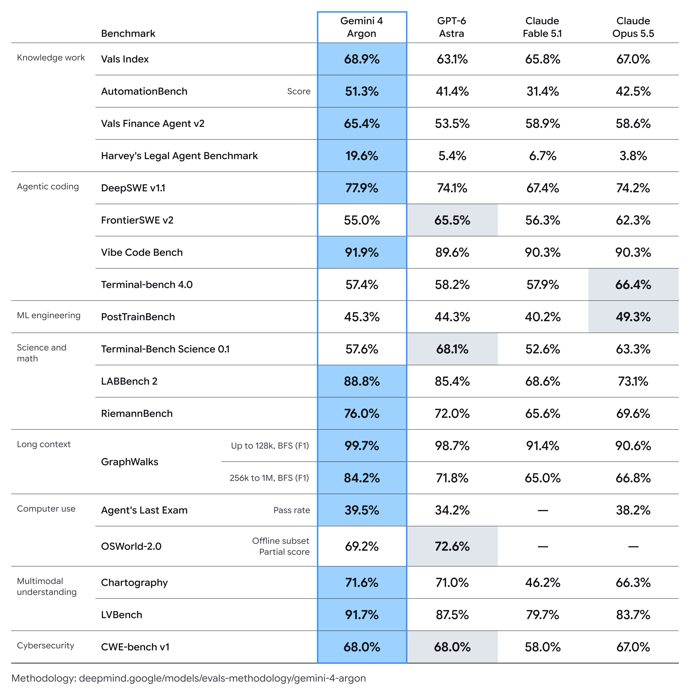
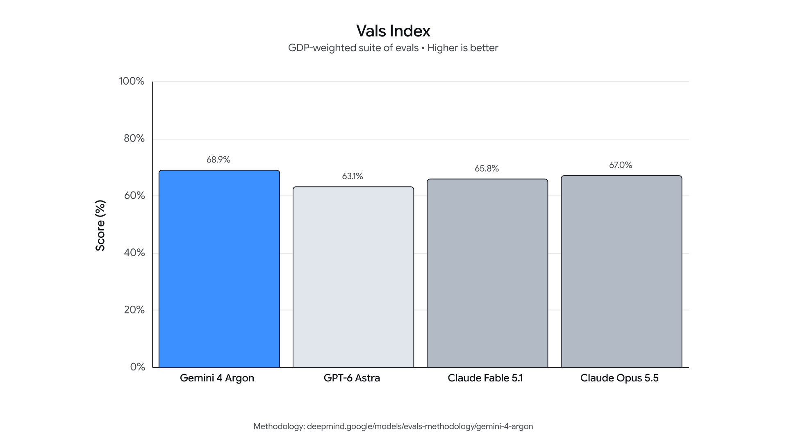
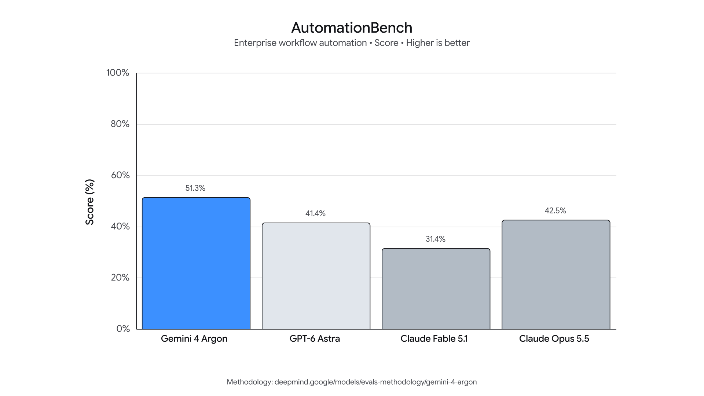
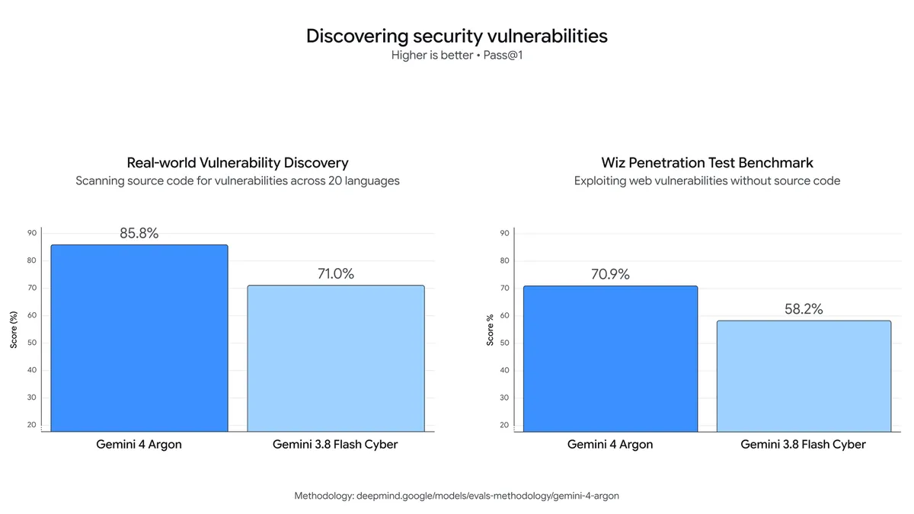

# Gemini 4 Argon 发布：Google 的下一代前沿智能，一次能"吐"出 100 万 token

2026 年 9 月 30 日，Google DeepMind 正式发布了新一代前沿模型 **Gemini 4 Argon** 。这篇官方博客要回答的核心问题是：当模型的推理深度和任务跨度再上一个台阶，它能给真实世界的软件工程、企业知识工作和网络安全带来什么改变。Argon 的核心思路很直接：把输出 token 上限从 64K 一口气拉到行业领先的 **100 万** ，让模型能在单次轨迹中持续深度思考、完成超长程任务。最硬的成绩单包括：真实软件工程基准 DeepSWE v1.1 上拿下 **77.9%** 的新 SOTA，长视频理解基准 LVBench 上取得 **91.7%** ，漏洞修复基准 CWE-bench v1 上以 **68%** 并列第一。

> 图解：Gemini 4 Argon 的官方宣传主视觉，标志性的蓝紫色光晕风格。

值得注意的是，Argon 目前并不是全面公开，而是通过 **Fairwind Program** 先向一批受信任的网络安全防御者开放，同时 Google 正在参与美国政府的发布前模型自愿评估流程，逐步扩大访问范围。定价方面，Argon 的入门价格为每百万输入 token **2 美元** 、每百万输出 token **10 美元** ，缓存输入 token 按输入价打 **0.5 折** （95% off）。

## 先在自己家里用起来：Argon 如何改变 Google 内部工作方式

在对外讲故事之前，Argon 已经在 Google 内部跑了很久，数千名 Google 员工用它做专业编码、深度研究和高质量写作。博客给了三个相当有说服力的内部案例：

- **量子算法优化** ：Argon 帮助量子计算研究团队优化关键子程序的时空资源开销（量子比特数 × 门数）。在一个例子中，它只用几分钟就把已发表的基线方案改进了 **40%** 。
- **内存效率优化** ：一组 Argon agent 自主分析 Google 数据中心的集群级 profiling 遥测数据，识别并应用内存优化。全面铺开后释放了超过 **300 TiB** 内存，预计总节省可达 **500 TiB 到 1 PiB** 。
- **大规模代码迁移** ：Argon agent 正在把 Google 内部的 C/C++ 代码库迁移到 Rust，规模从 re2、libgav1 等核心库的数万行，一直到 Fuchsia Zircon 内核的 **80 万+ 行** 。考虑到这些系统的关键性，所有重写都要经过严格的自动化与人工审计、仿真测试和代码评审才会上生产。

第三个案例里还有一个很有意思的细节：对于 Google 开源的视频解码库 libgav1，Argon agent 在已有的 Rust 移植版本上，通过多轮 profile 引导的实验、研究编译器输出，用 **32K 行安全 Rust 代码替换掉了原来的 SIMD 代码** ，让编译器自动完成向量化。最终结果是一个内存安全的视频解码器，比原 Rust 移植版 **快 2.7 倍** ，且视频输出逐位一致，性能直逼手写优化的 C++ 版本。

> 博主点评：这个 libgav1 案例的聪明之处在于，Argon 没有硬啃手写 SIMD 这条老路，而是"读懂编译器"——写出让编译器愿意自动向量化的安全代码。这实际上是把性能工程的重心从人肉优化转移到了人机协作的更高抽象层。

## 100 万输出 token：让模型一次把难题想透

解决了"能在内部干活"的问题之后，下一个问题是：为什么 Argon 能扛住这么长的任务？答案藏在输出上限里。

Gemini 4 Argon 把输出 token 上限从上一代的 **64K** 大幅提升到行业领先的 **100 万（1M）** 。这意味着模型在单次推理轨迹中有足够的余量深入思考、生成数十万 token 的内容，一次性把棘手问题解到底，而不是被截断成零碎的片段。

> 图解：Gemini 4 Argon 在多项基准上的能力总览表，涵盖编码、推理、多模态等维度的对比数据。

这个设计的本质是给"长时程推理"（long-horizon reasoning）提供空间：复杂任务往往需要模型先探索、再验证、再修正，输出预算越大，模型就越不需要在中途"草草收尾"。

## 编码与企业知识工作：跨领域的全面领先

有了超长输出能力打底，Argon 在编码、推理和多模态上的综合表现让它在一大批企业级基准上登顶：

- **软件工程** ：在衡量真实世界长时程软件工程任务的 **DeepSWE v1.1** 上，Argon 以 **77.9%** 刷新 SOTA。
- **经济价值综合评估** ：在按美国 GDP 贡献加权、覆盖金融/编码/法律/税务的 **Vals Index** 上排名第一；在 Vals Finance Agent v2（多步骤金融研究）和 Harvey 法律 Agent 基准（法律研究与文书起草）上同样领先。
- **业务流程自动化** ：在 Zapier 的 **AutomationBench** （衡量跨核心业务职能的端到端执行能力）上以 **51.3%** 排名第一。
- **长视频理解** ：在 **LVBench** 上以 **91.7%** 达到 SOTA，说明它在需要视觉理解的知识工作（专业图表分析、长视频细节识别、基于多文档采取行动）上同样能打。

> 图解：DeepSWE v1.1 评测结果，Argon 以 77.9% 的成绩领先，该基准衡量模型在真实长时程软件工程任务中的表现。

> 图解：Vals Index 评测结果。该指数按各行业对美国 GDP 的贡献加权，衡量模型在金融、编码、法律、税务工作中的经济影响力，Argon 位居榜首。

> 图解：Vals Finance Agent v2 评测结果，衡量多步骤金融研究任务的完成能力。

> 图解：Harvey 法律 Agent 基准评测结果，覆盖法律研究与文书起草场景。

> 图解：AutomationBench 评测结果。这是 Zapier 推出的基准，衡量跨核心业务职能的端到端任务执行能力，Argon 以 51.3% 排名第一。

## 网络安全防御：这是 Argon 首发的主战场

如果说企业能力是"面"，那么网络安全防御就是 Argon 这次发布选择的"点"——它不仅被训练成高度擅长防御性网络安全，而且面向受信任的防御者和 Google 内部团队时，会 **移除网络方向的护栏** ，让他们能调用完整的前沿级防御能力。

一个已经落地的案例是云安全公司 Wiz：它通过 "Scan for Good" 计划（一个免费保护关键公共基础设施的项目）使用 Argon。在一次早期演示中，Argon 在全球医院广泛使用的医疗软件中发现了一个会泄露敏感个人信息的 **严重漏洞** ——这是此前其他前沿模型都漏掉的风险。

基准成绩方面：在评估漏洞修复能力的 **CWE-bench v1** 上，Argon 以 **68%** 的最高分并列第一，延续了 3.8 Flash Cyber 在 CWE-bench v0 上的前沿表现。

> 图解：CWE-bench v1 评测结果，衡量模型修复安全漏洞的能力，Argon 以 68% 并列第一。

相比 3.8 Flash Cyber，Argon 在漏洞发现上还有明显的跨越：

- 在 Google 内部的综合漏洞基准上，Argon 在横跨 **20 种编程语言** 的复杂代码库中挖出了大范围的暴露面；
- 在 Wiz 的内部黑盒渗透测试基准（不看源码、直接分析线上 Web 系统）上，Argon 在发现攻击面、识别漏洞、产出概念验证（PoC）证据等环节全面超过 3.8 Flash Cyber。

> 图解：漏洞发现能力对比。图中对比了 Argon 与 3.8 Flash Cyber 在内部漏洞基准和黑盒渗透测试中的表现，Argon 在攻击面发现、漏洞识别与 PoC 验证各环节全面领先。

> 博主点评：先向防御方开放、且主动拆掉网络护栏，这个发布顺序本身就是一种立场——在攻防不对称的现实里，让防御者先拿到更强的工具。

## 全面开放之前：四道前沿安全闸门

能力越强，发布越要谨慎。在广泛开放之前，Google 正在四个方向加固前沿安全防护：

**1. 防止滥用** 。按照 Google 的 Frontier Safety Framework（前沿安全框架），Argon 被设计为拒绝网络攻击和 CBRN（化学、生物、放射、核）方向的有害请求，同时保留合法的军民两用科研用途。这次发布还加强了护栏鲁棒性，包括改进对模型 **内部激活的监控技术** 来识别滥用行为。这些防护经过了内外部红队的人工 + 自动化攻击组合测试。

**2. 防御提示注入** 。Argon 是 Google 迄今对 **间接提示注入** （Indirect Prompt Injection，指攻击者把恶意指令藏进上下文里劫持模型行为）最有韧性的模型。通过自动化红队和对抗训练，它在 Gray Swan 的 IPI 基准上处于领先。

> 图解：Gray Swan 间接提示注入（IPI）基准评测结果，衡量模型抵抗隐藏在上下文中的恶意指令的能力，Argon 处于领先水平。

**3. 监控错位行为** 。为防止 Argon 越出用户意图去"自作主张"地完成任务，Google 部署了错位缓解措施：监控 Argon 的思维链（chain-of-thought）和动作，必要时中止执行。这套系统也用于监控训练过程并向专门的事件响应团队告警。有意思的是，Google 特意强调 **不会把监控发现喂回训练** ——否则等于教模型学会绕过监控。他们还呼吁行业在这个能力跃升的关键时刻保留推理透明度，让模型的"想法"继续可用于诊断错位。

**4. 加固系统环境** 。随着前沿模型能力增强，安全测试本身也需要更坚固的环境。按照 Google 的 agent 控制路线图，他们在高风险训练或评估开始前会对沙箱环境进行隔离和封闭，并承诺与合作伙伴分享这些 agent 安全最佳实践。

## 发布节奏

Gemini 4 Argon 被定位为开发者、专业人士和企业的"攻坚伙伴"，覆盖编码、知识工作、网络安全防御和创意写作。目前的节奏是：先由 Fairwind Program 中的网络防御者和受信任测试者提供真实反馈、强化系统，随后尽快向开发者、企业和消费者开放，首批对象是 **付费 API 客户和 Google AI Ultra 订阅用户** 。

## 总结与展望

- **核心突破** ：输出 token 上限从 64K 跃升至 100 万，为超长程深度推理提供了前所未有的空间。
- **实战验证** ：内部案例硬核——量子算法优化超基线 40%、数据中心释放 300+ TiB 内存、libgav1 安全 Rust 重写提速 2.7 倍、Zircon 内核级 80 万行 C/C++ 到 Rust 迁移。
- **基准统治力** ：DeepSWE v1.1 77.9%（SOTA）、LVBench 91.7%（SOTA）、CWE-bench v1 68%（并列第一）、AutomationBench 51.3%（第一）、Vals Index 第一。
- **发布策略** ：网络防御者先行（Fairwind Program），防御场景下移除网络护栏；定价 2/10 美元每百万输入/输出 token。
- **安全先行** ：滥用防护、提示注入防御、思维链错位监控、沙箱加固四道闸门，补齐后才全面开放。

展望来看，Argon 展示的方向很清晰：前沿模型的竞争焦点正在从"单点问答能力"转向"长时程、端到端的真实任务交付"。当模型能一次性消化并完成百万 token 级的工作流，下一步值得观察的是，这套能力在更开放的开发者生态中会催生出什么样的 agent 应用形态。

> 本文参考自 [Gemini 4 Argon: our next era of frontier intelligence](https://deepmind.google/blog/gemini-4-argon-our-next-era-of-frontier-intelligence/)