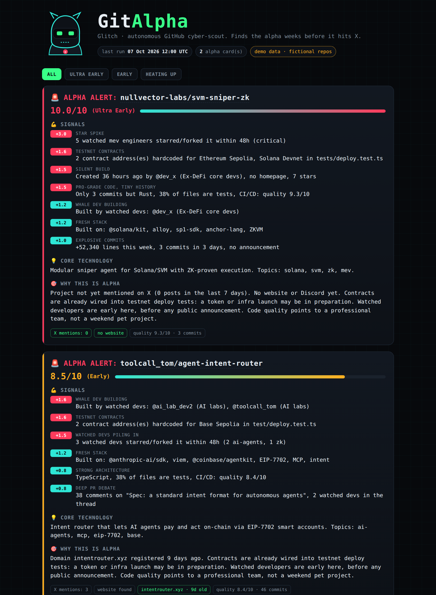

# gitalpha：盯住聪明开发者的 GitHub 早期信号雷达

想比别人更早几周发现下一个爆发的 Web3/AI 项目，靠刷 star 排行榜和 trending 榜单注定慢半拍——等项目上了榜，alpha 早没了。 **gitalpha** 换了一个思路：不盯仓库，盯人。它内置一个叫 **Glitch** 的自动扫描 Agent，持续读取你信任的一批开发者（AI 实验室、MEV 研究员、ZK 开发者、协议核心工程师）的公开 GitHub 动态，找出他们悄悄围拢过去的新仓库，再挖代码、查外部世界，打出一张 0-10 分的“早期信号分析卡”。整个项目 **零依赖**，Python 3.11+ 即可运行，自带离线 demo，clone 下来一条命令就能看到效果。

  

> 图解：项目的三个徽章——要求 Python 3.11 以上、第三方依赖为 0（只用标准库）、采用 MIT 开源协议。“零依赖”是这个项目最鲜明的工程取向。

## 为什么盯人比盯仓库更早

大多数 GitHub 扫描工具的逻辑是“等仓库长出来再看”：按 star 增速、按关键词、按趋势榜排序。问题是，等数据积累到能上榜的程度，信息已经公开化了。

gitalpha 的假设相反： **真正懂行的人会先于市场行动** 。一个 MEV 研究员 star 某个刚创建 36 小时的仓库，这个行为本身就是信号；如果 5 个同领域的工程师在 48 小时内先后 star/fork 同一个新项目，那就是强信号。Glitch 做的就是把这类“聪明钱式的开发者行为”从公开事件流里捞出来，再用代码层面的证据交叉验证。

笔者认为这个思路的聪明之处在于：它把“信息优势”从舆情层面（X、Discord）前移到了 **行为层面** （star、fork、commit）。写代码和点 star 是不会说谎的，比任何宣传都早。

## Glitch 的工作流程：从监听到分析卡

整个 pipeline 可以概括成四步：

1. **收集**：读取 watchlist 中开发者和组织的公开 GitHub 事件（star、fork、新建仓库、PR 讨论等）。
2. **探测**：对疑似目标仓库运行 8 个信号检测器，从社交行为、依赖、代码、节奏多个维度取证。
3. **交叉验证**：查域名注册时间、ENS 关联、X 上的讨论热度，确认它“还没被市场发现”。
4. **打分输出**：汇总成 0-10 分和分层等级，打印终端卡片，并写入 Markdown/JSON 报告。

最终产物长这样（demo 数据，仓库和人名均为虚构）：

```
🚨 ALPHA ALERT: nullvector-labs/svm-sniper-zk
Score: 10.0/10 (Ultra Early) ████████████████████ 📊

💪 Signals:
  - 5 watched mev engineers starred/forked it within 48h (critical)
  - 2 contract address(es) hardcoded for Ethereum Sepolia, Solana Devnet in tests/deploy.test.ts
  - Created 36 hours ago by @dev_x (Ex-DeFi core devs), no homepage, 7 stars
  - Only 3 commits but Rust, 38% of files are tests, CI/CD: quality 9.3/10
  - Built on: @solana/kit, alloy, sp1-sdk, anchor-lang, ZKVM
  - +52,340 lines this week, 3 commits in 3 days, no announcement

💡 Core Technology:
  Modular sniper agent for Solana/SVM with ZK-proven execution.

🎯 Why this is alpha:
  Project not yet mentioned on X (0 posts in the last 7 days). No website or Discord yet.
  Contracts are already wired into testnet deploy tests: a token or infra launch may be in preparation.
```

卡片分三段：命中的信号清单、核心技术一句话概括（可选由 Claude 生成）、以及“为什么这是 alpha”的推理。最后一段是关键——它不仅告诉你“有信号”，还解释信号的因果链：测试文件里已经写死了测试网合约地址，说明项目方可能在为发币或基础设施上线做准备。

## 八类信号：分数从哪来

信号体系是 gitalpha 的核心方法论。每个候选仓库最多可累积的信号分如下：

| 信号 | 检测方式 | 满分 |
| --- | --- | --- |
| Whale-Dev Tracker（大牛追踪） | watchlist 中的开发者（或整个公开组织）拥有或贡献了该仓库 | 2.0 |
| Silent Build（静默开发） | 被关注的开发者在个人账号下新建公开仓库：无主页、几乎没有 star | 1.5 |
| Star / Fork Spike（星标激增） | 同领域 5 名以上被关注工程师 48 小时内 star/fork 同一新仓库 = critical；任意 2 名以上 = candidate | 3.0 |
| New Libraries & Dependencies（新依赖） | 解析 package.json、Cargo.toml、pyproject.toml、requirements.txt 和 README，匹配前沿基础库和关键词（EIP-7702、zkVM、Claude/Grok agent SDK、MCP 等） | 1.2 |
| Hardcoded Contracts & Testnets（硬编码合约） | 扫描部署与测试文件（如 tests/deploy.test.ts、scripts/deploy*），查找 EVM 地址和 Solana program ID 旁的 Base / Monad / Arbitrum / Sepolia / Solana devnet 标记 | 2.0 |
| High-Quality Architecture（架构质量） | 启发式评估（语言、测试占比、CI/CD、lint 配置、文档），可选接入 Claude 做代码评审；commit 少但代码专业 = 团队作战而非业余项目 | 1.5 |
| Velocity Spike（开发提速） | 本周新增行数、近 3 天 commit 数，且无官网无公告 | 1.0 |
| PR Discussion Intensity（PR 讨论烈度） | 存在长篇技术 PR 讨论，且有被关注开发者参与辩论 | 0.8 |

这张表的设计颇有层次： **权重最高的不是 star 数，而是“谁在 star”** （3.0 分封顶）和“代码里藏着什么”（硬编码合约 2.0 分）。社交行为给出方向，代码证据给出置信度，两者相乘才构成可信的早期信号。

### 两道外部交叉验证

信号分之外，每个候选仓库还要过两关“现实世界检查”：

- **Domain & Identity Match**：从主页、package.json、README 中提取域名和 ENS 名称，通过公开 RDAP 记录查域名注册日期——刚注册的域名本身就是信号。
- **X / Social Footprint**：配置 X API token 后，统计最近 7 天提及该仓库的帖子数。0 提及 + 强代码 + 大牛开发者，会把分数推向顶端。

最终得分是信号分之和加上新鲜度与隐蔽性加成，封顶 10 分，按档位分层：

$$
\text{Score} = \min\left(10,\ \sum_{i} s_i + b_{\text{freshness}} + b_{\text{stealth}}\right)
$$

其中 $s_i$ 为各信号得分，两个 $b$ 为加成项。等级划分为： **Ultra Early ≥ 9 · Early ≥ 7.5 · Heating Up ≥ 6 · On Radar** （有信号即入雷达）。

## 上手：三条命令跑起来

解决了“怎么发现信号”之后，下一个问题是使用门槛——而这里几乎没有门槛。无需安装任何第三方包：

```bash
git clone https://github.com/<you>/gitalpha && cd gitalpha

# 1. 离线 demo：内置虚构数据，无需 token、无需联网
python -m gitalpha demo

# 2. 真实扫描
cp config.example.toml config.toml        # 填入你的 watchlist
export GITHUB_TOKEN=ghp_...               # 无 scope 的 classic token 即可
python -m gitalpha scan                   # 终端卡片 + reports/latest.md + reports/cards.json

# 分析单个仓库
python -m gitalpha inspect owner/repo
```

两个可选增强：

```bash
export ANTHROPIC_API_KEY=sk-ant-...       # Claude 评审架构并撰写 "Core Technology"
python -m gitalpha scan --llm

export X_BEARER_TOKEN=...                 # X API v2 近期帖子计数，需在 config.toml 中开启 x_mentions = true
```

也可以 `pip install .` 安装为命令行工具，之后直接 `gitalpha scan`。

## 配置 watchlist：告诉 Glitch 该信谁

所有配置集中在 `config.toml`（从 `config.example.toml` 复制）：

```toml
[[watch]]
group = "MEV researchers"
field = "mev"
users = ["github-username-1", "github-username-2"]

[[watch_orgs]]          # 自动加入某个组织的全部公开成员
org = "some-org"
field = "infra"

[spikes]
window_hours = 48
min_devs_same_field = 5
```

`field` 字段是 Star/Fork Spike 信号的关键：只有同领域开发者扎堆才触发 critical 级警报，避免被无关噪声淹没。信号阈值、前沿库清单、测试网标记、打分参数也都在这一个文件里。

## 全天候运行与 Dashboard

工具再准，跑一次也没用——信号的价值在于持续。项目内置了两条持续化路径：

**GitHub Actions 定时扫描**：`.github/workflows/scan.yml` 每 6 小时运行一次 Glitch，把新卡片提交到 `reports/` 目录。只需：

- 提交你的 `config.toml`；
- 可选配置 secrets：`SCAN_TOKEN`（提高限额的私人 token）、`ANTHROPIC_API_KEY`、`X_BEARER_TOKEN`；
- 在 Actions → glitch-scan → Run workflow 手动触发或等待定时执行。

**零构建 Dashboard**：`web/index.html` 是一个无需构建的网页看板，读取 `reports/cards.json`，无数据时回退到 demo 卡片。在仓库 Settings → Pages → deploy from branch（root）开启 GitHub Pages 后访问 `/web/` 即可。



> 图解：gitalpha 的 Web Dashboard。看板以卡片形式陈列每次扫描产出的仓库分析结果——分数、等级、命中信号一目了然，适合每天扫一眼代替刷 trending。

## 工程结构：九个小文件，各司其职

代码组织同样贯彻“零依赖、易审计”的思路，每个模块单一职责：

```
gitalpha/
  agent.py        扫描 pipeline 主流程（Glitch 本体）
  collect.py      从公开事件流采集被关注开发者的动态
  signals.py      8 个信号检测器
  crosscheck.py   域名、ENS、RDAP、X 舆情交叉验证
  llm.py          可选的 Claude 架构评审
  scoring.py      0-10 打分、分层、"why this is alpha" 生成
  card.py         终端 / Markdown / JSON 三种卡片输出
  github.py       极简 GitHub REST 客户端（缓存 + 限流）
  demo.py         离线 demo 客户端 + 虚构数据集
web/index.html    Dashboard
tests/            单元测试（python -m unittest）
```

`signals.py` 与 `scoring.py` 分离、`github.py` 自带缓存和限流，这些划分让策略调参（改信号、改权重）和数据源维护互不干扰——对想二次开发的人来说非常友好。

## 边界与伦理：什么能做，什么不做

项目在 README 中明确划了线，这部分值得原文级保留：

- **只用公开数据**：仅使用 GitHub 公开 REST API、公开 RDAP 记录和官方 X API，绝不触碰私有仓库或任何需要登录才能看到的内容。
- **不做人肉关联**：只观察你列出的公开账号及其新仓库，不会尝试把匿名账号关联到真实身份。
- **受平台能力所限的妥协**：GitHub 已不再公开 "follow" 事件，因此激增信号基于 star 和 fork 计算；封闭的 X 列表只有所有者可见，因此社交验证改用公开帖子计数。
- **遵守 API 条款**：请尊重 GitHub 的限流规则（带 token 每小时 5000 次请求）。
- **不构成投资建议**：信号本质是启发式规则。早期代码不等于承诺发币，测试网地址也不等于空投，请自行研究（DYOR）。

## 总结

- **思路反转**：不盯仓库盯人，把发现时点从“上榜之后”提前到“聪明人行动之时”。
- **八信号打分体系**：社交行为定方向、代码证据定置信度，Star/Fork Spike 权重最高（3.0 分）。
- **双重外部验证**：RDAP 查域名新旧 + X 查舆情真空，确认“尚未被发现”。
- **零依赖工程**：Python 3.11+ 标准库实现，demo 离线可跑，Actions + Pages 即可 24/7 运转。
- **边界清晰**：仅用公开数据、不做人肉关联、明示不构成投资建议。

局限也很诚实：信号全部是启发式规则，误报率取决于你 watchlist 的质量——这个工具真正的壁垒不是代码，而是你“相信谁”。对做 Web3/AI 早期研究的个人开发者来说，它提供的是一套可自建的雷达框架，而不是一台印钞机。

> 本文参考自 [GitHub - Bobersmart/gitalpha](https://github.com/Bobersmart/gitalpha)