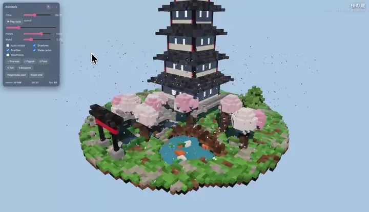

# Strata：125B 大模型跑上 12 GB 游戏显卡

本地部署的最大矛盾是：聪明的大模型需要服务器级显存，而普通人只有一张游戏显卡。开源项目 Strata 的回答是——把 1250 亿参数的 Qwen3.8-Flash-Next 塞进 12 GB 显存的 RTX 5070，短对话生成达 **94 tokens/s**（超过人眼阅读速度），读取 32K 文档达 **2650 tokens/s**，数据全程不出本机。

> 图解：Strata 在 RTX 5070 上以 128K 上下文一次提示生成的体素宝塔花园，全程仅 49 秒。

## 核心思路：不做减法做调度

不换小模型、不做毁质量的极致量化，而是利用 MoE 架构的稀疏激活特性：模型内部有 24,576 个"专家"子网络，生成每个词只调用其中 10 个。于是把"热专家"放显卡，其余放内存和 SSD——**用容量换显存，用命中率换速度**。

技术三板斧：

- **MoE 专家分层调度**：GPU 存几千个热专家，RAM 容纳全部 24,576 个，SSD 放查找表——解决"装得下"。
- **投机解码（Guess, then check）**：小模型先猜几个词，大模型一次并行验证，答案严格等价、质量零损失，提速 **1.6-1.8 倍**——解决"生成快"。
- **大块批量读取**：提示词切成最多 8192 token 的块读入，吞吐突破 1000 tokens/s，32K 文档一分钟读完——解决"吃得快"。

> 图解：GPU/RAM/SSD 三级存储调度，绝大部分计算发生在显卡上，慢速介质访问被摊薄到可忽略。

## 实测：跨过了可用性阈值

两台普通游戏 PC（RTX 5070 与 RX 9070 XT）上的读数：

- 生成 94 tokens/s（Q2_0 量化），瓶颈从机器转移到人，本地大模型从"玩具演示"变成"日常工具"。
- 读取速度是生成的 20-40 倍；显存越大越快，RTX 3090（24 GB）预计 100-140 tokens/s；AMD 平台约为同级 NVIDIA 的六成。
- 量化越狠越快（Q2_0 约 2-bit），规格越大质量越高——经典的速度-质量权衡。

## 选型与生态

硬件门槛务实：**12 GB 显存起步**、32 GB 内存（64 GB 跑全部规格）、约 80 GB SSD。按内存选版本：

- **32 GB**：Coder——砍掉一半专家的代码特化版，SWE-bench Verified 达完整模型的 **91%**，但中文能力弱。
- **64 GB**：IQ2_XS 推荐，IQ3_S 质量最高也最慢。
- **96 GB+**：可上约 4-bit 的 Unsloth UD-IQ4_XS，接近原版。

安装一键完成（Windows 双击脚本 / Linux 一行命令，或交给 AI 编程助手），提供 OpenAI / Anthropic / Responses 三套兼容 API，可被 Claude Code、Codex 等 agent 直接接管，还支持图像输入和局域网共享。

## 结语

Strata 的意义超出项目本身：当模型架构（MoE 稀疏激活）与推理引擎（分层调度 + 投机解码）协同设计，"大模型必须上云"的前提正在瓦解。局限也明确——AMD 性能仍有差距，超大规格依赖 SSD 流式读取时速度骤降——但随着消费级硬件代际提升，本地运行服务器级模型的体验只会越来越好。

> 本文参考自 [GitHub - Niko1221/Strata: Qwen3.8-Flash-Next on any consumer hardware](https://github.com/Niko1221/Strata)