# big-arrow-on-the-screen：给 AI Agent 一只会"指东西"的手指

你的 AI Agent 能重构整个 monorepo、写数据库迁移、还能解释什么是 Monad，但当它需要你点一个"允许"按钮时，它只能往你没在看的终端里打印一行字——然后干等。这个名为 **big-arrow-on-the-screen**（命令行叫 `bigarrow`）的 macOS 小工具，用一行命令把一支大箭头和一个提示牌画在屏幕最上层，替 Agent "伸出手指"。它完全不需要 macOS 绘图权限、点击可直接穿透、箭头会自己消失，配套的 104 个自动化测试和 18 项行为检查把"不抢焦点、能穿透、自动消失"这些承诺逐条钉死。项目上线两天就收获近 400 个 Star，Star 列表里不乏 Apple、NVIDIA 工程师的 GitHub 账号。


> 图解：项目徽章与 MIT 协议标识，开源可自由使用。

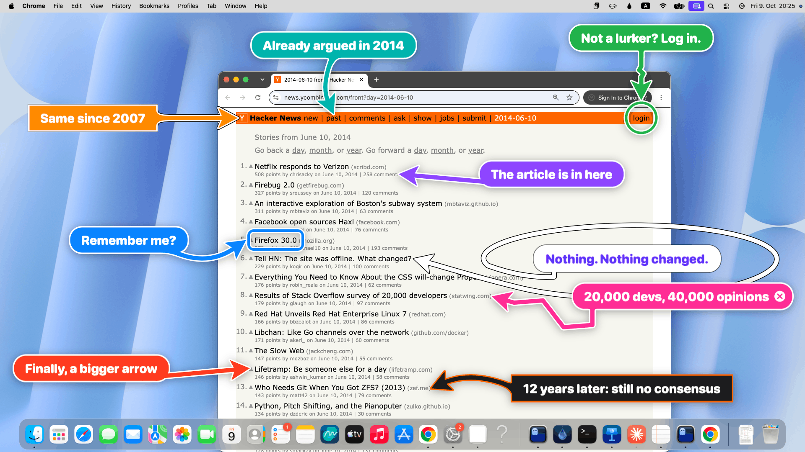

> 图解：项目主视觉——一支醒目的大箭头横跨屏幕指向目标元素，提示牌上写明"需要你点一下"，这就是它的全部形态。

## 提出问题：Agent 的最后一公里卡在人身上

随着 Claude Code、Codex 这类 coding Agent 开始在你的 Mac 上真正干活，它们迟早会遇到一步"只有人能做、或者必须人来决定"的操作：系统弹出的权限授权、OAuth 同意页、2FA 验证码、"用哪个应用打开"的确认框。

此时 Agent 的传统做法是在终端里输出一句"please click Allow in the dialog"。问题是：你可能正在别的 Space 里，可能去冲咖啡了，甚至可能根本没开那个终端窗口。任务就停在这行没人看到的文字上。

项目作者把这总结成一句很形象的话：Agent 什么都懂，但它 **没有手指**。而屏幕标注软件是给人画图用的，不是给程序从 shell 里指东西用的——作者调研了 26 款相关工具（research 目录可查），没有一个能满足"程序调用、带退出码、指完自己消失"这组要求。这就是 bigarrow 要填的空。

## 解决问题：一条 CLI，一支会自动消失的箭头

核心方案朴素到只有一句话： **在所有窗口之上画一个透明层，层里只有箭头和提示牌，其余全部点击穿透**。

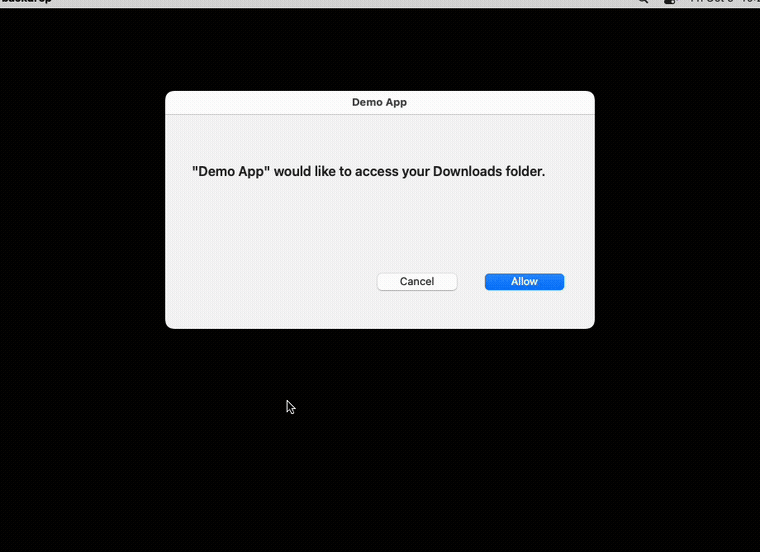

> 图解：实际效果演示。终端里执行一条 `bigarrow point` 命令后，箭头出现在系统设置窗口上方并指向目标按钮，指向过程中鼠标操作不受影响，演示结束箭头自行消失。

一条典型命令长这样：

```bash
bigarrow point --element "Allow" --app "System Settings" --text "Franz, click Allow: Ghostty may control your Mac"
```

它的工程实现有几个值得注意的决策：

- **一个透明窗口覆盖一切**：在所有显示器、所有 Space 的最上层放一个透明窗口，层级设在屏保级（screen-saver level），高于普通窗口、对话框甚至全屏应用，但它 **永远不成为焦点窗口**。
- **纯 Swift 单二进制**：没有 daemon、没有菜单栏图标、没有账号、没有遥测。作者还幽默地强调："我们检查了两次，里面没有 AI。它就是一支箭头。"
- **绘图零权限**：只在屏幕上画箭头这件事本身，不需要任何 macOS 权限（找目标的方式才需要，详见后文 FAQ）。
- **配套 Skill**：`bigarrow install-skill` 会把技能装进 Claude Code（`~/.claude/skills`）和 Codex（`~/.agents/skills`），教会 Agent 什么时候该指、怎么选目标。

笔者认为这个项目最聪明的地方在于 **自我设限**：它"永不点击、永不输入、永不截图，只指"。在一个 Agent 权限越来越大的时代，这种刻意收窄能力边界的设计反而让它可信。

## 真实场景：从妈妈的 PDF 到 14 个 Chrome 标签页

纸上谈兵不如看真实效果。下面所有截图都是真实 Mac（macOS 27）上真实应用的真实 bigarrow，由 `scripts/real-scenes.sh` 编排生成。

### 桌面与 Dock：修复"点击壁纸显示桌面"

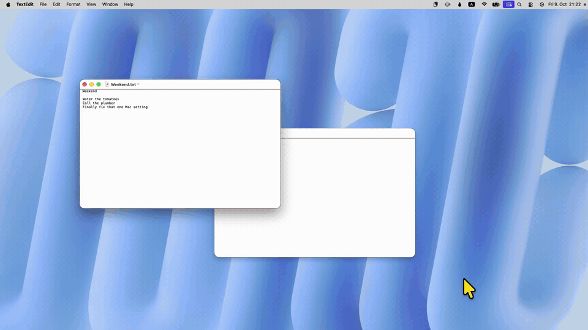

> 图解：macOS 新版中被大量用户吐槽为"Mac 更新史上最烦人的改动"——点壁纸会收起所有窗口。bigarrow 用六支箭头组成一个分步教程，把正确的操作顺序逐个指出来。

### 系统设置：授一个权限


> 图解：绿色箭头指向"辅助功能"列表里的 Terminal 开关，橙色小号 zigzag 箭头指向左下角的"+"号，提示牌写着"不在列表里？点加号，然后找到它"。两支箭头协同完成一个两步引导。

对应命令：

```bash
open "x-apple.systempreferences:com.apple.preference.security?Privacy_Accessibility"
bigarrow start --element Terminal_Toggle --app "System Settings" \
  --text "Franz, switch this on: Terminal may control your Mac" --from right --color green --close-button
bigarrow start --element Add --role button --app "System Settings" \
  --text "Not in the list? Plus. Then find it." --from bottom-right --style ring --color orange --shape zigzag --size S
```

### Keynote：三步教学

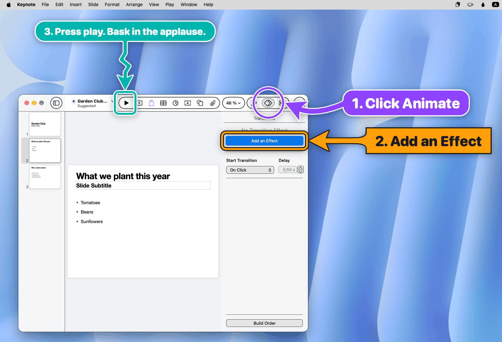

> 图解：三支箭头在 Keynote 里串起一个"添加动画"教学流程：紫色圈住 Animate 单选钮，橙色方框框住"Add an Effect"，青色小箭头指向 Play 按钮。编号提示牌让人按 1→2→3 顺序操作。

### 打印对话框：帮妈妈存 PDF

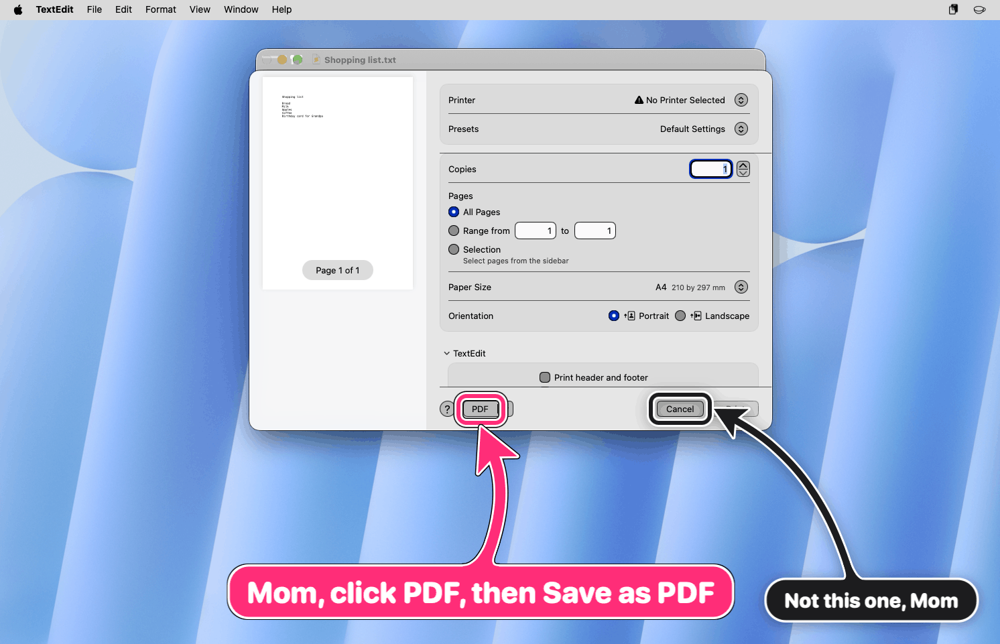

> 图解：粉色箭头指向打印对话框左下角的"PDF"按钮，提示牌写着"妈妈，点 PDF，然后选 Save as PDF"；另一支黑色小箭头指着 Cancel 说"不是这个，妈"。远程指导长辈操作的经典场景。

### Chrome：14 个标签页里指出对的那个

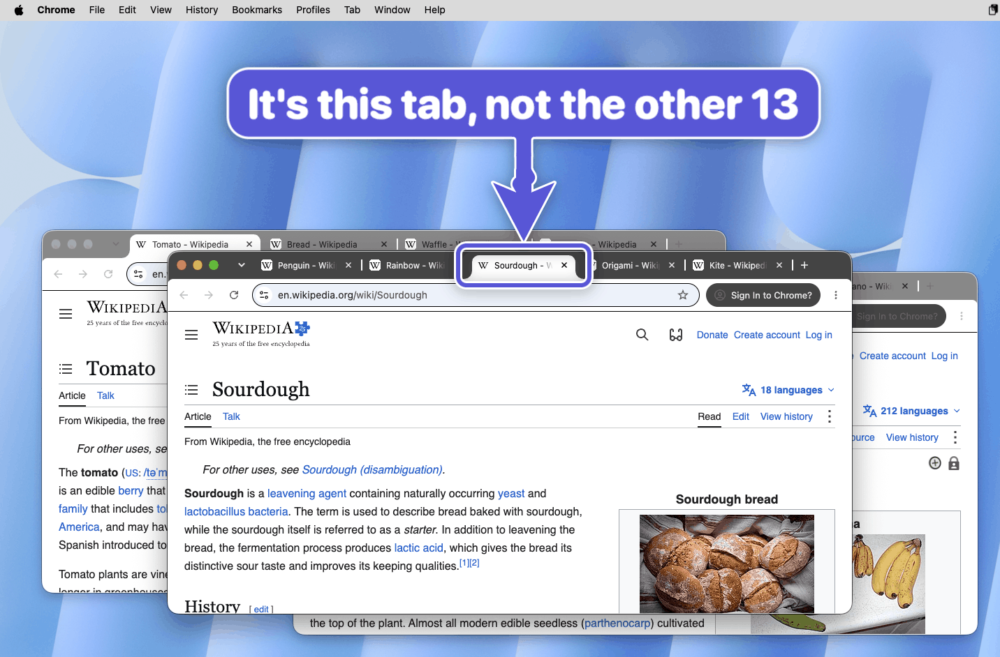

> 图解：紫色大号 zigzag 箭头从上方向下指向"Sourdough - Wikipedia"标签页，提示"It's this tab, not the other 13"。注意 `--app "Google Chrome:Sourdough"` 这种写法会 **先把该窗口和标签页切到前台**，再画箭头。

### Finder："不是那个网格图标，是这个"

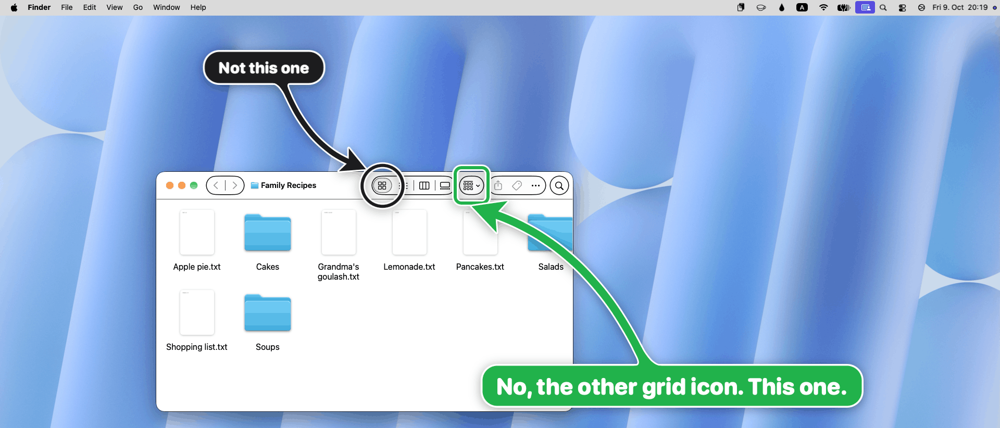

> 图解：Finder 工具栏上有两个长得像网格的按钮，一支黑色小圈先指向"icon view"说"不是这个"，绿色方框再框住 Group 按钮说"不，是另一个网格图标。这个。"口头描述永远讲不清的东西，一指就明白。

### 完整指南：一份 6 页的授权教程

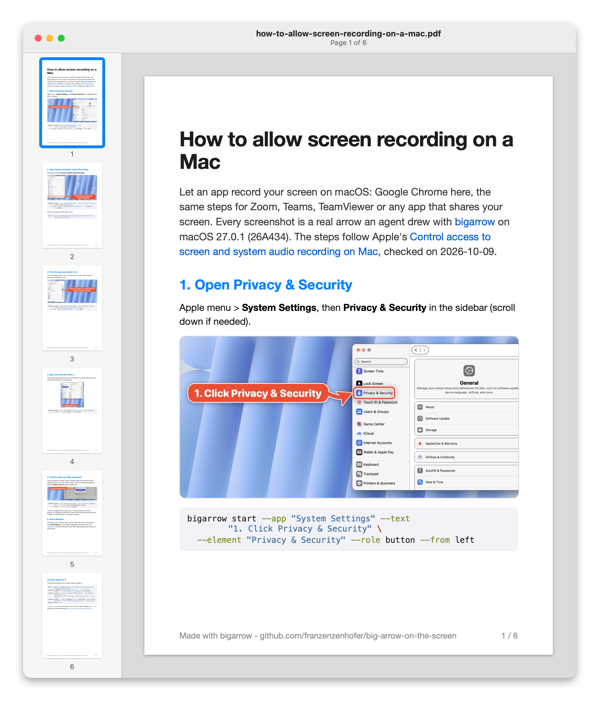

> 图解：一份完整的"如何允许屏幕录制"指南 PDF 预览，6 页中的每一张截图都是 Agent 用 bigarrow 画出来的箭头。这个指南本身就是一个 Agent 产出的文档作品。

## 复制粘贴：提示牌里藏着复制按钮

这是笔者认为设计最贴心的一个功能：提示牌文字里的 `{{value}}` 占位符会自动变成一个 **复制按钮**，点一下就进剪贴板。

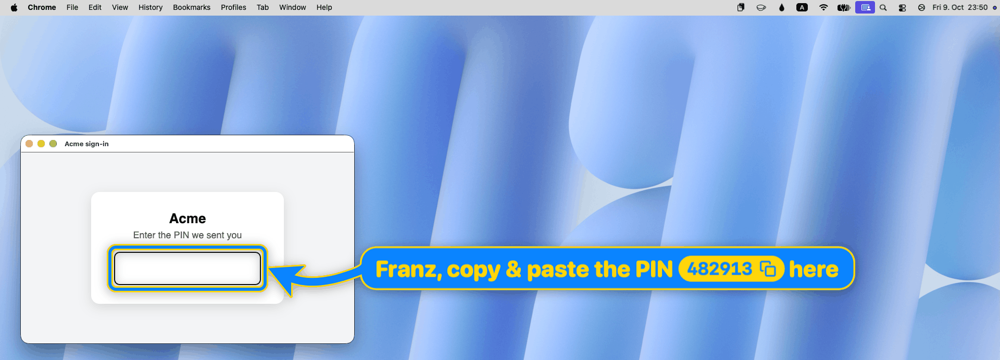

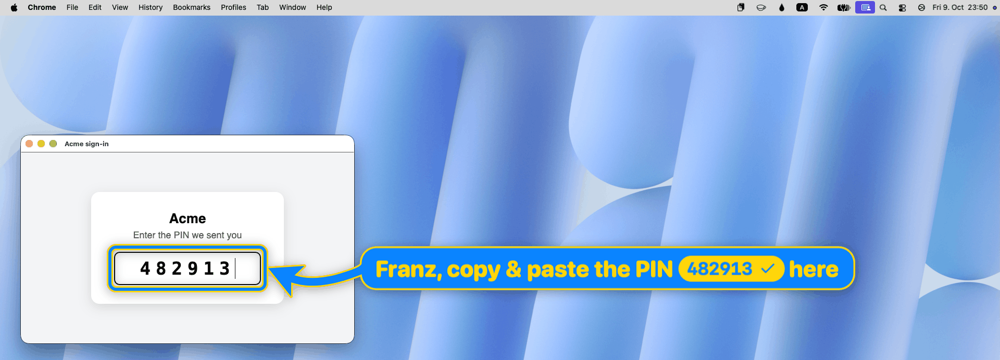

> 图解：左图是初始状态，提示牌写着"Franz, copy & paste the PIN [482913] here"，PIN 码渲染成一个可点击的复制按钮；右图是点击后的"已复制"确认状态。验证码、URL、命令行，任何需要人转手的字符串都可以这么递过去。

```bash
bigarrow start --element "PIN code" --role textfield --app "Google Chrome:Acme sign-in" --from right \
  --color blue --border-color yellow --text-color yellow --text "Franz, copy & paste the PIN {{482913}} here"
```

## 它到底用来干什么？八个真实用途

箭头这东西旧石器时代就有了，变的是： **现在在你的 Mac 上干活的是 Agent**。作者列出了它的用武之地：

- **"点一下允许"**：权限弹窗、OAuth 同意页、"用什么打开"。Agent 找得到按钮，但不能（或不该）替你按——它可以指。
- **"轮到你了"**：2FA、CAPTCHA、passkey、支付、签名。它指出来，你来做决定，它继续干活。
- **"粘贴这个"**：验证码、URL、命令，放在提示牌上配复制按钮。
- **"我需要你，而你在冲咖啡"**：`--say` 会把提示牌内容 **朗读出来**，你的 Mac 真的会把你叫回电脑前。
- **"教我怎么用"**：问 Agent 怎么在 Blender 里做某个操作，它会挨个指向每个控件——一个没有产品方的产品导览。
- **帮别人**：在父母的 Mac 上或屏幕共享时，指比"上面那个按钮，不，另一个上面"强一百倍。
- **演示与文档**：录屏时高亮，或用 `--png` 直接渲染成 PNG 写进文档。
- **调试坐标**：指向 Accessibility 或 Peekaboo 报出来的坐标亲眼验证；`--dry-run --json` 会先告诉你它会指哪。

边界同样清晰： **不是屏幕标注器、不是点击机器人、不是截图工具**。它永不点击、永不输入、永不捕获，只指。这是刻意的。

## 安装与三条核心命令

安装一行搞定（源码编译需要 Xcode 16+、macOS 14+）：

```bash
brew install franzenzenhofer/tap/bigarrow
bigarrow install-skill          # 给 Claude Code 和 Codex 装上技能
```

Agent 真正需要掌握的只有三条命令：

```bash
bigarrow point --element "Allow" --app "System Settings" --text "Franz, click Allow"   # 按元素名指
bigarrow point --at 760,500 --text "Franz, click HERE"                                 # 按坐标指
bigarrow start --window "Safari:Inbox" --text "This window" && bigarrow stop           # 指着，直到喊停
```

其中 `point` 是一次性的（指一下就撤），`start` 是持续性的（立即返回，`stop` 才消失）。

### 箭头的五种"善终"方式

"Agent 画完忘了收拾"是最常见的顾虑，作者对此做了完整的生命周期设计—— **每支箭头都会自己结束**，五种兜底机制：

| 结束方式 | 机制说明 |
| --- | --- |
| 时间限制 | `--duration 10`（`point` 默认 8 秒，`start` 默认 300 秒，0 表示不限） |
| 主动停止 | `start` 立即返回；`stop`（或 `stop --all`）移除箭头 |
| Agent 自己退出 | 箭头随画它的 Agent 进程一起结束（`CLAUDE_PID` 或 `BIGARROW_OWNER_PID`） |
| 人回了消息 | `bigarrow stop --hook` 作为 Claude Code 的 UserPromptSubmit hook，用户一提交就清掉该会话的箭头 |
| 人手动关闭 | `--close-button`（可选开启）在提示牌上加个 X |

### 目标定位与坐标系

指向目标的参数有六种：`--at X,Y`、`--rect X,Y,W,H`、`--mouse`、`--window App[:title]`、`--element Label --app App`、`--peekaboo ID --snapshot see.json`。坐标是全局左上原点的逻辑坐标，与 Accessibility 和 Peekaboo 报告的一致；`--display N` 可切换为相对某块屏幕。

三个实用细节：

- `--app App[:窗口或标签页标题]` 会 **先把目标应用、窗口或 Chrome/Safari 标签页提到前台** 再指——毕竟指着一个被你终端盖住的窗口是一种特别没用的行为。目标后来被别的窗口挡住时，箭头会 **自动隐藏**，重新可见时再回来。不想自动前置可用 `--no-raise`。
- `bigarrow elements --app X` 列出 `--element` 能匹配到的所有元素；`bigarrow doctor` 诊断权限和显示器状态。
- 每条命令都支持 `--json` 输出；退出码约定为：0 成功、2 参数错误、3 找不到目标、4 缺权限。正如作者所说："Agent 喜欢退出码，人类能容忍退出码。"

## 外观设计：在一支箭头上花"不合理"的时间

作者自嘲："它就是支箭头，所以我们在它好不好看上花了多得离谱的时间。"效果确实对得起这份偏执。

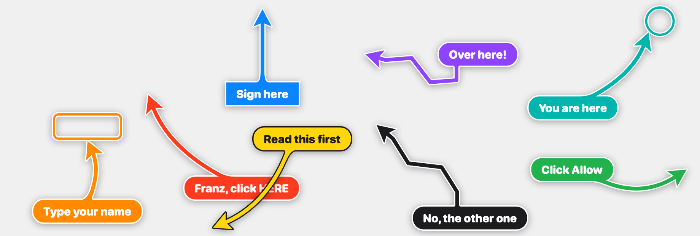

> 图解：标准形态的大箭头特写——弯曲的箭身、白色描边加投影、圆角提示牌，在任何背景上都清晰可辨。


> 图解：不同外观参数的对比展示，包括箭头（arrow）、圆环（ring）、方框（box）三种 style，以及 bend、straight、zigzag、spiral 四种 shape 的组合效果。

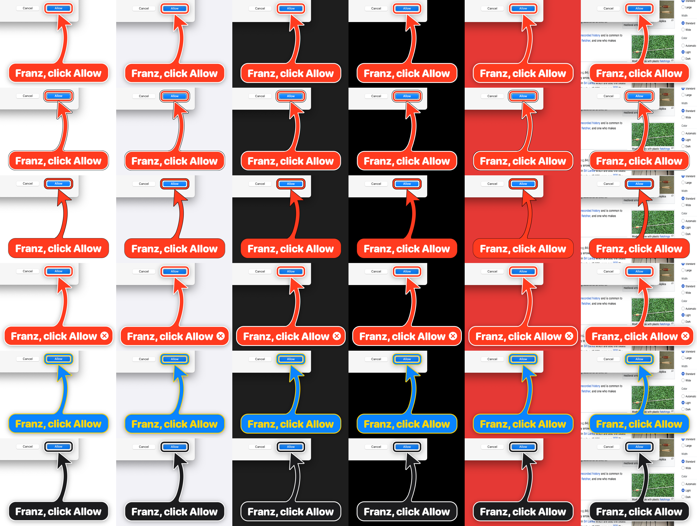

> 图解：同一组箭头分别画在纯白、macOS 灰、深色、纯黑、红色和花哨网页六种背景上的可读性测试——默认的白边加投影保证在任何底色上都不糊。

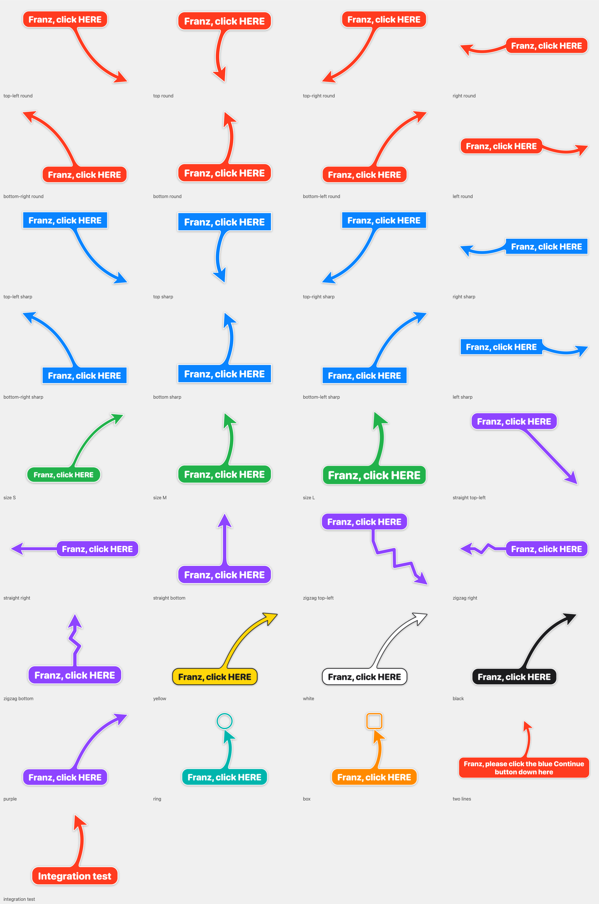

> 图解：全套外观组合的画廊。`scripts/gallery.py` 会渲染每一种参数组合，并放大检查每个"提示牌与箭身接缝处"（junctions），因为接缝处有缝隙这件事"显然是不可接受的"。

可调参数一览：

- **形状** `--shape bend|straight|zigzag|spiral`：zigzag 表示"真的很急"；spiral 会绕提示牌转一圈再指向目标，适合"绝对不能错过"的场景。
- **样式** `--style arrow|ring|box`：ring 和 box 都是描边轮廓， **目标本身始终可见**；另有 `--size S|M|L`、`--corners round|sharp`。
- **颜色** `--color red|orange|yellow|green|teal|blue|purple|pink|black|white|#RRGGBB`，边框、文字、边缘、关闭按钮颜色均可单独指定；不指定时自动选可读配色。
- **交互** `--follow` 跟随移动中的窗口或元素；`--until-click` 在目标被点击时结束；`--say` 朗读提示牌。
- **多箭头避让**：多支箭头同时存在时，各自的提示牌会自动错开，不互相遮挡。

## 创意箭头：对话框是假的，情绪是真的

下面这组"假对话框"是在干净的 CI runner 上用 `BACKDROP_ARGS=--cover scripts/funny-scenes.sh` 生成的整活场景，但每支箭头都是真的 bigarrow。

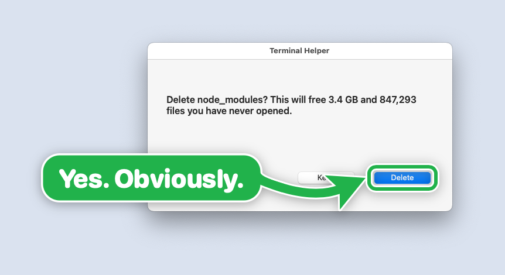

> 图解："删除 node_modules 是你这辈子最容易说 yes 的决定。"绿色箭头指向 Delete——`--color green`，因为有些决定根本不需要犹豫。

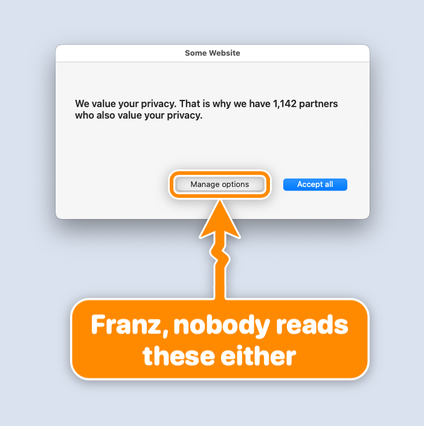

> 图解：Cookie 横幅场景，橙色 zigzag 箭头指向 Accept——`--shape zigzag --color orange`，一种"轻微紧迫感"的视觉表达。

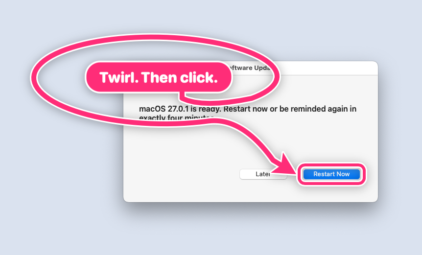

> 图解：软件更新提示，`--shape spiral` 让箭头绕提示牌转一圈再指向按钮，"荣誉巡游一圈"，仪式感拉满。

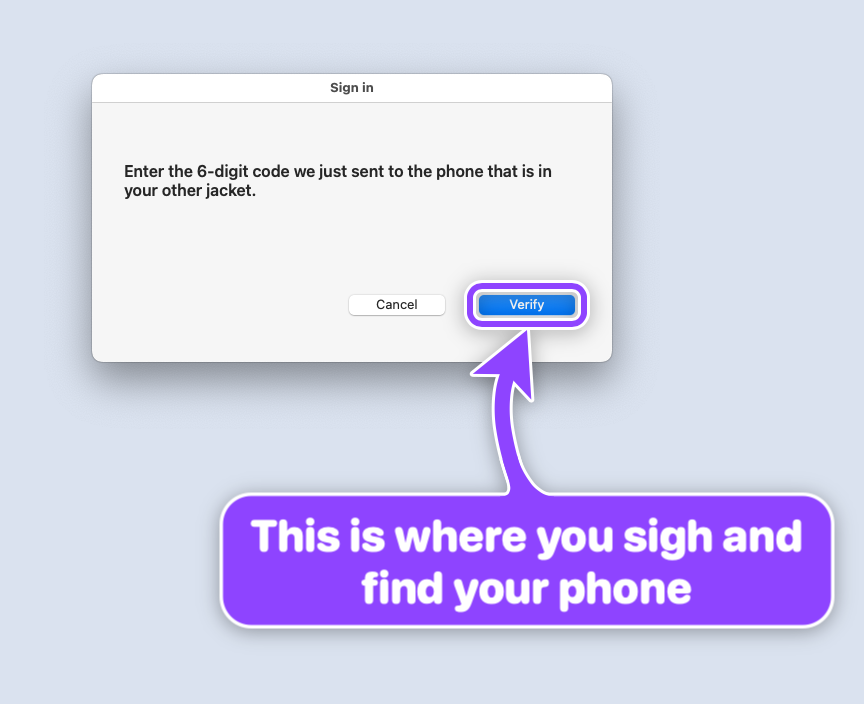

> 图解：2FA 场景，紫色箭头提醒"去找你的手机"。

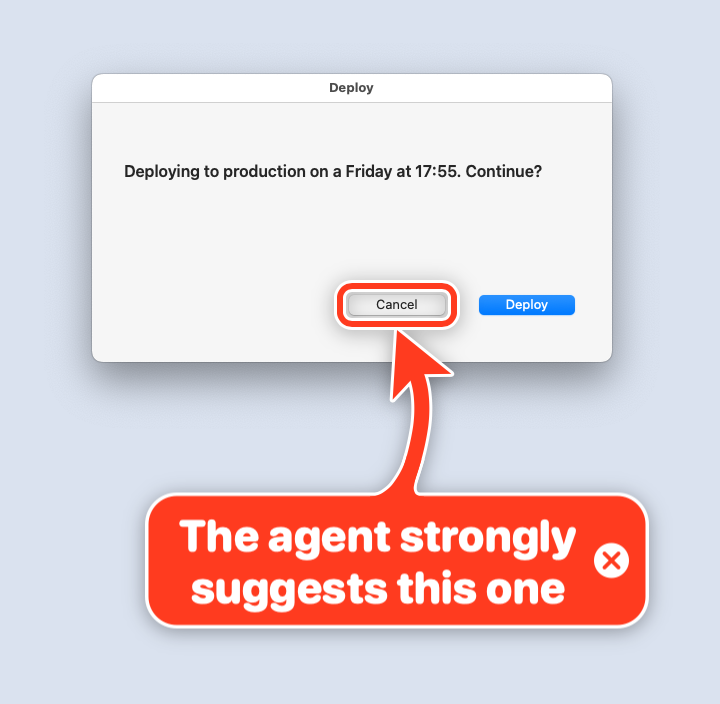

> 图解：周五下班前的部署确认，Agent 自己"投票" Cancel。`--close-button` 给提示牌加上关闭 X——因为最终决定权必须留在人手里。

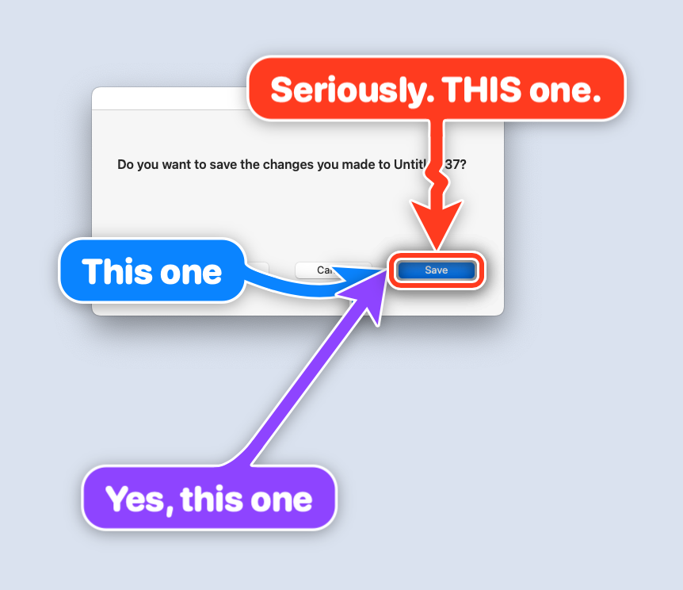

> 图解：三条 `start` 命令、一个按钮、零歧义。三支箭头从不同方向同时指向同一个保存按钮，适合强调"就是它，别犹豫"。


> 图解：macOS 权限弹窗场景，`--style box --corners sharp` 方框框住允许按钮，附带一堂 macOS 权限小课：要授权的是 Terminal，不是 bigarrow。

## 社区反响：两天近 400 Star


> 图解：GitHub Star 徽章。上线头两天收获近 400 个 Star，Star 用户的 GitHub 资料里能看到 Apple、NVIDIA、AMD、SAP、Salesforce、ServiceNow、Booking.com、Mercedes-Benz、SUSE、Oxide Computer、Posit、CoreWeave、Weights & Biases、OpenRouter、Metabase、InstaDeep、Benchling、Stainless、Under Armour 等公司，以及 Stanford、Johns Hopkins、KTH、Oak Ridge 国家实验室等学术机构。

## FAQ：那些你一定会问的问题

### 需要屏幕录制或辅助功能权限吗？

**画箭头本身：不需要。** 但"怎么找到目标"决定了要不要权限：

| 你用的方式 | 所需权限 |
| --- | --- |
| `--at`、`--rect`、`--mouse`、`--window App`、`--peekaboo`、`--app App` | 无 |
| `--element`、`elements`、`--until-click`、`--app App:title` | 辅助功能（Accessibility） |
| `--window App:title`（macOS 26 起隐藏窗口标题） | 屏幕录制，外加辅助功能用于前置窗口（用 `--no-raise` 则不需要） |

注意一个关键点：macOS 把权限授予 **启动 bigarrow 的那个应用**（Terminal、iTerm2、Ghostty、VS Code、Claude），而不是 bigarrow 自己，所以要给对应终端开权限。`bigarrow doctor` 会直接点名是哪个应用；缺权限时以退出码 4 退出，并告诉你应用名和对应的设置面板。

### 不抢焦点，凭什么在最上层？

在 macOS 上，"在最上层"和"拥有焦点"是两回事。箭头位于屏保级层级，高于窗口、对话框和全屏应用，但它永远不成为活动窗口——你打字不会被打断。作者透露这是项目里最难修的 bug：`NSApplication.run()` 会悄悄激活一个没有终端的进程，所以 bigarrow 自己泵事件循环，测试里专门检查了"最前台应用永不改变"这一条。

### 能穿透点击吗？

能，除了提示牌和箭身。点在提示牌或箭身上会 **移除箭头**（悬停时箭头会变暗作为提示）。点在目标或箭头头部附近则直接穿透给下面的应用，且不带走焦点。

### 多显示器、全屏、调度中心、多桌面？

全部支持，包括负坐标。箭在屏上时拔掉那块显示器，箭头会"礼貌地离开"。完整验证矩阵见仓库的 verification 文档。

### 一支脉动的箭头费多少 CPU？

CI runner 上实测 **1.4%**。动画由 Core Animation 在渲染服务端完成。

### `--element` 能定位网页内部的元素吗？

Electron 应用里可以；Chrome 里需要 `--force-renderer-accessibility`（或开着 VoiceOver），因为 Chrome 忽略了常规的开启请求（2026 年 10 月验证）。Chrome 自身的工具栏则一直可用。否则就退化为按页面坐标指，Skill 里有对应说明。

### Agent 会不会用它骗我？比如盖住"拒绝"按钮？

不会超出它已有的能力范围——一个能以你的身份跑 shell 命令的 Agent 本来就能干更糟的事，bigarrow 没有给它任何新权力。而且每条防护都有测试兜底：box 和 ring 是描边轮廓，目标始终可见；提示牌会避开目标（或尽量少遮挡）；点提示牌或箭身会移除箭头；每支箭头都会自己结束。Skill 还要求提示牌 **写明点击的后果**。

### 为什么是 Skill？费 token 吗？

平时只占 **182 token**——那是 Skill 的描述部分，也是 Agent 唯一始终看到的部分。完整的操作说明（1,398 token，用 Anthropic token 计数 API、Claude Opus 5.5 测得）只在 Agent 决定要指的时候才加载；面板 ID 和外观参数（再加 1,008 token）只在需要时加载。这是一个很克制的分层加载设计。

### 为什么不用现成的屏幕标注软件？

那些是给 **人在屏幕上画画** 用的，不是给 **程序从 shell 里指东西** 用的——后者需要退出码、JSON 输出、自动消失。作者先调研了 26 款工具（见仓库 research 目录），没有一个做这件事。

### 它是 AI 吗？

不是。"它是你 AI 技术栈里智力最低的部分，并且引以为豪。"

## 实验验证：怎么知道它真的好用？

这个项目没有传统意义上的"实验结果表格"，但它的验证体系值得单独说，因为每一项产品承诺都对应着可跑的测试：

- **104 个自动化测试**：覆盖几何计算、摆放位置、接缝处理、黄金图像（golden image）比对、复制按钮、录制的 window-server/Accessibility/Peekaboo 数据夹具（fixture），以及针对真实 window server 的测试（点击穿透、焦点永不移动、停止时序）。CI 跑在 macOS 15 上，另在 macOS 26 和 27 上验证通过。
- **18 项干净 runner 上的行为检查**（visual.yml）：点 X 关闭、复制按钮（剪贴板内容正确且箭头保留）、`--until-click`、`--follow`、窗口前置与 `--no-raise`、被遮挡时隐藏、Chrome 标签页切换、Agent 进程退出联动、`stop --hook`、`--say`、全屏、Stage Manager、Spaces、第二块及 2x 显示器、画到一半拔显示器、CPU 占用。
- **最有说服力的一条**：给一个全新 Agent 只发 Skill 文件和一句"show Franz where the Reload button in Chrome is"，它按元素名找到了目标并构造出了正确的命令（transcript 存档可查）——过程中还顺手发现了一个 bug，现在这个 bug 变成了一个测试。

笔者认为最后这条比前面 122 项测试都更能说明问题： **工具是为 Agent 设计的，而 Agent 在零示范的情况下一次就用对了**，这才是"Agent 友好"的终极验收标准。

## 面向 Agent 的 Skill 与工程文档

仓库的 `skill/big-arrow/`（Agent Skills 标准格式，外加给 Codex 的 `agents/openai.yaml`）教 Agent 五件事：什么时候该指、怎么选目标、提示牌上要写完整的一句话、人不在时用 `--say` 朗读、人操作完之后记得 `stop`。

工程过程也完全摊开在仓库里：`docs/plan/PLAN.md`、`docs/plan/TICKETS.md`（由 tickets.json 生成）、`docs/decisions/`、`docs/research/`、`docs/verification/`、`docs/skill-tests/` 和 CHANGELOG.md。致谢部分提到，复制与对勾图标来自 Feather（MIT），Peter Steinberger 的 Peekaboo 和 Nameplate 提供了 overlay 做法和 Skill 打包的范式，bigarrow 还能直接读 Peekaboo 的 `see --json` 作为目标来源。

## 总结

- **解决真痛点**：Agent 干到一半卡在"需要人点一下"的场景，bigarrow 用屏幕最上层的大箭头把"在哪点、点了会怎样"直接画给你看。
- **工程上极度克制**：永不点击、永不输入、永不截图；单 Swift 二进制、无 daemon、无遥测；绘图零权限。
- **生命周期完整**：时间限制、主动停止、随 Agent 进程退出、hook 清理、手动关闭，五重机制保证箭头必自己消失。
- **为 Agent 设计到底**：`--json` 输出、明确退出码、182 token 常驻的分层 Skill、104 个测试加 18 项行为检查，甚至用"新 Agent 一次用对"做验收。
- **两天近 400 Star** 的社区反响说明：当 Agent 开始真正操作你的电脑，"怎么把控制权礼貌地交还给人"会成为一个越来越重要的问题。

bigarrow 目前只支持 macOS，且只解决"指"这一件事——但它开启的方向很清晰：Agent 与人的交接界面（handoff UX），可能正是下一轮 Agent 工具链竞争里被低估的一环。

> 本文参考自 [GitHub - franzenzenhofer/big-arrow-on-the-screen: Let your AI agents paint big arrows, boxes and text on your Mac screen](https://github.com/franzenzenhofer/big-arrow-on-the-screen)