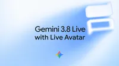

# Gemini 3.8 Live with Live Avatar 发布：让对话式 AI 拥有"实时面孔"

> 本文参考自 [Introducing Gemini 3.8 Live with Live Avatar](https://deepmind.google/blog/introducing-gemini-38-live-with-live-avatar/)

## 引言：从"会说话"到"有形象"

对话式 AI 的演进路线一直很清晰：从文本到语音，从语音到低延迟的实时语音对话（Live API），再到如今——给实时对话装上一张"会动的脸"。在上周 Gemini 3.8 Live 发布之后，Google DeepMind 紧接着推出了 **Gemini 3.8 Live with Live Avatar**，将近实时的视频生成能力与原生实时对话模型深度耦合，让 AI 第一次以"动态视觉形象"的方式参与到对话中。

这篇文章本质上是一份产品发布博文而非传统学术论文，但其背后反映的技术路线非常值得解读：**语音对话、视频生成、工具调用、多语言唇形同步** 这几条此前各自发展的技术线，正在被打包成一个端到端的"数字人对话系统"，并且直接面向企业级场景落地。

> 图解：官方发布主视觉图，浅蓝色渐变背景上呈现 "Gemini 3.8 Live with Live Avatar" 字样与 Gemini 星形 Logo，整体延续 Google DeepMind 一贯的简洁视觉风格。

## 提出问题：纯语音对话还差什么？

先来想一个问题：实时语音对话（比如 Gemini Live、各类语音 Agent）已经能做到接近人类的轮流对话（turn-taking）了，为什么还需要一张脸？

因为 **对话天然是多模态的**。人类交流时同时在听、在看、在说，还会用面部表情传递情绪和反馈。纯语音通道丢掉了大量信息：AI 看不到用户指着什么、展示什么；用户也看不到 AI 的"表情反馈"，交互的信任感和亲和力大打折扣。Live Avatar 要解决的正是这个"视觉临场感（visual presence）"的缺失问题。

它的核心做法是：把 **低延迟的流式视频生成** 与 **原生实时对话能力** 在模型层面原生耦合（natively coupling），而不是简单地在语音 Agent 外面套一个数字人渲染壳。这一点很关键——"原生耦合"意味着表情、唇形、对话节奏由同一个系统统一调度，而不是两套系统后期拼接，这是实现"精准唇形同步 + 自然表情 + 流畅轮流对话"三者同时成立的前提。

## 核心能力解析

### 更自然的多模态对话

Live Avatar 的输入侧是 **视觉 + 音频的同步处理**：它一边听用户说话，一边看摄像头画面，然后以带表情的音频和视频流作为回应。也就是说，这不仅是一个"会动的头像"，而是一个能"察言观色"的对话体——用户展示的物体、身处的环境都会进入模型的上下文。

从体验设计上看，这补齐了语音 Agent 的一大短板：过去用户想询问眼前的东西，必须先拍照上传或口头描述；现在指着物体直接问就行，交互链路被显著缩短。

### 异步工具执行：对话不中断的"后台干活"

笔者认为这是整套系统里最有工程价值的特性。传统的 Function Calling（函数调用）流程是阻塞式的：模型发起工具调用 → 等待返回 → 继续对话，期间用户只能干等，体验上就是"AI 卡住了"。

Live Avatar 支持 **Asynchronous Tool Calling（异步工具调用）**：它可以在后台触发工具调用、拉取数据，同时前台对话继续进行。官方给出的例子是酒店前台场景——数字人一边和客人闲聊确认需求，一边在后台调用系统完成入住办理，对话流完全不被打断。

为什么这个设计重要？因为在真实企业场景里，工具调用往往伴随着不可控的延迟（查数据库、调第三方 API），阻塞式设计会直接把"拟人对话"的沉浸感打回原形。异步化之后，延迟被自然的闲聊所掩盖，这是让数字人真正可用于生产环境的关键一环，也体现了 Gemini 底层推理与调度能力的深度整合。

### 面向全球规模：97 种语言的原生同步

多语言支持并不稀奇，稀奇的是 Live Avatar 的做法：**原生的多语言 speech-to-speech（语音到语音）同步**，并且唇形和表情会随语言动态适配。它可以在一次对话中途无缝切换语言，官方宣称覆盖 **97 种语言**，且切换时不会出现视频质量下降或 **visual drift（视觉漂移，即人物形象在生成过程中逐渐"变脸"的现象）**。

这里值得展开说一下技术难点：不同语言的口型模式（viseme，视觉音素）差异很大，中英混说时的唇形切换对生成模型是实打实的考验；而长视频生成中的人物一致性（identity consistency）一直是视频生成模型的老大难问题。"不引入视觉漂移"这句话背后，隐含的是模型在长时间流式生成中维持了人物身份特征的稳定，这比单点生成一张相像的图像要难得多。

### 品牌定制：从参考图生成专属数字人

除了预置的多样化 Avatar 库，企业还可以定制自己的形象：只需提供一张 **高质量参考图**，就能生成一个完全可动、可实时响应的 Avatar，同时保留参考图的相貌特征、品牌风格或角色设定。

这意味着企业的品牌 IP（吉祥物、虚拟代言人）可以低成本地"活化"为能实时对话的数字员工。需要注意的是，定制 Avatar 目前仅通过 **企业白名单（enterprise allowlisting）** 开放，Google 在这个能力上保持了谨慎的灰度策略——这也和下面要说的信任机制有关。

### 信任与透明：SynthID 水印

凡是涉及"以假乱真的人脸生成"，身份冒用和虚假信息就是绕不开的风险。Live Avatar 的所有 AI 生成输出都嵌入了 **SynthID** 水印——一种不可感知的水印技术，直接编织进音频和视频输出中，使 AI 生成内容可被检测，从而减少虚假信息传播和身份误认的风险。

从产品策略上看，"生成能力"与"可检测性"同步发布，已经成为 Google AI 产品的标准动作。配合定制 Avatar 的白名单机制，可以看出 DeepMind 在数字人这类高敏感能力上的部署思路：能力全开，但出口设卡。更完整的安全与负责任部署细节可以参考其模型卡（model card）。

## 落地情况

Gemini 3.8 Live with Live Avatar 自发布之日起即在 **Gemini Enterprise** 中可用，开发者可通过 API 文档接入。目标场景非常明确：企业客户服务、交互式产品导览、虚拟前台等需要"有亲和力的自动化交互"的场景。

## 总结与展望

回顾这次发布，Live Avatar 的信号意义大于单点功能本身：

- **技术整合趋势**：实时语音对话、流式视频生成、多语言唇形同步、异步工具调用被打包成一个原生耦合的系统，数字人正在从"CG 渲染 + 脚本驱动"的旧范式转向"端到端生成"的新范式。
- **体验的关键在细节**：异步工具执行、97 语言无漂移切换、精准唇形同步——这些不是炫技点，而是决定数字人能否从演示视频走进生产环境的工程门槛。
- **企业优先，安全同步**：能力首发在 Gemini Enterprise，配合 SynthID 水印与定制白名单，高敏感生成能力的发布正在形成"能力 + 护栏"同时上线的行业惯例。

可以预见，接下来数字人赛道的竞争焦点将不再是"脸做得像不像"，而是 **对话智能、任务执行与视觉表现三者的耦合深度**——而这恰恰是拥有全栈自研模型的厂商的主场。

> 本文参考自 [Introducing Gemini 3.8 Live with Live Avatar](https://deepmind.google/blog/introducing-gemini-38-live-with-live-avatar/)