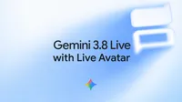

# Gemini 3.8 Live with Live Avatar 精华解读：给实时对话 AI 装上会听会说的"脸"

纯语音助手"听声不见人"，是 AI 对话体验长期缺失的一块拼图。Google 推出的 **Gemini 3.8 Live with Live Avatar**，把原生实时语音对话与低延迟视频生成耦合在同一个模型里，让 AI 拥有一张会听、会看、会说的"脸"。最亮的两个数字与能力：唇形与表情可在 **97 种语言** 间无缝切换且不损失画质；支持对话不中断的 **异步工具调用**，边聊天边干活。

## 关键差异：不是拼装，是"一个大脑"

- 常见方案是"语音模型 + 数字人渲染管线"两条流水线，唇形对齐、打断响应都要额外工程去缝合。
- Live Avatar 把视觉和音频输入放在同一模型中**同时处理**，统一生成语音与视频输出。对话轮换（turn-taking）、被打断时的表情收敛，都由模型自己决定。
- 对企业意味着：虚拟客服、交互式产品演示可以从"语音机器人"升级为"有形象、有表情的虚拟员工"。

## 三项核心能力

**1. 多模态输入，表情化输出**

- 同时接收视觉与音频输入——不只听你说话，还能"看"你展示的东西。
- 输入输出对称：输出端有了视觉通道，输入端也开放视觉，支撑"交互式导览"场景——用户把摄像头对准设备，虚拟形象一边看一边讲解，而非盲人摸象式纯语音描述。

**2. 异步工具调用：边干活边聊天**

- 传统 Function Calling 是同步的：模型调工具时对话卡住，用户面对尴尬的沉默。
- Live Avatar 的**异步工具执行**让工具调用在后台触发、数据在后台拉取，对话本身继续推进。
- 官方示例：酒店前台虚拟形象一边与客人保持对话，一边在后台完成入住办理。模型要自己决定何时发起调用、等待期间说什么来填充对话，而不是播一句"请稍等"。这是从"演示型数字人"走向"干活型数字人"的关键一步。

**3. 97 种语言的唇形同步**

- 多语言难点不在语音合成，而在**视觉一致性**：口型差异大，唇形不适配就会"出戏"甚至面部漂移。
- 原生**多语言语音到语音同步**：对话中途无缝切换语言，覆盖 97 种语言，不降低视频保真度、不引入视觉漂移。一个形象即可服务全球市场，无需逐语言适配。

## 形象定制与安全设计

- **品牌定制**：除官方预设形象库外，企业只需提供一张**高质量参考图**，即可生成完全可动画、可实时响应的专属形象，保留人物特征与品牌风格。但该能力目前仅通过**企业白名单**开放——从照片生成会说话的真人形象，是深度伪造风险最高的能力之一。
- **SynthID 水印**：所有生成的音视频默认嵌入不可感知、可被检测器识别的数字水印，标记"AI 生成内容"，不可关闭。配合白名单审核，体现了 Google 的策略：能力放开，但每一环都留溯源与管控的钩子。更多细节见官方 model card。

## 如何上手

该功能现已上线 **Gemini Enterprise**，可通过官方 API 文档接入。注意其定位是企业级产品，而非面向个人开发者的公开 API。

## 总结

- **一个大脑**：实时语音对话与低延迟视频生成原生耦合，非拼装方案。
- **看得见的交互**：视觉、音频同时输入，表情化音视频输出，对话轮换与打断处理更自然。
- **边聊边干活**：异步工具调用，后台任务执行期间对话不中断。
- **一张脸说 97 种语言**：唇形与表情跨语言无缝适配，无画质损失与视觉漂移。
- **可控可溯源**：参考图定制品牌形象（企业白名单），输出默认嵌入 SynthID 水印。

从语音到"语音 + 形象"，实时对话 AI 的交互带宽翻了一倍。接下来值得观察的是：当数字人真正进入客服、导览等生产场景，表情和唇形的"恐怖谷"效应会不会成为新的体验瓶颈。

> 本文参考自 [Introducing Gemini 3.8 Live with Live Avatar](https://deepmind.google/blog/introducing-gemini-38-live-with-live-avatar/)