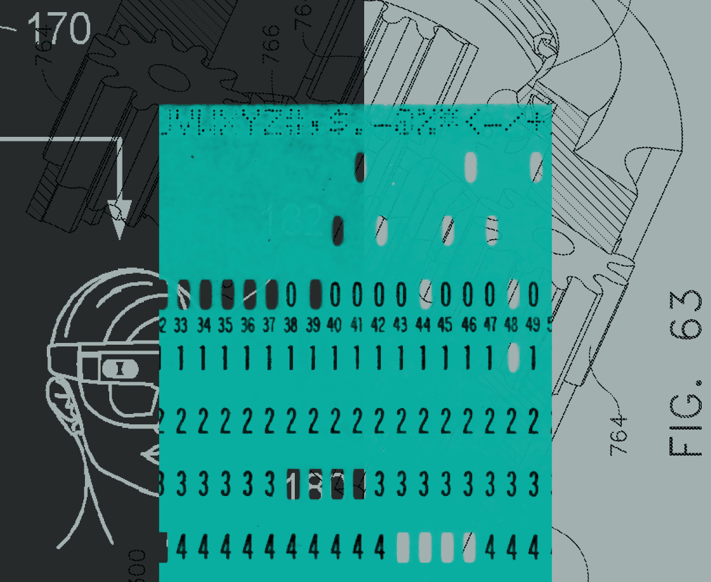
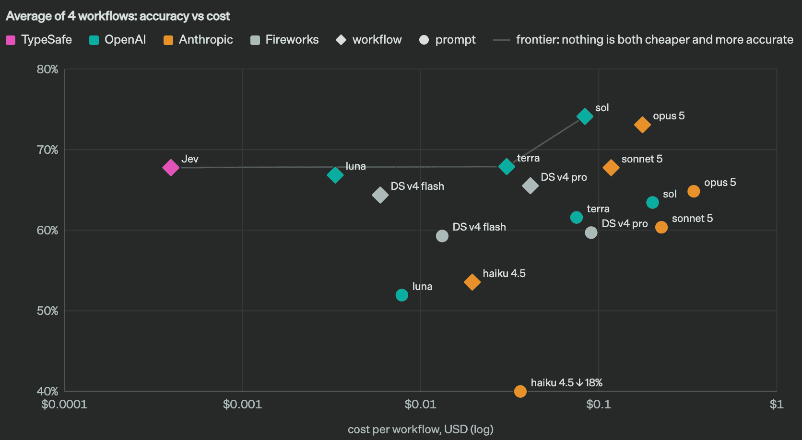
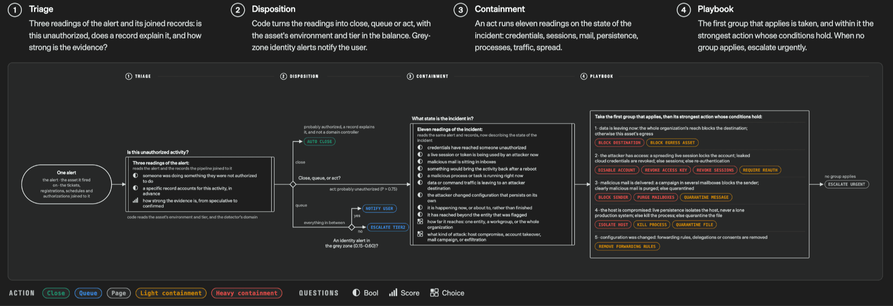

# 快 100 倍、便宜 400 倍还不幻觉？TypeSafe AI 发布 System One 模型与首个产品 Jev

2026 年 9 月 15 日，OpenAI 前研究员 Diogo Almeida（他主导的 RLHF 研究后来成了 ChatGPT 的技术基础）创办的 TypeSafe AI 正式结束两年的隐身期，发布了一类全新的模型： **System One Model** （System One 模型），并开放了首个公开模型 **Jev** 的早期访问。

这篇文章不是一篇传统论文，但信息量极大：它直接挑战了“LLM 就能搞定自动化”的主流叙事，提出了一条为 **软件自动化** （而非人机对话）而生的全新技术路线。下面我们就按“提出问题 → 分析问题 → 解决方案 → 实验验证 → 结论展望”的逻辑来完整拆解。

> 图解：TypeSafe AI 官方发布的宣传图，主题即本文主角——System One 模型与首个公开模型 Jev。官方将 Jev 定位为“前沿智能级别的函数调用”：非结构化状态输入，类型化的概率决策输出。

## 提出问题：模型聊天早已超人，自动化去哪了？

作者的出发点是一个非常尖锐的问题： **“语言模型在聊天上早就超越人类了，那为什么真正的自动化迟迟没有出现？”**

作为曾亲手做出“让语言模型会聊天、会听指令”那套方法（即 ChatGPT 背后的研究）的人，Diogo 坦言：他曾经以为聊天模型会通向 AGI，但泡沫之下他越来越确信—— **这条路缺了一块很大的东西** 。

缺的是什么？文章的回答很直接：聊天模型是为 **人类** 设计的接口，而不是为 **软件** 设计的接口。软件需要的是结构化、类型安全、带置信度、延迟可控的决策；而 LLM 输出的是自由文本（string）——它可以是任何东西：回答、代码、幻觉、拒答，或者一个恰好合法的 JSON。软件要用它，就必须解析、校验、兜底，而且永远存在“模型跑飞”的风险。

## 分析问题：LLM 与 System One 的根本差异

文章给出了一张信息量极高的对比表，可以看作整个 System One 路线的“宣言”。我们把它拆开讲：

| 维度 | 现有 LLM | System One + Jev |
| --- | --- | --- |
| 训练目标 | RLHF（人类反馈强化学习）/ RLVR（可验证奖励强化学习）：优化“人类评分员喜欢的回答”或“可被程序验证的输出” | **RLCD** （Reinforcement Learning for Calibrated Decisions，校准决策强化学习）：优化“带认知诚实概率的校准决策” |
| 输入侧重 | 非结构化数据（文本），强调 **连续消息序列** | 非结构化数据（文本），强调 **结构化的程序状态** |
| 输出 | 字符串/生成文本。灵活但可以是任何东西（包括幻觉），软件使用前必须解析 + 校验 | **类型安全的结构化值** 。可能的输出与结构预先定义，模型永远不会产生类型错误，所有回答附带校准概率与置信分数 |
| 采样方式 | **串行** ：一次生成一个 token，每个 token 依赖上一个 | **并行** ：单次查询生成全部输出，效率极高且硬件感知 |
| 成本 | 输入 token \$0.20 ~ \$10 / 百万 token；输出 token 约为输入的 5 倍 | 输入 token **\$0.042 / 百万 token** （\$42/十亿）；**输出 token 免费** （便宜到不值得计量） |
| 速度 | 端到端响应 3 ~ 329 秒（前沿模型）。对人够用，但嵌入代码中是大瓶颈 | 端到端 **70ms ~ 500ms** 。同等前沿智能水平下，对 System One 形态的查询快 **40x ~ 200x** |
| 置信度 | 即便被提示给出置信度，模型也往往过度自信且不一致。如果一个模型 95% 的时候能做对任务、却不说自己什么时候处于那 5%，它就无法自动化这个任务 | 每个输出都带置信度与不确定性； **校准** （confidence 越高、准确率越高）；对相似输入返回相似答案，一致性更好 |
| 适用场景 | 人在回路的任务（聊天机器人、copilot、编码 agent）；可验证问题（数学证明、kernel 优化）；以及“只能有时工作”的 demo 原型 | **AI 驱动的工作流 / 智能 if 语句** ：分类、路由、打分、抽取、分支；大数据 map-reduce；实时应用（100ms 级延迟）； **验证一切** （给 LLM 的 prompt、推理轨迹、输出做评分、护栏与越狱检测） |

> 核心观点：字符串极其强大和通用，但代价高昂。“放弃”字符串生成，换来了一整套超能力——并行采样、零类型错误、内置校准置信度、以及数量级的速度与成本优势。

## 解决方案：全新的全栈架构

为了这条路线，TypeSafe 不是“在 LLM 上加个 JSON 约束”这么简单，而是 **重写了整个技术栈** ，包含三个关键组件：

- **新模型架构** ：不生成字符串，直接输出预定义 schema 内的结构化值。可以把 Jev 理解为 **“前沿智能级别的函数调用”** ：非结构化状态进，类型化的概率决策出。
- **并行采样器（parallel sampler）** ：所有输出在一次查询中并行产生，而不是像自回归 LLM 那样逐 token 串行生成，并针对硬件做了极致优化。这是 40x ~ 200x 速度优势的物理基础。
- **RLCD 训练方法** ：Reinforcement Learning for Calibrated Decisions。与 RLHF 优化“人类偏好”、RLVR 优化“可验证正确性”不同，RLCD 优化的是 **校准性** ——让模型给出的概率在认知上诚实（epistemically honest）：说它 80% 确定，那它就应该真的大约 80% 是对的。

为什么“校准”如此重要？因为自动化的前提是 **知道自己什么时候不知道** 。一个 95% 准确率但永远自信满满的模型，在自动化系统里比 90% 准确率但置信度诚实的模型更危险——后者可以让代码在低置信时走人工分支，前者只会让错误静默流入下游。

## 实验验证：证据与技术指标

作者明确表示“非凡的主张需要非凡的证据”，并把可验证性分成了几层：

**容易自行验证的声明** ：

- **单次调用速度** ：确实就是那么快（不过官方评测是从美西的笔记本上跑的，服务也部署在美西）。
- **单次调用成本** ：定价完全透明（\$0.042/百万输入 token，输出免费）。官方也坦承无法证明这不是补贴价，长期可持续性需要时间来证明，但他们预期价格会继续下降而非上涨。
- **零类型错误** ：只需要一个反例就能证伪，但文章声称这在数学上是不可能的——因为输出被约束在预定义的类型空间内。

### Side-by-side 演示：并行概率 vs 逐 token 生成

官方提供了一个与 **GPT-5.6 Terra** （默认推理档位，官方认为其平均智能与 Jev 最可比）的并排演示：Jev 一次性并行输出所有字段的概率分布，而 LLM 逐 token 自回归地生成。录制的运行中，两者唯一的分歧在“客户流失可能性等级”一项上，官方认为该题本身就存在真实的歧义。

需要指出的细节：该演示的查询经过高度简化，问题键名刻意设计得人类可读，输入状态是短而密的段落——较短的输入对 Jev 更有利。有意思的是，正是这种演示当年说服了 TypeSafe 团队 all-in System One 方向。

### Workflow evals：衡量 AI 在代码中真实表现的新评测

这是全文最有技术含量的部分。官方设计了一种新型评测，专门度量 **AI 嵌入代码工作流时的表现** ：

- 不优化某个 ground truth 分类，也不允许 harness 和模型变动（防止通过“harness 工程”过拟合）；
- 假设存在一个正确的计算图（即代码中表示的“workflow”），用 **最大、最聪明、最贵的外部模型的预测均值** （这里是 GPT-6 Astra 与 Fable 5.1）作为参考概率；
- 每个模型跑相同的工作流，看它与“最聪明模型均值”的接近程度。

> 图解：workflow evals 结果散点图。横轴为成本/速度类指标（对数刻度），纵轴为与参考模型（Astra 与 Fable 均值）决策质量的对齐程度。Jev 完全脱离图表主簇，在将近 **两个数量级** 的跨度上独占 Pareto 前沿——即在同等决策质量下便宜/快上百倍。图中同时对比了“让 LLM 用 chain-of-thought 在单个生成 prompt 里完成全部逻辑”的做法，其结果显著差于使用真正的 workflow。

官方主页上 **“快 193.6 倍、便宜 444.6 倍”** 的惊人数字就出自这组评测，而且他们预计这处于真实世界收益的较高端。

为什么 workflow 形态重要？下图是官方公布的 4 个评测 workflow 中最简单的一个：

> 图解：一个代表性的生产级 workflow 结构。可靠的现实工作流往往由许多 **独立的、被拆解过的小问题** 组成，中间行为依赖 **概率而非离散判断** 做细粒度路由，最终才汇聚成离散的分支决策。从输入到最终答案之间有大量领域特定的工程逻辑，需要被高度一致地执行——这正是“智能 if 语句”发挥价值的地方。

官方也诚实地列出了这组评测的潜在偏差：

- workflow 的内容不是刻意挑选来美化自家模型的，也不在训练分布内，但由自家模型能力团队成员制作， **可能存在偏差** ；
- 参考答案用 GPT-6 Astra 和 Fable 5.1 的均值，这使结果偏向 OpenAI 和 Anthropic 的模型， **可能低估了 Jev 与 DeepSeek 模型的相对表现** ；
- 对比的 LLM 使用官方的 System One LLM wrapper（约束 LLM 输出与其 API 兼容的结构化决策），官方认为这是从 LLM 获取决策最准确的方式，但这种方式比不带概率的决策更慢、更贵。

### 幻觉与类型安全：一张“零发生率”的图

> 图解：各模型幻觉与类型错误（schema 不匹配）发生率对比图。现有 LLM 无论多聪明，都存在非零的幻觉与类型错误率（数据来源 OpenRouter，官方也提醒这里几乎必然存在偏差——更复杂的查询可能被路由到更好的模型）；而 Jev 对应的柱子是 **0%** 。注意这个 0% 不是经验测量值——schema 匹配是 **数学上保证** 的，因此可以直接画进图里。

文章认为幻觉与类型安全本质上是一回事，而后者是自动化的 **入场券** （table stakes）：在 agent 里出现一个幻觉的工具调用只是不方便，但如果它发生在一个有延迟保证的系统里、或者埋在依赖链的好几层之下，就是绝对的交易破坏者。

### 有趣的演示

**Doom** ：用 Jev 玩 Doom 游戏，展示实时智能——每秒 10 次查询（成本约 \$7/小时）。值得注意的是，输入是文本形式的结构化状态而非图像；一个非 AI 的 Doom bot 可以玩得更好，但这个 demo 的意义在于 **对不同游戏状态表示做出反应、并遵循指令** 的能力。

**Wikiracing** ：从一个维基百科页面出发，只通过页面上的链接跳到指定的目标页面，每步要在数百到数千个链接中做选择。这是展示“每秒智能”以及 **高基数（cardinality）选择下不幻觉的复利优势** 的绝佳场景。两个值得注意的技术细节：

- 这里的加速比小于其他 demo，因为对手模型用的是非推理模式（Astra 除外，设为最低推理档）——这也让 Jev 往往以更少的步数完成任务（更高智能的标志）；
- Jev 支持最大 **255** 的基数。更高基数的选择采用两阶段系统（先独立打分再显式选择），因此偶见减速。

## 结论与展望

Jev 仍处于早期。TypeSafe 正在开放早期访问并尽快消化 waitlist，希望开发者反馈：哪些决策需要自动化、Jev 在哪里好用、在哪里掉链子。

作者的长期愿景非常清晰： **“AI 需要一个软件可以依赖的接口。”** 当智能的成本每下降一个数量级，被解锁的用例就会增加好几个数量级。

### 命名彩蛋（FAQ 节选）

- **System One** 的命名致敬 Daniel Kahneman 的《思考，快与慢》——快而直觉的 System 1 思维 vs 慢而审慎的 System 2 推理。“System 1” 通常也暗含“易出错”，但官方表示（理由留待未来展开）他们相信 System One 模型可以做到比替代方案更可靠。
- **Jev** 得名于经济学家 William Stanley Jevons（杰文斯悖论提出者）：蒸汽机效率提升反而导致煤炭需求暴涨。他们预期机器智能将走同样的路——智能越便宜，需求越大。

官方 FAQ 还预留了若干尚未展开的问题（“为什么需要新的训练算法？”“Jev 是不是只是个小 LLM？”“训练数据从哪来？”“这些结果这么疯狂，怎么可能？”），看来后续还有更多技术披露。

---

> 本文参考自 [Introducing System One Models & Jev - TypeSafe AI Blog](https://typesafe.ai/blog/introducing-system-one-models-and-jev)