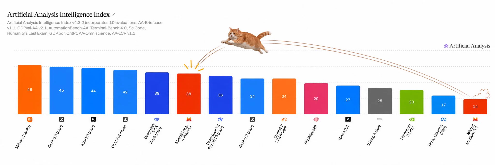
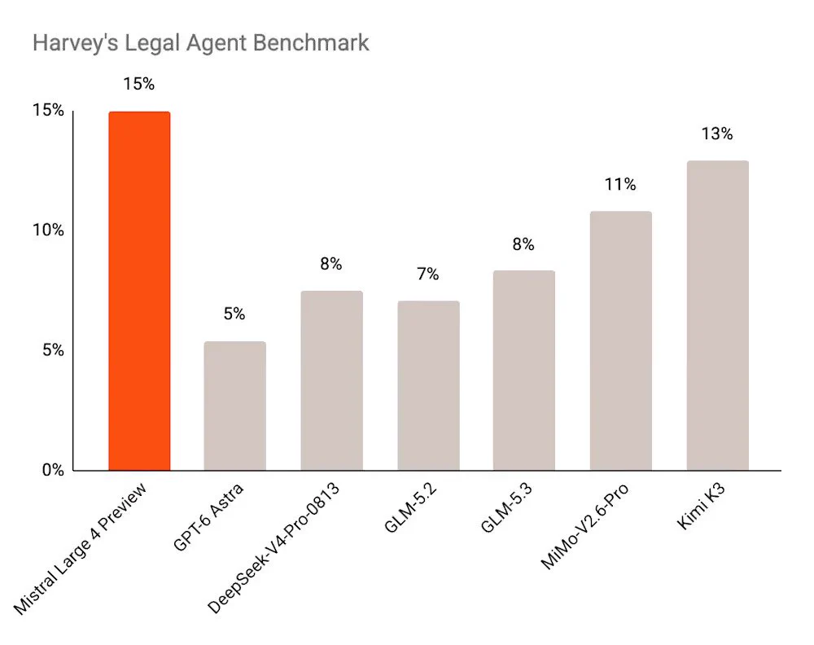

# Mistral 发布 1 万亿参数「Le Chonk」：欧洲最强开源权重模型来了

欧洲 AI 阵营很久没有这么热闹过了。2026 年 10 月 6 日，法国 AI 公司 Mistral AI 正式发布新一代旗舰模型 **Mistral Large 4** ，并给它起了一个相当接地气的昵称—— **Le Chonk** （"大块头"）。这个名字不是白叫的：模型总参数量达到 **1 万亿（1T）** ，采用稀疏激活架构，每次推理实际激活约 **490 亿（49B）** 参数。更关键的是，Mistral 官方宣称它是 **美国和欧洲范围内基准综合成绩最强的开源权重（open weights）模型** ，在 Harvey's Legal Agent 法律基准上以 15% 领跑，并将于 10 月底开放权重下载。

这篇文章基于 X 平台 Trending 汇总及 Mistral 官方、CEO Arthur Mensch、联合创始人 Guillaume Lample 等人的一手推文，带大家完整梳理这次发布的核心信息、实测数据、背后的算力故事，以及社区的真实反应。

## 一、发布现场：一只橘猫和一座美术馆

Mistral 官方账号 @MistralAI 的官宣推文非常简洁，但信息量不小：

> **Mistral AI (@MistralAI, Oct 6)** ：Meet Mistral Large 4, aka Le Chonk.
>
> - 1T parameters, natively multimodal. 49B active.
> - It is the best open weights model from US or Europe on aggregated benchmarks.
> - State-of-the-art on critical workloads, including cyber defense, manufacturing and finance...

这条推文还配了一段宣传视频，封面图颇有欧洲式的幽默：

> 图解：宣传视频的画面是一座古典美术馆，正中央立着一座巨大的橙色像素风数字「4」雕塑（呼应 Mistral 的品牌色和第四代模型），一只橘猫端坐雕塑前仰望——既点题「Le Chonk」（英语网络文化中常用来形容胖乎乎的猫），也暗合 Mistral 一贯的「猫」系彩蛋传统。美术馆墙上挂的肖像画里也都是猫，彩蛋密度拉满。

从这个开场就能看出 Mistral 的叙事策略：一边用最硬的参数规模说话，一边用轻松的文化符号拉近与开发者社区的距离。这很「欧洲」，也很 Mistral。

## 二、模型规格：1T 总量、49B 激活的稀疏架构

先把官方公布的核心规格列清楚：

- **总参数量** ：1 万亿（1T），是 Mistral 有史以来最大的模型；
- **激活参数量** ：每次前向推理约 490 亿（49B），说明采用了类似 Mixture-of-Experts（MoE）的稀疏激活设计——用 1T 的「知识容量」，只付 49B 的「推理账单」；
- **原生多模态（natively multimodal）** ：支持文本和图像输入；
- **上下文长度** ：512k token，面向复杂 Agent 场景；
- **定位** ：网络防御（cyber defense）、制造业、金融等关键行业负载上的 SOTA。

这里值得展开说一句 **「1T 总量 / 49B 激活」这个设计的聪明之处** 。稠密（Dense）模型的参数量和推理成本是绑定的，参数翻倍成本就翻倍；而稀疏架构把「记住多少知识」和「每次算多少」解耦了——模型可以拥有万亿参数级的知识储备，但每次只唤醒其中一小部分专家参与计算。对于要在欧洲自建数据中心、算力预算远不如美国巨头的 Mistral 来说，这是用架构效率换规模竞争力的典型打法。

512k 的超长上下文则是明确冲着 **Agent 场景** 去的：复杂 Agent 需要把大量工具调用历史、文档、代码库塞进上下文，512k 已经是当前第一梯队的水准。

## 三、跑分实测：强势，但要看清口径

说完了「怎么做」，接下来是大家最关心的「做得怎么样」。这次流传最广的有两张图。

### Artificial Analysis 综合智能指数

> 图解：这是第三方评测机构 Artificial Analysis 的 **Intelligence Index v4.3.2** 榜单，横轴为各模型（按分数从左到右降序排列），纵轴为综合智能分数。该指数聚合了 AA-Briefcase v1.1、GDPval-AA v2.1、AutomationBench-AA、Terminal-Bench 4.0、SciCode、Humanity's Last Exam、CritPt、AA-Omniscience、AA-LCR v1.1 等 10 项评测。从图中数据看：MiMo-V2.6-Pro（46）、GLM-5.3 max（45）、Kimi K3 max（44）位居前三， **Mistral Large 4 Preview 得分 38** ，排在第六位。图中橘猫（Mistral 的吉祥物梗）正从 Mistral Medium 3.5（14 分）一跃跳到 Mistral Large 4 Preview 的位置——相比自家上一代，提升幅度确实夸张。

这里要帮大家读出一个关键细节：榜单前几名几乎被中国开源模型（MiMo、GLM、Kimi、DeepSeek）包揽，Mistral Large 4 的 38 分虽然没能登顶全球，但 **在排除中国厂商之后的「美国 + 欧洲开源权重模型」范围内，它确实是第一** ——这正是官方宣传「best open weights model from US or Europe」的精确口径。宣传话术没撒谎，但定语加得很讲究。

此外，汇总信息还提到 Mistral Large 4 在 **Artificial Analysis Cyber Index（网络安全指数）上拿到 50 分** ，与其主打的网络防御行业负载相呼应。

### Harvey's Legal Agent 法律基准

> 图解：这是法律 AI 公司 Harvey 的 **Legal Agent Benchmark** 柱状图，纵轴为得分百分比（0%–15%），横轴为参评模型。 **Mistral Large 4 Preview 以 15% 居首** （橙色高亮柱），其后依次是 Kimi K3（13%）、MiMo-V2.6-Pro（11%）、DeepSeek-V4-Pro-0813（8%）、GLM-5.3（8%）、GLM-5.2（7%）、GPT-6 Astra（5%）。需要说明的是，该基准整体得分都偏低（冠军也只有 15%），反映出法律 Agent 任务本身难度极高、行业整体还处于早期。

在法律这种高专业壁垒、高容错成本的任务上领先 GPT-6 Astra 十个百分点，是这次发布中最有含金量的一项垂直成绩。

## 四、算力故事：在法国本土，用 3800 块 GPU 训出来的

参数和跑分之外，这次发布还有一个容易被忽略但意义深远的看点： **它是欧洲用自己的算力堆出来的** 。

Mistral 联合创始人 Guillaume Lample 在推文中透露：

> **Guillaume Lample (@GuillaumeLample, Oct 6)** ：ML4 was trained on 3,800 NVIDIA Grace Blackwell GPUs in our European datacenters — our cluster in Bruyères-le-Châtel built using our Series B fundraise. We are investing heavily in infrastructure, with our Series C and D clusters coming online soon...

训练集群位于法国巴黎郊区的 **Bruyères-le-Châtel** （顺便一提，这里也是法国原子能委员会的军事应用部门所在地，算力基础设施氛围浓厚）：

> 图解：推文中配的是 Bruyères-le-Châtel 小镇的实景照片——一个看上去相当宁静的法国郊区小镇。谁能想到，欧洲最强的开源权重模型就诞生在这样的地方。

3800 块 NVIDIA Grace Blackwell GPU 训练一个 1T 参数的模型，这个算力规模放在美国巨头动辄十万卡集群的背景下显得相当克制。 **这恰恰说明稀疏架构 + 高效训练管线的路线是成立的** ：不是只有烧最多的卡才能做出第一梯队模型。

CEO Arthur Mensch 的发言则更有底气：

> **Arthur Mensch (@arthurmensch, Oct 6)** ：That one took some groundwork. Trained and served on our own compute, and RL shows no sign of saturation.

两个关键信息：

1. **训练和服务全部跑在自有算力上** ——从 B 轮融资建的 Bruyères-le-Châtel 集群，到即将上线的 C 轮、D 轮新集群，Mistral 在基础设施上的投入是长期的；
2. **「RL shows no sign of saturation」** ——强化学习的收益还没有饱和迹象。这句话的潜台词是：Le Chonk 现在的能力还不是终点，继续堆 RL 训练还能涨。这也是 2026 年大模型竞争的主线叙事之一：预训练 scaling 放缓之后，RL 成了新的能力增长引擎。

官方随后也跟进确认了这一路线：

> **Mistral AI (@MistralAI, Oct 6)** ：再次强调 1T 参数、原生多模态、49B 激活的核心规格，以及在美欧开源权重模型中的领先地位。

## 五、社区反应：骄傲与调侃齐飞

欧洲开发者社区对这次发布的情绪整体是兴奋的——终于有一个能在全球榜单上露脸的欧洲开源权重模型了。但调侃也没缺席，最出圈的一条来自用户 leo：

> **leo (@synthwavedd, Oct 6)** ：It's pretty funny that it seems the one thing Mistral Large 4 is actually leading on is a benchmark about regulation. Another EU banger.

翻译过来就是：「挺好笑的，Mistral Large 4 真正领先的唯一基准，居然是个跟监管/法律有关的。不愧是欧盟出品。」这条推文配的就是上文那张 Harvey's Legal Agent 榜单图，拿了 99 个赞。

这个吐槽之所以能火，是因为它精准戳中了一个梗：欧盟以《AI Act》等严苛监管闻名，现在欧洲最强的模型恰好在法律基准上夺冠，节目效果直接拉满。当然，玩笑归玩笑，15% vs 5% 的差距是实打实的。

## 六、可用性与开放策略

对开发者来说，最关心的落地信息有两条：

- **API 现已开放** ：发布即可通过 Mistral 的 API 调用 Mistral Large 4；
- **开源权重 10 月底放出** ：官方承诺 open weights 将在 10 月底上线。届时开发者可以在自有基础设施上部署这个 1T 参数的模型（当然，49B 激活参数的推理门槛依然不低）。

同期 Mistral 还发布了 **Medium 3.5 Dense 模型** ，面向 Agent 和 Coding 场景（在 X 上有 2.6K 条相关讨论），形成了「超大稀疏旗舰 + 中型稠密主力」的产品矩阵。

## 七、总结

最后回顾一下这次发布的核心要点：

- **规模** ：Mistral Large 4「Le Chonk」总参数 1T、激活 49B，稀疏架构用效率换规模，512k 上下文 + 原生多模态瞄准 Agent 场景；
- **成绩** ：Harvey's Legal Agent 法律基准 15% 全球第一，Artificial Analysis 综合指数 38 分位列美欧开源权重模型之首（全球第六），网络安全指数 50 分；
- **算力** ：在法国 Bruyères-le-Châtel 自有集群用 3800 块 NVIDIA Grace Blackwell GPU 完成训练，训练推理全栈自主；
- **后劲** ：CEO 明确表示 RL 训练收益未饱和，模型还有提升空间；
- **开放** ：API 已上线，开源权重承诺 10 月底放出。

展望来看，Le Chonk 的意义不止于一个模型本身：它证明了在中等算力预算下，欧洲团队依然能做出全球第一梯队的开源权重模型。接下来值得观察的，一是 10 月底权重放出后社区的实际部署和微调表现，二是 Mensch 所说的「RL 不饱和」能否在后续版本中兑现为持续的分数增长——毕竟在全球榜单上，它前面还站着四座中国开源模型的大山。

> 本文参考自 [Mistral Unveils Le Chonk: Europe's Top Open-Weights AI Model](https://x.com/i/trending/2107458174307455069)