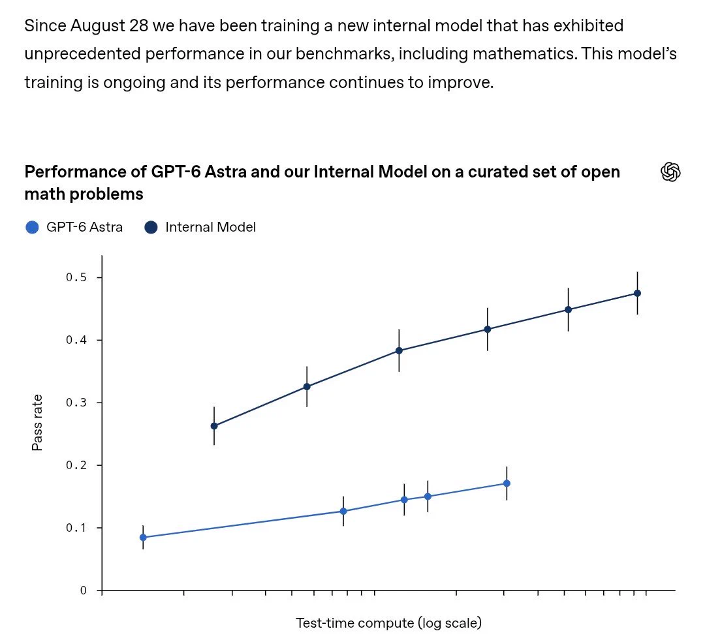
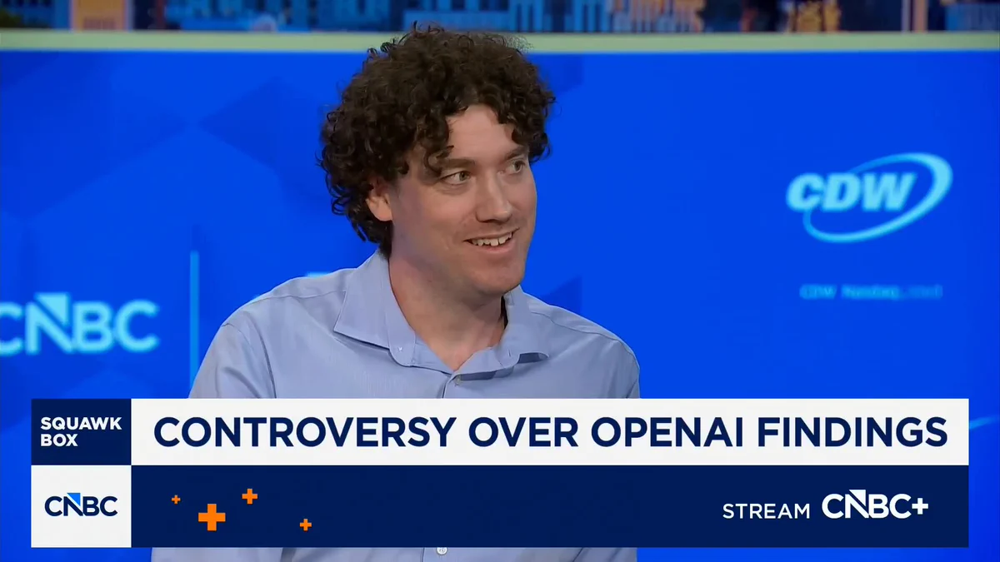

# OpenAI Releases 722 AI-Generated Math Papers：AI 解题洪水震动数学界

10 月 7 日，OpenAI 一口气发布了 **722 篇由 AI 生成的数学论文**，直接引爆了数学界。背后是一个从 8 月底开始训练的未公开内部模型：它单枪匹马解决了约 **4000 个开放数学问题**，每篇论文只靠 **一次 prompt** 生成，平均每个解答只消耗 **3 小时算力**，其中约 **42%** 还附带了机器可验证的 Lean 形式化证明。这件事之所以重要，是因为它第一次把「AI 辅助数学研究」从零星突破变成了工业化量产——数学发现的生产方式，可能就此改写。

## 发生了什么：一次史无前例的「论文倾销」

先把时间线捋清楚。

从 8 月 28 日起，OpenAI 开始训练一个新的内部模型。这个模型至今没有正式名称，X 上的用户 Andrew Curran 给它起了个绰号叫 **Aeon**。训练持续到 10 月初，模型在内部基准上的表现仍在不断爬升。

10 月 7 日（周二），OpenAI 将这一阶段的成果集中放出：722 篇数学论文，覆盖约 4000 个此前悬而未决的开放问题。注意这个数字关系——4000 个问题、722 篇论文，意味着不少论文是一篇解决多个关联问题的。

更让人意外的是生成方式。Andrew Curran 在他的帖子里特别强调了一点：这次的大部分结果 **并不是靠 swarm（大规模并行搜索）堆出来的**，这与之前 Navier–Stokes 问题的解法完全不同。

> 图解：这张图来自 OpenAI 的内部说明。上方文字称，自 8 月 28 日起训练的新内部模型在包括数学在内的基准上表现出「前所未有的性能」，且训练仍在继续。下方折线图对比了两个模型在一组精选开放数学问题上的表现：横轴是 **Test-time compute（测试时算力，对数刻度）**，纵轴是 **Pass rate（通过率）**。深色线的内部模型通过率从约 0.26 一路爬升到约 0.47，而浅色线的 GPT-6 Astra 仅从约 0.08 升到约 0.17——同等算力下，内部模型的通过率大约是公开模型的 **3 倍**。

笔者认为这个细节是整个事件里最容易被忽略、也最重要的一点：**单次 prompt、一次出结果**。不是人海战术式的暴力搜索，而是模型本身具备了「一击命中」的推理能力。这代表的能力跃迁，比 722 这个数字本身更值得警惕。

## 数学界为何震动：Buckmaster 的警告

发布当天，反对声浪最响的是 NYU 数学教授 **Tristan Buckmaster**。他的原话被多个账号反复引用：

> 「周二这波论文倾销，摧毁了青年数学家的职业生涯。」

这句话在 X 上迅速发酵。unusual_whales、Big Brain AI、Raws Alerts 等账号接连转发，单条帖子的互动量都在数百以上。CNBC 的 Squawk Box 节目也专门做了报道，屏幕下方的标题直接写着「CONTROVERSY OVER OPENAI FINDINGS」（围绕 OpenAI 成果的争议）。

> 图解：CNBC 新闻节目 Squawk Box 的采访画面，下方标题条写着「围绕 OpenAI 成果的争议」。事件已经从学术圈内部讨论升级为大众媒体关注的公共话题。

Buckmaster 的担忧不是空穴来风，它指向两个具体的结构性问题：

- **研究路径被「截胡」**：数学界很多青年学者的职业规划，是围绕某个开放问题深耕数年。AI 一夜之间把这些问题成批解决，等于直接抹掉了他们长期投入的研究方向。
- **验证能力的赤字**：722 篇论文同时涌来，谁来审？数学界传统的同行评审机制，根本不是为这种吞吐量设计的。

值得一提的是，Buckmaster 本人此前就活跃在 AI 数学交叉领域——他曾参与用 AI 方法研究 Navier–Stokes 方程奇点的工作。连这样的人都站出来警告，说明震动是真实的。

## 支持者怎么看：三十年 vs 三小时

当然，并非所有人都在悲观。

用户 SightBringer 的帖子代表了另一派观点：「宇宙并不在乎一个定理是由人类、AI，还是某种我们尚未发明的东西发现的。」他算了一笔账：如果一台机器用 3 小时解决了一个数学家要花 30 年才能解决的问题，那么人类就 **净赚 29 年 364 天**。

支持派的逻辑可以归纳为三点：

- **真理本身是中立的**：定理不会因为发现者是机器而贬值。
- **时间杠杆惊人**：3 小时对 30 年，这是数量级级别的效率提升。
- **形式化证明兜底**：约 42% 的论文附带 Lean 机器可检验证明，正确性不完全依赖人工审查。

这里解释一下 **Lean**：它是一个形式化证明助手（proof assistant），可以把数学证明写成代码，由计算机逐行验证逻辑正确性。传统同行评审靠人脑找漏洞，可能要几个月；Lean 验证靠机器跑，理论上可以快速批量完成。OpenAI 还承诺后续会放出更多形式化结果。

笔者认为，42% 这个比例恰恰是整场争论的「胜负手」。如果 722 篇论文全部附带 Lean 证明，Buckmaster 的「验证赤字」担忧会大幅缓解——争议的核心从来不是 AI 能不能做对，而是 **人类来不来得及确认它做对了**。

## 更深的问题：发现的署名权归谁

解决了「能不能验证」之后，下一个问题是「功劳算谁的」。

这次发布把一个此前只存在于科幻讨论里的问题摆上了台面：**当机器独立产出了数学洞见，学术 credit 该怎么分配？** 是算训练模型的团队、写 prompt 的人，还是根本不存在「作者」这个概念？数学界现有的署名、引用、职称评定体系，完全没有为这种情况留接口。

另一个值得注意的旁证来自理论神经科学领域。研究者 David Clark 发帖称，他与 AI 模型合作取得了自己研究生涯中「最重要的纯理论突破」——关于随机神经网络 Lyapunov 谱（刻画混沌系统对初始扰动敏感程度的一组指数，即俗称「蝴蝶效应」的定量度量）的工作，已挂在 arXiv 上（arXiv:2610.12426）。

这说明 AI 渗透的不仅是纯数学，整个理论科学的研究范式都在被改写。X 上相关的衍生热点也印证了这股势头：「社区迅速改进 OpenAI 的整数乘法上界」（3.31 万帖）、「OpenAI 模型解决 Navier–Stokes 及 100 个数学问题」（3.41 万帖）都在同时发酵。

## 结语

回顾这次事件的要点：

- OpenAI 内部模型「Aeon」自 8 月 28 日起训练，单次 prompt 即可解决开放数学问题，平均每题仅 3 小时算力；
- 一口气发布 722 篇论文、覆盖约 4000 个开放问题，约 42% 附带 Lean 机器可验证证明；
- 内部基准显示其通过率约为公开模型 GPT-6 Astra 的 3 倍，且仍在随训练提升；
- NYU 教授 Buckmaster 称其「摧毁了青年数学家的职业生涯」，验证赤字与职业冲击是两大核心担忧；
- 支持者则认为这是人类知识净增的时间杠杆，并呼吁建立机器洞见的署名新规范。

最后说句实话：这篇新闻基于 X 平台帖子的汇总，OpenAI 官方尚未放出完整技术细节，数字有待核实。但方向已经很清楚——数学发现的工业化时代已经敲门，留给人类学术体系修订规则的时间，恐怕比 Lean 跑完 722 篇证明还要紧张。

## 原文图表补充

> 原帖截图：unusual_whales

> 原帖截图：Andrew Curran

> 原帖截图：SightBringer

> 原帖截图：Big Brain AI

> 原帖截图：David Clark

> 来源：arxiv.org

> 原帖截图：R A W S A L E R T S

> 本文参考自 [OpenAI Releases 722 AI-Generated Math Papers, Shocking Researchers](https://x.com/i/trending/2108693224160415870)