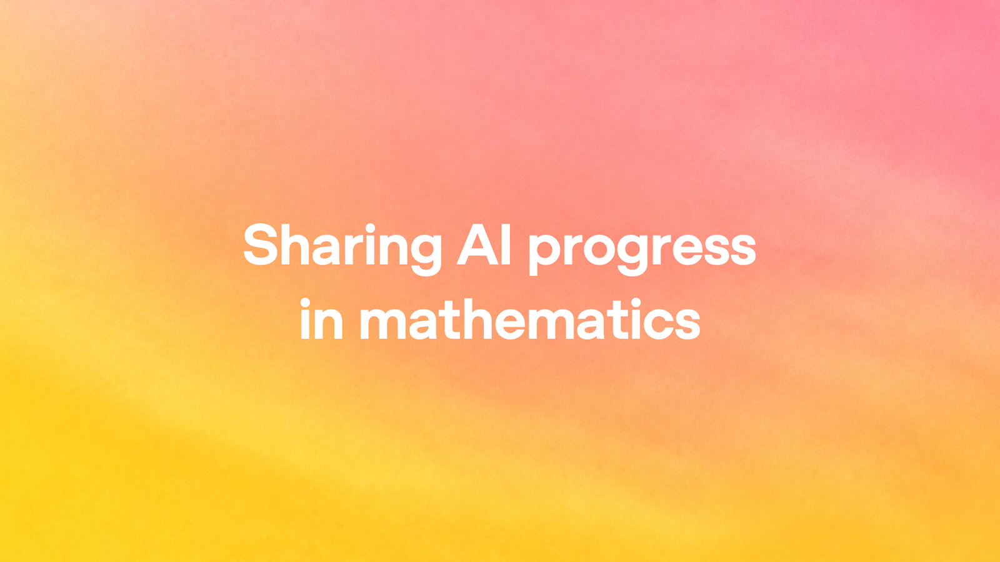

# Sharing AI Progress in Mathematics：OpenAI 首次公开内部前沿模型的数学成果

2026 年 10 月 6 日，OpenAI 首次公开了一批由**内部前沿模型**产出的数学成果——这不是一次模型发布，而是一次成果发布，它首次认真回答了数学界追问已久的问题：AI 写出人类未曾见过的证明后，该以什么标准交给学术界？最亮眼的两个细节：许多证明附带 **Lean 形式化版本**，由计算机逐行机械验证；平均每个结果的算力成本约等于 **ChatGPT Pro 三小时的思考量**。

## 发布什么：成果本身与披露方式同样重要

- 一批内部前沿模型产生的、覆盖面较广的新数学结果，托管于 GitHub 仓库，并配套论文修订与引用规范；
- OpenAI 措辞克制，没有宣称"AI 证明了某某重大猜想"，而是把重心放在**发布方式本身**——因为困扰社区的核心一直是可信度与可核查性。

## 可信度保障：Lean 形式化证明

Lean 是"数学证明的编译器"：人类证明靠同行评审发现漏洞，Lean 证明则由计算机机械验证——编译通过，证明才成立。这一设计绕开了"AI 证明人类审不动"的死结：AI 一天可产几十页证明，人类评审需数月，但只要通过 Lean 类型检查，正确性就有了不依赖人力的硬保证。OpenAI 承诺持续补充更多形式化证明。

## 透明度细节：过程数据罕见公开

- **10 份模型推理过程摘要**，让外界一窥模型"如何想到"证明；
- **算力消耗估算**：平均每结果约 3 小时 ChatGPT Pro 思考算力——既展示效率，也暗示前沿推理仍然昂贵；
- **尝试题目数量统计**：公开成功率的分母，避免幸存者偏差，主动展示模型的失败面。

## 治理机制：IAS 独立顾问组参与立规

OpenAI 一直与普林斯顿高等研究院（IAS）旗下独立的 Advisory Group on Mathematics and AI 磋商，依据其建议设计发布方式，并承诺持续迭代披露标准。数学共同体开始为"AI 时代"立规矩，这本身就是标志性信号。

## 后续投入：消化成果与开放模型

- 资助围绕"理解 AI 重大数学成果"的研讨会和专项计划，让数学家坐下来消化这些结果；
- 负责任地开放产生成果的模型本身，让科学家直接用上最前沿能力。成果披露建立信任，模型开放释放生产力，二者互为前提。

## 一句话总结

这次发布的真正意义不在某条定理，而在于为"AI 科学成果如何进入人类知识体系"立下了一套**可核查、可引用、可追责**的模板——它的价值将超过任何单一结果。

> 本文参考自 [Sharing AI progress in mathematics](https://openai.com/index/sharing-ai-progress-in-mathematics)