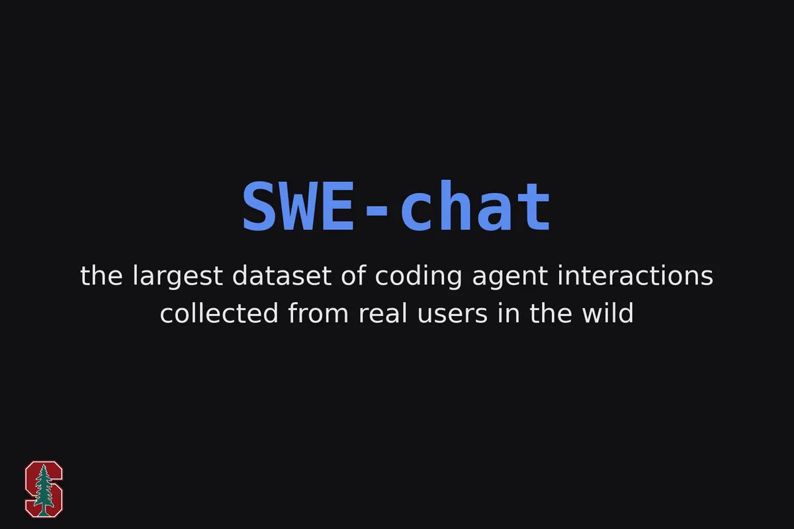

# SWE-chat：斯坦福发布最大规模真实 Coding Agent 交互数据集，揭开“Vibe Coding”的效率与安全真相

> 图解：SWE-chat 的官方宣传图——“目前最大规模的、从真实用户野外环境中收集的 coding agent 交互数据集”。左下角是斯坦福校徽，该工作由 Stanford AI Lab 团队发布。

AI coding agent 已经大规模落地，但 **人们到底怎么用它、它产出的代码有多少真正被采纳** ，此前一直缺乏实证数据。斯坦福 AI Lab 提出的 **SWE-chat** 填补了这个空白：这是首个从开源开发者真实工作流中持续收集的大规模 coding agent 会话数据集，包含 6,000 个会话、超过 63,000 条用户 prompt 和 355,000 次工具调用。基于这批数据，论文给出了几个相当“扎心”的数字： **只有 44% 的 agent 产出的代码最终进入了用户的 commit** ；而全托管式的 “vibe coding” 每千行引入的安全漏洞约为人写代码的 **9 倍** 。

## 为什么需要 SWE-chat：Benchmark 之外的盲区

现有的 SWE 类 benchmark（如 SWE-bench 系列）大多是“精心策划的题目”：任务定义清晰、解可验证、一次性完成。但真实开发完全不是这样——用户会中途改主意、会打断 agent、会把 agent 写的代码删掉重写。

更关键的是，此前 **没有任何公开数据集** 记录过完整的“人类—agent”交互轨迹：用户怎么写 prompt、怎么纠偏、最终哪些代码被 commit、哪些被丢弃。没有这些数据，关于“AI 编程提效”的讨论基本停留在轶事层面。SWE-chat 的贡献正在于把这件事变成了可量化研究的科学问题。

## 数据集是怎么建起来的

### 数据来源：开发者主动 opt-in 的会话日志

SWE-chat 的数据来自公共 GitHub 仓库，这些仓库的开发者主动安装了开源工具 **Entire.io** 的 CLI。该工具会在专用分支上自动记录 coding agent 的完整会话日志，并把每个 checkpoint 与代码 commit 关联起来，做到 **行级别的人/机代码归属判定** 。

目前覆盖五款主流 coding agent：Claude Code、OpenCode、Gemini CLI、Cursor 和 Factory AI Droid（约 85% 的数据来自 Claude Code）。日志内容包括用户 prompt、agent 回复、工具调用（文件编辑、shell 命令、代码搜索等）以及 token 用量。

### 数据规模与结构

截至论文写作时（2026 年 4 月），数据集包含：

- 近 **6,000 个会话** ，横跨 **200+ 个仓库**
- **13,000+ checkpoints** 、 **63,000+ 用户 prompts** 、 **355,000+ 工具调用**
- 总计 **270 万条日志事件** （含流式进度事件、工具返回值和少量推理轨迹）

每个会话由“用户 prompt ↔ agent 响应（含工具调用）”交替构成。会话多为多轮交互，agent 在一次请求中往往要发起多次工具调用，涉及的文件类型和编程语言也非常多样。

值得一提的是，SWE-chat 是一个 **living dataset** ：收集管道通过 GitHub Code Search API 持续发现新的 Entire-enabled 仓库并自动处理，数据集在快速增长（最新的社区报道显示其 prompt 规模已扩展到 23 万条）。

### 分析方法：LLM-as-a-Judge + 行级代码归属回放

论文的分析走两条路。

**第一条路是语义标注。** 团队为会话成功率、用户意图、用户行为画像等维度设计了标注规范（codebook），先由人类专家标注并计算标注者间一致性（中等到较高），再用多个开源/闭源 LLM 做 zero-shot 对照，选出表现最好的模型和 prompt 来标注全量数据。作者也很坦诚：LLM 标注并不可靠，这些标签主要用于筛选和定位案例，结论性判断需谨慎对待。

**第二条路是纯粹的日志度量，这也是我认为全文最硬核的部分。** 团队通过 **按时间顺序回放 agent 的每一次文件修改工具调用** ，用行级 diff 给每一行代码打上“base（人写）”或“agent”的出处标签，从而精确追踪每行 agent 代码的命运——是被保留、被 agent 自己重写、被人覆盖，还是被人删除。由此定义两个核心指标：

$$
\text{Coding efficiency} = \frac{\text{agent lines survived}}{\text{agent cumulative lines produced}} \times 100
$$

$$
\text{Code survival rate} = \frac{\text{agent lines survived}}{\text{agent lines in final state}} \times 100
$$

前者衡量 agent 的“总努力”有多少进了 commit，后者衡量其“净产出”有多少被人保留。此外还定义了 token 效率、成本效率（美元/百行）、认知效率（用户 prompt 字符数/百行）、时间效率等一系列“每百行提交代码的代价”指标。代码安全性则用静态分析工具 **Semgrep** 对 commit 前后快照做差分，统计新增漏洞数。

> 这个设计的聪明之处在于：它完全绕开了“AI 提效”问卷式调查的主观性——代码有没有被留下，是用户用脚投票的最硬证据。

## RQ1：人类在野外到底怎么用 Coding Agent？

### 用途远比“写代码”多样

用户意图分布显示，最常见的具体请求是 **理解已有代码或行为** （19.0%），其次才是创建新代码（13.4%）、git 操作（13.4%）和调试（13.0%），另有 26.6% 归入宽泛的“其他”。重构、写测试等占比更低。

agent 侧的行为也印证这一点： **三分之一的工具调用是 bash 命令** （主要是 git 操作），随后是文件读取、编辑和 grep 搜索。典型轨迹是先读和搜，再改文件、跑构建。

这意味着：只盯着“生成 patch”的 benchmark 严重低估了真实工作流的操作多样性。agent 不仅要会写代码，更要会 **读懂代码、做日常开发杂务** 。

### 三种编码模式：极端双峰分布

所有提交代码中 55.8% 由 agent 撰写，但分布极其双峰。论文据此划分三种模式：

- **Human-only（22.7% 的会话）** ：代码全由人写，agent 只当“顾问”，负责理解代码、调试、git 操作。
- **Collaborative（36.5%）** ：人机共同贡献，agent 写了 0–99% 的行。
- **Vibe coding（40.8%）** ：超过 99% 的提交代码由 agent 撰写，人类基本“动口不动手”。

更值得警惕的是趋势：在三个月的观察窗口内，vibe coding 的占比从 20% **翻倍到了 40% 以上** 。

### 用户画像：“专家级挑剔鬼”占主导

团队按完整会话轨迹把用户分为三类画像：

- **Expert Nitpicker（专家挑剔型）** ：目标稳定，但对 agent “怎么做”极其较真，逐条给出精确纠偏（“别用 arg hash，换 short uuid”“不要单独建函数，内联掉”）。这是 **占比最高的画像** ——即便在 vibe coding 会话中也占 47%。
- **Vague Requester（模糊委托型）** ：指令宽泛，把实现决策全部交给 agent。
- **Mind Changer（中途变卦型）** ：会话中途推翻整体目标（“再想想：把 start 命令整个删掉吧”）。vibe coding 中变卦更少（5% vs 其他模式 10%）。

这与当前 benchmark“一次性给全指令”的设定形成鲜明对比： **真实用户是看着 agent 的输出、迭代式地 refine 需求的** 。

## RQ2：Agent 哪里不行？用户怎么补救？

### 整体成功率尚可，但失败模式很“经典”

90% 的会话成功评分在 50 分以上，说明 agent 大体上能完成任务。论文人工检查了评分最低的 50 个会话，最常见的失败模式有两类：用户在 agent 产出有效结果前就中断走人；agent 产出了与用户真实需求 **完全无关** 的工作或 commit。一个典型案例里，agent 反复修改错误的动画参数，用户纠偏两次仍然改错，最终会话无 commit 收场—— **不在动手前验证假设** ，是 agent 的老毛病。

### 低效：不到一半的 AI 代码被留下

这是最硬的数字之一： **只有 44.3% 的 agent 产出代码最终进入了用户 commit** 。低效的主要来源不是“人覆盖写”，而是 **人类直接把 agent 写的代码删掉** 。vibe coding 会话中保留率更高（59%），但作者提醒这难以做因果解读——可能是产出更对路，也可能只是用户审得更松。

### Vibe coding：又贵又慢

按“每 100 行提交代码”计算的中位数开销对比如下：

| 指标 | Human-only | Collaborative | Vibe coding |
|---|---|---|---|
| Token 消耗 | 约 102K | 约 68K | **约 204K** |
| 美元成本 | \$0.07 | **\$0.05** | \$0.13 |
| 会话耗时 | 8.6 分钟 | **4.8 分钟** | 12.6 分钟 |

可以看到，vibe coding 的 token 消耗约为协作模式的 **3 倍** ，成本近 3 倍，耗时也最久。 **协作模式在几乎所有效率维度上都是最优的** ——这对“全自动化才是未来”的叙事是个有力的反证。用户在 vibe coding 时还要投入更多 prompt 精力，省下的“动手”被“动口+等待”吃掉了不少。

### 安全：每千行漏洞数是人的 9 倍

Semgrep 差分分析的结果相当刺眼（每千行提交代码引入的漏洞数）：

| 编码模式 | 引入漏洞 | 修复漏洞 |
|---|---|---|
| Human-only | 0.08 | 0.04 |
| Collaborative | 0.14 | 0.08 |
| Vibe coding | **0.76** | 0.52 |

Vibe coding 引入漏洞的速率约为人写代码的 **9 倍** 、协作模式的 **5 倍** 。它确实也修复更多漏洞（0.52/千行），但三种模式都是“引入多于修复”，且 vibe coding 的净差最大。漏洞类型包括路径穿越、命令注入、不安全的格式化字符串、SQL 注入等。如果 vibe coding 占比继续按现在的速度增长， **生产代码的绝对漏洞量会持续上升** 。

### 自主性在涨，监督却在“裸奔”

Claude Code 的多数单轮交互很短（中位数不到 1 分钟，P90 低于 7 分钟），但长尾在快速拉长——P99.9 的单轮时长已超过 **100 分钟** ，且呈明显上升趋势。

问题在于，agent 自主性增长的同时，几乎不主动求助：只有 **1.1%–2.6%** 的轮次里 agent 会停下来向用户澄清问题。与之相对，用户在 **3.3%–6.0%** 的轮次里直接打断 agent（最常发生在 agent 退出 plan 模式、执行 git 操作或编辑文件时），并在 **39%** 的轮次结束后以“软纠偏”形式 push back（纠正、驳回、故障报告）。算上打断，用户在约 44% 的轮次里都要“出手”。

这组不对称很有信息量： **agent 获得自主性的速度，远超它学会“什么时候该问人”的速度** ，监督的负担整个压在了用户身上。而且 agent 很少暴露不确定性，错误往往只能靠用户主动检查才能发现——silent failure 在真实场景中同样普遍。

## 讨论：这份数据能改变什么

论文在讨论部分给出了三个判断：自主性正在跑赢监督；agent 强大但脆弱（写了一半以上的代码，却留不住一半以上的产出）；agent 代码的安全性问题在真实工作流中得到了实证确认。

基于 SWE-chat，作者指出了三个可落地的研究方向：

- **更真实的 benchmark** ：真实世界最常见的意图是“理解代码”而非“写 patch”，会话是多轮迭代而非一次性求解。可以用真实会话轨迹评测 agent“在给定对话上下文下能否提出恰当的下一步动作”。
- **更自适应的交互设计** ：用户几乎每隔一轮就要纠偏，但很少彻底放弃会话。这批“纠正—响应”循环数据可以帮研究者搞清楚 agent 交互设计到底差在哪。
- **用户模拟器（User Simulator）** ：用真实交互轨迹训练用户模拟器，为 agent 提供低成本、可复现的离线评测范式——数据里足够多样的行为模式正是逼真模拟器所需的原料。

当然，局限性也要说清楚：数据只来自主动 opt-in 的开源早期用户，不覆盖企业私有代码库；用户彻底放弃 agent 产出的会话不会被 commit，因此 **成功率和效率可能被高估** ；行级归属也无法捕捉“人把 agent 代码换个形式重写”的语义存活情况，又可能 **低估** agent 的真实贡献。此外约一半（48.6%）的会话能做无歧义的 commit 归属，其余被排除在部分分析之外。隐私方面，数据集发布前用 Microsoft Presidio 脱敏 PII、用 TruffleHog 清除凭据，并通过了斯坦福 IRB 审查。

## 总结

- **SWE-chat 是首个大规模“野外” coding agent 交互数据集** ：6,000 会话、63K prompts、355K 工具调用，且通过自动化管道持续增长。
- **真实用途远超写代码** ：最常见意图是理解已有代码（19%），1/3 工具调用是 bash——现有 benchmark 覆盖面严重不足。
- **编码模式极端双峰** ：41% 的会话是纯 vibe coding，23% 全人写，且 vibe coding 占比三个月翻了一倍。
- **效率真相** ：仅 44% 的 agent 代码被 commit；vibe coding 每百行烧 3 倍 token，协作模式才是最省的方式。
- **安全真相** ：vibe coding 每千行引入漏洞率是人的 9 倍，而 agent 几乎从不主动提问，用户不得不在 44% 的轮次里人工纠偏。

一句话展望：SWE-chat 最大的价值或许不是给出结论，而是提供了一面“持续更新的镜子”——当 benchmark 还在衡量 agent “能不能做题”时，它让我们第一次看清了 agent “在真实世界里干得怎么样”，而这正是下一代 agent 评测、交互设计和用户模拟研究的起点。

> 本文参考自 [SWE-chat: Coding Agent Interactions From Real Users in the Wild](https://arxiv.org/abs/2604.20779)，原始发布见 [Stanford AI Lab on X](https://x.com/StanfordAILab/status/2106096953495036259)