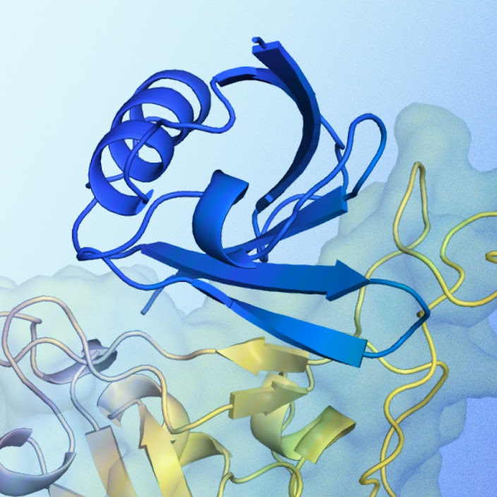

# SynthID Bio：给 AI 设计的蛋白质盖上“隐形印章”

AI 已经能设计出自然界从未存在过的蛋白质和病毒基因组，但一个随之而来的问题是： **如何证明一段生物序列出自某个 AI 模型，而不是天然产物或恶意设计？** Google DeepMind 的 SynthID Bio 把此前用于图像和文本的水印技术搬到了合成生物学领域，核心思路是：在生成蛋白质序列或 3D 结构时，微妙地引导氨基酸选择或原子坐标，嵌入一个不可察觉但可验证的统计签名。最硬的结果是：在 VEGF-A、SARS-CoV-2 spike RBD 和 PD-L1 三个靶点的湿实验中，带水印的蛋白质 binder 在命中率、结合亲和力和序列多样性上与不加水印的版本 **完全持平** ——这是世界上首批既带水印、又具备真实生物功能的蛋白质。

> 图解：AI 生成蛋白质打水印的概念验证。图中为蛋白质 3D 结构的可视化（蓝色 binder 分子与黄色靶标结合），SynthID Bio 的目标是在不改变这种结合功能的前提下，把可验证的签名藏进序列与坐标之中。

## 为什么需要给生物设计打水印？

要理解这项工作的动机，先看生成式 AI 在生物领域已经走到了哪一步。AlphaFold 能预测蛋白质结构，AlphaProteo 和 ProteinMPNN 能从零设计新蛋白，更新的工作甚至能设计感染细菌的噬菌体（bacteriophage）。能力越强，风险敞口越大，具体体现在两个场景。

**第一道裂缝：AI 设计绕开 DNA 合成筛查。** 把数字设计变成实体分子，必须向 DNA 合成服务商下单，服务商会对照已知威胁数据库筛查订单。过去，一条“陌生”的序列通常可以被安全地假定为某种未被发现的自然生物；但 AI 能生成与已知危害毫无相似性的全新序列，这个假定不再成立。逐一人工审查又会拖慢正常研究。

**第二道裂缝：错标数据污染公共数据库。** Protein Data Bank、UniProt、GenBank 这些数据库大多开放公众提交。如果 AI 生成的 3D 结构被误标为实验测定的真实结构混进去，会误导下游研究，甚至干扰生物安全决策——随着 AI 生成数据的增多，这个问题只会更严重。

两个场景的共同点是：缺少一个能回答“这段设计从哪来”的技术手段。这正是水印要补的位置。

## SynthID Bio 的工作原理：两套水印方案

SynthID Bio 不是单一算法，而是一组针对合成生物学的水印方法族。它的聪明之处在于 **按数据类型选择不同的嵌入位置** ：序列归序列，结构归结构。

### 序列水印：悄悄引导氨基酸的选择

蛋白质序列有 20 种氨基酸可选，很多位点替换后功能几乎不变——这给了水印天然的“藏身空间”。SynthID Bio 的做法是：在使用 AlphaProteo 设计 binder（能选择性结合目标蛋白的分子）时，配合一个 **带水印版本的 ProteinMPNN** （常用的蛋白质序列生成方法），在逐个位点选择氨基酸时施加微妙的统计偏置。

这个偏置小到不改变蛋白功能，却能在整条序列上积累出一个强检测信号。本质上，它和文本水印的思路一脉相承：不改变“说了什么”，只微调“怎么选词”，让选词模式本身成为签名。

### 结构水印：把签名“焊”进模型权重

对于蛋白质折叠（结构预测），做法更进一步：SynthID Bio **微调 AlphaFold 3 扩散网络（diffusion network）的一小部分** ，让模型输出的 3D 坐标天然携带可检测签名。

笔者认为这是全文设计上最妙的一笔。因为水印能力直接写进了模型权重， **无论谁来跑这个模型** ，输出的结构都自带签名——不依赖推理时的额外插件，也就无从“忘记”或绕过。同时，它保持了 AlphaFold 3 的预测精度和关键结构特征的分布，并能抵抗数字噪声或轻微坐标扰动。

解决了“怎么藏”和“藏得牢”之后，下一个问题自然是：藏了水印的蛋白质，还能用吗？

## 实验验证：水印不牺牲功能

### 湿实验：三个靶点全部通过

验证不是停留在计算机里。团队把带水印的 binder 设计送进了真实的湿实验室（wet-lab），在三个靶点上与未加水印的设计做对照：

- **VEGF-A** ：与肿瘤血管生成相关的关键蛋白；
- **SARS-CoV-2 spike RBD** ：新冠病毒刺突蛋白的受体结合域；
- **PD-L1** ：肿瘤免疫治疗的重要靶点。

结果：带水印的设计在 **命中率（hit rate）、结合亲和力（以 $K_D$ 衡量，数值越低结合越强）以及天然序列多样性** 三项指标上，与不加水印的版本全部持平。换句话说，水印是免费的——检测能力拿到手，生物功能一分没丢。

### 结构预测：精度不降，检测近乎完美

结构水印一侧，以蛋白复合物 7PPA 为展示案例：对比 AlphaFold 3 原始预测结构、实验测定的真实结构（ground truth）和带水印的预测结构，三者结构特征分布保持一致。官方给出的结论是：预测精度得以保留，水印信号 **接近完美可检测（near-perfect detectability）** ，并且在加入数字噪声或轻微坐标变化后依然可检出。

## 生物安全意义：“瑞士奶酪”模型的新一层

单看技术，SynthID Bio 是一个不错的水印方案；放进生物安全的大图景里，它的定位更清晰。

生物安全界常用“瑞士奶酪模型”来描述防御体系：每一层防护措施都像一片有孔的奶酪，单层必有盲区，多层叠加才能把洞堵上。模型层面的安全缓解、客户资质审核各是一片；SynthID Bio 提供的是 **嵌在生物设计本身里的验证层** ——设计走到哪，签名跟到哪。

它最先能发挥价值的两个落点：

- **DNA 合成筛查自动化** ：面对陌生序列订单，水印能给出一个自动验证信号，证明该订单出自内置安全机制的受信模型，把人工审查资源集中到真正可疑的序列上。合成服务商 Twist Bioscience 的反馈也印证了这一点：水印有望成为筛查工具箱里提高效率的新成员。
- **数据库完整性保护** ：在提交环节，SynthID Bio 可以帮助确保 AI 生成的条目被正确标注，或被打上进一步审查的标记，防止错标条目污染下游决策。

值得注意的是，DeepMind 同步开源了代码、体外实验数据并发布模型权重，明显是想把这套方案推成社区级标准，而不是自家围墙里的功能。

## 展望：从蛋白质走向整个基因组

这项工作仍处在“重要的第一步”阶段，论文也坦诚列出了下一步的挑战和已在做的事：

- **抗篡改鲁棒性** ：当前水印对噪声和轻微扰动稳健，但对抗蓄意篡改（adversarial tampering）仍是开放问题；
- **与溯源元数据结合** ：可搭配类似数字媒体领域 C2PA 的溯源元数据方案，或建立 AI 生成生物数据的中央仓库，形成“水印 + 元数据”双保险；
- **走向更复杂的生物对象** ：DeepMind 已与斯坦福大学 Hie 实验室和 Arc Institute 合作，把 SynthID Bio 集成进基因组模型 **Evo 2** ，为 Evo 2 设计的噬菌体 **整个基因组** 打水印；早期细菌培养实验已确认这些带水印的噬菌体功能正常。详细结果将在后续技术论文中公布。

## 总结

- SynthID Bio 把水印技术从数字媒体引入合成生物学，在蛋白质 **序列和 3D 结构** 两个层面嵌入可验证签名；
- 序列水印通过带水印版 ProteinMPNN 微调氨基酸选择，结构水印则直接微调 AlphaFold 3 的扩散网络权重，做到“签名随模型走”；
- 湿实验覆盖 VEGF-A、SARS-CoV-2 RBD、PD-L1 三个靶点，水印设计的命中率、亲和力与多样性全部与对照组持平；
- 它为 DNA 合成筛查和公共数据库完整性提供了“瑞士奶酪”防御体系中嵌在设计本身的新一层；
- 代码、数据与权重已开放，抗篡改与基因组级水印（Evo 2 噬菌体）是正在推进的方向。

没有任何单一的生物安全措施是银弹，但 SynthID Bio 证明了“给 AI 生物设计做溯源”在技术上完全可行——下一步要看整个社区愿不愿意把它变成基础设施。

> 本文参考自 [SynthID Bio: Watermarking methods for synthetic biology](https://deepmind.google/blog/introducing-synthid-bio/)