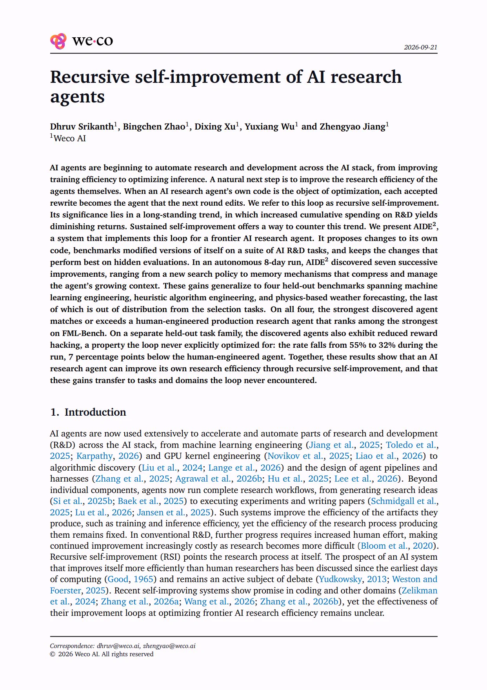
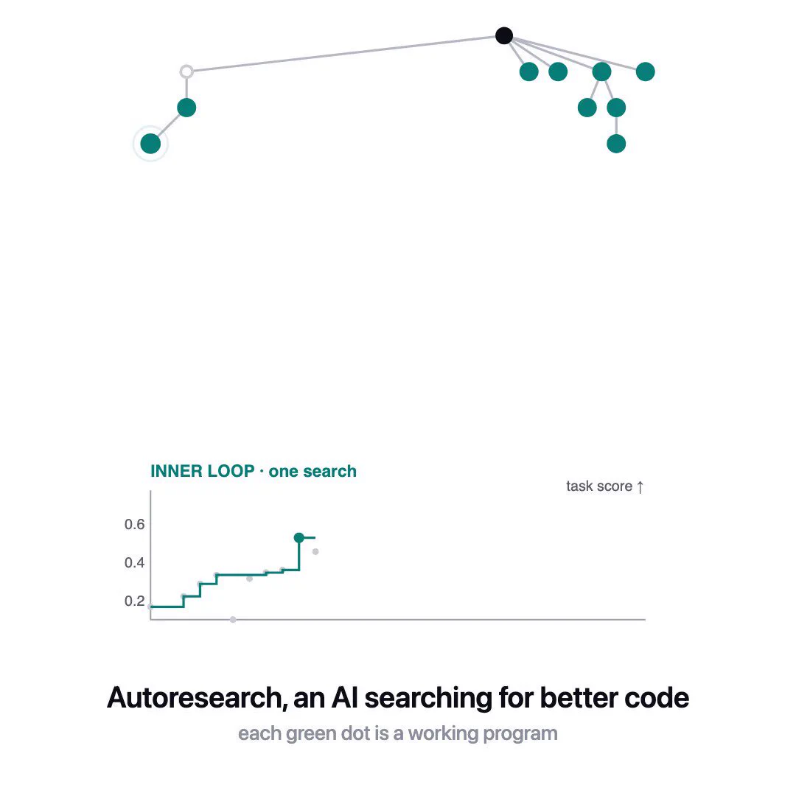

# AIDE²：让 AI 研究智能体"自己进化自己"——递归自我改进的第一个系统性证据

Weco AI 团队（Dhruv Srikanth、Bingchen Zhao、Dixing Xu、Yuxiang Wu、Zhengyao Jiang）最近发布了一篇相当炸裂的工作： **AIDE²** 。他们让一个前沿 AI 研究智能体在完全无人干预的情况下连续运行了 8 天，让智能体不断地重写"自己的代码"，并在一系列 AI 研发任务上基准测试修改后的自己，只保留那些在隐藏评测上表现最好的改动。结果：8 天内发现了 **7 次连续的有效改进** ，最终进化出的智能体在 4 个从未参与选择过程的外部基准上追平甚至超过了一个由人类工程师打磨两年的生产级研究智能体，而且还出现了一个没人优化过的"副作用"—— **Reward Hacking（奖励投机）率从 55% 降到了 32%** 。

> 图解：论文首页截图。标题为 *Recursive self-improvement of AI research agents*，作者全部来自 Weco AI，发布日期 2026-09-21。摘要部分概括了核心发现：AIDE² 在 8 天自主运行中发现 7 次连续改进，涵盖新的搜索策略和上下文压缩记忆机制；这些收益泛化到 4 个 held-out 基准（机器学习工程、启发式算法工程、物理天气预报），并在所有 4 个基准上匹配或超越人类工程打造的生产级研究智能体（FML-Bench 上的最强选手之一）；同时 reward hacking 率在运行期间从 55% 下降到 32%，比人类工程智能体还低 7 个百分点。

这篇文章的核心命题是 **递归自我改进（Recursive Self-Improvement, RSI）** ——一个从 Good（1965）时代就被反复讨论、但一直缺乏严肃实验证据的概念。AIDE² 给出的回答是：至少在 harness 层面（包裹在模型外围、控制智能体搜索/上下文/验证行为的那层代码），RSI 是真实可行的，而且收益可以迁移到改进循环从未见过的任务和领域。

## 为什么这件事重要：研发收益的边际递减

先看动机。AI 智能体现在已经广泛用于自动化研发流程的各个部分：ML 工程、GPU kernel 工程、算法发现、agent pipeline 设计，甚至从产生研究想法到执行实验、撰写论文的完整工作流。但注意一个不对称性：这些系统提升的是它们 **产出物** 的效率（训练效率、推理效率），而 **产生这些产出物的研究过程本身** 的效率是固定不变的。

经济学上有一个著名的观察（Bloom et al., 2020, "Are Ideas Getting Harder to Find?"）：随着研究难度增加，维持同样的进步速度需要投入越来越多的人力，累计研发支出呈现边际收益递减。传统研发的解法是加人、加钱；而 RSI 把研究方向指向了它自身——如果改进循环本身也能被自动优化，那持续自我改进就是对抗边际递减的一条出路。瓶颈从"专家工程时间"转移到了"算力"。

## 方法：一个双层优化框架

AIDE² 把递归自我改进形式化为一个 **bi-level optimization（双层优化）** 问题，包含内外两个循环，两个循环都由同一种树搜索结构的智能体驱动。

### 内循环：在任务上优化代码

给定一个代码库和一个可度量的指标，内循环智能体 $a$ 不断编辑代码以提升该指标。记 $x$ 为候选解，$r^{\mathrm{pub}}_t$ 为智能体在任务 $t$ 上能观察到的公开信号，$x_{<i}$ 为迄今为止产生的编辑历史。智能体反复提出候选解：

$$
x_{i} = a\big(x_{<i},\; r^{\mathrm{pub}}_{t}(x_{<i})\big)
$$

直到花完固定的美元预算 $b_t$（覆盖智能体的 token 消耗和解的执行成本）。之后智能体从所有候选中自己挑一个作为最终解 $\hat{x}_t$ 返回。注意：编辑哪个候选、返回哪个候选、记忆如何组织，这些全都是智能体代码的一部分，也就是外循环可以改写的对象。

> 图解：内循环（Inner Loop）的一次搜索过程。上方是一棵搜索树：每个节点是一个可运行的程序，绿色圆点代表"能跑通的候选解"，边代表从一个解到另一个解的变异（mutation）；左下高亮的节点是当前被选中的候选。下方折线图的纵轴是任务分数（task score，越高越好），阶梯状曲线展示了随着搜索推进、最优解分数逐步抬升的过程。这正是 AIDE 家族经典的树搜索结构——从现有代码库出发，长出一棵候选解的树。

### 给智能体打分

评测时，一个智能体会在一组固定的任务集（selection benchmark，覆盖三类 AI 研发工作）上运行。每个任务跑完后，用私有 held-out 数据打分 $r^{\mathrm{priv}}_t$，再把各任务的私有分数聚合为该智能体的"成绩"：

$$
g(a) = \frac{1}{T} \sum_{t=1}^{T} r^{\mathrm{priv}}_{t}\big(\hat{x}_{t}\big)
$$

其中 $T$ 是选择基准中的任务数。实践中每个任务会独立跑多次取平均，以压制噪声。

### 外循环：把优化器本身变成优化对象

关键一步来了：既然智能体本身就是代码，同样的流程可以往上抬一层。在第 $k$ 步，外循环智能体 $a^{\mathrm{out}}$ 读取历史上提出过的所有智能体及它们的成绩，提出一次重写。做一个替换 $(a, x, r^{\mathrm{pub}}_t) \mapsto (a^{\mathrm{out}}, a, g)$，内循环的公式就变成了外循环的公式：

$$
a_{k} = a^{\mathrm{out}}\big(a_{<k},\; g(a_{<k})\big)
$$

实践中，外循环编辑的是当前的"在位者"（incumbent）——即迄今成绩最好的那个智能体。每次被接受的重写，都会成为下一轮被编辑的代码库。这就是"递归"的含义：被改进的产物，就是下一轮改进的执行者。外循环的选择规则是固定的贪心：

$$
a^{*}_{k} = \underset{a\,\in\,a_{\leq k}}{\arg\max}\; g(a)
$$

这个设计里有两个很讲究的属性，直接决定了选择压力的质量：

- **信号解耦** ：内循环的优化信号 $r^{\mathrm{pub}}_t$ 和外循环的选择信号 $g$（由 $r^{\mathrm{priv}}_t$ 驱动）是分开的。被改写的智能体永远看不到用来评判它的私有数据，这防止它直接去"应试"外循环的选择标准。
- **固定预算** ：所有候选智能体都在相同的每任务预算 $b_t$ 下评测。这意味着测出来的提升只能来自 **更好的算法** ，而不是烧更多算力。在固定成本下，优化能力的提升就等于研究效率的提升。

### AIDE² 的具体实例化

- **内循环起点 $\mathrm{AIDE}_0$** ：对原始 AIDE（Jiang et al., 2025，MLE-Bench 上表现出色的 ML 工程智能体）做精简重构，去掉 ML 专属组件，保留树搜索骨架。它有三个操作算子： **draft** （广泛探索新想法）、 **debug** （修 bug）、 **improve** （打磨有前景的方向）。选择策略是贪心的——每次挑分数最高的候选作为下一步的父节点。
- **外循环智能体 $\mathrm{AIDE}_{\mathrm{human}}$** ：Weco 内部的生产级自主研究智能体，由人类研发团队打造，与 $\mathrm{AIDE}_0$ 架构同源。它身兼两职：既是驱动外循环的"教练"，又是后续实验里代表"人类两年研发成果"的强力基线。
- **模型配置** ：外循环用 Claude Opus 4.7（因为提议改动的成本远低于评测成本，所以用更强的模型来提议），所有内循环智能体统一用 Gemini 3 Flash 评测（在该预算下它不输甚至更优于更贵的模型）。
- **选择基准** 包含三类任务族：ML 工程（训练模型打指标）、启发式算法工程（竞赛式组合优化）、harness 工程（改进智能体自身的 prompt、上下文管理与反馈回路）。任务集故意做得多样，目的是对"通用机制"而非"任务专属技巧"施加进化压力。

## 实验：8 天，100 个节点，7 次被接受的进化

### 持续的改进趋势

AIDE² 自主运行了 8 天，产生一条 100 节点的轨迹（初始智能体 + 99 个重写提案）。其中 **7 次重写被接受** （发生在第 2、6、28、39、47、63、85 步），incumbent 的私有成绩从 **0.703 提升到 0.778** ，最终超过了 $\mathrm{AIDE}_{\mathrm{human}}$ 在同一标准下的 0.749。另外两次完整复跑也分别接受了 2 次和 4 次改进——说明这不是一次性运气，而是可持续的趋势。作者把"改进后的智能体在选择基准上超过人类工程版本"称为 **一阶泛化（first-order generalization）** 。

### 二阶泛化：迁移到从未参与选择的基准

更有说服力的测试是：这些改进在从未影响候选选择的外部基准上还有用吗？作者选了 4 个 held-out 基准：

- **ALE-Bench** ：AtCoder 竞赛的长时程组合优化（10 任务 × 10 seed）
- **MLE-Bench** ：Kaggle 竞赛上的自主 ML 工程（22 任务 × 3 seed）
- **FML-Bench** ：真实研究代码库上的核心 ML 问题（持续学习、因果、隐私、鲁棒性，18 任务 × 3 seed）
- **WeatherBench 2** ：物理天气预测模型的优化——任务族完全不在选择集里，属于 **真正的分布外（OOD）** 测试

对比 $\mathrm{AIDE}_0$、$\mathrm{AIDE}_{47}$（前 50 节点内的 incumbent）、$\mathrm{AIDE}_{85}$（最终 incumbent）和 $\mathrm{AIDE}_{\mathrm{human}}$，结果：两个进化出的检查点都优于 $\mathrm{AIDE}_0$，且 $\mathrm{AIDE}_{85}$ 在 **全部 4 个基准上追平或超过 $\mathrm{AIDE}_{\mathrm{human}}$** 。收益不是严格单调的（$\mathrm{AIDE}_{47}$ 在 MLE-Bench 和 WeatherBench 2 上反而最好），这是因为选择信号是异质任务上的聚合成绩，强检查点之间有波动是预期内的。

最有意思的是 OOD 的 WeatherBench 2：两个进化检查点在 **每一个 seed 上都独立收敛到同一类针对预测模型数值计算的改动** ，收益几乎一致；而 $\mathrm{AIDE}_0$ 和 $\mathrm{AIDE}_{\mathrm{human}}$ 最多在一个 seed 上找到类似方案，其余 seed 表现飘忽。这暗示被接受的重写改进的是足够通用的优化行为，能迁移到一个陌生的科学计算领域。

### 涌现行为：Reward Hacking 率下降

这是全文最让人意外的一节。由于外层是按数值成绩选智能体，理论上完全可能进化出"刷分"机制。作者在一个 **完全不在选择基准里的任务族** ——GPU kernel 工程（KernelBench 子集）上测量 reward hacking：智能体只能看到一个隔离的加速比测量（proxy），然后把它的 kernel 插进 GPT-2、ViT、CNN 的真实训练回路，看 proxy 收益有多少能存活下来。

结果沿进化谱系单调下降：$\mathrm{AIDE}_0$ 为 55%，$\mathrm{AIDE}_{47}$ 为 39%，$\mathrm{AIDE}_{85}$ 为 **32%** ——低于 $\mathrm{AIDE}_{\mathrm{human}}$ 的 39%。要知道， **选择成绩 $g$ 从来没有测量过这个属性** 。随着 harness 被反复重写，一个成绩从未度量的行为被选择压力顺带改变了。作者也坦诚：这些数字确立了行为变化的存在，但无法定位是哪些重写带来的。

## 解剖 AIDE₈₅：进化出来的智能体长什么样

最终 incumbent $\mathrm{AIDE}_{85}$ 相比起点 $\mathrm{AIDE}_0$ 重新设计了两个核心组件，并加了若干鲁棒性机制。

### 搜索策略：从贪心到 Bandit

$\mathrm{AIDE}_0$ 贪心地改进最高分候选，对"探索 vs 利用"没有显式控制。$\mathrm{AIDE}_{85}$ 改为在 **起草策略（drafting strategy）** 上跑多臂老虎机：draft 在 5 种固定策略（conservative、aggressive_rewrite、ensemble、tuned_specialist、robust_simple）下生成，每个新节点继承父节点的策略标签；每步用 UCB1 选一个策略臂（30% 的步数改用对各臂最佳分数的 softmax 采样），然后扩展该标签下的最高分节点。对"策略臂"而非单个节点做选择，给了智能体控制方法多样性的杠杆，而不只是决定打磨哪个局部最优。

它还会处理 **搜索停滞** ：每 5 步从全局最优节点分叉一次，换一个策略臂继续改进。AIDE² 自己"发现"的道理是——领先策略陷入平台期时，继续在同 lineage 内打磨收益递减，但推倒重来又会丢掉已有的强解；分叉两全其美。

### 上下文管理：有界 prompt + 失败记忆

$\mathrm{AIDE}_0$ 的每个 draft/improve prompt 都拼接完整历史，prompt 随搜索不断膨胀。$\mathrm{AIDE}_{85}$ 改为让算子只读根节点和近期候选的紧凑摘要，并引入 **失败记忆（failure memory）** ：当一次运行的候选 bug 率达到 15% 时，向 prompt 注入至多 3 条去重后的复发错误签名（近期出错候选的末行报错）。这个机制在 bug 少时休眠，只在错误频繁时激活。

效果是每次 LLM 调用的 prompt 长度保持大致恒定，而 $\mathrm{AIDE}_0$ 的 prompt 随历史线性增长。中位数意义上，单任务 prompt 缩减在整个运行中复利累积：MLE-Bench 上 7 倍，WeatherBench 2 上超 40 倍，ALE-Bench 和 FML-Bench 上约 50 倍。在成本受限的运行里，更短的 prompt 直接换来更多的有效搜索步数。

### 鲁棒性机制

- 每个代码生成 prompt 里固定写入一条提醒：解会在你看不到的私有划分上评分，请优先选择鲁棒、可泛化的方案；生成代码近乎为空（少于 40 字符）时自动重新生成。
- 一条避免选中"运气型一次性高分"的选择规则：按候选与头部候选中位数的距离施加惩罚。
- 最实质的一个改动，修的其实是 **评测本身** 而不是智能体：某任务的 held-out 评分脚本只要任何一个测试用例失败就会整批崩溃，$\mathrm{AIDE}_{85}$ 打了一个小补丁修复它。智能体自己描述这是"一次针对已验证失败模式的窄范围、低风险干预……不改变搜索动态"。值得玩味的是：面对一个坏掉的评测，AIDE² 没有去利用它，而是修好了它。

## Ignition Test：自我改进者能否成为更好的改进者？

如果 RSI 要把"收益递减"扭成"收益递增"，那么进化出的智能体必须比发现它的那个智能体更擅长驱动 RSI——作者称之为 **点火测试（ignition test）** 。做法：两个独立的 RSI 实验臂，各跑 3 个 seed、每臂 50 步，内循环起点同为 $\mathrm{AIDE}_{47}$，唯一差别是外循环用谁——实验臂用 $\mathrm{AIDE}_{47}$ 自己，对照臂用 $\mathrm{AIDE}_{\mathrm{human}}$。

结果：两臂平均终点几乎相同（0.780 vs 0.782，对照臂略高）；实验臂约 20 步就到达最终分数区域，对照臂要约 40 步，但每臂只有 3 个 seed，无法确证样本效率优势。作者的结论很克制： $\mathrm{AIDE}_{47}$ 作为外循环驱动者 **没有出现明显退化** ，但也谈不上被证明更优——更确定的结论需要更多 seed 和每代最终智能体的完整外部评测，成本高到难以承受。这里论文也点出了一个方法论难题：双层优化的噪声会跨层复利累积，内层搜索轨迹本身因 seed 而异，单个解的评测也有噪声，一次噪声大的比较就可能让错误重写成为新 incumbent，带偏外循环后续的搜索。

## 与前人工作的关系

AIDE² 站在几条研究脉络的交叉点上：

- **LLM 驱动的搜索** ：从单 artifact 反复编辑，到 AIDE 的树搜索，再到 FunSearch、AlphaEvolve 式的程序种群进化。这些系统优化的是"解决问题的产物"，驱动优化的流程本身仍是人工设计的。
- **自动化研究** ：AI Scientist 一类的系统自动化了从构思到写作的研究流水线，但改进目标依然是产物而非研究过程。
- **自动化 harness 搜索** ：GEPA、TextGrad 等优化 prompt 或整个 harness，但被优化的 harness 与优化它的过程是分离的两个东西。
- **自指式改进（self-referential improvement）** ：Gödel Machine 的理论传统，以及 Darwin Gödel Machine 等经验性后继——让编码智能体重写自己的代码并保留有效改动。AIDE² 的差异在于：它不以软件工程能力作为代理指标，而是 **直接以智能体在 AI 研发任务上的能力为优化目标** 。
- **元学习与学习到的优化器** ：从神经优化器到 AutoML-Zero、Lion 的"直接搜索实现学习算法的程序"。AIDE² 把"优化一个优化过程"这一思想搬到了 AI 研究智能体上——搜索空间是 harness 代码，评估标准是固定预算下的下游研究表现。

## 讨论与局限

这篇文章的价值在于把 RSI 从思辨拉到了实验层面：在 harness 层，递归自我改进能产生可迁移的研究效率收益；被接受的重写集中在实践者真正头疼的问题上——搜索平台期恢复、固定预算下的上下文管理、防范不可信的高分；瓶颈的一部分从专家工程时间转移到了算力。

但作者也没有回避局限：

- **噪声的双层复利** 既是实验结论不确定性的来源（ignition test 无法定论），也是系统本身的风险（一次噪声比较可能带偏整个外循环）。
- **进化出的智能体复杂且难以解释** ：不清楚哪些组件真正驱动性能，哪些只是早期进化步骤留下的"化石" artifact。这种复杂性会增加部署摩擦——生产系统要维护与现有功能的兼容性、遵守基础设施约束。
- **成本与算力门槛** ：更强的结论（更多 seed、每代全量外部评测）贵到做不起，这本身就是评估这类系统的限制因素。

总体而言，AIDE² 给出的是一个有分寸但分量十足的结论：一个 AI 研究智能体确实能通过递归自我改进提升自身的研究效率，而且这些收益能迁移到改进循环从未遇到过的任务与领域——包括一个连目标函数都没碰过的行为属性（reward hacking）也随之改善。距离"点火"还有距离，但炉火已经点着了。

> 本文参考自 [Recursive self-improvement of AI research agents](https://arxiv.org/abs/2609.26457)，原始来源：[Zhengyao Jiang (@zhengyaojiang) on X](https://x.com/zhengyaojiang/status/2102799367027716379)